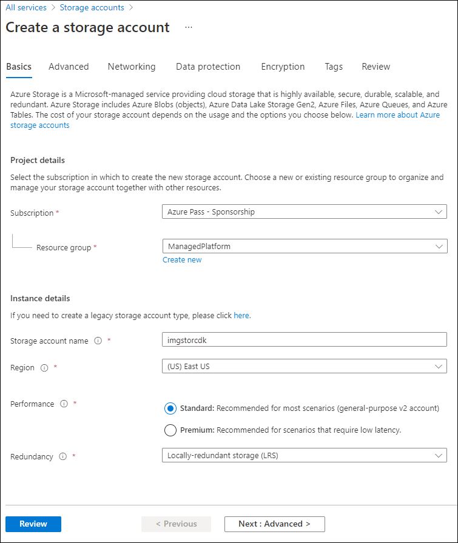

---
lab:
  az204Title: 'Lab 01: Build a web application on Azure platform as a service offerings'
  az204Module: 'Learning Path 01: Implement Azure App Service Web Apps'
---

# 实验室 01：在 Azure 平台即服务产品/服务上构建 Web 应用程序

## Microsoft Azure 用户接口

鉴于 Microsoft 云工具的动态特性，Azure UI 在此培训内容开发后可能会发生更改。 因此，实验说明和实验步骤可能无法正确对应。

我们发现社区进行了必要更改时，Microsoft 会更新此培训课程。 但是，云更新经常发生，因此在此培训内容更新之前，可能会发生 UI 更改。 如果发生这种情况，请适应这些更改，并根据需要在实验室中熟悉这些更改。

## Instructions

### 开始之前

#### 登录到实验室环境

使用以下凭据登录到 Windows 11 虚拟机 (VM)：

- 用户名：`Admin`
- 密码：`Pa55w.rd`

> **注意**：你的讲师将提供连接到虚拟实验室环境的说明。

#### 查看已安装的应用程序

在 Windows 11 桌面上找到任务栏。 任务栏里有本实验室中你将使用的应用程序的图标，包括：

- Microsoft Edge
- 文件资源浏览器
- 终端
- Visual Studio Code

## 实验室场景

在本实验室中，你将了解如何使用 PaaS 模型在 Azure 上创建 Web 应用程序。 创建 Web 应用程序后，你将了解如何使用 Apache Kudu zip 部署选项上传现有的 Web 应用程序文件。 然后，你将查看并测试新部署的 Web 应用程序。

右键单击此[视频链接](https://youtu.be/EiSEcU9qjfo)观看此视频，然后选择“在新标签页/新窗口中打开链接”。<em></em>


## 体系结构关系图


### 练习 1：通过使用 Azure 存储和 Azure 应用服务的 Web 应用功能来生成后端 API

#### 任务 1：打开 Azure 门户

1. 在任务栏上，选择 Microsoft Edge 图标。

1. 在浏览器窗口中，浏览到 Azure 门户 (`https://portal.azure.com`)，然后使用你将用于此实验室的帐户登录。

   > **注意**：第一次登录 Azure 门户时，你会看到一个门户教程。 如果想跳过该导览，请选择“以后再说”以开始使用门户。

#### 任务 2：创建存储帐户

1. 在 Azure 门户中，使用“搜索资源、服务和文档”文本框搜索“存储帐户”，然后在结果列表中选择“存储帐户”  。

1. 在“存储帐户”边栏选项卡上，选择“+ 创建”。 ****  

1. 在“创建存储帐户”边栏选项卡的“基本信息”选项卡上，执行以下操作，然后选择“查看 + 创建”： **** ********

    | 设置 | 操作 |
    |--|--|
    | “订阅”下拉列表 | 保留默认值 |
    | “资源组”部分 | 选择“新建”，输入“ManagedPlatform”，然后选择“确定” |
    | “存储帐户名称”文本框  | 输入“imgstor[yourname]” |
    | “区域”下拉列表 | 选择“(US)美国东部” |
    | 主服务**** | 无更改 |
    | “性能”部分 | 选择“标准”选项 |
    | “冗余”下拉列表 | 选择“本地冗余存储(LRS)” |

   以下屏幕截图显示了“创建存储帐户”边栏选项卡的“基本信息”选项卡上配置的设置 。

   

1. 在“查看 + 创建”选项卡中，查看在上述步骤中选择的选项。

1. 选择“创建”，使用指定的配置创建存储帐户。

   > **注意**：等待创建任务完成，再继续操作本实验室。

1. 在“概述”边栏选项卡上，选择“转到资源”按钮以导航到新创建的存储帐户的边栏选项卡 。

1. 在“存储帐户”边栏选项卡上的“安全 + 网络”部分中，选择“访问密钥”。 ****   ****  

1. 在“访问密钥” 边栏选项卡上，查看任一“连接字符串”（使用“显示”按钮），然后在记事本中记录任一“连接字符串” 框的值 ****************。 **密钥** 是平台管理的加密密钥，**不** 用于此实验室。

   > **注意**：你选择哪个连接字符串无关紧要。 它们是可互换的。

1. 打开记事本，然后将复制的连接字符串值粘贴到记事本。 你稍后将在本实验室中使用此值。

#### 任务 3：上传样本 blob

1. 在“存储帐户”边栏选项卡上的“数据存储”部分中，选择“容器”链接  。

1. 在“容器”边栏选项卡中，选择“+ 容器” 。

1. 在“新建容器”窗口中，执行以下操作，然后选择“创建”。********

   | 设置 | 操作 |
   | --- | --- |
   | “名称”文本框 | 输入“images” |

1. 在“容器”边栏选项卡上，导航到新建的“映像”容器********。

1. 在“images”边栏选项卡中，选择“上传” 。

1. 在“上传 Blob”窗口中，执行以下操作：

    | 设置 | 操作 |
    |--|--|
    | “文件”部分 | 选择“浏览文件”或使用拖放功能 |
    | “文件资源管理器”窗口 | 浏览到 Allfiles (F):\\Allfiles\\Labs\\01\\Starter\\Images，选择 grilledcheese.jpg 文件，然后选择“打开” |
    | “如果文件已存在，请覆盖”复选框 | 确保选中该复选框，然后选择“上传” |

    > **注意**：等待 Blob 上传完成，然后再继续本实验室。

#### 任务 4：创建 Web 应用

1. 在 Azure 门户的导航窗格上，选择“创建资源”。

1. 在“创建资源”窗格的“搜索服务和市场”文本框中，输入“Web 应用”  ，然后按 Enter 键。

1. 在“市场”搜索结果边栏选项卡中，选择“Web 应用”结果 。

1. 在 “Web 应用”边栏选项卡，选择“创建”********。

1. 在“**创建 Web 应用**”边栏选项卡的“**基本**”选项卡上，执行以下操作，然后选择“**监视 + 保护**”选项卡：

   | 设置                            | 操作                                                                                                  |
   | ---------------------------------- | ------------------------------------------------------------------------------------------------------- |
   | “订阅”下拉列表    | 保留默认值                                                                                |
   | “资源组”部分         | 选择“ManagedPlatform”                                                                              |
   | “名称”文本框                   | 输入“imgapi[yourname]”                                                                            |
   | **保护唯一默认主机名安全** | **已禁用**                                                                                            |
   | “发布”部分                | 选择“代码”                                                                                         |
   | “运行时堆栈”下拉列表   | 选择“.NET 8 (LTS)”****                                                                                 |
   | “操作系统”部分       | 选择“Windows”                                                                                      |
   | “区域”下拉列表          | 选择“美国东部”区域                                                                           |
   | “Windows 计划(美国东部)”部分 | 选择“新建”，在“名称”文本框中输入值“ManagedPlan”，然后选择“确定” |
   | “定价计划”部分           | 选择“标准 S1”                                                                                  |

   以下屏幕截图显示了“创建 Web 应用”窗格上配置的设置。

   

1. 在“**监视 + 保护**”选项卡的“**启用 Application Insights**”部分中，选择“**否**”，然后选择“**查看 + 创建**”。

1. 在“查看 + 创建”选项卡中，查看在上述步骤中选择的选项。

1. 选择“创建”，使用指定的配置创建 Web 应用。

   > **注意**：等待 Web 应用创建完成，再继续本实验室。

1. 在“概述”边栏选项卡上，选择“转到资源”按钮以导航到新创建的 Web 应用的边栏选项卡。

#### 任务 5：配置 Web 应用

1. 在“应用服务”边栏选项卡上的“设置”部分，选择“环境变量”链接************。

1. 在“应用设置”选项卡中，选择“+ 添加”********。 在“添加/编辑应用程序设置”弹出对话框中输入以下信息****：

    | 设置 | 操作 |
    |--|--|
    | “名称”文本框 | 输入 StorageConnectionString**** |
    | “值”文本框 | 粘贴先前复制到记事本的存储连接字符串 |
    | “部署槽设置”复选框 | 保留默认值 |

1. 选择“应用”以关闭弹出对话框并返回“应用设置”部分********。

1. 在“应用设置”部分底部，选择“应用”********。

   >**注意：** 更新应用设置时，你可能会收到一条警告，指出应用可能会重启。 选择“**确认**”。 等待应用程序设置保存后再继续本实验室。

1. 若要获取应用服务的 URL，请转到“概述”链接，从“默认域”部分复制值，然后将其粘贴到记事本。 将 `https://` 追加到记事本中的域名前面。 在本实验室中，你稍后将用到此值。

   > **注意**：此时，此 URL 的 Web 服务器将返回占位符网页。 你尚未向 Web 应用中部署任何代码。 你将在本实验室稍后部分向 Web 应用部署代码。

#### 任务 6：将 `ASP.NET` Web 应用程序部署到 Web 应用

1. 在任务栏上，选择“Visual Studio Code”图标。

1. 在“文件”**** 菜单中，选择“打开文件夹”****。

1. 在“文件资源管理器”窗口中，浏览到 Allfiles (F):\\Allfiles\\Labs\\01\\Starter\\API，然后选择“选择文件夹”  。

   > 注意：忽略任何提示，无论是添加生成和调试所需资产的提示，还是运行还原命令来解决未解析的依赖项的提示。

1. 在“Visual Studio Code”窗口的“资源管理器”窗格中，展开 Controllers 文件夹，然后选择 ImagesController.cs 文件以在编辑器中打开。 ****   ****

1. 在编辑器中 ImagesController 类的第 26 行，观察 GetCloudBlobContainer 方法和用于检索容器的代码 。

1. 在 ImagesController 类的第 36 行，观察 Get 方法和用于从 images 容器异步检索所有 blob 的代码  。

1. 在 ImagesController **** 类的第 68 行，观察 Post 方法和用于将上传图像保存到存储的代码 。****

1. 在任务栏上，选择“终端”图标****。

1. 在打开的终端处，输入以下命令并按 Enter 以登录 Azure 命令行接口 (CLI)：

   ```
   az login
   ```

1. 在 Microsoft Edge 浏览器窗口中，输入 Microsoft 帐户的电子邮件地址和密码，然后选择“登录” 。

1. 返回到当前打开的“终端”窗口。**** 请等待登录过程完成。

1. 在终端中输入以下命令，然后按 Enter 以列出“ManagedPlatform”资源组中的所有应用****：

   ```
   az webapp list --resource-group ManagedPlatform
   ```

1. 输入以下命令，然后按 Enter 查找具有前缀 imgapi\* 的应用：

   ```
   az webapp list --resource-group ManagedPlatform --query "[?starts_with(name, 'imgapi')]"
   ```

1. 输入以下命令，然后按 Enter 以仅呈现具有前缀 imgapi\* 的单一应用的名称：

   ```
   az webapp list --resource-group ManagedPlatform --query "[?starts_with(name, 'imgapi')].{Name:name}" --output tsv
   ```

1. 输入以下命令，然后按 Enter，将当前目录更改为包含实验室文件的 Allfiles (F):\\Allfiles\\Labs\\01\\Starter\\API 目录：

   ```
   cd F:\Allfiles\Labs\01\Starter\API\
   ```

1. 输入以下命令然后按 Enter，以将 api.zip 文件部署到之前在此实验室中创建的 Web 应用：

   ```
   az webapp deployment source config-zip --resource-group ManagedPlatform --src api.zip --name <name-of-your-api-app>
   ```

   > **注意**：将 *\<name-of-your-api-app\>* 占位符替换为之前在本练习中创建的 Web 应用的名称。 你最近在之前的步骤中查询了此应用的名称。

   等待部署完成后，再继续本实验室。

1. 在 Azure 门户的“导航”窗格中，选择“资源组”链接。

1. 在“资源组”边栏选项卡中，选择你之前在本实验室中创建的 ManagedPlatform 资源组 。

1. 在“ManagedPlatform”边栏选项卡上，选择你先前在本实验室中创建的 imgapi[yourname] Web 应用。

1. 在“应用服务”边栏选项卡中，选择“浏览” 。

   > **注意**：“浏览”命令将向网站的根执行 GET 请求，该请求返回一个 JavaScript 对象表示法 (JSON) 数组。 此数组应包含你在 Azure 存储帐户中上传的单个映像的 URL。

1. 返回到包含 Azure 门户的浏览器窗口。

1. 关闭当前正在运行的 Visual Studio Code 和“终端”应用程序。

#### 审阅

在本练习中，你在 Azure 中创建了一个 Web 应用，然后使用 Azure CLI 和 Apache Kudu zip 文件部署实用程序将 `ASP.NET` Web 应用程序部署到了 Web 应用。

### 练习 2：使用 Azure Web 应用构建前端 Web 应用程序

#### 任务 1：创建 Web 应用

1. 在 Azure 门户的导航窗格上，选择“创建资源” 。

1. 在“创建资源”窗格的“搜索服务和市场”文本框中，输入“Web 应用”  ，然后按 Enter 键。

1. 在“市场”搜索结果边栏选项卡中，选择“Web 应用” 。

1. 在 “Web 应用”边栏选项卡，选择“创建”********。

1. 在“**创建 Web 应用**”边栏选项卡的“**基本**”选项卡上，执行以下操作，然后选择“**监视 + 保护**”选项卡：

   | 设置                            | 操作                        |
   | ---------------------------------- | ----------------------------- |
   | “订阅”下拉列表    | 保留默认值      |
   | “资源组”部分         | 选择“ManagedPlatform”    |
   | “名称”文本框                   | 输入“imgweb[yourname]”  |
   | **保护唯一默认主机名安全** | **已禁用**                  |
   | “发布”部分                | 选择“代码”               |
   | “运行时堆栈”下拉列表   | 选择“.NET 8 (LTS)”****       |
   | “操作系统”部分       | 选择“Windows”            |
   | “区域”下拉列表          | 选择“美国东部”区域 |
   | “Windows 计划(美国东部)”部分 | 选择“ManagedPlan (S1)”   |

以下屏幕截图显示了“创建 Web 应用”窗格上配置的设置。


1. 在“**监视 + 保护**”选项卡的“**启用 Application Insights**”部分中，选择“**否**”，然后选择“**查看 + 创建**”。

1. 在“查看 + 创建”选项卡中，查看在先前步骤中选择的选项。

1. 选择“创建”，使用指定的配置创建 Web 应用。

   > **注意**：等待创建任务完成，再继续操作本实验室。

1. 在“概述”边栏选项卡上，选择“转到资源”按钮以导航到新创建的 Web 应用的边栏选项卡。

#### 任务 2：配置 Web 应用

1. 在“应用服务”边栏选项卡上的“设置”部分，选择“环境变量”链接************。

1. 在“**环境变量**”部分中，执行以下操作，选择“**保存**”，然后选择“**继续**” ：

    | 设置 | 操作 |
    |--|--|
    | “应用设置”选项卡**** | 选择“新应用程序设置” |
    | “添加/编辑应用程序设置”弹出对话框 | 在“名称”文本框中，输入“ApiUrl” |
    | “值”文本框 | 输入之前在此实验室中复制的 Web 应用 URL。 注意：请确保在复制到此应用程序设置的“值”文本框的 URL 中包含协议 https:// |
    | “部署槽设置”复选框 | 保留默认值，然后选择“确定” |
    | 单击顶部菜单中的“保存”**** | 这将保存刚输入的配置值 |

   > **注意**：等待应用程序设置保存后再继续本实验室。

#### 任务 3：将 `ASP.NET` Web 应用程序部署到 Web 应用

1. 在任务栏上，选择“Visual Studio Code”图标。

1. 在“文件”**** 菜单中，选择“打开文件夹”****。

1. 在“文件资源管理器”窗口中，浏览到 Allfiles (F):\\Allfiles\\Labs\\01\\Starter\\Web，然后选择“选择文件夹”  。

   > 注意：忽略任何提示，无论是添加生成和调试所需资产的提示，还是运行还原命令来解决未解析的依赖项的提示。

1. 在“Visual Studio Code”窗口的“资源管理器”窗格中，展开 Pages 文件夹，然后选择 Index.cshtml.cs 文件以在编辑器中打开。 ****   ****

1. 在编辑器的 IndexModel 类的第 30 行，观察 OnGetAsync 方法和用于从 API 检索映像列表的代码 。

1. 在 IndexModel 类的第 41 行，观察 OnPostAsync 方法和用于将上传图像流式传输到后端 API 的代码 。

1. 在任务栏上，选择“终端”图标****。

1. 在打开的终端处，输入以下命令并按 Enter 以登录 Azure CLI：

   ```
   az login
   ```

1. 在 Microsoft Edge 浏览器窗口中，输入 Microsoft 帐户的电子邮件地址和密码，然后选择“登录” 。

1. 返回到当前打开的“终端”窗口。**** 请等待登录过程完成。

1. 输入以下命令并按 Enter 键以列出 ManagedPlatform 资源组中的所有应用：

   ```
   az webapp list --resource-group ManagedPlatform
   ```

1. 输入以下命令，然后按 Enter 查找具有前缀 imgweb\* 的应用：

   ```
   az webapp list --resource-group ManagedPlatform --query "[?starts_with(name, 'imgweb')]"
   ```

1. 输入以下命令，然后按 Enter 以仅呈现具有前缀 imgweb\* 的单一应用的名称：

   ```
   az webapp list --resource-group ManagedPlatform --query "[?starts_with(name, 'imgweb')].{Name:name}" --output tsv
   ```

1. 输入以下命令，然后按 Enter，将当前目录更改为包含实验室文件的 Allfiles (F):\\Allfiles\\Labs\\01\\Starter\\Web 目录：

   ```
   cd F:\Allfiles\Labs\01\Starter\Web\
   ```

1. 输入以下命令然后按 Enter，以将 web.zip 文件部署到之前在此实验室中创建的 Web 应用：

   ```
   az webapp deployment source config-zip --resource-group ManagedPlatform --src web.zip --name <name-of-your-web-app>
   ```

   > **注意**：将 *\<name-of-your-web-app\>* 占位符替换为之前在本练习中创建的 Web 应用的名称。 你最近在之前的步骤中查询了此应用的名称。

   等待部署完成后，再继续本实验室。

1. 在 Azure 门户的导航窗格中，选择“资源组” 。

1. 在“资源组”边栏选项卡中，选择你之前在本实验室中创建的 ManagedPlatform 资源组 。

1. 在“ManagedPlatform”边栏选项卡上，选择你先前在本实验室中创建的 imgweb[yourname] Web 应用 。

1. 在“应用服务”边栏选项卡中，选择“浏览”。

1. 查看图库中的图像列表。 图库应列出之前在实验室中上传到存储的单个图像。

1. 在“Contoso Photo Gallery”网页的“上传新图像”部分中，执行以下操作 ：

   a. 选择“浏览”。

   b. 在“文件资源管理器”**** 窗口中，浏览至 Allfiles (F):\\Allfiles\\Labs\\01\\Starter\\Images**** 文件，选择“banhmi.jpg”**** 文件，然后选择“打开”****。

   c. 选择“上传”。

1. 观察已用新图像更新的图库图像。

   > **注意**：在极少数情况下，你可能需要刷新浏览器窗口才能检索新图像。

1. 返回到包含 Azure 门户的浏览器窗口。

1. 关闭当前正在运行的 Visual Studio Code 和“终端”应用程序。

#### 审阅

在本练习中，你创建了一个 Azure Web 应用，并将现有 Web 应用程序代码部署到云中的资源。
