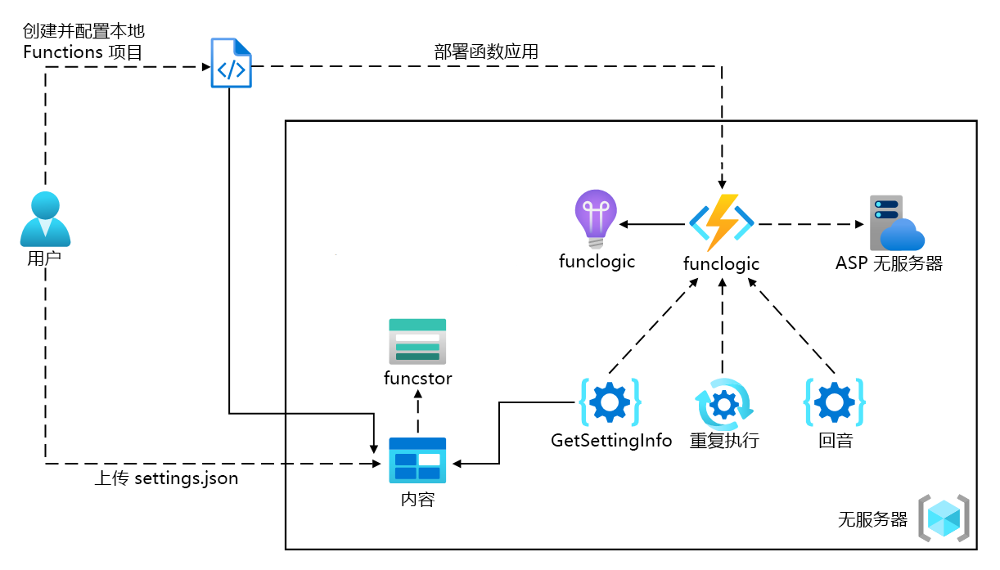
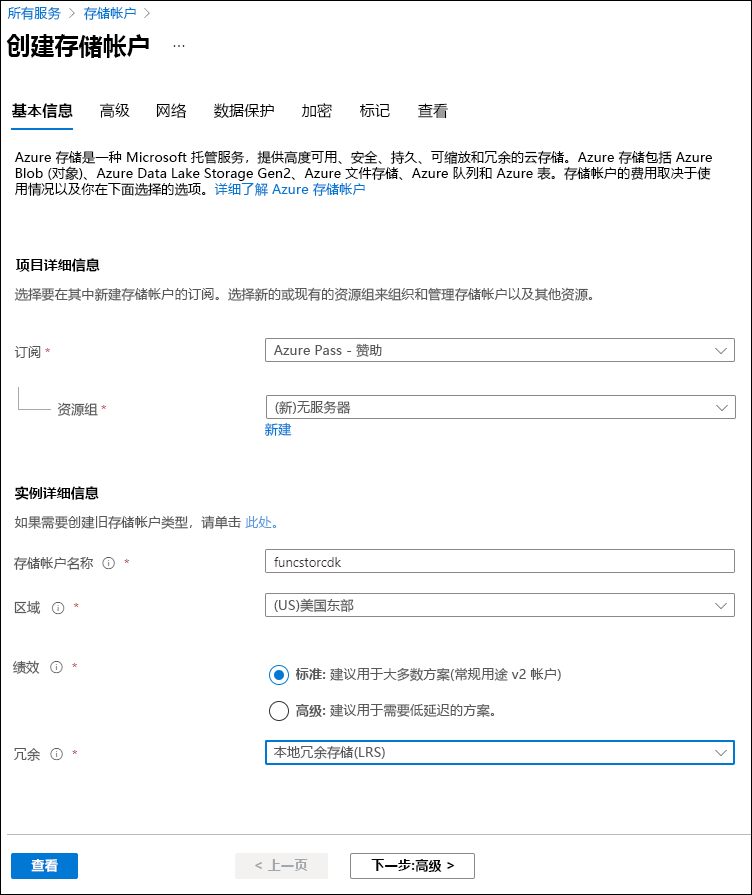
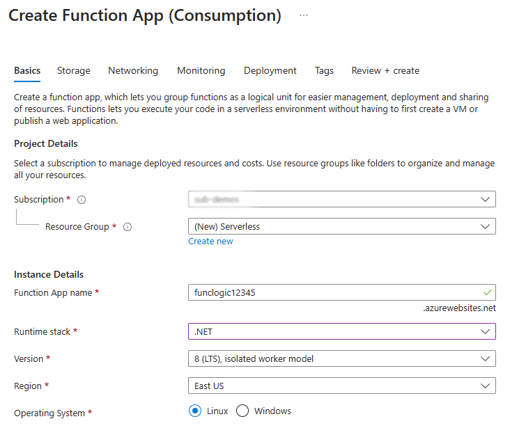

---
lab:
  az204Title: 'Lab 02: Implement task processing logic by using Azure Functions'
  az020Title: 'Lab 02: Implement task processing logic by using Azure Functions'
  az204Module: 'Module 02: Implement Azure Functions'
  az020Module: 'Module 02: Implement Azure Functions'
---

# <a name="lab-02-implement-task-processing-logic-by-using-azure-functions"></a>实验室 02：使用 Azure Functions 实现任务处理逻辑

## <a name="microsoft-azure-user-interface"></a>Microsoft Azure 用户接口

鉴于 Microsoft 云工具的动态特性，Azure UI 在此培训内容开发后可能会发生更改。 因此，实验说明和实验步骤可能无法正确对应。

我们发现社区进行了必要更改时，Microsoft 会更新此培训课程。 但是，云更新经常发生，因此在此培训内容更新之前，可能会发生 UI 更改。 如果发生这种情况，请适应这些更改，并根据需要在实验室中熟悉这些更改。

## <a name="instructions"></a>说明

### <a name="before-you-start"></a>开始之前

#### <a name="sign-in-to-the-lab-environment"></a>登录到实验室环境

使用以下凭据登录到 Windows 10 虚拟机 (VM)：

- 用户名：Admin
- 密码：Pa55w.rd

> **注意**：你的讲师将提供连接到虚拟实验室环境的说明。

#### <a name="review-the-installed-applications"></a>查看已安装的应用程序

在你的 Windows 10 桌面上找到任务栏。 任务栏里有本实验室中你将使用的应用程序的图标，包括：

- Microsoft Edge
- 文件资源浏览器
- Windows 终端
- Visual Studio Code

## <a name="architecture-diagram"></a>体系结构关系图



### <a name="exercise-1-create-azure-resources"></a>练习 1：创建 Azure 资源

#### <a name="task-1-open-the-azure-portal"></a>任务 1：打开 Azure 门户

1. 在任务栏上，选择 Microsoft Edge 图标。
1. 在浏览器窗口中，浏览到 Azure 门户 (<https://portal.azure.com>)，然后使用你将用于此实验室的帐户登录。

    > **注意**：第一次登录 Azure 门户时，你会看到一个门户教程。 如果想跳过该导览，请选择“开始使用”以开始使用门户。

#### <a name="task-2-create-an-azure-storage-account"></a>任务 2：创建 Azure 存储帐户

1. 在 Azure 门户中，使用“搜索资源、服务和文档”文本框搜索“存储帐户”，然后在结果列表中选择“存储帐户”  。

1. 在“存储帐户”边栏选项卡上，选择“+ 创建”。 ****  

1. 在“创建存储帐户”边栏选项卡的“基本信息”选项卡上，执行以下操作，然后选择“查看 + 创建”  ：

    | 设置 | 操作 |
    | -- | -- |
    | “订阅”下拉列表 | 保留默认值 |
    | “资源组”部分 | 选择“新建”，输入“无服务器”，然后选择“确定”   |
    | “存储帐户名称”文本框  | 输入“funcstor[yourname]” |
    | “区域”下拉列表 | 选择“(US)美国东部” |
    | “性能”部分 | 选择“标准”选项 |
    | “冗余”下拉列表 | 选择“本地冗余存储(LRS)” |

    以下屏幕截图显示了“创建存储帐户”窗格中配置的设置。

    

1. 在“查看 + 创建”选项卡中，查看在上述步骤中选择的选项。

1. 选择“创建”，使用指定的配置创建存储帐户。

    > **注意**：等待创建任务完成，再继续操作本实验室。

1. 在“概述”边栏选项卡上，选择“转到资源”按钮以导航到新创建的存储帐户的边栏选项卡 。

1. 在“存储帐户”边栏选项卡上的“安全 + 网络”部分中，选择“访问密钥”。 ****   ****  

1. 在“访问密钥”边栏选项卡上，选择“显示密钥”。 ****  

1. 查看任一密钥，然后将任一“连接字符串”框的值复制到剪贴板。 ****  

     > **注意**：你选择哪个连接字符串无关紧要。 它们是可互换的。

1. 打开记事本，然后将复制的连接字符串值粘贴到记事本。 你稍后将在本实验室中使用此值。

#### <a name="task-3-create-a-function-app"></a>任务 3：创建函数应用

1. 在 Azure 门户的导航窗格中，选择“创建资源”链接。

1. 在“创建资源”边栏选项卡的“搜索服务和市场”文本框中，输入“函数”，然后按 Enter 键  。

1. 在“市场”搜索结果边栏选项卡上，选择“函数应用”结果 。

1. 在“函数应用”边栏选项卡中，选择“创建” 。

1. 在“创建函数应用”边栏选项卡的“基本信息”选项卡上，执行以下操作，然后选择“下一步:  托管”：

    | 设置 | 操作 |
    | -- | -- |
    | “订阅”下拉列表 | 保留默认值 |
    | “资源组”部分 | 选择“无服务器” |
    | “函数应用名称”文本框  | 输入“funclogic[yourname]” |
    | “发布”部分 | 选择“代码” |
    | “运行时堆栈”下拉列表 | 选择“.NET” |
    | “版本”下拉列表 | 选择“6” |
    | “区域”下拉列表 | 选择“美国东部”区域 |
    | “操作系统”选项 | 选择“Linux” |
    | “计划类型”下拉列表 | 选择“消耗(无服务器)” |

    以下屏幕截图显示了“创建函数应用”边栏选项卡上配置的设置。

    

1. 在“托管”选项卡上，执行以下操作，然后选择“查看 + 创建” ：

    | 设置 | 操作 |
    | -- | -- |
    | “存储帐户”下拉列表 | 选择 funcstor[yourname] 存储账户 |

1. 在“查看 + 创建”选项卡中，查看在上述步骤中选择的选项。

1. 选择“创建”，使用指定的配置创建函数应用。

    > **注意**：等待创建任务完成，再继续本实验室。

#### <a name="review"></a>审阅

在本练习中，你创建了本实验室所需的全部资源。

### <a name="exercise-2-configure-a-local-azure-functions-project"></a>练习 2：配置本地 Azure Functions 项目

#### <a name="task-1-initialize-a-function-project"></a>任务 1：初始化函数项目

1. 在任务栏上，选择“Windows 终端”图标。

1. 运行以下命令，将当前目录更改为 Allfiles (F):\\Allfiles\\Labs\\02\\Starter\\func 空目录：

    ```powershell
    cd F:\Allfiles\Labs\02\Starter\func
    ```

    > **注意**：在 Windows 资源管理器中，从 F:\\Allfiles\\Labs\\02\\Starter\\func\\.gitignore 文件中删除只读属性 。

1. 运行以下命令以使用 Azure Functions Core Tools 通过 dotnet 运行时在当前目录中新建本地 Azure Functions 项目 ：

    ```powershell
    func init --worker-runtime dotnet --force
    ```

    > **注意**：可以查看文档以使用 Azure Functions Core Tools [创建新项目][azure-functions-core-tools-new-project]。
    
1. 关闭“Windows 终端”应用程序。

#### <a name="task-2-configure-a-connection-string"></a>任务 2：配置连接字符串

1. 在“启动”屏幕上，选择“Visual Studio Code”磁贴 。
1. 在“文件”**** 菜单中，选择“打开文件夹”****。
1. 在打开的“文件资源管理器”窗口中，浏览到 Allfiles (F):\\Allfiles\\Labs\\02\\Starter\\func，然后选择“选择文件夹”  。
1. 在 Visual Studio Code 窗口的“资源管理器”窗格中，打开 local.settings.json 文件  。
1. 观察 AzureWebJobsStorage 设置的当前值：

    ```json
    "AzureWebJobsStorage": "UseDevelopmentStorage=true",
    ```

1. 将 AzureWebJobsStorage 元素的值更改为之前在本实验室中记录的存储帐户的连接字符串。 ****
1. 保存 local.settings.json 文件。

#### <a name="task-3-build-and-validate-a-project"></a>任务 3：生成和验证项目

1. 在任务栏上，选择“Windows 终端”图标。
1. 运行以下命令，将当前目录更改为 Allfiles (F):\\Allfiles\\Labs\\02\\Starter\\func 目录：

    ```powershell
    cd F:\Allfiles\Labs\02\Starter\func
    ```

1. 运行以下命令以生成 .NET Core 3.1 项目：

    ```powershell
    dotnet build
    ```

#### <a name="review"></a>审阅

在本练习中，你创建了用于 Azure Functions 开发的本地项目。

### <a name="exercise-3-create-a-function-thats-triggered-by-an-http-request"></a>练习 3：创建被 HTTP 申请触发的函数

#### <a name="task-1-create-an-http-triggered-function"></a>任务 1：创建 HTTP 触发的函数

1. 在任务栏上，选择“Windows 终端”图标。
1. 运行以下命令，将当前目录更改为 Allfiles (F):\\Allfiles\\Labs\\02\\Starter\\func 目录：

    ```powershell
    cd F:\Allfiles\Labs\02\Starter\func
    ```

1. 运行以下命令以使用 Azure Functions Core Tools 通过 HTTP 触发器模板新建一个名为 Echo 的函数  ：

    ```powershell
    func new --template "HTTP trigger" --name "Echo"
    ```

    > **注意**：可以查看文档以使用 Azure Functions Core Tools [创建新函数][azure-functions-core-tools-new-function]。

1. 关闭当前运行的“Windows 终端”应用程序。

#### <a name="task-2-write-http-triggered-function-code"></a>任务 2：编写 HTTP 触发的函数代码

1. 在“启动”屏幕上，选择“Visual Studio Code”磁贴 。
1. 在“文件”**** 菜单中，选择“打开文件夹”****。
1. 在打开的“文件资源管理器”窗口中，浏览到 Allfiles (F):\\Allfiles\\Labs\\02\\Starter\\func，然后选择“选择文件夹”  。
1. 在 Visual Studio Code 窗口的“资源管理器”窗格中，打开 Echo.cs 文件  。
1. 在代码编辑器中，观察示例实现：

    ```csharp
    using System;
    using System.IO;
    using System.Threading.Tasks;
    using Microsoft.AspNetCore.Mvc;
    using Microsoft.Azure.WebJobs;
    using Microsoft.Azure.WebJobs.Extensions.Http;
    using Microsoft.AspNetCore.Http;
    using Microsoft.Extensions.Logging;
    using Newtonsoft.Json;
    namespace func
    {
        public static class Echo
        {
            [FunctionName("Echo")]
            public static async Task<IActionResult> Run(
                [HttpTrigger(AuthorizationLevel.Function, "get", "post", Route = null)] HttpRequest req,
                ILogger log)
            {
                log.LogInformation("C# HTTP trigger function processed a request.");
                string name = req.Query["name"];
                string requestBody = await new StreamReader(req.Body).ReadToEndAsync();
                dynamic data = JsonConvert.DeserializeObject(requestBody);
                name = name ?? data?.name;
                string responseMessage = string.IsNullOrEmpty(name)
                    ? "This HTTP triggered function executed successfully. Pass a name in the query string or in the request body for a personalized response."
                    : $"Hello, {name}. This HTTP triggered function executed successfully.";
                return new OkObjectResult(responseMessage);
            }
        }
    }
    ```

1. 删除 Echo.cs 文件中的所有内容。
1. 添加以下代码行，为 Microsoft.AspNetCore.Mvc、Microsoft.Azure.WebJobs、Microsoft.AspNetCore.Http 和 Microsoft.Extensions.Logging 命名空间添加 using 指令    ：

    ```csharp
    using Microsoft.AspNetCore.Mvc;
    using Microsoft.Azure.WebJobs;
    using Microsoft.AspNetCore.Http;
    using Microsoft.Extensions.Logging;
    ```

1. 创建名为 Echo 的新公共静态类 ：

    ```csharp
    public static class Echo
    { }
    ```

1. 再次观察 Echo.cs 文件，该文件现在应包括：

    ```csharp
    using Microsoft.AspNetCore.Mvc;
    using Microsoft.Azure.WebJobs;
    using Microsoft.AspNetCore.Http;
    using Microsoft.Extensions.Logging;
    public static class Echo
    { }
    ```

1. 在 Echo 类中，添加以下代码块，创建名为 Run 的新公共静态方法，该方法返回类型为 IActionResult 的变量，并且还将 HttpRequest 和 ILogger 类型的变量分别作为名为 request 和 logger 的参数      ：

    ```csharp
    public static IActionResult Run(
        HttpRequest request,
        ILogger logger)
    { }
    ```

1. 添加以下代码，将属性追加到类型为 FunctionNameAttribute 的 Run 方法中，该方法的名称参数设置为 Echo 的值   ：

    ```csharp
    [FunctionName("Echo")]
    public static IActionResult Run(
        HttpRequest request,
        ILogger logger)
    { }
    ```

1. 添加以下代码，将属性追加到类型为 HttpTriggerAttribute 的 request 参数，该参数的 methods 参数数组设置为 POST 的一个值   ：

    ```csharp
    [FunctionName("Echo")]
    public static IActionResult Run(
        [HttpTrigger("POST")] HttpRequest request,
        ILogger logger)
    { }
    ```

1. 再次观察 Echo.cs 文件，该文件现在应包括以下代码：

    ```csharp
    using Microsoft.AspNetCore.Mvc;
    using Microsoft.Azure.WebJobs;
    using Microsoft.AspNetCore.Http;
    using Microsoft.Extensions.Logging;
    public static class Echo
    {
        [FunctionName("Echo")]
        public static IActionResult Run(
            [HttpTrigger("POST")] HttpRequest request,
            ILogger logger)
        { }
    }
    ```

1. 在 Run 方法中，输入以下代码行，记录固定消息：

    ```csharp
    logger.LogInformation("Received a request");
    ```

1. 输入以下代码行以将 HTTP 请求的正文作为 HTTP 响应进行回显：

    ```csharp
    return new OkObjectResult(request.Body);
    ```

1. 再次观察 Echo.cs 文件，该文件现在应包括以下代码：

    ```csharp
    using Microsoft.AspNetCore.Mvc;
    using Microsoft.Azure.WebJobs;
    using Microsoft.AspNetCore.Http;
    using Microsoft.Extensions.Logging;
    public static class Echo
    {
        [FunctionName("Echo")]
        public static IActionResult Run(
            [HttpTrigger("POST")] HttpRequest request,
            ILogger logger)
        {
            logger.LogInformation("Received a request");
            return new OkObjectResult(request.Body);
        }
    }
    ```

1. 选择“保存”以保存对 Echo.cs 文件的更改 。

#### <a name="task-3-test-the-http-triggered-function-by-using-httprepl"></a>任务 3：使用 httprepl 测试 HTTP 触发的函数

1. 在任务栏上，选择“Windows 终端”图标。
1. 运行以下命令，将当前目录更改为 Allfiles (F):\\Allfiles\\Labs\\02\\Starter\\func 目录：

    ```powershell
    cd F:\Allfiles\Labs\02\Starter\func
    ```

1. 运行以下命令以运行函数应用项目：

    ```powershell
    func start --build
    ```

    > **注意**：可以查看文档以使用 Azure Functions Core Tools [在本地启动函数应用项目](https://docs.microsoft.com/azure/azure-functions/functions-develop-local)。
    
1. 在任务栏上再次选择“Windows 终端”图标以打开该应用程序的新实例。 运行以下命令，将当前目录更改为 Allfiles (F):\\Allfiles\\Labs\\02\\Starter\\func 空目录：

    ```powershell
    cd F:\Allfiles\Labs\02\Starter\func
    ```
    
1. 在命令提示符下，运行以下命令以安装并启动 httprepl 工具，将基本统一资源标识符 (URI) 设置为 ``http://localhost:7071``：

    ```powershell
    dotnet tool install -g Microsoft.dotnet-httprepl
    httprepl http://localhost:7071
    ```

    > **注意**：httprepl 工具会显示一条错误消息。 出现此消息是因为该工具正在搜索用于遍历 API 的 Swagger 定义文件。 由于函数项目不会生成 Swagger 定义文件，因此你需要手动遍历该 API。
1. 在工具提示符下，运行以下命令浏览到相关的 api 目录：

    ```powershell
    cd api
    ```

1. 运行以下命令以浏览到相关的 echo 目录：

    ```powershell
    cd echo
    ```

1. 运行以下命令以运行 post 命令，使用 \-content\- 选项发送设置为数值 3 的 HTTP 请求正文  ：

    ```powershell
    post --content 3
    ```

1. 运行以下命令以运行 post 命令，使用 \-content\- 选项发送设置为数值 5 的 HTTP 请求正文  ：

    ```powershell
    post --content 5
    ```

1. 运行以下命令以运行 post 命令，使用 \-content\- 选项发送设置为字符串值 Hello 的 HTTP 请求正文  ：

    ```powershell
    post --content "Hello"
    ```

1. 运行以下命令以运行 post 命令，发送设置为 JavaScript Object Notation (JSON) 值 {"msg": "Successful"} 的 HTTP 请求正文，方法是使用 \-content\- 选项 ：************

    ```powershell
    post --content "{"msg": "Successful"}"
    ```

1. 运行以下命令以退出 httprepl 应用程序：

    ```powershell
    exit
    ```

1. 关闭“Windows 终端”应用程序上所有当前运行的实例。

#### <a name="review"></a>审阅

在本练习中，你创建了一个基本函数，该函数可回显通过 HTTP POST 请求发送的内容。

### <a name="exercise-4-create-a-function-that-triggers-on-a-schedule"></a>练习 4：创建一个按计划触发的函数

#### <a name="task-1-create-a-schedule-triggered-function"></a>任务 1：创建由计划触发的函数

1. 在任务栏上，选择“Windows 终端”图标。
1. 运行以下命令，将当前目录更改为 Allfiles (F):\\Allfiles\\Labs\\02\\Starter\\func 目录：

    ```powershell
    cd F:\Allfiles\Labs\02\Starter\func
    ```

1. 在命令提示符下，输入以下命令，以使用 Azure Functions Core Tools 通过计时器触发器模板新建一个名为 Recurring 的函数  ：

    ```powershell
    func new --template "Timer trigger" --name "Recurring"
    ```

    > **注意**：可以查看文档以使用 Azure Functions Core Tools [创建新函数][azure-functions-core-tools-new-function]。
    
1. 关闭当前运行的“Windows 终端”应用程序。

#### <a name="task-2-observe-function-code"></a>任务 2：观察函数代码

1. 在“启动”屏幕上，选择“Visual Studio Code”磁贴 。
1. 在“文件”**** 菜单中，选择“打开文件夹”****。
1. 在打开的“文件资源管理器”窗口中，浏览到 Allfiles (F):\\Allfiles\\Labs\\02\\Starter\\func，然后选择“选择文件夹”  。
1. 在 Visual Studio Code 窗口的“资源管理器”窗格中，打开 Recurring.cs 文件  。
1. 在代码编辑器中，观察实现：

    ```csharp
    using System;
    using Microsoft.Azure.WebJobs;
    using Microsoft.Azure.WebJobs.Host;
    using Microsoft.Extensions.Logging;    
    namespace func
    {
        public static class Recurring
        {
            [FunctionName("Recurring")]
            public static void Run([TimerTrigger("0 */5 * * * *")]TimerInfo myTimer, ILogger log)
            {
                log.LogInformation($"C# Timer trigger function executed at: {DateTime.Now}");
            }
        }
    }
    ```

#### <a name="task-3-observe-function-runs"></a>任务 3：观察函数运行

1. 在任务栏上，选择“Windows 终端”图标。
1. 运行以下命令，将当前目录更改为 Allfiles (F):\\Allfiles\\Labs\\02\\Starter\\func 目录：

    ```powershell
    cd F:\Allfiles\Labs\02\Starter\func
    ```

1. 在命令提示符下，运行以下命令以运行函数应用项目：

    ```powershell
    func start --build
    ```

    > **注意**：可以查看文档以使用 Azure Functions Core Tools [在本地启动函数应用项目][azure-functions-core-tools-start-function]。
1. 观察大约每 5 分钟运行一次的函数。 每次运行函数都应向日志呈现一条简单的消息。
1. 关闭当前运行的“Windows 终端”应用程序。

#### <a name="task-4-update-the-function-integration-configuration"></a>任务 4：更新函数集成配置

1. 在“启动”屏幕上，选择“Visual Studio Code”磁贴 。
1. 在“文件”**** 菜单中，选择“打开文件夹”****。
1. 在打开的“文件资源管理器”窗口中，浏览到 Allfiles (F):\\Allfiles\\Labs\\02\\Starter\\func，然后选择“选择文件夹”  。
1. 在 Visual Studio Code 窗口的“资源管理器”窗格中，打开 Recurring.cs 文件  。
1. 在代码编辑器中，观察现有的 Run 方法签名：

    ```csharp
    [FunctionName("Recurring")]
    public void Run([TimerTrigger("0 */5 * * * *")]TimerInfo myTimer, ILogger log)
    ```

1. 更新 Run 方法签名代码块以将计划更改为每 30 秒运行一次 ：

    ```csharp
    [FunctionName("Recurring")]
    public void Run([TimerTrigger("*/30 * * * * *")]TimerInfo myTimer, ILogger log)
    ```

1. 选择“保存”以保存对 Recurring.cs 文件的更改 。

#### <a name="task-5-observe-function-runs"></a>任务 5：观察函数运行

1. 在任务栏上，选择“Windows 终端”图标。

1. 运行以下命令，将当前目录更改为 Allfiles (F):\\Allfiles\\Labs\\02\    \Starter\\func 目录：

    ```powershell
    cd F:\Allfiles\Labs\02\Starter\func
    ```

1. 1. 在命令提示符下，运行以下命令以运行函数应用项目：

    ```powershell
    func start --build
    ```
    
    > **注意**：可以查看文档以使用 Azure Functions Core Tools [在本地启动函数应用项目][azure-functions-core-tools-start-function]。
    
1. 观察大约每 30 秒运行一次的函数。 每次运行函数都应向日志呈现一条简单的消息。

1. 关闭当前运行的“Windows 终端”应用程序。

1. 关闭 Visual Studio Code 窗口。

#### <a name="review"></a>审阅

在本练习中，你创建了一个按照固定计划自动运行的函数。

### <a name="exercise-5-create-a-function-that-integrates-with-other-services"></a>练习 5：创建与其他服务集成的函数

#### <a name="task-1-upload-sample-content-to-azure-blob-storage"></a>任务 1：将示例内容上传到 Azure Blob 存储

1. 在 Azure 门户的“导航”窗格中，选择“资源组”链接。
1. 在“资源组”边栏选项卡中，选择之前在本实验室中创建的“无服务器”资源组 。
1. 在“无服务器”边栏选项卡上，选择之前在本实验室中创建的 funcstor[yourname] 存储帐户  。
1. 在“存储帐户”边栏选项卡中，选择“数据存储”部分的“容器”链接。
1. 在“容器”部分，选择“+ 容器” 。
1. 在“新建容器”弹出窗口中，执行以下操作，然后选择“创建”： 

    | 设置 | 操作 |
    | -- | -- |
    | “名称”文本框  | 输入“内容” |
    | “公共访问级别”下拉列表  | 选择“专用(没有匿名访问权限)” |

1. 返回到“容器”部分，然后选择最近创建的“内容”容器 。
1. 在“容器”边栏选项卡中，选择“上传” 。
1. 在“上传 blob”窗口中，执行以下操作，然后选择“上传” ：

    | 设置 | 操作 |
    | -- | -- |
    | “文件”部分  | 选择“文件夹”图标 |
    | “文件资源管理器”窗口  | 浏览到 Allfiles (F):\\Allfiles\\Labs\\02\\Starter，选择 settings.json 文件，然后选择“打开”   |
    | “如果文件已存在，请覆盖”复选框 | 确保选中此复选框 |

      > **注意**：等待 Blob 上传完成，然后再继续本实验室。

#### <a name="task-2-create-an-http-triggered-function"></a>任务 2：创建 HTTP 触发的函数

1. 在任务栏上，选择“Windows 终端”图标。
1. 运行以下命令，将当前目录更改为 Allfiles (F):\\Allfiles\\Labs\\02\\Starter\\func 目录：

    ```powershell
    cd F:\Allfiles\Labs\02\Starter\func
    ```

1. 在命令提示符下，输入以下命令，以使用 Azure Functions Core Tools 通过 HTTP 触发器模板新建一个名为 GetSettingInfo 的函数  ：

    ```powershell
    func new --template "HTTP trigger" --name "GetSettingInfo"
    ```

    > **注意**：可以查看文档以使用 Azure Functions Core Tools [创建新函数][azure-functions-core-tools-new-function]。
1. 关闭当前运行的“Windows 终端”应用程序。

#### <a name="task-3-write-http-triggered-and-blob-inputted-function-code"></a>任务 3：编写 HTTP 触发且 Blob 输入的函数代码

1. 在“启动”屏幕上，选择“Visual Studio Code”磁贴 。
1. 在“文件”**** 菜单中，选择“打开文件夹”****。
1. 在打开的“文件资源管理器”窗口中，浏览到 Allfiles (F):\\Allfiles\\Labs\\02\\Starter\\func，然后选择“选择文件夹”  。
1. 在 Visual Studio Code 窗口的“资源管理器”窗格中，打开 GetSettingInfo.cs 文件  。
1. 在代码编辑器中，观察示例实现：

    ```csharp
    using System;
    using System.IO;
    using System.Threading.Tasks;
    using Microsoft.AspNetCore.Mvc;
    using Microsoft.Azure.WebJobs;
    using Microsoft.Azure.WebJobs.Extensions.Http;
    using Microsoft.AspNetCore.Http;
    using Microsoft.Extensions.Logging;
    using Newtonsoft.Json;    
    namespace func
    {
        public static class GetSettingInfo
        {
            [FunctionName("GetSettingInfo")]
            public static async Task<IActionResult> Run(
                [HttpTrigger(AuthorizationLevel.Function, "get", "post", Route = null)] HttpRequest req,
                ILogger log)
            {
                log.LogInformation("C# HTTP trigger function processed a request.");    
                string name = req.Query["name"];    
                string requestBody = await new StreamReader(req.Body).ReadToEndAsync();
                dynamic data = JsonConvert.DeserializeObject(requestBody);
                name = name ?? data?.name;    
                string responseMessage = string.IsNullOrEmpty(name)
                    ? "This HTTP triggered function executed successfully. Pass a name in the query string or in the request body for a personalized response."
                    : $"Hello, {name}. This HTTP triggered function executed successfully.";    
                return new OkObjectResult(responseMessage);
            }
        }
    }
    ```

1. 删除 GetSettingInfo.cs 文件中的所有内容。

1. 添加以下代码行，为 Microsoft.AspNetCore.Http、Microsoft.AspNetCore.Mvc 和 Microsoft.Azure.WebJobs 命名空间添加 using 指令   ：

    ```csharp
    using Microsoft.AspNetCore.Http;
    using Microsoft.AspNetCore.Mvc;
    using Microsoft.Azure.WebJobs;
    ```

1. 创建名为 GetSettingInfo 的新公共静态类 ：

    ```csharp
    public static class GetSettingInfo
    { }
    ```

1. 再次观察 GetSettingInfo.cs 文件，该文件现在应包括以下代码：

    ```csharp
    using Microsoft.AspNetCore.Http;
    using Microsoft.AspNetCore.Mvc;
    using Microsoft.Azure.WebJobs;
    public static class GetSettingInfo
    { }
    ```

1. 在 GetSettingInfo 类中，添加以下代码块，创建名为 Run 且以表达式为主体的新公共静态方法，该方法返回类型为 IActionResult 的变量，并且还将 HttpRequest 和字符串类型的变量分别作为名为 request 和 json 的参数      ：

    ```csharp
    public static IActionResult Run(
        HttpRequest request,
        string json)
        => null;
    ```

    > **注意**：你只是将返回值暂时设置为 null。

1. 添加以下代码，将属性追加到类型为 FunctionNameAttribute 的 Run 方法中，该方法的名称参数设置为 GetSettingInfo 的值   ：

    ```csharp
    [FunctionName("GetSettingInfo")]
    public static IActionResult Run(
        HttpRequest request,
        string json)
        => null;
    ```

1. 添加以下代码，将属性追加到类型为 HttpTriggerAttribute 的 request 参数，从而将 methods 参数数组设置为 GET 的一个值   ：

    ```csharp
    [FunctionName("GetSettingInfo")]
    public static IActionResult Run(
        [HttpTrigger("GET")] HttpRequest request,
        string json)
        => null;
    ```

1. 添加以下代码将属性添加到类型为 BlobAttribute 的 json 参数中，该方法的 blobPath 参数设置为 content/settings.json 的值   ：

    ```csharp
    [FunctionName("GetSettingInfo")]
    public static IActionResult Run(
        [HttpTrigger("GET")] HttpRequest request,
        [Blob("content/settings.json")] string json)
        => null;
    ```

1. 添加以下代码，更新以表达式为主体的 Run 方法来返回类型为 OkObjectResult 的新实例，以将 json 方法参数的值作为唯一的构造函数参数传入  ：

    ```csharp
    [FunctionName("GetSettingInfo")]
    public static IActionResult Run(
        [HttpTrigger("GET")] HttpRequest request,
        [Blob("content/settings.json")] string json)
        => new OkObjectResult(json);
    ```

1. 再次观察 GetSettingInfo.cs 文件，该文件现在应包括以下代码：

    ```csharp
    using Microsoft.AspNetCore.Http;
    using Microsoft.AspNetCore.Mvc;
    using Microsoft.Azure.WebJobs;
    public static class GetSettingInfo
    {
        [FunctionName("GetSettingInfo")]
        public static IActionResult Run(
            [HttpTrigger("GET")] HttpRequest request,
            [Blob("content/settings.json")] string json)
            => new OkObjectResult(json);
    }
    ```

1. 选择“保存”以保存对 GetSettingInfo.cs 文件的更改 。

#### <a name="task-4-register-azure-storage-blob-extensions"></a>任务 4：注册 Azure 存储 Blob 扩展

1. 在任务栏上，选择“Windows 终端”图标。
1. 运行以下命令，将当前目录更改为 Allfiles (F):\\Allfiles\\Labs\\02\\Starter\\func 目录：

    ```powershell
    cd F:\Allfiles\Labs\02\Starter\func
    ```

1. 在命令提示符下，运行以下命令以注册 [Microsoft.Azure.WebJobs.Extensions.Storage](https://www.nuget.org/packages/Microsoft.Azure.WebJobs.Extensions.Storage/) 扩展：

    ```powershell
    func extensions install --package Microsoft.Azure.WebJobs.Extensions.Storage --version 5.0.1
    ```

1. 运行以下命令，以生成 .NET 项目并验证是否正确安装了扩展：

    ```powershell
    dotnet build
    ```

1. 关闭“Windows 终端”应用程序上所有当前运行的实例。

#### <a name="task-5-test-the-function-by-using-httprepl"></a>任务 5：使用 httprepl 测试函数

1. 在任务栏上，选择“Windows 终端”图标。
1. 运行以下命令，将当前目录更改为 Allfiles (F):\\Allfiles\\Labs\\02\\Starter\\func 目录：

    ```powershell
    cd F:\Allfiles\Labs\02\Starter\func
    ```

1. 在命令提示符下，运行以下命令以运行函数应用项目：

    ```powershell
    func start --build
    ```

    > **注意**：可以查看文档以使用 Azure Functions Core Tools [在本地启动函数应用项目][azure-functions-core-tools-start-function]。
1. 在任务栏上再次选择“Windows 终端”图标以打开 Windows Terminal 应用程序的新实例 。
1. 在命令提示符下，运行以下命令以启动 httprepl 工具，将基本统一资源标识符 (URI) 设置为 ``http://localhost:7071``：

    ```powershell
    httprepl http://localhost:7071
    ```

    > **注意**：httprepl 工具会显示一条错误消息。 出现此消息是因为该工具正在搜索用于遍历 API 的 Swagger 定义文件。 由于函数项目不会生成 Swagger 定义文件，因此你需要手动遍历该 API。

1. 收到工具提示符时，运行以下命令以浏览到相关的 api 终结点：

    ```powershell
    cd api
    ```

1. 运行以下命令以浏览到相关 getsettinginfo 终结点：

    ```powershell
    cd getsettinginfo
    ```

1. 运行以下命令，为当前终结点运行 get 命令：

    ```powershell
    get
    ```

1. 查看函数应用响应的 JSON 内容，该内容现在应包括：

    ```json
    {
        "version": "0.2.4",
        "root": "/usr/libexec/mews_principal/",
        "device": {
            "id": "21e46d2b2b926cba031a23c6919"
        },
        "notifications": {
            "email": "joseph.price@contoso.com",
            "phone": "(425) 555-0162 x4151"
        }
    }
    ```

1. 运行以下命令以退出 httprepl 应用程序：

    ```powershell
    exit
    ```

1. 关闭“Windows 终端”应用程序上所有当前运行的实例。

#### <a name="review"></a>审阅

在本练习中，你在 Storage 里创建了能退回 JSON 文件内容的函数。

### <a name="exercise-6-deploy-a-local-function-project-to-an-azure-functions-app"></a>练习 6：将本地函数项目部署到 Azure Functions 应用

#### <a name="task-1-deploy-using-the-azure-functions-core-tools"></a>任务 1：使用 Azure Functions Core Tools 进行部署

1. 在任务栏上，选择“Windows 终端”图标。
1. 运行以下命令，将当前目录更改为 Allfiles (F):\\Allfiles\\Labs\\02\\Starter\\func 目录：

    ```powershell
    cd F:\Allfiles\Labs\02\Starter\func
    ```

1. 在命令提示符下，运行以下命令以登录到 Azure 命令行接口 (CLI)：

    ```powershell
    az login
    ```

1. 在 Microsoft Edge 浏览器窗口中，输入在此实验室中所使用的 Microsoft 或 Azure Active Directory 帐户的名称和密码，然后选择“登录”。 
1. 返回当前打开的 Windows Terminal 窗口。 请等待登录过程完成。
1. 在命令提示符下，运行以下命令以发布函数应用项目（将 `<function-app-name>` 占位符替换为在本实验室前面创建的函数应用的名称）：

    ```powershell
    func azure functionapp publish <function-app-name>
    ```

    > **注意**：例如，如果函数应用名称为 funclogicstudent，那么命令将为 ``func azure functionapp publish funclogicstudent`` 。 可以查看文档以使用 Azure Functions Core Tools [发布本地函数应用项目][azure-functions-core-tools-publish-azure]。

1. 等待部署完成后，再继续本实验室。
1. 关闭当前运行的“Windows 终端”应用程序。

#### <a name="task-2-validate-deployment"></a>任务 2：验证部署

1. 在任务栏上，选择 Microsoft Edge 图标，然后选择显示 Azure 门户 (<https://portal.azure.com>) 的选项卡。
1. 在 Azure 门户的“导航”窗格中，选择“资源组”链接。
1. 在“资源组”边栏选项卡中，选择之前在本实验室中创建的“无服务器”资源组 。
1. 在“无服务器”边栏选项卡上，选择之前在本实验室中创建的 funclogic[yourname] 函数应用 。
1. 在“函数应用”边栏选项卡上，选择“函数”部分的“函数”选项  。
1. 在“函数”窗格中选择现有的 GetSettingInfo 函数 。
1. 在“函数”边栏选项卡中的“开发人员”部分，选择“代码 + 测试”选项  。
1. 在函数编辑器中，选择“测试/运行”。
1. 在自动显示的窗格中的“HTTP 方法”下拉列表中，选择“GET”。 
1. 选择“运行”以测试函数。
1. 在“HTTP 响应内容”中，查看运行测试的结果。 JSON 内容现应包含以下代码：

    ```json
    {
        "version": "0.2.4",
        "root": "/usr/libexec/mews_principal/",
        "device": {
            "id": "21e46d2b2b926cba031a23c6919"
        },
        "notifications": {
            "email": "joseph.price@contoso.com",
            "phone": "(425) 555-0162 x4151"
        }
    }
    ```

#### <a name="review"></a>审阅

在本练习中，你将本地函数项目部署到了 Azure Functions，并验证了这些函数在 Azure 中是否能够正常工作。

### <a name="exercise-7-clean-up-your-subscription"></a>练习 7：清理订阅

#### <a name="task-1-open-azure-cloud-shell-and-list-resource-groups"></a>任务 1：打开 Azure Cloud Shell 并列出资源组

1.  在 Azure 门户中，选择“Cloud Shell”图标  以打开一个新的 Bash 会话。 如果 Cloud Shell 默认为 PowerShell 会话，请选择“PowerShell”，然后在下拉菜单中选择“Bash”。

    > **注意**：如果这是你第一次启动 Cloud Shell，当系统提示你选择“Bash”或“PowerShell”时，请选择“PowerShell”。 当出现消息“未安装存储”时，请选择你在本实验中使用的订阅，然后选择“创建存储”。 

#### <a name="task-2-delete-a-resource-group"></a>任务 2：删除资源组

1. 在 Cloud Shell 窗格中，运行以下命令以删除“无服务器”资源组 ：

    ```powershell
    az group delete --name Serverless --no-wait --yes
    ```
     > **注意**：该命令以异步方式执行（由 --nowait 参数确定），因此，尽管可立即在同一个 Bash 会话中运行另一个 Azure CLI 命令，但要花几分钟才能删除资源组。

1. 关闭门户中的“Cloud Shell”窗格。

#### <a name="task-3-close-the-active-application"></a>任务 3：关闭活动的应用程序

- 关闭当前正在运行的 Microsoft Edge 应用程序。

#### <a name="review"></a>审阅

在本练习中，你通过删除本实验室中曾经使用的资源组来清理订阅。
