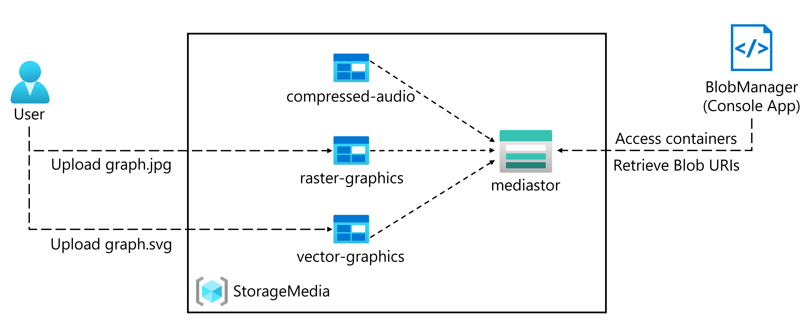
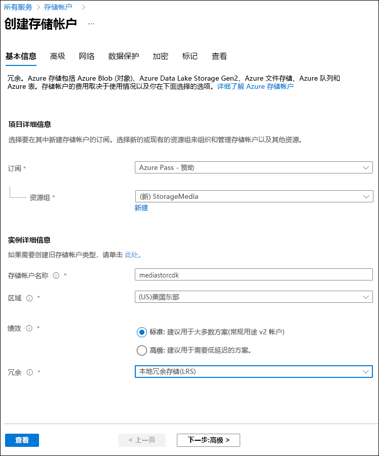

---
lab:
  az204Title: 'Lab 03: Retrieve Azure Storage resources and metadata by using the Azure Storage SDK for .NET'
  az204Module: 'Learning Path 03: Develop solutions that use blob storage'
---

# 实验室 03：使用适用于 .NET 的 Azure 存储 SDK 检索 Azure 存储资源和元数据

## Microsoft Azure 用户接口

鉴于 Microsoft 云工具的动态特性，Azure 用户界面 (UI) 在此培训内容开发后可能会发生更改。 因此，实验说明和实验步骤可能无法正确对应。

我们发现社区进行了必要更改时，Microsoft 会更新此培训课程。 但是，云更新经常发生，因此在此培训内容更新之前，可能会发生 UI 更改。 如果发生这种情况，请适应这些更改，并根据需要在实验室中熟悉这些更改。

## Instructions

### 开始之前

#### 登录到实验室环境

使用以下凭据登录到 Windows 10 虚拟机 (VM)：

- 用户名：`Admin`
- 密码：`Pa55w.rd`

> **注意**：你的讲师将提供连接到虚拟实验室环境的说明。

#### 查看已安装的应用程序

在你的 Windows 10 桌面上找到任务栏。 任务栏里有本实验室中你将使用的应用程序的图标，包括：

-   Microsoft Edge
-   文件资源浏览器

## 实验室场景

在本实验室中，你将了解如何使用 Azure 存储 SDK 来访问 C# 应用程序中的 Azure 存储容器。 你还将了解如何访问元数据和公开 URI 信息，来获取对存储帐户中容器内容的访问权限。 

最后，为了确保符合公司法规，你将通过生成共享访问签名和数据生命周期策略来实现安全访问。 你还将通过静态网站来测试对内容的访问。

右键单击此[视频链接](https://youtu.be/UtDXcgLv8BQ)观看此视频，然后选择“在新标签页/新窗口中打开链接”。<em></em>

 

## 体系结构关系图



### 练习 1：创建 Azure 资源

#### 任务 1：打开 Azure 门户

1. 在任务栏上，选择 Microsoft Edge 图标。

1. 在浏览器窗口中，浏览到 Azure 门户 (`https://portal.azure.com`)，然后使用你将用于此实验室的帐户登录。

   > **注意**：第一次登录 Azure 门户时，你会看到一个门户教程。 选择“开始使用”，以跳过导览并开始使用门户。

#### 任务 2：创建存储帐户

1. 在 Azure 门户中，使用“搜索资源、服务和文档”文本框搜索“存储帐户”，然后在结果列表中选择“存储帐户”  。

1. 在“存储帐户”边栏选项卡上，选择“+ 创建”。 ****  

1. 在“创建存储帐户”**** 边栏选项卡的“基本信息”**** 选项卡上，执行以下操作：

   | 设置 | 操作 |
   | -- | -- |
   | “订阅”下拉列表 | 保留默认值 |
   | “资源组”部分 | 选择“新建”，输入“StorageMedia”，然后选择“确定” |
   | “存储帐户名称”文本框  | 输入“mediastor[yourname]” |
   | “区域”下拉列表 | 选择“(US)美国东部” |
   | “性能”部分 | 选择“标准”选项 |
   | “冗余”下拉列表 | 选择“本地冗余存储(LRS)” |

   以下屏幕截图显示了“创建存储帐户”窗格上配置的设置。
 
   

1. 在“高级”**** 选项卡上，确保选中“允许在单个容器上启用匿名访问”****。 检查设置是否未启用。
    
1. 在“查看”选项卡中，查看在上述步骤中选择的选项。

1. 选择“创建”，使用指定的配置创建存储帐户。

    > **注意**：等待创建任务完成，再继续本实验室。

1. 选择“转到资源”。

1. 在“存储帐户”边栏选项卡上的“设置”部分中，选择“终结点”链接。 ****   ****   ****  

1. 在“终结点”部分中，将“Blob 服务”文本框的值复制到剪贴板 。

    > **注意**：你将在稍后的实验室中使用此终结点值。

1. 打开记事本，然后将复制的 blob 服务值粘贴到记事本。

1. 在“存储帐户”边栏选项卡的“安全性 + 网络”部分中，选择“访问密钥”  。

1. 将“存储帐户名称”值复制到剪贴板，然后将其粘贴到记事本中。

1. 从“访问密钥”边栏选项卡中，选择“显示密钥” 。

1. 查看任一密钥，然后将任一“密钥”框的值复制到剪贴板。

    > **注意**：你将在本实验室的后面部分使用所有这些值。

#### 审阅

在本练习中，你创建了将用于本实验室其余部分的新存储帐户。

### 练习 2：将 Blob 上传到容器

#### 任务 1：创建存储帐户容器

1. 在“存储帐户”边栏选项卡中，选择“数据存储”部分的“容器”链接。

1. 在“容器”部分，选择“+ 容器” 。

1. 在“新建容器”弹出窗口中，执行以下操作，然后选择“创建”：

    | 设置 | 操作 |
    | -- | -- |
    | “名称”文本框 | 输入“raster-graphics” |
    | “公共访问级别”下拉列表 | 选择“专用(没有匿名访问权限)” |

1. 在“容器”部分，选择“+ 容器” 。

1. 在“新建容器”弹出窗口中，执行以下操作，然后选择“创建”：

    | 设置 | 操作 |
    | -- | -- |
    | “名称”文本框 | 输入“compressed-audio” |
    | “公共访问级别”下拉列表 | 选择“专用(没有匿名访问权限)” |

1. 在“容器”部分中，查看容器更新列表。

    以下屏幕截图显示了“创建存储帐户”窗格上配置的设置。

    

#### 任务 2：上传存储帐户 Blob

1. 在“容器”部分中，选择最近创建的 raster-graphics 容器。

1.  在“容器”边栏选项卡中，选择“上传” 。

1.  在“上传 blob”窗口中，执行以下操作，然后选择“上传” ：

   | 设置 | 操作 |
   | -- | -- |
   | “文件”部分 | 选择“浏览文件”或使用拖放功能 |
   | “文件资源管理器”窗口 | 浏览到 Allfiles (F):\\Allfiles\\Labs\\03\\Starter\\Images，选择 graph.jpg 文件，然后选择“打开” |
   | “如果文件已存在，请覆盖”复选框 | 确保选中此复选框 |
   
   > **注意**：等待 Blob 上传完成，然后再继续本实验室。

#### 审阅

在本练习中，你在存储帐户中创建了占位符容器，然后在其中一个容器中填充了一个 Blob。

### 练习 3：使用 .NET SDK 访问容器

#### 任务 1：创建 .NET 项目

1. 在“启动”屏幕上，选择“Visual Studio Code”磁贴 。

1. 在“文件”菜单上，选择“打开文件夹”，浏览到 Allfiles (F):\\Allfiles\\Labs\\03\\Starter\\BlobManager，然后选择“选择文件夹”   。

1. 在“Visual Studio Code”窗口中的“菜单”栏上，选择“终端”，然后选择“新建终端”  。

1. 在终端中，运行以下命令以在当前文件夹中创建名为“BlobManager”的新 .NET 项目：

    ```
    dotnet new console --framework net6.0 --name BlobManager --output .
    ```

    > **注意**：dotnet new 命令将在与项目同名的文件夹中创建一个新的“控制台”项目 。

1. 在终端中，运行以下命令，从 NuGet 导入 **Azure.Storage.Blobs** 版本 12.12.0：

    ```
    dotnet add package Azure.Storage.Blobs --version 12.12.0
    ```

    > **注意**：dotnet add package 命令将从 NuGet 添加 Azure.Storage.Blobs 包。 有关详细信息，请参阅 [Azure.Storage.Blobs](https://www.nuget.org/packages/Azure.Storage.Blobs/12.12.0)。

1. 在终端中，运行以下命令以生成 .NET Web 应用程序：

    ```
    dotnet build
    ```

1. 选择“终止终端”或者“回收站”图标以关闭当前打开的终端和所有关联的进程 。

#### 任务 2：修改程序类以访问存储

1. 在“Visual Studio Code”窗口的“资源管理器”窗格上，打开 Program.cs 文件。 ****  

1. 在 Program.cs 文件的“代码编辑器”选项卡上，删除现有文件中的所有代码。 ****  

1. 添加以下代码：

    ```csharp
    using Azure.Storage;
    using Azure.Storage.Blobs;
    using Azure.Storage.Blobs.Models;
    using System;
    using System.Threading.Tasks;    
    public class Program
    {
        //Update the blobServiceEndpoint value that you recorded previously in this lab.        
        private const string blobServiceEndpoint = "<primary-blob-service-endpoint>";

        //Update the storageAccountName value that you recorded previously in this lab.
        private const string storageAccountName = "<storage-account-name>";

        //Update the storageAccountKey value that you recorded previously in this lab.
        private const string storageAccountKey = "<key>";    


        //The following code to create a new asynchronous Main method
        public static async Task Main(string[] args)
        { 
        }
    }
    ```

1. 通过将 blobServiceEndpoint 字符串常量的值设置为之前在本实验室中记录的存储帐户的“主 Blob 服务终结点”来更新该字符串常量。 ****

1. 通过将 storageAccountName 字符串常量的值设置为之前在本实验室中记录的存储帐户的存储帐户名称来更新该字符串常量。 ****

1. 通过将 storageAccountKey 字符串常量的值设置为之前在本实验室中记录的存储帐户的密钥来更新该字符串常量。 ****
  

#### 任务 3：连接到 Azure 存储 Blob 服务终结点

1. 在 Main 方法中，添加以下代码：
  
    ```csharp
     public static async Task Main(string[] args)
    {
        //The following line of code to create a new instance of the StorageSharedKeyCredential class by using the storageAccountName and storageAccountKey constants as constructor parameters
        StorageSharedKeyCredential accountCredentials = new StorageSharedKeyCredential(storageAccountName, storageAccountKey);

        //The following line of code to create a new instance of the BlobServiceClient class by using the blobServiceEndpoint constant and the accountCredentials variable as constructor parameters
        BlobServiceClient serviceClient = new BlobServiceClient(new Uri(blobServiceEndpoint), accountCredentials);

        //The following line of code to invoke the GetAccountInfoAsync method of the BlobServiceClient class to retrieve account metadata from the service
        AccountInfo info = await serviceClient.GetAccountInfoAsync();

        //Render a welcome message
        await Console.Out.WriteLineAsync($"Connected to Azure Storage Account");

        //Render the storage account's name
        await Console.Out.WriteLineAsync($"Account name:\t{storageAccountName}");

        //Render the type of storage account
        await Console.Out.WriteLineAsync($"Account kind:\t{info?.AccountKind}");

        //Render the currently selected stock keeping unit (SKU) for the storage account
        await Console.Out.WriteLineAsync($"Account sku:\t{info?.SkuName}");
    }
    ```

1. 保存 Program.cs 文件。 ****

1. 在“Visual Studio Code”窗口中的“菜单”栏上，选择“终端”，然后选择“新建终端”  。

1. 在终端中，运行以下命令以运行 .NET Web 应用程序：

    ```
    dotnet run
    ```

    > **注意**：如果出现任何生成错误，请查看位于 Allfiles (F):\\Allfiles\\Labs\\03\\Solution\\BlobManager 文件夹中的 Program.cs 文件 。

1. 观察当前运行的控制台应用程序的输出。 输出包含从服务中检索到的存储帐户的元数据。

1. 选择“终止终端”或者“回收站”图标以关闭当前打开的终端和所有关联的进程 。

#### 任务 4：枚举现有容器

1. 在 Program 类中，输入以下代码，创建名为 EnumerateContainersAsync 的新私有静态异步方法，该方法只有一个 BlobServiceClient 参数类型   ：
   
    ```csharp
    private static async Task EnumerateContainersAsync(BlobServiceClient client)
    {   
        /*Create an asynchronous foreach loop that iterates over the results of 
            an invocation of the GetBlobContainersAsync method of the BlobServiceClient class. */    
        await foreach (BlobContainerItem container in client.GetBlobContainersAsync())
        {   
            //Print the name of each container
            await Console.Out.WriteLineAsync($"Container:\t{container.Name}");
        }
    }
    ```

1. 在 Main 方法中，请在方法末尾输入以下代码以调用 EnumerateContainersAsync 方法，传入 serviceClient 变量作为参数：

    ```csharp
    await EnumerateContainersAsync(serviceClient);
    ```

1. 查看 Program.cs 文件，该文件现在应包括：
    ```csharp
    using Azure.Storage;
    using Azure.Storage.Blobs;
    using Azure.Storage.Blobs.Models;
    using System;
    using System.Threading.Tasks;
    
    public class Program
    {
        private const string blobServiceEndpoint = "your blobServiceEndpoint";
        private const string storageAccountName = "your storageAccountName";
        private const string storageAccountKey = "your storageAccountKey";    
        public static async Task Main(string[] args)
        {
            StorageSharedKeyCredential accountCredentials = new StorageSharedKeyCredential(storageAccountName, storageAccountKey);
            BlobServiceClient serviceClient = new     BlobServiceClient(new Uri(blobServiceEndpoint), accountCredentials);
            AccountInfo info = await serviceClient.GetAccountInfoAsync();
            await Console.Out.WriteLineAsync($"Connected to Azure Storage Account");
            await Console.Out.WriteLineAsync($"Account name:\t{storageAccountName}");
            await Console.Out.WriteLineAsync($"Account kind:\t{info?.AccountKind}");
            await Console.Out.WriteLineAsync($"Account sku:\t{info?.SkuName}");

            /* To invoke the EnumerateContainersAsync method, 
            passing in the serviceClient variable as a parameter */
            await EnumerateContainersAsync(serviceClient);
        }        
        private static async Task EnumerateContainersAsync(BlobServiceClient client)
        {        
            await foreach (BlobContainerItem container in client.GetBlobContainersAsync())
            {
                await Console.Out.WriteLineAsync($"Container:\t{container.Name}");
            }
    }
    }
    ```

1. 保存 Program.cs 文件。 ****

1. 在“Visual Studio Code”窗口中的“菜单”栏上，选择“终端”，然后选择“新建终端”  。

1. 在终端中，运行以下命令以运行 .NET Web 应用程序：

    ```
    dotnet run
    ```

    > **注意**：如果出现任何生成错误，请查看位于 Allfiles (F):\\Allfiles\\Labs\\03\\Solution\\BlobManager 文件夹中的 Program.cs 文件 。

1. 观察当前运行的控制台应用程序的输出。 更新后的输出包括帐户中每个现有容器的列表。

1. 选择“终止终端”或者“回收站”图标以关闭当前打开的终端和所有关联的进程 。

#### 审阅

在本练习中，使用 Azure 存储 SDK 访问现有容器。

### 练习 4：使用 .NET SDK 检索 Blob 统一资源标识符 (URI)

#### 任务 1：使用 SDK 枚举现有容器中的 Blob

1. 在 **Program** 类中，输入以下代码，以创建名为 **EnumerateBlobsAsync** 的新 私有静态异步方法，该方法具有两种参数类型，即 **BlobServiceClient** 和 **string**：
  
    ```csharp
    private static async Task EnumerateBlobsAsync(BlobServiceClient client, string containerName)
    {   
        /* Get a new instance of the BlobContainerClient class by using the
           GetBlobContainerClient method of the BlobServiceClient class, 
           passing in the containerName parameter */   
        BlobContainerClient container = client.GetBlobContainerClient(containerName);

        /* Render the name of the container that will be enumerated */
        await Console.Out.WriteLineAsync($"Searching:\t{container.Name}");

        /* Create an asynchronous foreach loop that iterates over the results of
            an invocation of the GetBlobsAsync method of the BlobContainerClient class */
        await foreach (BlobItem blob in container.GetBlobsAsync())
        {     
            //Print the name of each blob    
            await Console.Out.WriteLineAsync($"Existing Blob:\t{blob.Name}");
        }
    }
    ```

1. 在 Main 方法中，在方法末尾输入以下代码，创建一个名为 existingContainerName 且值为 raster-graphics 的变量：

    ```csharp
    string existingContainerName = "raster-graphics";
    ```

1. 在 Main 方法中，在方法末尾输入以下代码以调用 EnumerateBlobsAsync 方法，从而传入 serviceClient 和 existingContainerName 变量作为参数：

    ```csharp
    await EnumerateBlobsAsync(serviceClient, existingContainerName);
    ```

1. 查看 Program.cs 文件，该文件现在应包括：
    ```csharp
    using Azure.Storage;
    using Azure.Storage.Blobs;
    using Azure.Storage.Blobs.Models;
    using System;
    using System.Threading.Tasks;    
    public class Program
    {
        private const string blobServiceEndpoint = "your blobServiceEndpoint";
        private const string storageAccountName = "your storageAccountName";
        private const string storageAccountKey = "your storageAccountKey";    
        public static async Task Main(string[] args)
        {
            StorageSharedKeyCredential accountCredentials = new StorageSharedKeyCredential(storageAccountName, storageAccountKey);
            BlobServiceClient serviceClient = new   BlobServiceClient(new Uri(blobServiceEndpoint), accountCredentials);
            AccountInfo info = await serviceClient.GetAccountInfoAsync();
            await Console.Out.WriteLineAsync($"Connected to Azure Storage Account");
            await Console.Out.WriteLineAsync($"Account name:\t{storageAccountName}");
            await Console.Out.WriteLineAsync($"Account kind:\t{info?.AccountKind}");
            await Console.Out.WriteLineAsync($"Account sku:\t{info?.SkuName}");
            await EnumerateContainersAsync(serviceClient);
            string existingContainerName = "raster-graphics";
            await EnumerateBlobsAsync(serviceClient, existingContainerName);
        }        
        private static async Task EnumerateContainersAsync(BlobServiceClient client)
        {        
            await foreach (BlobContainerItem container in client.GetBlobContainersAsync())
            {
                await Console.Out.WriteLineAsync($"Container:\t{container.Name}");
            }
        }        
        private static async Task EnumerateBlobsAsync(BlobServiceClient client, string containerName)
        {      
            BlobContainerClient container = client.GetBlobContainerClient(containerName);
            await Console.Out.WriteLineAsync($"Searching:\t{container.Name}");
            await foreach (BlobItem blob in container.GetBlobsAsync())
            {        
                await Console.Out.WriteLineAsync($"Existing Blob:\t{blob.Name}");
            }
        }
    }
    ```

1. 保存 Program.cs 文件。 ****

1. 在“Visual Studio Code”窗口中的“菜单”栏上，选择“终端”，然后选择“新建终端”  。

1. 在终端中，运行以下命令以运行 .NET Web 应用程序：

    ```
    dotnet run
    ```

    > **注意**：如果出现任何生成错误，请查看位于 Allfiles (F):\\Allfiles\\Labs\\03\\Solution\\BlobManager 文件夹中的 Program.cs 文件 。

1. 查看当前运行的控制台应用程序的输出。 更新后的输出包括有关现有容器和 Blob 的元数据。

1. 选择“终止终端”或者“回收站”图标以关闭当前打开的终端和所有关联的进程 。

#### 任务 2：使用 SDK 创建新容器

1. 在 Program 类中输入以下代码，创建名为 GetContainerAsync 的新私有静态异步方法，该方法有两种参数类型，即 BlobServiceClient 和 string    ：

    ```csharp
    private static async Task<BlobContainerClient> GetContainerAsync(BlobServiceClient client, string containerName)
    {   
        /* Get a new instance of the BlobContainerClient class by using the
            GetBlobContainerClient method of the BlobServiceClient class,
            passing in the containerName parameter */   
        BlobContainerClient container = client.GetBlobContainerClient(containerName);

        /* Invoke the CreateIfNotExistsAsync method of the BlobContainerClient class */
        await container.CreateIfNotExistsAsync(PublicAccessType.Blob);

        /* Render the name of the container that was potentially created */
        await Console.Out.WriteLineAsync($"New Container:\t{container.Name}");

        /* Return the container as the result of the GetContainerAsync */        
        return container;
    }
    ```

1. 在 Main方法中，在方法末尾输入以下代码，创建一个名为 newContainerName 且值为 vector-graphics 的变量：

    ```csharp
    string newContainerName = "vector-graphics";
    ```

1. 在 Main 方法中，在方法末尾输入以下代码以调用 GetContainerAsync 方法，从而以参数的形式传入 serviceClient 和 newContainerName 变量，并将结果存储在名为 containerClient 的 BlobContainerClient 类变量中   ：

    ```csharp
    BlobContainerClient containerClient = await GetContainerAsync(serviceClient, newContainerName);
    ```

1. 查看 Program.cs 文件，该文件现在应包括：
    ```csharp
    using Azure.Storage;
    using Azure.Storage.Blobs;
    using Azure.Storage.Blobs.Models;
    using System;
    using System.Threading.Tasks;    
    public class Program
    {
        private const string blobServiceEndpoint = "your blobServiceEndpoint";
        private const string storageAccountName = "your storageAccountName";
        private const string storageAccountKey = "your storageAccountKey";
        public static async Task Main(string[] args)
        {
            StorageSharedKeyCredential accountCredentials = new StorageSharedKeyCredential(storageAccountName, storageAccountKey);
            BlobServiceClient serviceClient = new BlobServiceClient(new Uri(blobServiceEndpoint), accountCredentials);
            AccountInfo info = await serviceClient.GetAccountInfoAsync();
            await Console.Out.WriteLineAsync($"Connected to Azure Storage Account");
            await Console.Out.WriteLineAsync($"Account name:\t{storageAccountName}");
            await Console.Out.WriteLineAsync($"Account kind:\t{info?.AccountKind}");
            await Console.Out.WriteLineAsync($"Account sku:\t{info?.SkuName}");
            await EnumerateContainersAsync(serviceClient);
            string existingContainerName = "raster-graphics";
            await EnumerateBlobsAsync(serviceClient, existingContainerName);
            string newContainerName = "vector-graphics";
            BlobContainerClient containerClient = await GetContainerAsync(serviceClient, newContainerName);
        }        
        private static async Task EnumerateContainersAsync(BlobServiceClient client)
        {        
            await foreach (BlobContainerItem container in client.GetBlobContainersAsync())
            {
                await Console.Out.WriteLineAsync($"Container:\t{container.Name}");
            }
        }        
        private static async Task EnumerateBlobsAsync(BlobServiceClient client, string containerName)
        {      
            BlobContainerClient container = client.GetBlobContainerClient(containerName);
            await Console.Out.WriteLineAsync($"Searching:\t{container.Name}");
            await foreach (BlobItem blob in container.GetBlobsAsync())
            {        
                await Console.Out.WriteLineAsync($"Existing Blob:\t{blob.Name}");
            }
        }        
        private static async Task<BlobContainerClient> GetContainerAsync(BlobServiceClient client, string containerName)
        {      
            BlobContainerClient container = client.GetBlobContainerClient(containerName);
            await container.CreateIfNotExistsAsync(PublicAccessType.Blob);
            await Console.Out.WriteLineAsync($"New Container:\t{container.Name}");
            return container;
        }
    }
    ```

1. 保存 Program.cs 文件。 ****

1. 在“Visual Studio Code”窗口中的“菜单”栏上，选择“终端”，然后选择“新建终端”  。

1. 在终端中，运行以下命令以运行 .NET Web 应用程序：

    ```
    dotnet run
    ```

    > **注意**：如果出现任何生成错误，请查看位于 Allfiles (F):\\Allfiles\\Labs\\03\\Solution\\BlobManager 文件夹中的 Program.cs 文件 。

1. 观察当前运行的控制台应用程序的输出。 更新后的输出包括有关现有容器和 Blob 的元数据。

1. 选择“终止终端”或者“回收站”图标以关闭当前打开的终端和所有关联的进程 。

#### 任务 3：使用门户上传新 Blob

1. 在 Azure 门户的“导航”窗格中，选择“资源组”链接。

1. 在“资源组”窗格中，选择之前在本实验中创建的“StorageMedia”资源组。

1. 在“StorageMedia”边栏选项卡中，选择你之前在本实验室中创建的 mediastor[yourname] 存储帐户 。

1. 在“存储帐户”边栏选项卡中，选择“数据存储”部分的“容器”链接。

1. 在“容器”部分中，选择新创建的 vector-graphics 容器。 可能需要刷新页面才能看到新的容器。

1.  在“容器”边栏选项卡中，选择“上传” 。

1.  在“上传 blob”窗口中，执行以下操作，然后选择“上传” ：

    | 设置 | 操作 |
    | -- | -- |
    | “文件”部分 | 选择“浏览文件”或使用拖放功能 |
    | “文件资源管理器”窗口 |  Allfiles (F):\\Allfiles\\Labs\\03\\Starter\\Images，选择 graph.svg 文件，然后选择“打开” |
    | “如果文件已存在，请覆盖”复选框 | 确保选中此复选框 |

    > **注意**：等待 Blob 上传完成，然后再继续本实验室。

#### 任务 4：使用 SDK 访问 Blob URI

1. 切换到“Visual Studio Code”窗口。

1. 在 **Program** 类中，输入以下代码，创建名为 **GetBlobAsync** 的新使用静态异步方法。该方法具有两种参数类型，即 **BlobContainerClient** 和 **string**：
   
    ```csharp
    private static async Task<BlobClient> GetBlobAsync(BlobContainerClient client, string blobName)
    {      
        BlobClient blob = client.GetBlobClient(blobName);
        bool exists = await blob.ExistsAsync();
        if (!exists)
        {
            await Console.Out.WriteLineAsync($"Blob {blob.Name} not found!");
            
        }
        else
            await Console.Out.WriteLineAsync($"Blob Found, URI:\t{blob.Uri}");
        return blob;
    }
    ```

1. 在 Main 方法中，在方法末尾输入以下代码，创建一个名为 uploadedBlobName 且值为 graph.svg 的变量：

    ```csharp
    string uploadedBlobName = "graph.svg";
    ```

1. 在 Main 方法中，在方法末尾输入以下代码以调用 GetBlobAsync 方法，从而以参数的形式传入 containerClient 和 uploadedBlobName 变量，并将结果存储在名为 blobClient 的 BlobClient 类变量中：

    ```csharp
    BlobClient blobClient = await GetBlobAsync(containerClient, uploadedBlobName);
    ```

1. 在 Main 方法中，在方法末尾输入以下代码，呈现 blobClient 变量的 Uri 属性：

    ```csharp
    await Console.Out.WriteLineAsync($"Blob Url:\t{blobClient.Uri}");
    ```

1. 查看 Program.cs 文件，该文件现在应包括：
    ```csharp
    using Azure.Storage;
    using Azure.Storage.Blobs;
    using Azure.Storage.Blobs.Models;
    using System;
    using System.Threading.Tasks;    
    public class Program
    {
        private const string blobServiceEndpoint = "your blobServiceEndpoint";
        private const string storageAccountName = "your storageAccountName";
        private const string storageAccountKey = "your storageAccountKey";    
        public static async Task Main(string[] args)
        {
            StorageSharedKeyCredential accountCredentials = new StorageSharedKeyCredential(storageAccountName, storageAccountKey);
            BlobServiceClient serviceClient = new BlobServiceClient(new Uri(blobServiceEndpoint), accountCredentials);
            AccountInfo info = await serviceClient.GetAccountInfoAsync();
            await Console.Out.WriteLineAsync($"Connected to Azure Storage Account");
            await Console.Out.WriteLineAsync($"Account name:\t{storageAccountName}");
            await Console.Out.WriteLineAsync($"Account kind:\t{info?.AccountKind}");
            await Console.Out.WriteLineAsync($"Account sku:\t{info?.SkuName}");
            await EnumerateContainersAsync(serviceClient);
            string existingContainerName = "raster-graphics";
            await EnumerateBlobsAsync(serviceClient, existingContainerName);
            string newContainerName = "vector-graphics";
            BlobContainerClient containerClient = await GetContainerAsync(serviceClient, newContainerName);
            string uploadedBlobName = "graph.svg";
            BlobClient blobClient = await GetBlobAsync(containerClient, uploadedBlobName);
            await Console.Out.WriteLineAsync($"Blob Url:\t{blobClient.Uri}");
        }        
        private static async Task EnumerateContainersAsync(BlobServiceClient client)
        {        
            await foreach (BlobContainerItem container in client.GetBlobContainersAsync())
            {
                await Console.Out.WriteLineAsync($"Container:\t{container.Name}");
            }
        }        
        private static async Task EnumerateBlobsAsync(BlobServiceClient client, string containerName)
        {      
            BlobContainerClient container = client.GetBlobContainerClient(containerName);
            await Console.Out.WriteLineAsync($"Searching:\t{container.Name}");
            await foreach (BlobItem blob in container.GetBlobsAsync())
            {        
                await Console.Out.WriteLineAsync($"Existing Blob:\t{blob.Name}");
            }
        }        
        private static async Task<BlobContainerClient> GetContainerAsync(BlobServiceClient client, string containerName)
        {      
            BlobContainerClient container = client.GetBlobContainerClient(containerName);

            await container.CreateIfNotExistsAsync(PublicAccessType.Blob);
            await Console.Out.WriteLineAsync($"New Container:\t{container.Name}");
            return container;
        }        
        private static async Task<BlobClient> GetBlobAsync(BlobContainerClient client, string blobName)
        {      
            BlobClient blob = client.GetBlobClient(blobName);
            bool exists = await blob.ExistsAsync();
            if (!exists)
            {
                await Console.Out.WriteLineAsync($"Blob {blob.Name} not found!");
                
            }
            else
                await Console.Out.WriteLineAsync($"Blob Found, URI:\t{blob.Uri}");
            return blob;
        }
    }
    ```

1. 保存 Program.cs 文件。 ****

1. 在“Visual Studio Code”窗口中的“菜单”栏上，选择“终端”，然后选择“新建终端”  。

1. 在终端中，运行以下命令以运行 .NET Web 应用程序：

    ```
    dotnet run
    ```

    > **注意**：如果出现任何生成错误，请查看位于 Allfiles (F):\\Allfiles\\Labs\\03\\Solution\\BlobManager 文件夹中的 Program.cs 文件 。

1. 观察当前运行的控制台应用程序的输出。 更新后的输出包括用于在线访问 blob 的最终 URL。 记录本 URL 的值，以便稍后在本实验室中使用。

    > **注意**：URL 可能类似于以下字符串：`https://mediastor*[yourname]*.blob.core.windows.net/vector-graphics/graph.svg`

1. 选择“终止终端”或者“回收站”图标以关闭当前打开的终端和所有关联的进程 。

#### 任务 5：使用浏览器测试该 URI

1. 在任务栏上，激活“Microsoft Edge”的快捷菜单，然后选择“新建窗口”。

1. 在新的浏览器窗口中，引用之前在本实验室中针对 Blob 复制的 URL。

1. 现在，应该在浏览器窗口中注意到可缩放矢量图形 (SVG) 文件。

#### 审阅

在本练习中，你使用存储 SDK 创建了容器并管理了 Blob。
