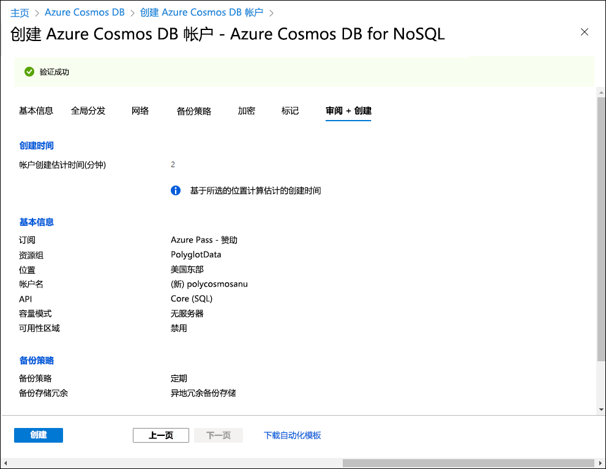
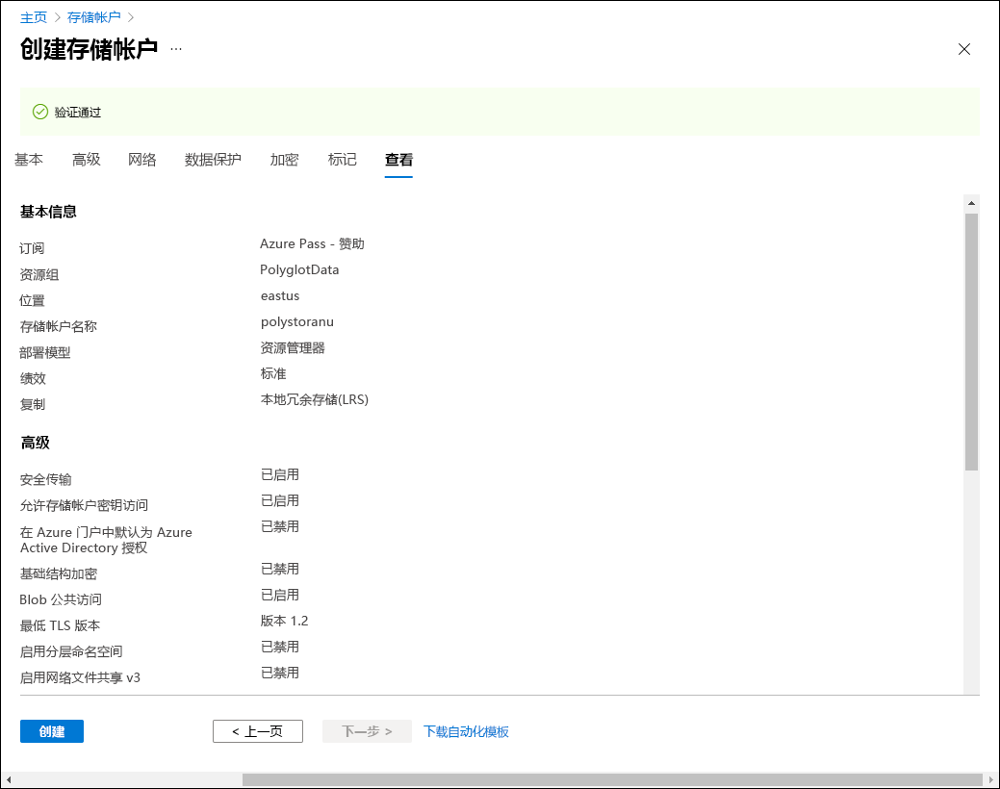

---
lab:
  az204Title: 'Lab 04: Construct a polyglot data solution'
  az204Module: 'Learning Path 04: Develop solutions that use Cosmos DB storage'
---

# 实验室 04：构造多语言数据解决方案

## Microsoft Azure 用户接口

鉴于 Microsoft 云工具的动态特性，Azure UI 在此培训内容开发后可能会发生更改。 因此，实验说明和实验步骤可能无法正确对应。

我们发现社区进行了必要更改时，Microsoft 会更新此培训课程。 但是，云更新经常发生，因此在此培训内容更新之前，可能会发生 UI 更改。 如果发生这种情况，请适应这些更改，并根据需要在实验室中熟悉这些更改。

## Instructions

### 开始之前

#### 登录到实验室环境

使用以下凭据登录到 Windows 11 虚拟机 (VM)：

- 用户名：`Admin`
- 密码：`Pa55w.rd`

> **注意**：你的讲师将提供连接到虚拟实验室环境的说明。

#### 查看已安装的应用程序

在 Windows 11 桌面上找到任务栏。 任务栏里有本实验室中你将使用的应用程序的图标，包括：

- Microsoft Edge
- 文件资源浏览器
- Visual Studio Code

## 实验室场景

在本实验室中，你将创建 Azure Cosmos DB 资源和存储帐户资源。 使用 C# 和 .NET，你将访问 Cosmos DB 资源并将数据上传到该资源。

此外，由于 Contoso 可能希望通过用户友好界面访问 Cosmos DB 中的数据，因此你将实现一个 .NET 解决方案，用于在 Web 浏览器中访问和显示来自 Cosmos DB 中的数据。

## 体系结构关系图


### 练习 1：在 Azure 中创建数据存储资源

#### 任务 1：打开 Azure 门户

1. 在任务栏上，选择 Microsoft Edge 图标。

1. 在打开的浏览器窗口中，浏览到 Azure 门户 (`https://portal.azure.com`)，然后使用你将用于此实验室的帐户登录。

   > **注意**：第一次登录 Azure 门户时，你会看到一个门户教程。 选择“开始使用”，以跳过导览并开始使用门户。

#### 任务 2：创建 Azure Cosmos DB 帐户资源

1. 在 Azure 门户中，使用“搜索资源、服务和文档”文本框搜索“Azure Cosmos DB”，然后在结果列表中，选择“Azure Cosmos DB”  。

1. 在“Azure Cosmos DB”窗格上，选择“创建”********。

1. 在“创建 Azure Cosmos DB 帐户”边栏选项卡上，在“Azure Cosmos DB for NoSQL”框中选择“创建”。************

1. 在“创建 Azure Cosmos DB 帐户 - Azure Cosmos DB for NoSQL”页的“基本信息”选项卡上，执行以下操作，然后选择“查看 + 创建”************：

   | 设置                     | 操作                                                                                                                   |
   | --------------------------- | ------------------------------------------------------------------------------------------------------------------------ |
   | 订阅列表       | 保留默认值                                                                                                          |
   | “资源组”部分  | 选择“新建”                                                                                                    |
   | “名称”文本框           | 输入“Polyglotdata”，然后选择“确定”                                                                                 |
   | AccountName 文本框    | 输入“polycosmos[yourname]”                                                                                         |
   | “位置”下拉列表 | 选择与实验室计算机位置最接近的 Azure 区域，并选择要在其中创建 Cosmos DB 帐户的位置 |
   | 容量模式部分****   | 选择“无服务器”                                                                                                    |

   以下屏幕截图显示了“创建 Azure Cosmos DB 帐户 - Azure Cosmos DB for NoSQL”页上配置的设置。

   

1. 在“创建 Azure Cosmos DB 帐户 - Azure Cosmos DB for NoSQL”页上的“查看 + 创建”选项卡上，查看你在前面步骤中选择的选项********。

1. 选择“创建”，使用指定的配置创建 Azure Cosmos DB 帐户。

   > **注意**：等待创建任务完成，再继续本实验室。

1. 选择“转到资源”。

1. 在“Azure Cosmos DB 帐户”边栏选项卡中，找到“设置”部分，然后选择“密钥”链接************。

1. 在“密钥”窗格的“读取-写入密钥”选项卡上，将“URI”、“主密钥”和“主连接字符串”文本框的值记录到记事本中********************。 你将在本实验室的后面部分使用这些值。

   > **注意**：需要使用“主键”和“主连接字符串”的眼睛图标才能将它们复制到剪贴板中********。 

#### 任务 3：创建 Azure 存储帐户资源

1. 在 Azure 门户中，使用“搜索资源、服务和文档”文本框搜索“存储帐户”，然后在结果列表中选择“存储帐户”  。

1. 在“存储帐户”边栏选项卡上，选择“+ 创建”。

1. 在“创建存储帐户”边栏选项卡的“基本信息”选项卡上，执行以下操作，然后选择“查看”  ：

   | 设置 | 操作 |
   | --- |--- |
   | 订阅列表 | 保留默认值 |
   | “资源组”部分 | 选择“PolyglotData” |
   | “存储帐户名称”文本框 | 输入“polystor[yourname]” |
   | “区域”下拉列表 | 选择之前在本练习中创建 Cosmos DB 帐户的区域 |
   | 主服务**** | 无更改 |
   | “性能”部分 | 选择“标准” |
   | “冗余”下拉列表 | 选择“本地冗余存储(LRS)” |

   以下屏幕截图显示了“创建存储帐户”边栏选项卡上配置的设置。

   

1. 在“创建存储帐户”边栏选项卡上的“查看”选项卡上，查看你在前面步骤中选择的选项 。

1. 选择“创建”，使用指定的配置创建存储帐户。

   > **注意**：等待创建任务完成，再继续操作本实验室。

#### 审阅

在此练习中，你已创建了将在此实验室中实现的多语言数据解决方案所需的 Azure 资源。 你创建的 Azure 资源包括 Azure Cosmos DB 帐户和 Azure 存储帐户。

### 练习 2：查看并上传数据

#### 任务 1：将图像上传到 Azure Blob 存储

1. 在 Azure 门户导航窗格中，导航回“存储帐户”边栏选项卡，然后选择在此实验室之前的练习中创建的 polystor[yourname] 存储帐户 。

1. 在 polystor[yourname] 存储帐户边栏选项卡中，选择“数据存储”部分的“容器”链接 。

1. 在“容器”部分，选择“+ 容器” 。

1. 在“新建容器”弹出窗口中，执行以下操作，然后选择“创建”：

   | 设置                                | 操作                                   |
   | -------------------------------------- | ---------------------------------------- |
   | “名称”文本框                      | 输入“images”                         |

1. 返回“容器”部分，导航到新创建的“images”容器********。

1. 在“容器”边栏选项卡中，找到“设置”部分，然后选择“属性”链接  。

1. 在“属性”窗格中，将“URL”文本框中的值记录到记事本********。 你稍后将在本实验室中使用此值。

1. 下一步，单击“共享访问令牌”****，然后单击“生成 SAS 令牌和 URL”****，以生成具有默认设置的访问令牌。 将 Blob SAS 令牌的值记录到记事本，稍后需要用到此值****。

   > **注意**：记事本中现在应有 5 个值。 Cosmos DB 帐户的 URI、主键和主连接字符串************。 以及 Blob 容器的 URL 和 SAS 令牌********。

1. 在边栏选项卡中找到并选择“概述”链接。
1. 在边栏选项卡中，选择“上传”。

1. 在“上传 Blob”弹出窗口中，执行以下操作：

   a. 在“文件”部分，选择“浏览文件”或使用拖放功能。

   b. 在“文件资源管理器”窗口中，浏览到 Allfiles (F):\\Allfiles\\Labs\\04\\Starter\\Images，选择 42 个单独的 .jpg 图像文件，然后选择“打开”   。

   c. 确保“如果文件已存在，则覆盖”已选中，然后选择“上传” 。

   > **注意**：等待所有 Blob 上传完成，然后再继续本实验室。

#### 任务 2：查看 JSON 数据

1. 在实验室计算机上，启动“Visual Studio Code”。

1. 在“文件”菜单中，选择“打开文件”，浏览到 Allfiles (F):\\Allfiles\\Labs\\04\\Starter\\AdventureWorks\\AdventureWorks.Upload，选择“models.json”，然后选择“打开”    。

1. 查看“models.json”文件的格式，并注意它包含 JSON 对象的数组，还包含作为 Products 属性一部分的对象嵌套数组， 。

   > **注意**：这将确定你将定义的类，以便在将 JSON 文件内容上传到 Cosmos DB 集合之前对其内容进行反序列化。

1. 请注意，在“models.json”文件中有一个名为“Category”的属性 。

   > **注意**：你将使用“Category”属性定义目标 Cosmos DB 集合的分区。

1. 关闭 Visual Studio Code。

#### 任务 3：创建 Cosmos DB 数据库和集合，并上传 JSON 数据

1. 在“启动”屏幕上，选择“Visual Studio Code”磁贴 。

1. 在“文件”菜单上，选择“打开文件夹” 。

1. 在打开的“文件资源管理器”窗口中，浏览到 Allfiles (F):\\Allfiles\\Labs\\04\\Starter\\AdventureWorks，然后选择“选择文件夹”  。

1. 在“Visual Studio Code”窗口中的“菜单”栏上，选择“终端”，然后选择“新建终端”  。

1. 在终端中，验证当前目录是否设置为“AdventureWorks”（如果不是，请更改为此目录），然后运行以下命令将终端上下文切换到“AdventureWorks.Upload”文件夹 ：

   ```
   cd .\AdventureWorks.Upload\
   ```

   > **注意**：执行下一步之前，请打开 Windows 资源管理器，并从文件 Allfiles (F):\\Allfiles\\Labs\\04\\Starter\\AdventureWorks\\AdventureWorks.Upload\\AdventureWorks.Upload.csproj 中删除只读属性

1. 在终端提示符下，运行以下命令，将 Azure Cosmos DB .NET 客户端库添加到当前打开的项目：

   > **备注**：在继续执行以下命令之前，请确保当前位于以下路径：**(F):\\Allfiles\\Labs\\04\\Starter\\AdventureWorks\\AdventureWorks.Upload\\**

   ```
   dotnet add package Microsoft.Azure.Cosmos --version 3.28.0
   ```
   
   > **注意**：dotnet add package 命令将从 NuGet 添加 Microsoft.Azure.Cosmos 包  。 有关详细信息，请参阅 [Microsoft.Azure.Cosmos](https://www.nuget.org/packages/Microsoft.Azure.Cosmos)。

1. 查看在终端上打印的生成结果。 生成应成功完成，不会出现错误或警告消息。

1. 在“Visual Studio Code”窗口的“资源管理器”窗格中，展开“AdventureWorks.Upload”项目************。

1. 打开 **Program.cs** 文件。

1. 在“Program.cs”文件中，查看指令，并注意它们包括 Microsoft.Azure.Cosmos、System.IO、System.Text.Json、System.Threading.Tasks 和 System.Collections.Generic      。 这样，就可以将 JSON 项从实验室计算机的本地文件异步上传到 Cosmos DB 数据库中的集合。

1. 在“Program.cs”文件的第 14 行中，将空字符串替换为之前在此实验室中记录的 Cosmos DB 帐户的“URI”属性，以设置“EndpointUrl”的值****************。 确保此值括在双引号内。 这是在记事本中记录的第一个值****。

1. 在第 15 行中，将空字符串替换为之前在此实验室中记录的 Cosmos DB 帐户的“PRIMARY KEY”属性，以设置“AuthorizationKey”的值********。**** 确保此值括在双引号内。 这是在记事本中记录的第二个值****。

1. 在第 18 行中，将空字符串替换为“/Category”，以设置“PartitionKey”的值 。

1. 在第 19 行中，将空字符串替换为“F:\\\\Allfiles\\\\Labs\\\\04\\\\Starter\\\\AdventureWorks\\\\AdventureWorks.Upload\\\\models.json”，以设置“JsonFilePath”的值 。

1. 在 try 块中，请注意 CosmosClient 类的 CreateDatabaseIfNotExistsAsync 方法的调用 。 如果不存在数据库，这将创建一个数据库。

1. 请注意对 Database 类的 DefineContainer 方法的调用 。 这将创建一个容器，用于托管 JSON 项（如果不存在）。

   > **注意**：DefineContainer 方法包括一个成本最小化选项，借此你可以修改默认索引策略（自动索引所有属性）。

1. 请注意 using 语句，该语句依赖于 StreamReader 对象，以从文本文件中读取 JSON 项，并将其反序列化到 Program.cs 文件中进一步定义的 Model 类的对象中   。

1. 请注意 foreach 循环，它遍历反序列化对象集合并将每个对象异步地插入到目标集合中。

1. 查看 Model 和 Product 类，这些类反映之前在此实验室中查看的 JSON 格式文件中存储的对象格式 。

1. 保存并关闭 Program.cs**** 文件。

   > **注意**：如果收到文件为只读的提示，请选择“覆盖”。

1. 在终端中，运行以下命令以还原任何缺失的 NuGet 包，并在文件夹中生成项目：

   ```
   dotnet build
   ```

   > **注意**：dotnet build 命令将在生成文件夹中的所有项目之前自动还原所有丢失的 NuGet 包。

1. 在终端提示符下，运行以下命令以运行 .NET Core 控制台应用程序：

   ```
   dotnet run
   ```

   > **注意**：dotnet run 命令将自动生成对项目的更改，然后在不连接调试程序的情况下启动 Web 应用程序。 该命令将输出指示数据加载进度的消息，包括插入到目标集合中的项数和插入操作持续时间。

1. 查看运行在终端上打印的命令的结果。 运行应成功完成，并显示有关有 119 项插入到目标 Cosmos DB 集合的消息。

1. 选择“终止终端”（“回收站”图标）以关闭终端窗格和任何关联的进程 。

#### 任务 4：验证 JSON 数据是否上传

1. 在实验室计算机上，切换到显示 Azure 门户的“Microsoft Edge”浏览器窗口。

1. 在 Azure 门户中，选择“搜索资源、服务和文档”文本框，在“最近使用的资源”列表中选择之前在此实验室中创建的 polycosmos[yourname] Azure Cosmos DB 帐户  。

1. 在“Azure Cosmos DB 帐户”边栏选项卡中，查找并选择边栏选项卡中的“数据资源管理器”链接********。

1. 在“数据资源管理器”窗格中，展开“零售”数据库节点 。

1. 展开“Online”容器节点，然后选择“新建 SQL 查询” 。

   > **注意**：此选项的标签可能会隐藏。 可以通过将鼠标悬停在“数据资源管理器”窗格的图标上来显示标签。

1. 在“查询”选项卡中，输入以下文本：

   ```sql
   SELECT * FROM models
   ```

1. 选择“执行查询”，然后查看查询返回的 JSON 项列表。

1. 返回查询编辑器，将现有文本替换为以下文本：

   ```sql
   SELECT VALUE COUNT(1) FROM models
   ```

1. 选择“执行查询”，然后查看 COUNT 聚合操作的结果 。 它应输出 119，与插入的项数匹配。 

1. 切换回“Visual Studio Code”窗口。

#### 审阅

在此练习中，你使用了适用于 Azure Cosmos DB 的 .NET SDK 将数据插入到 Azure Cosmos DB 中。 接下来要实现的 Web 应用程序将使用此数据。

### 练习 3：配置 .NET Web 应用程序

#### 任务 1：更新对数据存储的引用并生成 Web 应用程序

1. 在“Visual Studio Code”窗口的“资源管理器”窗格中，展开 AdventureWorks.Web 项目************。

1. 打开 **appsettings.json** 文件。

1. 在 JSON 对象的第 3 行中，找到 ConnectionStrings.AdventureWorksCosmosContext 路径。 注意当前值为空：

   ```json
   "ConnectionStrings": {
       "AdventureWorksCosmosContext": "",
   },
   ```

1. 通过将“AdventureWorksCosmosContext”属性的值设置为你之前在本实验中记录的 Azure Cosmos DB 帐户的“主连接字符串”来更新该值********。 这是在记事本中记录的第三个值****。

1. 在 JSON 对象的第 6 行，找到“Settings.BlobContainerUrl”属性****。 注意当前值为空：

   ```json
   "Settings": {
       "BlobContainerUrl": "",
       "BlobSASToken": ""
   }
   ```

1. 更新 BlobContainerUrl 和 BlobSASToken 属性，将它们的值设置为名为 images 的 Azure Storage blob 容器的 URL 属性，以及在本实验室早些时候记录的 blob SAS 令牌值********************。 这是在记事本中记录的第四个和第五个值********。

1. 保存 appsettings.json 文件并将其关闭****。

   > **注意**：如果收到文件为只读的提示，请选择“覆盖”。

1. 在“Visual Studio Code”**** 窗口的“资源管理器”窗格中，右键单击“AdventureWorks.Context”**** 文件夹，然后选择“在集成终端中打开”****。

   

   > **注意**：执行下一步之前，请打开 Windows 资源管理器，并从文件 Allfiles (F):\Allfiles\Labs\04\Starter\AdventureWorks\AdventureWorks.Context\AdventureWorks.Context.csproj 中删除只读属性

1. 在终端提示符下，验证当前目录是否设置为“AdventureWorks.Context”（如果不是，将其更改为该目录），然后运行以下命令从 NuGet 导入 Microsoft.Azure.Cosmos ：

   > **备注**：在继续执行以下命令之前，请确保当前位于以下路径：**(F):\\Allfiles\\Labs\\04\\Starter\\AdventureWorks\\AdventureWorks.Context\\**

   ```
   dotnet add package Microsoft.Azure.Cosmos --version 3.28.0
   ```

1. 在终端提示符下，运行以下命令以生成 AdventureWorks.Context**** 项目：

   ```
   dotnet build
   ```

1. 查看在终端上打印的生成结果。 生成应成功完成，不会出现错误或警告消息。

#### 任务 2：到 Azure Cosmos DB 的配置连接

1. 在“Visual Studio Code”窗口的“资源管理器”窗格中，展开“AdventureWorks.Context”项目************。

1. 从“AdventureWorks.Context”文件夹节点的快捷菜单中，选择“新建文件” 。

1. 在新文件提示符处，输入“AdventureWorksCosmosContext.cs”。

1. 在 AdventureWorksCosmosContext.cs **** 文件的“代码编辑器”选项卡中，添加以下代码：

   ```csharp
   using AdventureWorks.Models;
   using Microsoft.Azure.Cosmos;
   using Microsoft.Azure.Cosmos.Linq;
   using System;
   using System.Collections.Generic;
   using System.Linq;
   using System.Threading.Tasks;

   namespace AdventureWorks.Context
   {
       /* AdventureWorksCosmosContext class will implement the
       IAdventureWorksProductContext interface */
      public class AdventureWorksCosmosContext : IAdventureWorksProductContext
      {
           /* Create a new read-only Container variable named _container */
           private readonly Container _container;

         public AdventureWorksCosmosContext(string connectionString, string database = "Retail", string container = "Online")
         {
           /* Create a new instance of the CosmosClient class, and then obtain
             both a Database and Container instance from the client */
           _container = new CosmosClient(connectionString)
           .GetDatabase(database)
           .GetContainer(container);
         }

         public async Task<Model> FindModelAsync(Guid id)
         {
           /* Create a LINQ query, transform it into an iterator, iterate over the result set,
              and then return the single item in the result set */
           var iterator = _container.GetItemLinqQueryable<Model>()
           .Where(m => m.id == id).ToFeedIterator<Model>();
           List<Model> matches = new List<Model>();
           while (iterator.HasMoreResults)
           {
               var next = await iterator.ReadNextAsync();
               matches.AddRange(next);
           }

           return matches.SingleOrDefault();
         }

         public async Task<List<Model>> GetModelsAsync()
         {
           /* Run an SQL query, get the query result iterator, iterate over the result set,
               and then return the union of all results */
           string query = $@"SELECT * FROM items";
           var iterator = _container.GetItemQueryIterator<Model>(query);
           List<Model> matches = new List<Model>();
           while (iterator.HasMoreResults)
           {
               var next = await iterator.ReadNextAsync();
               matches.AddRange(next);
           }

           return matches;
         }

         public async Task<Product> FindProductAsync(Guid id)
         {
           /* Run an SQL query, get the query result iterator, iterate over the result set,
              and then return the single item in the result set */
           string query = $@"SELECT VALUE products
                       FROM models
                       JOIN products in models.Products
                       WHERE products.id = '{id}'";
           var iterator = _container.GetItemQueryIterator<Product>(query);
           List<Product> matches = new List<Product>();
           while (iterator.HasMoreResults)
           {
               var next = await iterator.ReadNextAsync();
               matches.AddRange(next);
           }

           return matches.SingleOrDefault();
         }

      }
   }
   ```

1. 保存并关闭 AdventureWorksCosmosContext.cs 文件****。
1. 在终端提示符下，将当前目录设置为“AdventureWorks.Context”，运行以下命令以生成 .NET Web 应用程序：

   ```
   dotnet build
   ```

   > **备注**：如果出现任何生成错误，请查看位于**Allfiles    > (F):\\Allfiles\\Labs\\04\\Solution\\AdventureWorks\\AdventureWorks.Context** 文件夹中的 AdventureWorksCosmosContext.cs**** 文件。

#### 任务 3：查看 .NET 应用程序启动逻辑

1. 在“Visual Studio Code”窗口的“资源管理器”窗格中，展开 AdventureWorks.Web 项目************。

1. 打开 Startup.cs 文件。

1. 在 Startup 类中，请注意现有的 ConfigureProductService 方法 ：

   ```csharp
   public void ConfigureProductService(IServiceCollection services)
   {
       services.AddScoped<IAdventureWorksProductContext, AdventureWorksCosmosContext>(provider =>
           new AdventureWorksCosmosContext(
               _configuration.GetConnectionString(nameof(AdventureWorksCosmosContext))
           )
       );
   }
   ```

   > **注意**：当前产品服务使用 Cosmos DB 作为其数据库。

1. 关闭 Startup.cs 文件，而不进行任何修改****。

#### 任务 4：验证 .NET 应用程序是否成功连接到数据存储

1. 在 Visual Studio Code 中，在终端提示符下运行以下命令，将终端上下文切换到 AdventureWorks Web 文件夹：

   ```
   cd ..\AdventureWorks.Web\
   ```

1. 在终端提示符下，运行以下命令以运行 ASP.NET Web 应用程序：

   > **备注**：在继续执行以下命令之前，请确保当前位于以下路径：**(F):\\Allfiles\\Labs\\04\\Starter\\AdventureWorks\\AdventureWorks.Web\\**

   ```
   dotnet run
   ```

   > **注意**：dotnet run 命令将自动生成对项目的更改，然后在不连接调试程序的情况下启动 Web 应用程序。 此命令将输出正在运行的应用程序和所有已分配端口的 URL。

1. 在任务栏上，选择 Microsoft Edge 图标。

1. 在打开的浏览器窗口中，浏览到当前正在运行的 Web 应用程序 (<http://localhost:5000>)。

1. 在 Web 应用程序中，查看首页上显示的模型列表。

1. 找到 Touring-1000 模型，并选择“查看详细信息” 。

1. 在“Touring-1000”产品详细信息页上，查看选项列表。

1. 关闭显示 Web 应用程序的浏览器窗口。

1. 切换到“Visual Studio Code”窗口，然后选择“终止终端”（“回收站”图标）以关闭当前打开的终端和所有关联的进程  。

#### 审阅

在本练习中，你编写了 C# 代码以使用 .NET SDK 查询 Azure Cosmos DB 集合。
