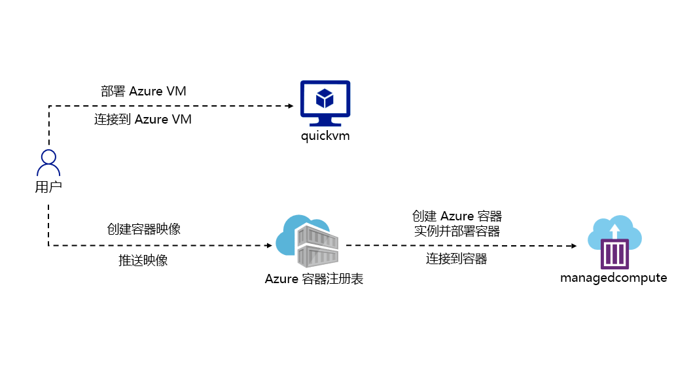
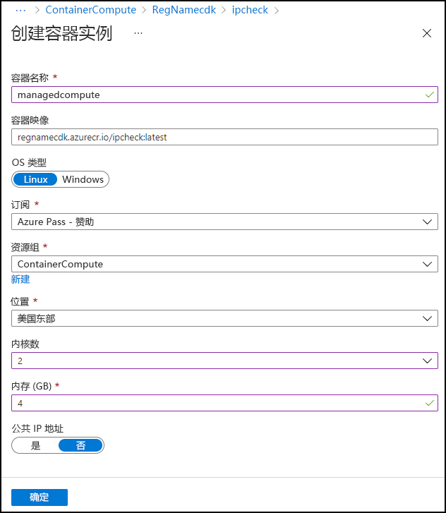
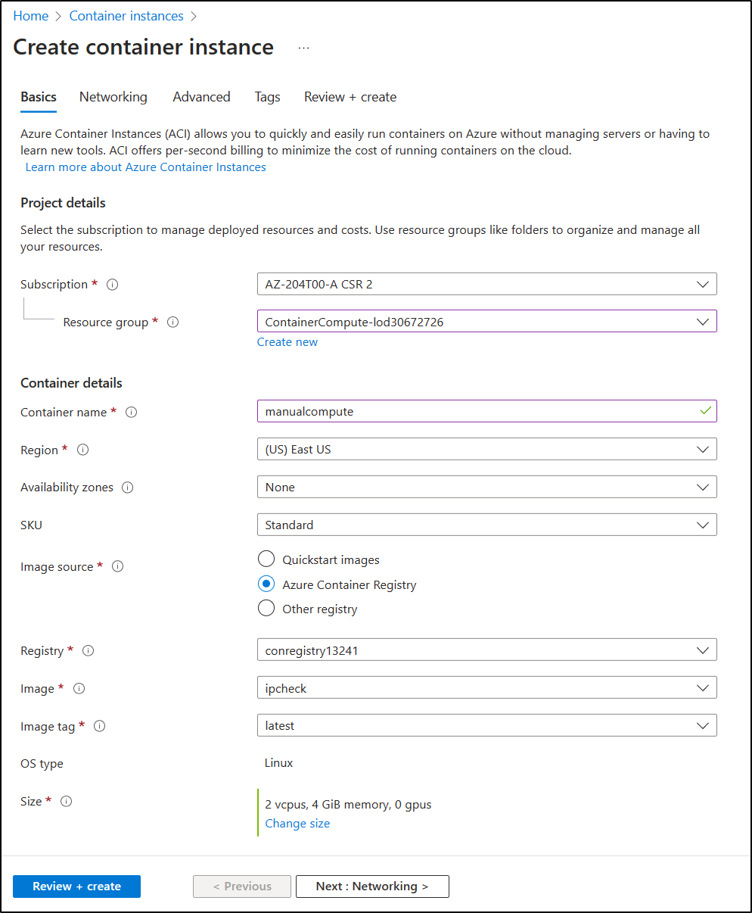

---
lab:
  az204Title: 'Lab 05: Deploy compute workloads by using images and containers'
  az204Module: 'Learning Path 05: Implement containerized solutions'
---

# 实验室 05：使用映像和容器部署计算工作负载

## Microsoft Azure 用户接口

鉴于 Microsoft 云工具的动态特性，Azure UI 在此培训内容开发后可能会发生更改。 因此，实验说明和实验步骤可能无法正确对应。

我们发现社区进行了必要更改时，Microsoft 会更新此培训课程。 但是，云更新经常发生，因此在此培训内容更新之前，可能会发生 UI 更改。 如果发生这种情况，请适应这些更改，并根据需要在实验室中熟悉这些更改。

## Instructions

### 开始之前

#### 登录到实验室环境

使用以下凭据登录到 Windows 10 虚拟机 (VM)：

- 用户名：`Admin`
- 密码：`Pa55w.rd`

> **注意**：你的讲师将提供连接到虚拟实验室环境的说明。

#### 查看已安装的应用程序

在你的 Windows 10 桌面上找到任务栏。 任务栏里有本实验室中你将使用的应用程序的图标，包括：

-   Microsoft Edge
-   文件资源浏览器

## 实验室场景

在本实验室中，你将了解如何使用 .NET 应用程序和 docker 文件创建容器并将其部署到Azure 容器注册表。 还要将容器化解决方案部署到 Azure 容器应用。

## 体系结构关系图




### 练习 1：创建 Docker 容器映像并将其部署到 Azure 容器注册表

#### 任务 1：打开 Azure 门户

1. 在任务栏上，选择 Microsoft Edge 图标。

1. 在打开的浏览器窗口中，导航到 Azure 门户 (`https://portal.azure.com`)，然后使用你将用于此实验室的帐户登录。

   > **注意**：第一次登录 Azure 门户时，你会看到一个门户教程。 如果想跳过该导览，请选择“开始使用”以开始使用门户。

#### 任务 2：创建资源组

1. 在 Azure 门户的导航窗格中，使用“搜索资源、服务和文档”文本框搜索“资源组”，然后在结果列表中，选择“资源组”。

1. 在“资源组”边栏选项卡中，选择“创建”。

1. 在“创建资源组”边栏选项卡的“基本信息”选项卡上，执行以下操作，然后选择“查看 + 创建”  ：

    | 设置 | 操作 |
    | -- | -- |
    | “订阅”下拉列表 | 保留默认值  |
    | “资源组”文本框 | 输入“ContainerCompute” |
    | “区域”下拉列表 | 选择“(US)美国东部” |

    以下屏幕截图显示了“创建资源组”边栏选项卡上配置的设置。

    

1. 在“查看 + 创建”选项卡中，查看在上述步骤中选择的选项。

1. 选择“创建”以使用指定的配置创建资源组。  

    > **注意**：等待创建任务完成后再继续本实验。


#### 任务 3：启动源项目

1. 在任务栏上，选择“Windows 终端”图标。

1. 运行以下命令，将当前目录更改为 **Allfiles (F):\\Allfiles\\Labs\\05\\Starter** 目录：

    ```powershell
    cd F:\Allfiles\Labs\05\Starter
    ```

1. 运行以下命令，以在当前目录中使用 .NET 8.0 创建一个新的 .NET Core 控制台应用程序：

    ```powershell
    dotnet new console --output . --name ipcheck --framework net8.0
    ```

1. 运行以下命令，以在名为 Dockerfile 的当前目录中创建一个新文件****：

    ```powershell
    New-Item -ItemType File Dockerfile
    ```

1. 运行以下命令，在 Visual Studio Code 中打开当前目录：

    ```powershell
    code .
    ```

#### 任务 4：创建并测试 .NET 应用程序

1. 在“Visual Studio Code”窗口的“资源管理器”窗格中，打开“Program.cs”文件************。

1. 删除“Program.cs”文件的全部内容。

1. 将以下代码复制并粘贴到“Program.cs”文件中：

    ```csharp
    // Check if network is available
    if (System.Net.NetworkInformation.NetworkInterface.GetIsNetworkAvailable())
    {
        System.Console.WriteLine("Current IP Addresses:");

        // Get host entry for current hostname
        string hostname = System.Net.Dns.GetHostName();
        System.Net.IPHostEntry host = System.Net.Dns.GetHostEntry(hostname);
        
        // Iterate over each IP address and render their values
        foreach(System.Net.IPAddress address in host.AddressList)
        {
            System.Console.WriteLine($"\t{address}");
        }
    }
    else
    {
        System.Console.WriteLine("No Network Connection");
    }
    ```

1. 保存 Program.cs 文件。

1. 删除 Starter.sln 文件****。

    > **注意**：这样就无需在使用 dotnet 命令时显式引用 .csproj 文件。

1. 切换到“Windows 终端”应用程序****。

1. 运行以下命令以执行应用程序：

    ```powershell
    dotnet run
    ```

1. 查看结果。 至少应列出一个 IP 地址，表示分配给计算机的 IP 地址。

1. 从 Visual Studio Code 窗口返回，然后从“资源管理器”窗格中打开 Dockerfile 文件************。

1. 将以下代码复制并粘贴到“Dockerfile”文件中：

    ```
    # Start using the .NET 8.0 SDK container image
    FROM mcr.microsoft.com/dotnet/sdk:8.0 AS build

    # Change current working directory
    WORKDIR /app

    # Copy existing files from host machine
    COPY . ./

    # Publish application to the "out" folder
    RUN dotnet publish --configuration Release --output out

    # Start container by running application DLL
    ENTRYPOINT ["dotnet", "out/ipcheck.dll"]
    ```

1. 保存 Dockerfile 文件  。

    > **注意**：接下来，你将创建一个包含所有项目文件的存档。 这将简化将项目文件上传到 Cloud Shell。

1. 切换到“Windows 终端”应用程序****。

1. 运行以下命令以执行应用程序：

    ```powershell
    Compress-Archive -Path .\* -DestinationPath .\lab05.zip
    ```

#### 任务 5：创建 Azure 容器注册表资源

1. 切换到显示 Azure 门户的浏览器窗口。 

1. 在 Azure 门户中，选择“Cloud Shell”图标  以打开一个新的 Bash 会话。 如果 Cloud Shell 默认设置为 PowerShell 会话，请选择“PowerShell”，然后在下拉菜单中选择“Bash”。

    > **注意**：“Cloud Shell”图标使用大于符号 (\>) 和下划线字符 (\_) 表示。

    > **注意**：如果这是你第一次启动 Cloud Shell，当系统提示你选择“Bash”或“PowerShell”时，请选择“Bash”。 当出现消息“未安装存储”时，请选择你在本实验中使用的订阅，然后选择“创建存储”。  

1. 在 Cloud Shell 窗格中，选择“上传/下载”按钮（由折叠页面表示，其中右下角有指向相反方向的两个箭头）并在下拉菜单中选择“上传”********。

1. 在“打开”对话框中，导航到 Allfiles (F):\\Allfiles\\Labs\\05\\Starter\\func 空目录，选择“lab05.zip”，然后选择“打开”****************。

    > **注意**：这会将文件上传到 Cloud Shell 会话中的 /~ 目录********。

1. 在门户中的 Cloud Shell 命令提示符处运行以下命令，在 \~ 目录中创建名为 ipcheck 的新目录************：

    ```bash
    mkdir ~/ipcheck
    ```

1. 运行以下命令，将上传的存档的内容提取到新创建的目录 \~/ipcheck****：

    ```bash
    unzip ~/lab05.zip -d ~/ipcheck
    ```

1. 运行以下命令，对 \~/ipcheck 目录中整个提取的内容设置读取和执行权限****：

    ```bash
    chmod -R +xr ~/ipcheck
    ```

1. 运行以下命令，将当前目录更改为 \~/ipcheck****：

    ```bash
    cd ~/ipcheck
    ```

1. 在门户中的 Cloud Shell 命令提示符下，运行以下命令，以为容器注册表资源创建具有唯一值的变量： 

    ```bash
    registryName=conregistry$RANDOM
    ```

1. 在门户中的 Cloud Shell 命令提示符处，运行以下命令，以验证在上一步中创建的名称是否可用： 

    ```bash
    az acr check-name --name $registryName
    ```

    如果结果显示名称可用，请继续执行下一步。 如果名称不可用，请在上一步中重新运行该命令，然后再次验证可用性。

1. 在门户中的 Cloud Shell 命令提示符处，运行以下命令，以创建容器注册表资源： 

    ```bash
    az acr create --resource-group ContainerCompute --name $registryName --sku Basic
    ```

    > **注意**：等待创建任务完成，再继续操作本实验室。

#### 任务 6：存储容器注册表元数据

1. 在门户的 Cloud Shell 命令提示符中，运行以下命令，以查看订阅中的所有容器注册表列表：

    ```
    az acr list
    ```

1. 运行以下命令，确保将注册表的名称视为输出。 如果看不到除“[]”以外的输出，请等待一分钟，然后尝试再次运行该命令。

    ```
    az acr list --query "max_by([], &creationDate).name" --output tsv
    ```

1. 运行以下命令：

    ```
    acrName=$(az acr list --query "max_by([], &creationDate).name" --output tsv)
    ```

1. 运行以下命令：

    ```
    echo $acrName
    ```

#### 任务 7：将 Docker 容器映像部署到容器注册表

1. 运行以下命令，以将活动目录从 \~/ 更改为 \~/clouddrive/ipcheck：

    ```
    cd ~/clouddrive/ipcheck
    ```

1. 运行以下命令以获取当前目录的内容：

    ```
    dir
    ```

1. 运行以下命令，以将源代码上传到容器注册表并将容器映像构建为容器注册表任务：

    ```
    az acr build --registry $acrName --image ipcheck:latest .
    ```

    > **注意**：等待生成任务完成后再继续本实验室。

1. 关闭门户中的“Cloud Shell”窗格。

#### 任务 8：在容器注册表中验证容器映像

1. 在 Azure 门户的“导航”窗格中，选择“资源组”链接。

1. 在“资源组”边栏选项卡中，选择你之前在本实验室中创建的“ContainerCompute”资源组。

1. 在“ContainerCompute”边栏选项卡中，选择你之前在本实验室中创建的容器注册表。

1. 在“容器注册表”边栏选项卡中，在“服务”部分中选择“存储库”链接。

1. 在“存储库”部分中，选择“ipcheck”容器映像存储库，然后选择“最新”标记。

1. 审阅具有“最新”标记的容器映像版本的元数据。

    > **注意**：你也可以选择“运行 ID”链接以查看有关生成任务的元数据。

#### 审阅

在本练习中，你创建了一个 .NET 控制台应用程序来显示计算机的当前 IP 地址。 然后，你将 **Dockerfile** 文件添加到应用程序，以便将其转换为 Docker 容器映像。 最后，你将容器映像部署到容器注册表。

### 练习 2：部署 Azure 容器实例

#### 任务 1：在容器注册表中启用管理员用户

1. 在“ContainerCompute”**** 资源组中，选择此前在本实验室中创建的容器注册表，然后选择“访问密钥”**** 边栏选项卡。

1. 切换管理员用户部分中的开关，为此容器注册表启用管理员用户。

#### 任务 2：自动将容器映像部署到 Azure 容器实例

1. 在“容器注册表”边栏选项卡中，在“服务”部分中选择“存储库”链接。

1. 在“存储库”部分，选择包含 ipcheck 容器映像的存储库********。

1. 在存储库边栏选项卡上的“设置”部分中，选择“访问密钥”********。

1. 在“访问密钥”边栏选项卡上，选中“管理员用户”复选框********。

1. 在存储库边栏选项卡上的“服务”部分中，选择“存储库”********。 

1. 在存储库列表中，选择“ipcheck”****。

1. 在“ipcheck”窗格上，选择与“最新”标记条目关联的省略号菜单，然后选择“运行实例”************。

1. 在“创建容器实例”边栏选项卡中，执行以下操作，然后选择“创建”：

    | 设置 | 操作 |
    | -- | -- |
    | “容器名称”文本框 | 输入“managedcompute” |
    | “容器映像”文本框 | 保留默认值 |
    | “OS 类型”部分 | 选择“Linux” |
    | “订阅”文本框 | 保留默认值 |
    | “资源组”下拉列表 | 选择“ContainerCompute” |
    | “位置”下拉列表 | 选择“美国东部” |
    | “核心数”下拉列表 | 选择“2” |
    | “内存 (GB)”文本框 | 输入“4” |
    | “公共 IP 地址”部分 | 请选择“否” |

    以下屏幕截图显示了“创建容器实例”边栏选项卡上配置的设置。

    

    > **注意**：等待容器实例创建完成，再继续操作本实验室。

#### 任务 3：手动将容器映像部署到容器实例

1. 在 Azure 门户的“导航”窗格中，选择“创建资源”链接。

1. 在“创建资源”边栏选项卡的“搜索服务和市场”文本框中，输入“容器实例”  ，然后按 Enter 键。

1. 在“市场”搜索结果边栏选项卡中，选择“容器实例”结果。

1. 在“容器实例”边栏选项卡中，选择“创建”。

1. 在“创建容器实例”边栏选项卡的“基本信息”选项卡上，执行以下操作，然后选择“查看 + 创建”  ：

    | 设置 | 操作 |
    | -- | -- |
    | “订阅”下拉列表 | 保留默认值 |
    | “资源组”下拉列表 | 选择“ContainerCompute” |
    | “容器名称”文本框  | 输入“manualcompute” |
    | “区域”下拉列表 | 选择“(US)美国东部” |
    | “映像源”部分 | 选择“Azure 容器注册表” |
    | “注册表”下拉列表 | 选择你之前在本实验室中创建的“Azure 容器注册表”资源 |
    | “映像”下拉列表 | 选择“ipcheck” |
    | “映像标记”下拉列表 | 选择“最新” |
    | 大小：核心数  | 输入“2” |
    | 大小：内存 (GiB) | 输入“4” |

    以下屏幕截图显示了“创建容器实例”边栏选项卡上配置的设置。

    

1. 在“查看 + 创建”选项卡中，查看选定的选项。

1. 选择“创建”以使用指定配置创建容器实例。  

    > **注意**：等待容器实例创建完成，再继续操作本实验室。


#### 任务 4：验证容器实例是否成功运行

1. 在 Azure 门户的导航窗格中，选择“资源组”链接。

1. 在“资源组”边栏选项卡中，选择你之前在本实验室中创建的“ContainerCompute”资源组。

1. 在“ContainerCompute”边栏选项卡中，选择你之前在本实验室中创建的 manualcompute 容器实例。

1. 在“容器实例”边栏选项卡中，在“设置”部分中选择“容器”链接。

1. 在“容器”部分中，查看“事件”列表。

1. 选择“日志”选项卡，然后查看容器实例中的短信日志。

> **注意**：你也可以选择查看 managedcompute 容器实例中的“事件”和“日志”。

> 注意：此时 manualcompute 和 managedcompute 可能不包含任何事件。

> **注意**：应用程序完成运行后，容器因为已完成工作而终止。 对于手动创建的容器实例，你表示可以接受成功退出，因此该容器只运行一次。 自动创建的实例没有提供此选项，并且假定该容器应始终处于运行状态，因此该容器会反复重启。

#### 审阅

在本练习中，使用多种方法将容器映像部署到 Azure 容器实例。 通过使用手动方法，你可以进一步自定义部署，并将基于任务的应用程序作为容器运行的一部分运行。


### 练习 3：创建一个安全的容器应用环境并部署容器应用。

#### 任务 1：准备环境

1. 登录到 Azure 门户。

1. 选择 Cloud Shell 图标，然后选择 Bash 环境。

1. 在门户中的 Cloud Shell 命令提示符下，运行以下命令来安装适用于 CLI 的 Azure 容器应用扩展： 

    ```bash
    az extension add --name containerapp --upgrade
    ```

1. 运行以下命令来注册 Microsoft.App 命名空间： 

    ```bash
    az provider register --namespace Microsoft.App
    ```
   
   > 注意：Azure 容器应用资源已从 Microsoft.Web 命名空间迁移到 Microsoft.App 命名空间。

1. 运行以下命令，为 Azure Monitor Log Analytics 工作区注册 Microsoft.OperationalInsights 提供程序（如果以前未使用过）： 

    ```bash
    az provider register --namespace Microsoft.OperationalInsights
    ```

    > 注意：注册 Microsoft.App 命名空间和 Microsoft.OperationalInsights 分别需要几分钟时间才能完成。

1. 设置本练习稍后使用的环境变量。 
   
   ```bash
     myRG=ContainerCompute
     myAppContEnv=az204-env-$RANDOM
    ```

升级 CLI 并创建环境变量后，可创建容器应用环境并部署容器应用。

#### 任务 2：创建环境

Azure 容器应用中的环境围绕一组容器应用创建安全边界。 部署到相同环境的容器应用部署在同一虚拟网络中，并将日志写入同一个 Log Analytics 工作区。

1. 在门户中的 Cloud Shell 命令提示符下，运行以下命令来使用 `az containerapp env` create 命令创建环境： 

    ```bash
    az containerapp env create \
        --name $myAppContEnv \
        --resource-group $myRG \
        --location eastus
    ```

#### 任务 3：创建容器应用

容器应用环境完成部署后，将容器映像部署到 Azure 容器应用。

1. 在门户中的 Cloud Shell 命令提示符下，运行以下命令来使用 `az containerapp create` 命令部署示例应用容器映像： 

    ```bash
    az containerapp create \
        --name my-container-app \
        --resource-group $myRG \
        --environment $myAppContEnv \
        --image mcr.microsoft.com/azuredocs/containerapps-helloworld:latest \
        --target-port 80 \
        --ingress 'external' \
        --query properties.configuration.ingress.fqdn
    ```
将 `--ingress` 设置为 `external`，使容器应用可供公共请求使用。 该命令返回用于访问应用的链接。

1. 选择 `az containerapp create` 命令返回的链接，以验证容器应用是否正在运行。

