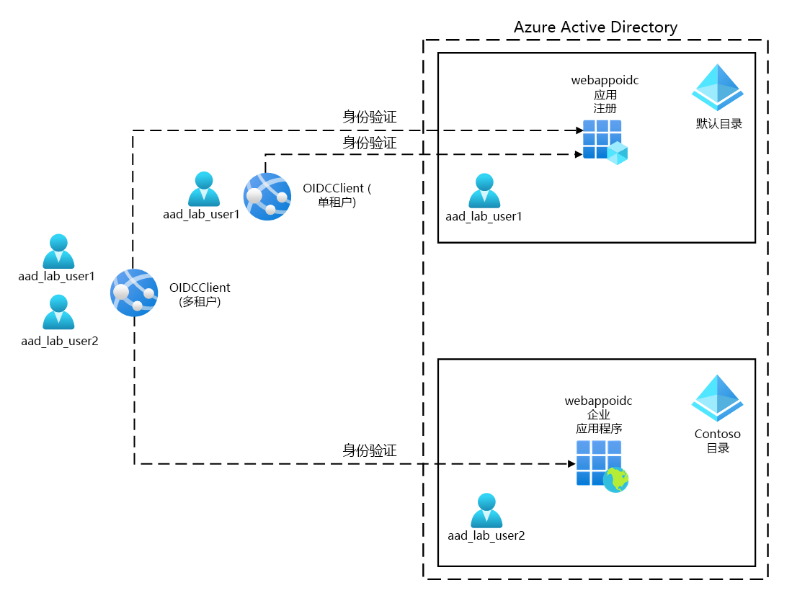
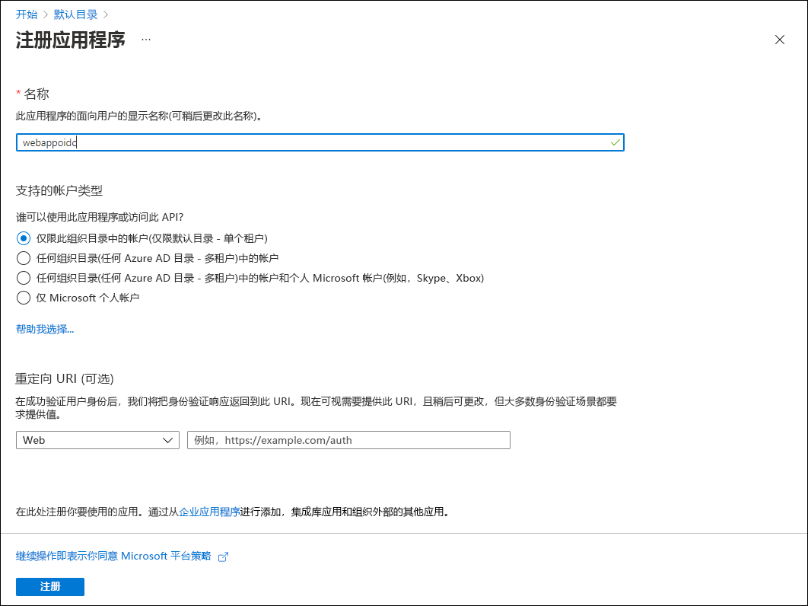

---
lab:
  az204Title: 'Lab 06: Authenticate by using OpenID Connect, MSAL, and .NET SDKs'
  az020Title: 'Lab 06: Authenticate by using OpenID Connect, MSAL, and .NET SDKs'
  az204Module: 'Module 06: Implement user authentication and authorization'
  az020Module: 'Module 06: Implement user authentication and authorization'
---

# <a name="lab-06-authenticate-by-using-openid-connect-msal-and-net-sdks"></a>实验室 6：使用 OpenID Connect、MSAL 和 .NET SDK 进行身份验证

## <a name="microsoft-azure-user-interface"></a>Microsoft Azure 用户接口

鉴于 Microsoft 云工具的动态特性，Azure UI 在此培训内容开发后可能会发生更改。 因此，实验说明和实验步骤可能无法正确对应。

我们发现社区进行了必要更改时，Microsoft 会更新此培训课程。 但是，云更新经常发生，因此在此培训内容更新之前，可能会发生 UI 更改。 如果发生这种情况，请适应这些更改，并根据需要在实验室中熟悉这些更改。

## <a name="instructions"></a>说明

### <a name="before-you-start"></a>开始之前

#### <a name="sign-in-to-the-lab-environment"></a>登录到实验室环境

使用以下凭据登录到 Windows 10 虚拟机 (VM)：
    
-   用户名：Admin

-   密码：Pa55w.rd

> **注意**：你的讲师将提供连接到虚拟实验室环境的说明。

#### <a name="review-the-installed-applications"></a>查看已安装的应用程序

在你的 Windows 10 桌面上找到任务栏。 任务栏里有本实验室中你将使用的应用程序的图标，包括：
    
-   Microsoft Edge

-   Visual Studio Code

## <a name="ensure-that-your-local-lab-environment-has-its-time-set-properly-no-delay-according-to-your-timezone"></a>确保本地实验室环境已正确设置时间（根据你的时区，无延迟）

> 注意：如果你注意到本地实验室环境（实验室 VM 或本地计算机）出现延时，请使用以下 PowerShell 命令调整其本地时间，将时间增加 15 分钟。 可能需要以管理员身份运行 PowerShell。

```powershell
  Set-Date -Adjust (New-TimeSpan -Minutes 15)
```

## <a name="architecture-diagram"></a>体系结构关系图



### <a name="exercise-1-configure-a-single-tenant-azure-ad-environment"></a>练习 1：配置单租户 Azure AD 环境

#### <a name="task-1-open-the-azure-portal"></a>任务 1：打开 Azure 门户

1.  在任务栏上，选择 Microsoft Edge 图标。

1.  在打开的浏览器窗口中，浏览到 Azure 门户 ([portal.azure.com](https://portal.azure.com))，然后使用你将用于此实验的帐户登录。

    > **注意**：第一次登录 Azure 门户时，你会看到一个门户教程。 选择“开始使用”，以跳过导览并开始使用门户。

#### <a name="task-2-register-an-application-in-azure-ad"></a>任务 2：在 Azure AD 中注册应用程序

1.  在 Azure 门户中，使用“搜索资源、服务和文档”文本框搜索“Azure Active Directory”，然后在结果列表中，选择“Azure Active Directory”。

    > **注意**：这会将浏览器会话重定向到与你的 Azure 订阅关联的 Azure Active Directory (Azure AD) 租户的边栏选项卡。

1.  在“Azure Active Directory”边栏选项卡上的“管理”部分中，选择“应用注册”。 ****   

1.  在“应用注册”部分中，选择“+ 新建注册”。

1.  在“注册应用程序”部分中，执行以下操作，然后选择“注册”：
    
    | 设置 | 操作 |
    | -- | -- |
    | “名称”文本框 | 输入“webappoidc” |
    | “支持的帐户类型”列表 | 选择“仅限此组织目录中的帐户(仅限默认目录 - 单个租户)” |

    > 注意：租户的名称可能因 Azure 订阅而异。
   
    以下屏幕截图显示了“注册应用程序”部分中配置的设置。
          
     
      
    
#### <a name="task-3-record-unique-identifiers"></a>任务 3：记录唯一标识符

1.  在“webappoidc”应用程序注册边栏选项卡上，选择“概述”。

1.  在“概述”部分，找到并记录“应用程序(客户端) ID”文本框的值 。 你将在稍后的实验室中使用此值。

1.  在“概述”部分，找到并记录“目录(租户) ID”文本框的值 。 你将在稍后的实验室中使用此值。

#### <a name="task-4-configure-the-application-authentication-settings"></a>任务 4：配置应用程序身份验证设置

1.  在“webappoidc”应用程序注册边栏选项卡上的“管理”部分中，选择“身份验证”。

1.  在“身份验证”部分中，执行以下操作，然后选择“配置”：

    | 设置 | 操作 |
    | -- | -- |
    | “平台配置”部分 | 选择“+ 添加平台” |
    | “配置平台”边栏选项卡 | 选择“Web” |
    | “重定向 URI”文本框 | 输入 `https://localhost:5001/` |
    | “前通道注销 URL”文本框 | 输入 `https://localhost:5001/signout-oidc` |
        
1. 返回“平台配置”部分，选择“添加 URI”，然后输入 `https://localhost:5001/signin-oidc`。

1. 在“隐式授权和混合流”部分中，选择“ID 令牌(用于隐式流和混合流)”。 

1. 选择“保存”。

    以下屏幕截图显示了“身份验证”边栏选项卡上配置的设置。
          
     
       

#### <a name="task-5-create-an-azure-ad-user"></a>任务 5：创建一个 Azure AD 用户

1.  在 Azure 门户中，选择“Cloud Shell”图标  以打开一个新的 PowerShell 会话。 如果 Cloud Shell 默认为 Bash 会话，请选择“Bash”，然后在下拉菜单中选择“PowerShell”。

     > **注意**：如果这是你第一次启动 Cloud Shell，当系统提示你选择“Bash”或“PowerShell”时，请选择“PowerShell”。 当出现“尚未装载任何存储”消息时，请选择你在本实验室中使用的订阅，然后选择“创建存储”。

1.  在“Cloud Shell”窗格中，运行以下命令以登录到与 Azure 订阅关联的 Azure AD 租户：

      ```powershell
       Connect-AzureAD
      ```

1.  运行以下命令以检索和显示 Azure AD 租户的主域名系统 (DNS) 域名：

       ```powershell
       $aadDomainName = ((Get-AzureAdTenantDetail).VerifiedDomains)[0].Name
       $aadDomainName
       ```

    > **注意**：记录 DNS 域名的值。 你将在稍后的实验室中使用此值。

1.  运行以下命令以创建用于测试 Azure AD 身份验证的 Azure AD 用户：

       ```powershell
       $passwordProfile = New-Object -TypeName Microsoft.Open.AzureAD.Model.PasswordProfile
       $passwordProfile.Password = 'Pa55w.rd1234'
       $passwordProfile.ForceChangePasswordNextLogin = $false
       New-AzureADUser -AccountEnabled $true -DisplayName 'aad_lab_user1' -PasswordProfile $passwordProfile -MailNickName 'aad_lab_user1' -UserPrincipalName "aad_lab_user1@$aadDomainName" 
       ```

1.  运行以下命令以标识新创建的 Azure AD 用户的用户主体名称 (UPN)：

       ```powershell
       (Get-AzureADUser -Filter "MailNickName eq 'aad_lab_user1'").UserPrincipalName
       ```

    > **注意**：记录 UPN。 你将在稍后的实验室中使用此值。

1.  关闭 Cloud Shell 窗格。

#### <a name="review"></a>审阅

在本练习中，你注册了单租户 Azure AD 应用程序，并创建了 Azure AD 用户帐户。

### <a name="exercise-2-create-a-single-tenant-aspnet-web-app"></a>练习 2：创建单租户 ASP.NET Web 应用

#### <a name="task-1-create-an-aspnet-web-app-project"></a>任务 1：创建 ASP.NET Web 应用项目

1.  在实验室计算机上，启动“命令提示符”。

1.  在命令提示符下，运行以下命令以创建当前目录并将其设置为 Allfiles (F):\\Allfiles\\Labs\\06\\Starter\\OIDCClient：

    ```cmd
    F:
    cd F:\Allfiles\Labs\06\Starter\OIDCClient
    ```

1.  运行以下命令，根据模型视图控制器 (MVC) 模板创建新的 .NET Core Web 应用（将占位符 `<application_ID>`、`<tenant_ID>` 和 `<domain_Name>` 替换为之前在本实验中记录的相应值）：

    ```cmd
    dotnet new mvc --auth SingleOrg --client-id <application_ID> --tenant-id <tenant_ID> --domain <domain_Name>
    rmdir .\obj /S /Q
    ```

1.  运行以下命令来启动 Visual Studio Code。 

    ```cmd
    code .
    ```
    > 如果出现“是否信任此文件夹中的文件作者”提示，请选择“是，我信任此作者” 。


1.  在“Visual Studio Code 资源管理器”窗格中，查看表示 MVC Web 应用的自动生成的文件夹结构。

1.  导航到 Properties 文件夹，打开 launchSettings.json 文件，然后应用以下更改：

    
    | 部分 | 属性 | 值 |
    | -- | -- | -- |
    | iisSettings | **sslPort** | 44321 |
    | OIDCClient  | **applicationUrl** | `https://localhost:5001` |
    

    > **注意**：端口号必须与创建 Azure AD 应用注册时指定的值匹配。

1.  保存并关闭该文件。

1.  在“Visual Studio Code 资源管理器”窗格中，选择“OIDCClient.csproj”。

1.  确保将 `<TargetFramework>` 元素的值设置为“net6.0”。

1.  确保 `Microsoft.AspNetCore.Authentication.JwtBearer` 和 `Microsoft.AspNetCore.Authentication.OpenIdConnect` NuGet 包的版本设置为“6.0.9”。

1.  将 `Microsoft.Identity.Web` 和 `Microsoft.Identity.Web.UI` NuGet 包的版本设置为“1.25.3”。

1.  验证 OIDCClient.csproj 文件的内容是否与以下列表（`UserSecretsId` 的值不同）类似，然后保存更改。

    ```csharp
    <Project Sdk="Microsoft.NET.Sdk.Web">
      <PropertyGroup>
        <TargetFramework>net6.0</TargetFramework>
        <UserSecretsId>aspnet-OIDCClient-737DEB13-25D4-4C52-93C5-F485367E3C8C</UserSecretsId>
      </PropertyGroup>

      <ItemGroup>
        <PackageReference Include="Microsoft.AspNetCore.Authentication.JwtBearer" Version="6.0.9" NoWarn="NU1605" />
        <PackageReference Include="Microsoft.AspNetCore.Authentication.OpenIdConnect" Version="6.0.9" NoWarn="NU1605" />
        <PackageReference Include="Microsoft.Identity.Web" Version="1.25.3" />
        <PackageReference Include="Microsoft.Identity.Web.UI" Version="1.25.3" />
      </ItemGroup>
    </Project>
    ```

1.  关闭 OIDCClient.csproj 文件。

1.  导航到 Views\Shared 文件夹，然后打开 _LoginPartial.cshtml 文件。

1.  验证每个 span 元素中的 `asp-area` 属性是否引用 `MicrosoftIdentity`，如以下行所示：

    ```csharp
    <a class="nav-link text-dark" asp-area="MicrosoftIdentity" asp-controller="Account" asp-action="SignOut">Sign out</a>
    ```

1.  关闭文件，而不进行任何更改。

1.  打开文件 appsettings.json 并查看 AzureAd 对象的内容，包括以下元素：

    | 元素 | 值 |
    | -- | -- |
    | `Instance` | `https://login.microsoftonline.com/`|
    | `Domain` | 与你的 Azure 订阅关联的 Azure AD 租户的主 DNS 域 |
    | `TenantId` | Azure AD 租户的 GUID |
    | `ClientId` | Azure AD 租户中注册的应用程序的应用程序（客户端）ID |
    | `CallbackPath` | `/signin-oidc` |

1.  关闭文件，而不进行任何更改。

1.  在“Visual Studio Code 资源管理器”窗格中，选择“Program.cs”。

1.  验证文件是否包含以下 using 指令：

    ```csharp
    using Microsoft.AspNetCore.Authentication.OpenIdConnect;
    using Microsoft.Identity.Web;
    using Microsoft.Identity.Web.UI;
    ```

1.  验证该文件是否包含将相关身份验证服务添加到容器的以下行：

    ```csharp
    builder.services.AddAuthentication(OpenIdConnectDefaults.AuthenticationScheme)
      .AddMicrosoftIdentityWebApp(Configuration.GetSection("AzureAd"));
    ```

1.  验证该文件是否包含为帐户管理添加控制器和 Razor 页面的以下行：

    ```csharp
    builder.services.AddRazorPages()
      .AddMicrosoftIdentityUI();
    ```

1.  保存并关闭该文件。

### <a name="task-2-test-the-single-tenant-web-app-in-a-single-tenant-scenario"></a>任务 2：在单租户方案中测试单租户 Web 应用

1.  在“Visual Studio Code”窗口的顶部菜单栏中，转到“终端”菜单，然后选择“新建终端”  。

1.  在“终端”面板中，当前工作目录的当前路径应为 F:\Allfiles\Labs\06\Starter\OIDCClient 。 运行以下命令以生成 .NET Web 应用：

    ```
    dotnet build
    ```

    > **注意**：如果出现任何生成错误，请查看 Allfiles (F):\\Allfiles\\Labs\\06\\Solution\\OIDCClient 文件夹中的文件。 忽略所有警告消息。

1.  运行以下命令以生成自签名证书，并将本地计算机配置为信任它：

    ```
    dotnet dev-certs https --trust
    ```

1.  如果系统提示你安装自动生成的证书，请选择“是”。

1.  在终端提示符下，运行以下命令以运行 .NET Web 应用：

    ```
    dotnet run
    ```

1.  在 InPrivate 模式下启动 Microsoft Edge 浏览器，然后导航到 `https://localhost:5001` URL。

1.  如果出现“你的连接不是专用连接”消息，请选择“高级”，然后选择“继续转到 localhost (不安全)”链接。

1.  在打开的浏览器窗口中，当出现提示时，请使用之前在本实验室中创建的 aad_lab_user1 Azure AD 帐户的 UPN 并将 Pa55w.rd1234 用作其密码进行身份验证。

    > **注意**：如果系统提示你使用“帮助我们保护帐户”窗口，请选择“立即跳过”。

1.  浏览器窗口将自动打开“请求的权限”网页。

1.  查看请求的权限，包括“查看你的基本个人资料”和“维护对已授予访问权限的数据的访问权限”。

1.  选择“接受”。

1.  查看浏览器显示的目标站点的“欢迎”主页，并验证 aad_user1 Azure AD 帐户的 UPN 是否显示在浏览器窗口中。

1.  在“欢迎”页上，选择“注销”。

1.  当系统提示你选择要注销的帐户时，请选择 aad_lab_user1 Azure AD 帐户。 你将被自动重定向到“已注销”页面。

1.  关闭 Microsoft Edge 浏览器。

#### <a name="review"></a>审阅 

在本练习中，你实现了单租户 Web 应用，并在单租户 Azure 环境中对其进行了测试。

### <a name="exercise-3-clean-up-your-lab-environment"></a>练习 3：清理实验室环境

#### <a name="task-1-delete-the-application-registration-in-azure-ad"></a>任务 1：删除 Azure AD 中的应用程序注册

1.  切换到显示 Azure 门户的 Microsoft Edge 浏览器。

1.  在 Azure 门户中，导航到与你的 Azure 订阅关联的 Azure AD 租户的边栏选项卡。

1.  在“Azure Active Directory”边栏选项卡上的“管理”部分中，选择“应用注册”。 ****   

1.  在“应用注册”部分中，选择你之前在本实验室中创建的 webappoidc Azure AD 应用程序注册。

1.  在“webappoidc”部分中，执行以下操作：

    a.   选择“删除” 。

    b.   在“删除应用注册”边栏选项卡上，选择“我了解删除此应用注册的影响”，然后选择“删除”。

1.  导航到“用户 \| 所有用户(预览版)”边栏选项卡。

1.  在用户列表中，选择“aad_lab_user1”

1.  在“aad_lab_user1 \| 配置文件”边栏选项卡上，选择“删除”，在系统提示确认时，选择“是”。

#### <a name="task-2-close-the-active-applications"></a>任务 2：关闭活动应用程序

1.  关闭任何打开的 Microsoft Edge 窗口。

1.  关闭 Visual Studio Code。

#### <a name="review"></a>审阅

在本练习中，你通过删除本实验室中使用的应用程序注册清理了订阅。
