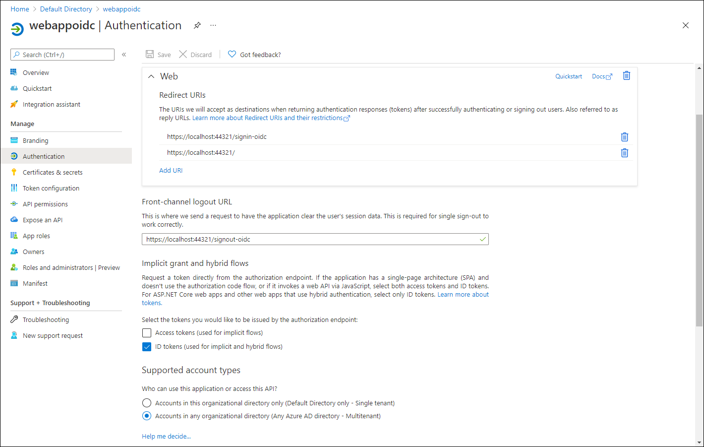

---
lab:
    az204Title: '实验室 06：使用 MSAL 和 .NET SDK 对 Microsoft Graph 进行身份验证和查询'
    az020Title: '实验室 06：使用 MSAL 和 .NET SDK 对 Microsoft Graph 进行身份验证和查询'
    az204Module: '模块 06：实现用户身份验证和授权'
    az020Module: '模块 06：实现用户身份验证和授权'
---

# 实验室 06： 使用 OpenID Connect、MSAL 和 .NET SDK 进行身份验证

## Microsoft Azure 用户界面

鉴于 Microsoft 云工具的动态特性，Azure UI 在此培训内容开发后可能会发生更改。因此，实验室说明和实验室步骤可能无法完全一致。

当社区提醒我们进行必要的更改时，Microsoft 会更新本培训课程。然而，云更新的发生频率很高，因此你可能会遇到 UI 已更改但本培训内容尚未更新的情况。**如果发生这种情况，请适应这些更改，并根据需要在实验室中熟悉这些更改。**

## 说明

### 准备工作

#### 登录实验室环境

使用以下凭据登录 Windows 10 虚拟机 (VM)：
    
-   用户名：**Admin**

-   密码： **Pa55w.rd**

> **备注**：你的讲师将提供连接到虚拟实验室环境的说明。

#### 查看已安装的应用程序

在你的 Windows 10 桌面上找到任务栏。任务栏里有本实验室中你将使用的应用程序的图标，包括：
    
-   Microsoft Edge

-   Visual Studio Code

## 体系结构图


### 练习 1：配置单租户 Azure AD 环境

#### 任务 1：打开 Azure 门户

1.  在任务栏上，选择 **Microsoft Edge** 图标。

1.  在打开的浏览器窗口中，浏览到 Azure 门户 ([portal.azure.com](https://portal.azure.com))，然后使用你将在本实验室中使用的帐户登录。

    > **备注**：第一次登录 Azure 门户时，你会看到一个门户教程。选择“**开始使用**”，跳过教程并开始使用门户。

#### 任务 2： 在 Azure AD 中注册应用程序

1.  在 Azure 门户中，使用“**搜索资源、服务和文档**”文本框搜索“**Azure Active Directory**”，并在结果列表中选择“**Azure Active Directory**”。

    > **备注**：这会将浏览器会话重定向到与 Azure 订阅关联的 Azure Active Directory (Azure AD) 租户的边栏选项卡。

1.  在“**Azure Active Directory**”边栏选项卡的“**管理**”部分，选择“**应用注册**”。

1.  在“**应用注册**”部分，选择“**+ 新建注册**”。

1.  在“**注册应用程序**”部分，执行以下操作，然后选择“**注册**”：
    
    | 设置                          | 操作                                                       |
    | -------------------------------- | ------------------------------------------------------------ |
    | “**名称**”文本框                | 输入“**webappoidc**”。                                         |
    | “**支持的帐户类型**”列表 | 选择“**仅限此组织目录中的帐户(仅限默认目录 - 单个租户)**”。 |

   
    以下屏幕截图显示了“**注册应用程序**”部分中已配置的设置。
          
     
      
    
#### 任务 3：记录唯一标识符

1.  在“**webappoidc**”应用程序注册边栏选项卡上，选择“**概述**”。

1.  在“**概述**”部分，找到并记录“**应用程序(客户端) ID**”文本框的值。你将在稍后的实验室中使用此值。

1.  在“**概述**”部分，找到并记录“**目录（租户）ID**”文本框的值。你将在稍后的实验室中使用此值。

#### 任务 4：配置应用程序身份验证设置

1.  在“**webappoidc**”应用程序注册边栏选项卡的“**管理**”部分，选择“**身份验证**”。

1.  在“**身份验证**”部分，执行以下操作，并选择“**配置**”：

    | 设置                     | 操作                                                       |
    | --------------------------- | ------------------------------------------------------------ |
    | “**平台配置**”部分\      | 选择“**+ 添加平台**”。                    |
    | “**配置平台**”边栏选项卡  | 选择“**Web**”。                                    |
    | “**重定向 URI**”文本框 | 输入 `https://localhost:44321/`。                                      |
    | “**前端通道注销 URL**”文本框   | 输入 `https://localhost:44321/signout-oidc`。  |
        
1. 回到“**平台配置**”部分，选择“**添加 URI**”，然后输入 `https://localhost:44321/signin-oidc`。

1. 在“**隐式授权和混合流**”部分，选择“**ID 令牌(用于隐式和混合流)**”。 

1. 选择“**保存**”。

    以下屏幕截图显示了“**身份验证**”边栏选项卡上已配置的设置。
          
     
       

#### 任务 5：创建 Azure AD 用户

1.  在 Azure 门户中，选择 **Cloud Shell** 图标 ，打开新的 PowerShell 会话。如果 Cloud Shell 默认为 Bash 会话，请选择“**Bash**”，然后在下拉菜单中选择“**PowerShell**”。

     > **备注**：首次启动 **Cloud Shell** 时，系统会提示选择 **Bash** 或 **PowerShell**，请选择“**PowerShell**”。如果显示“**未挂载存储**”消息，请选择你在本实验室中使用的订阅，然后选择“**创建存储**”。

1.  在“**Cloud Shell**”窗格中运行以下命令，登录到与 Azure 订阅关联的 Azure AD 租户：

      ```powershell
       Connect-AzureAD
      ```

1.  运行以下命令，检索和显示 Azure AD 租户的主域名系统 (DNS) 域名：

       ```powershell
       $aadDomainName = ((Get-AzureAdTenantDetail).VerifiedDomains)[0].Name
       $aadDomainName
       ```

    > **备注**：记录 DNS 域名的值。你将在稍后的实验室中使用此值。

1.  运行以下命令，创建你将用于测试 Azure AD 身份验证的 Azure AD 用户：

       ```powershell
       $passwordProfile = New-Object -TypeName Microsoft.Open.AzureAD.Model.PasswordProfile
       $passwordProfile.Password = 'Pa55w.rd1234'
       $passwordProfile.ForceChangePasswordNextLogin = $false
       New-AzureADUser -AccountEnabled $true -DisplayName 'aad_lab_user1' -PasswordProfile $passwordProfile -MailNickName 'aad_lab_user1' -UserPrincipalName "aad_lab_user1@$aadDomainName" 
       ```

1.  运行以下命令，标识新创建的 Azure AD 用户的用户主体名称 (UPN)：

       ```powershell
       (Get-AzureADUser -Filter "MailNickName eq 'aad_lab_user1'").UserPrincipalName
       ```

    > **备注**：记录 UPN。你将在稍后的实验室中使用此值。

1.  关闭 Cloud Shell 窗格。

#### 回顾

在本练习中，你注册了一个单租户 Azure AD 应用程序，并创建了一个 Azure AD 用户帐户。

### 练习 2：创建单租户 ASP.NET Core Web 应用

#### 任务 1：创建 ASP.NET Core Web 应用项目

1.  在实验室计算机上，启动“**命令提示符**”。

1.  从命令提示符，运行以下命令创建工作目录，并将其设置为 **Allfiles (F):\\Allfiles\\Labs\\06\\Starter\\OIDCClientST**：

    ```powershell
    F:
    md "F:\Allfiles\Labs\06\Starter\OIDCClient"
    cd F:\Allfiles\Labs\06\Starter\OIDCClient
    ```

1.  运行以下命令，基于模型视图控制器 (MVC) 模板创建新的 .NET Core Web 应用（将 `<application_ID>`、`<tenant_ID>` 和 `<domain_Name>` 占位符替换为你之前在本实验室中记录的相应值）：

    ```powershell
    dotnet new mvc --auth SingleOrg --client-id <application_ID> --tenant-id <tenant_ID> --domain <domain_Name>
    rmdir .\obj /S /Q
    ```

1.  在实验室计算机上，启动 Visual Studio Code。

1.  在“**文件**”菜单上，选择“**打开文件夹**”。

1.  在“**文件资源管理器**”窗格中，浏览到 **Allfiles (F):\\Allfiles\\Labs\\06\\Starter\\OIDCClient**，然后选中“**选择文件夹**”。

1.  在 Visual Studio Code 的“**资源管理器**”窗格中，查看自动生成的表示 MVC Web 应用的文件夹结构。

1.  导航到 **Properties** 文件夹，打开 **launchSettings.json** 文件，然后应用以下更改：

    
    | 部分         | 属性           | 值                                                   |
    | --------------- | ------------------ | ------------------------------------------------------- |
    | **iisSettings** | **sslPort**        | **44321**                                               |
    | **OIDCClient**  | **applicationUrl** | `https://localhost:44321` |
    

    > **备注**：端口号必须与你在创建 Azure AD 应用注册时指定的值匹配。

1.  保存并关闭该文件。

1.  在 Visual Studio Code 的“**资源管理器**”窗格中，选择“**OIDCClient.csproj**”。

1.  确保 `<TargetFramework>` 元素的值设置为 **netcoreapp3.1**。

1.  将 NuGet 包 `Microsoft.AspNetCore.Authentication.JwtBearer` 和 `Microsoft.AspNetCore.Authentication.OpenIdConnect` 的版本设置为 **3.1.18**。

1.  将 NuGet 包 `Microsoft.Identity.Web` 和 `Microsoft.Identity.Web.UI` 的版本设置为 **0.3.1-preview**。

1.  删除 `<WebProject_DirectoryAccessLevelKey>0</WebProject_DirectoryAccessLevelKey>` 条目。

1.  删除 `<PackageReference Include="Microsoft.AspNetCore.Authentication.AzureAD.UI" Version="3.1.7" />` 条目。

1.  验证 **OIDCClient.csproj** 文件的内容是否与以下列表类似（`UserSecretsId` 的值将有所不同），并保存更改。

    ```csharp
    <Project Sdk="Microsoft.NET.Sdk.Web">
      <PropertyGroup>
        <TargetFramework>netcoreapp3.1</TargetFramework>
        <UserSecretsId>aspnet-OIDCClient-737DEB13-25D4-4C52-93C5-F485367E3C8C</UserSecretsId>
      </PropertyGroup>

      <ItemGroup>
        <PackageReference Include="Microsoft.AspNetCore.Authentication.JwtBearer" Version="3.1.18" NoWarn="NU1605" />
        <PackageReference Include="Microsoft.AspNetCore.Authentication.OpenIdConnect" Version="3.1.18" NoWarn="NU1605" />
        <PackageReference Include="Microsoft.Identity.Web" Version="0.3.1-preview" />
        <PackageReference Include="Microsoft.Identity.Web.UI" Version="0.3.1-preview" />
      </ItemGroup>

    </Project>
    ```

1.  关闭 **OIDCClient.csproj** 文件。

1.  导航到 **Views\Shared** 文件夹，然后打开 **_LoginPartial.cshtml** 文件。

1.  将以下行中的 `AzureAD` 替换为 `MicrosoftIdentity`：

    ```csharp
    <a class="nav-link text-dark" asp-area="AzureAD" asp-controller="Account" asp-action="SignOut">Sign out</a>`
    ```

1.  将以下行中的 `AzureAD` 替换为 `MicrosoftIdentity`：

    ```csharp
    <a class="nav-link text-dark" asp-area="AzureAD" asp-controller="Account" asp-action="SignIn">Sign in</a>
    ```

1.  保存并关闭该文件。

1.  打开 **appsettings.json** 文件并查看 **AzureAd** 对象的内容，包括以下元素：

    | 元素        | 值                                                        |
    | -------------- | ------------------------------------------------------------ |
    | `Instance`     | `https://login.microsoftonline.com/`                          |
    | `Domain`       | 与 Azure 订阅关联的 Azure AD 租户的主 DNS 域。 |
    | `TenantId`     | Azure AD 租户的 GUID。                                 |
    | `ClientId`     | 在 Azure AD 租户中注册的应用程序的应用程序（客户端）ID。 |
    | `CallbackPath` | `/signin-oidc`                                               |

1.  关闭文件，但不进行任何更改。

1.  在 Visual Studio Code 的“**资源管理器**”窗格中，选择“**Startup.cs**”。

1.  删除 `using Microsoft.AspNetCore.Authentication.AzureAD.UI;` 指令。

1.  在上一步中删除的条目后面直接添加以下 **using** 指令：

    ```csharp
    using Microsoft.AspNetCore.Authentication.OpenIdConnect;
    using Microsoft.Identity.Web;
    using Microsoft.Identity.Web.UI;
    ```

1.  删除以下行：

    ```csharp
    services.AddAuthentication(AzureADDefaults.AuthenticationScheme)
      .AddAzureAD(options => Configuration.Bind("AzureAd", options));
    ```

1.  将你在上一步中删除的行替换为以下行：

    ```csharp
    services.AddAuthentication(OpenIdConnectDefaults.AuthenticationScheme)
      .AddMicrosoftIdentityWebApp(Configuration.GetSection("AzureAd"));
    ```

1.  删除以下行：

    ```csharp
    services.AddRazorPages();
    ```

1.  将你在上一步中删除的行替换为以下行：

    ```csharp
    services.AddRazorPages()
      .AddMicrosoftIdentityUI();
    ```

1.  保存并关闭该文件。

### 任务 2：在单租户场景中测试单租户 Web 应用

1.  在 **Visual Studio Code** 窗口中，激活“**资源管理器**”窗格的快捷菜单，然后选择“**在集成终端中打开**”。

1.  运行以下命令来构建 .NET Web 应用：

    ```
    dotnet build
    ```

    > **备注**：如果出现任何生成错误，请查看 **Allfiles (F):\\Allfiles\\Labs\\06\\Solution\\OIDCClient** 文件夹中的文件。

1.  运行以下命令生成自签名证书，并配置本地计算机以信任该证书：

    ```
    dotnet dev-certs https --trust
    ```

1.  当提示安装自动生成的证书时，选择“**是**”。

1.  从终端提示符运行以下命令，运行 ASP.NET Web 应用：

    ```
    dotnet run
    ```

1.  在“**InPrivate**”模式下启动 Microsoft Edge 浏览器，然后导航到 `https://localhost:44321` URL。

1.  如果显示“**你的连接不是专用连接**”消息，请选择“**高级**”，然后选择“**继续到 localhost (不安全)**”链接。

1.  在打开的浏览器窗口中，当出现提示时，使用在本实验室前面创建的 Azure AD 帐户 **aad_lab_user1** 的 UPN 和密码 **Pa55w.rd1234** 进行身份验证。

1.  浏览器窗口将自动打开“**请求的权限**”网页。

1.  查看请求的权限，其中包括“**查看基本配置文件**”和“**维持对已有权访问的数据的访问权限**”。

1.  选择“**接受**”。

1.  查看浏览器显示的目标站点的“**欢迎**”主页，并验证浏览器窗口中是否出现 Azure AD 帐户 **aad_user1** 的 UPN。

1.  在“**欢迎**”页面上，选择“**注销**”。

1.  当提示选择要注销的帐户时，选择 Azure AD 帐户 **aad_lab_user1**。你将被自动重定向到“**已注销**”页面。

1.  将显示“**已注销**”页面的 Microsoft Edge 浏览器保持在打开状态。

#### 回顾 

在本练习中，你实现了一个单租户 Web 应用，并在单租户 Azure 环境中对其进行了测试。

### 练习 3：配置多租户 Azure AD 环境

#### 任务 1：创建 Azure AD 租户

1.  切换到显示 Azure 门户的 Microsoft Edge 浏览器。

1.  在 Azure 门户中，导航到“**Azure Active Directory**”边栏选项卡。

1.  在“**Azure Active Directory**”边栏选项卡上，选择“**管理租户**”，然后选择“**+ 创建**”。

1.  在“**创建租户**”边栏选项卡的“**基本信息**”选项卡上，确保选中“**Azure Active Directory**”选项，然后选择“**下一步: 配置 >**”。

1.  在“**创建租户**”边栏选项卡的“**配置**”选项卡上，指定以下设置：

    | 设置 | 值 |
    | --- | --- |
    | 组织名称 | **Contoso** |
    | 初始域名 | 由小写字母和数字组成并以字母开头的任何有效 DNS 名称。 |
    | 国家/区域 | 你所在国家/区域的名称。 |

1.  选择“**查看 + 创建**”，然后选择“**创建**”。

1.  如果出现提示，请在“**请证明你不是机器人**”上，输入提供的代码，然后选择“**提交**”。

1.  等待预配完成，然后选择“**Contoso**”链接导航到显示 Contoso Azure AD 租户属性的边栏选项卡。

1.  在 Azure AD 租户的“**概述**”边栏选项卡上，标识并记录其“***租户 ID**”属性的值。你将在稍后的实验室中使用此值。

#### 任务 2：创建 Azure AD 用户

1.  在显示 Azure 门户的 Web 浏览器窗口中，选择“**目录 + 订阅**”工具栏图标。

1.  在“**门户设置 | 目录 + 订阅**”边栏选项卡上，选择表示与订阅关联的 Azure AD 租户的条目旁边的“**切换**”。

1.  在 Azure 门户中，选择“**Cloud Shell**”图标打开一个新的 PowerShell 会话。 

1.  在“**Cloud Shell**”窗格中运行以下命令，登录到 Contoso Azure AD 租户。将 `<tenant_Id>` 占位符替换为你在上一个任务中标识的租户 ID 属性的值：

       ```powershell
       Import-Module AzureAD.Standard.Preview
       AzureAD.Standard.Preview\Connect-AzureAD -TenantID '<tenant_ID>'
       ```
1.  按住 Ctrl 并单击警告中的 URL 以打开浏览器窗口，并按照步骤进行身份验证。  

1.  运行以下命令，检索 Azure AD 租户的 DNS 域名：

       ```powershell
       $aadDomainName = ((Get-AzureAdTenantDetail).VerifiedDomains)[0].Name
       ```

1.  运行以下命令，创建你将用于测试 Azure AD 身份验证的 Azure AD 用户：

       ```powershell
       $passwordProfile = New-Object -TypeName Microsoft.Open.AzureAD.Model.PasswordProfile
       $passwordProfile.Password = 'Pa55w.rd1234'
       $passwordProfile.ForceChangePasswordNextLogin = $false
       New-AzureADUser -AccountEnabled $true -DisplayName 'aad_lab_user2' -PasswordProfile $passwordProfile -MailNickName 'aad_lab_user2' -UserPrincipalName "aad_lab_user2@$aadDomainName"
       ```

1.  运行以下命令，标识新创建的 Azure AD 用户的 UPN：

       ```powershell
       (Get-AzureADUser -Filter "MailNickName eq 'aad_lab_user2'").UserPrincipalName
       ```

    > **备注**：记录 UPN。你将在稍后的实验室中使用此值。

1.  关闭 **Cloud Shell** 窗格。

### 任务 3：在多租户场景中测试单租户 Web 应用

1.  切换回 Microsoft Edge 浏览器，在显示“**已注销**”页面的“**InPrivate**”模式下，选择“**登录**”。

1.  在打开的浏览器窗口中，当出现提示时，使用在本练习前面创建的 Azure AD 帐户 **aad_lab_user2** 的 UPN 和密码 **Pa55w.rd1234** 进行身份验证。

1.  请注意错误消息，它表示注册 Web 应用 **webappoidc** 的租户中没有你使用的用户帐户。

    > **备注**：若要在此场景下登录，需要先将此帐户作为外部用户添加到托管 webappoidc Web 应用注册的租户。

1.  关闭显示错误消息的 Microsoft Edge 浏览器，然后切换回“**Visual Studio Code**”窗口。

1.  在“**终端**”窗格中，选择“**终止终端**”（“**回收站**”图标），关闭当前打开的终端和任何关联的进程。

#### 回顾

在本练习中，你配置了一个多租户 Azure 环境，并使用单租户 Web 应用对其进行了测试。

### 练习 4：配置多租户 ASP.NET Core Web 应用

#### 任务 1： 在 Azure AD 中配置应用程序注册

1.  切换到 Azure 门户，然后选择“**目录 + 订阅**”工具栏图标。

1.  在“**门户设置 | 目录 + 订阅**”边栏选项卡上，选择表示与订阅关联的 Azure AD 租户的条目旁边的“**切换**”。

1.  在“**Azure Active Directory**”边栏选项卡的“**管理**”部分，选择“**应用注册**”。

1.  在应用注册列表中，选择“**webappoidc**”。

1.  在“**webappoidc**”应用程序注册边栏选项卡的“**管理**”部分，选择“**身份验证**”。

1.  在“**支持的帐户类型**”部分，选择“**任何组织目录中的帐户(任何 Azure AD 目录 - 多租户)**”。

1.  选择“**保存**”。

    以下屏幕截图显示了“**应用注册**”边栏选项卡上已配置的设置。
          
     

    
#### 任务 2：配置 ASP.NET Core Web 应用的多租户支持

1.  在实验室计算机上，启动 Visual Studio Code。

1.  打开“**appsettings.json**”文件。

1.  将包含 `TenantId` 元素的行替换为以下内容：

    ```
    "TenantId": "organizations", 
    ```

1.  保存并关闭该文件。

### 任务 3：在多租户场景中测试多租户 Web 应用

1.  在 **Visual Studio Code** 窗口中，激活“**资源管理器**”窗格的快捷菜单，然后选择“**在集成终端中打开**”。

1.  从终端提示符运行以下命令，运行 ASP.NET Web 应用：

    ```
    dotnet run
    ```

1.  在“**InPrivate**”模式下启动 Microsoft Edge 浏览器，然后导航到 `https://localhost:44321` URL。

1.  如果显示“**你的连接不是专用连接**”消息，请选择“**高级**”，然后选择“**继续到 localhost (不安全)**”链接。

1.  在打开的浏览器窗口中，当出现提示时，使用在本实验室前面创建的 Azure AD 帐户 **aad_lab_user1** 的 UPN 和密码 **Pa55w.rd1234** 进行身份验证。

1.  查看浏览器显示的目标站点的“**欢迎**”主页，然后验证浏览器窗口中是否出现 Azure AD 帐户 **aad_lab_user1** 的 UPN。

1.  在“**欢迎**”页面上，选择“**注销**”。

1.  当提示选择要注销的帐户时，选择 Azure AD 帐户 **aad_lab_user1**。你将被自动重定向到“**已注销**”页面。

1.  将显示“**已注销**”页面的 Microsoft Edge 浏览器保持在打开状态，并选择“**登录**”。

1.  在打开的浏览器窗口中，当出现提示时，使用在本练习前面创建的 Azure AD 帐户 **aad_lab_user2** 的 UPN 和密码 **Pa55w.rd1234** 进行身份验证。

1.  浏览器窗口将自动打开“**请求的权限**”网页。

1.  查看请求的权限，其中包括“**查看基本配置文件**”和“**维持对已有权访问的数据的访问权限**”。

1.  选择“**接受**”。

    > **备注**：该应用程序被列为未验证。这是意料之中的结果，因为你在本实验室中使用的示例应用尚未经过发布者验证。有关详细信息，请参阅介绍[发布者验证](https://docs.microsoft.com/zh-cn/azure/active-directory/develop/publisher-verification-overview)的 Microsoft 文档。

1.  查看浏览器显示的目标站点的“**欢迎**”主页，然后验证浏览器窗口中是否出现 Azure AD 帐户 **aad_lab_user2** 的 UPN。

1.  在“**欢迎**”页面上，选择“**注销**”。

1.  在 **InPrivate** 模式下关闭 Microsoft Edge 浏览器，然后切换回“**Visual Studio Code**”窗口。

1.  在“**终端**”窗格中，选择“**终止终端**”（“**回收站**”图标），关闭当前打开的终端和任何关联的进程。

#### 回顾

在本练习中，你实现了一个多租户 Web 应用，并在多租户 Azure 环境中对其进行了测试。

### 练习 5：清理订阅

#### 任务 1：删除 Azure AD 中的应用程序注册

1.  切换到显示 Azure 门户的 Microsoft Edge 浏览器。

1.  在 Azure 门户中，导航到“**Contoso Azure AD 租户**”边栏选项卡。此时将显示“**Contoso \| 概述**”边栏选项卡。

1.  在“**Azure Active Directory**”边栏选项卡的“**管理**”部分，选择“**企业应用程序**”。

1.  在“**企业应用程序 \| 所有应用程序**”边栏选项卡上，选择“**webappoidc**”。

1.  在“**webappoidc \| 概述**”边栏选项卡上，选择“**属性**”。

1.  在“**webappoidc \| 属性**”边栏选项卡上，选择“**删除**”，并在提示确认时选择“**是**”。

1.  导航到 Contoso Azure AD 租户的“**用户 \| 所有用户(预览)**”边栏选项卡。

1.  在用户列表中选择“**aad_lab_user2**”。

1.  在“**aad_lab_user2 \| 配置文件**”边栏选项卡上，选择“**删除**”，然后在提示确认时选择“**是**”。

1.  导航回到“**Contoso \| 概述**”边栏选项卡，然后选择“**管理租户**”。

1.  在租户列表中，选中“**Contoso (默认)**”条目旁边的复选框，然后选择“**删除**”。

1.  在“**删除租户 "Contoso"?**”边栏选项卡上，选择“**删除**”。

1.  如有必要，选择“**获取删除 Azure 资源的权限**”，在 Azure AD 租户的“**属性**”边栏选项卡上的“**Azure 资源的访问管理**”中，选择“**是**”，然后选择“**保存**”。

1.  导航回到“**删除租户 "Contoso"?**”边栏选项卡，刷新浏览器页面，选择“**删除**”，然后选择“**是**”进行确认。

1.  在 Azure 门户中，导航回到与 Azure 订阅关联的 Azure AD 租户的边栏选项卡。

1.  在“**Azure Active Directory**”边栏选项卡的“**管理**”部分，选择“**应用注册**”。

1.  在“**应用注册**”部分，选择你之前在本实验室中创建的 **webappoidc** Azure AD 应用程序注册。

1.  在“**webappoidc**”部分，执行以下操作：

    a.   选择“**删除**”。

    b.   在“**删除应用注册**”边栏选项卡中，选择“**我了解删除此应用注册的影响**”，然后选择“**删除**”。

1.  导航到“**用户 \| 所有用户(预览)**”边栏选项卡。

1.  在用户列表中选择“**aad_lab_user1**”

1.  在“**aad_lab_user1 \| 配置文件**”边栏选项卡上，选择“**删除**”，并在提示确认时选择“**是**”。

#### 任务 2：关闭活动应用程序

1.  关闭任何打开的 Microsoft Edge 窗口。

1.  关闭 Visual Studio Code。

#### 回顾

在本练习中，你通过删除本实验室中使用的应用程序注册清理了订阅。
