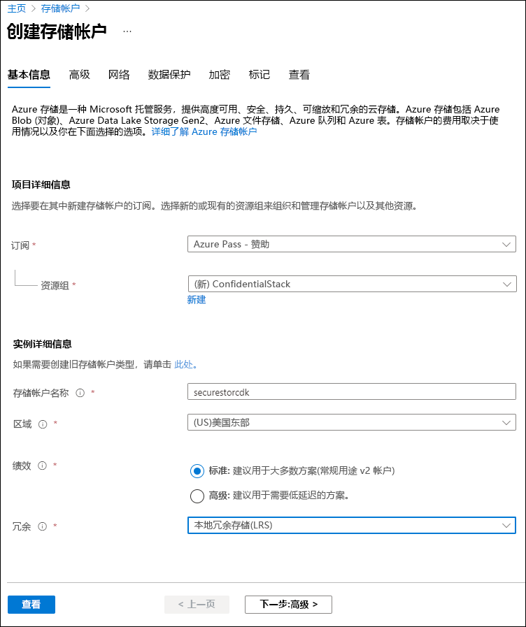
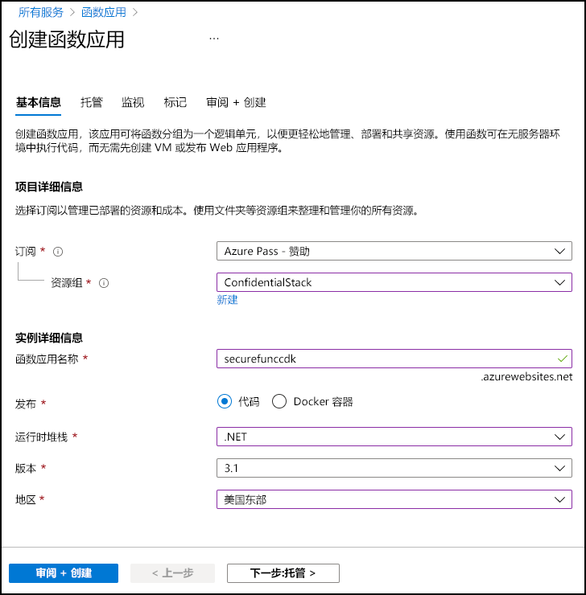

---
lab:
  az204Title: 'Lab 07: Access resource secrets more securely across services'
  az020Title: 'Lab 07: Access resource secrets more securely across services'
  az204Module: 'Module 07: Implement secure cloud solutions'
  az020Module: 'Module 07: Implement secure cloud solutions'
---

# <a name="lab-07-access-resource-secrets-more-securely-across-services"></a>实验室 07：以更安全地方式跨服务访问资源机密

## <a name="microsoft-azure-user-interface"></a>Microsoft Azure 用户接口

鉴于 Microsoft 云工具的动态特性，Azure UI 在此培训内容开发后可能会发生更改。 因此，实验说明和实验步骤可能无法正确对应。

我们发现社区进行了必要更改时，Microsoft 将会更新此培训课程。 但由于云更新频繁，在此培训内容更新前 UI 可能已更改。 如果发生这种情况，请适应这些更改，并根据需要在实验室中熟悉这些更改。

## <a name="instructions"></a>说明

### <a name="before-you-start"></a>开始之前

#### <a name="sign-in-to-the-lab-environment"></a>登录到实验室环境

使用以下凭据登录到 Windows 10 虚拟机 (VM)：

- 用户名：Admin
- 密码：Pa55w.rd

> **注意**：你的讲师将提供连接到虚拟实验室环境的说明。

#### <a name="review-the-installed-applications"></a>查看已安装的应用程序

在你的 Windows 10 桌面上找到任务栏。 任务栏里有本实验室中你将使用的应用程序的图标，包括：

- Microsoft Edge
- 文件资源浏览器
- Windows 终端
- Visual Studio Code

## <a name="architecture-diagram"></a>体系结构关系图


### <a name="exercise-1-create-azure-resources"></a>练习 1：创建 Azure 资源

#### <a name="task-1-open-the-azure-portal"></a>任务 1：打开 Azure 门户

1. 在任务栏上，选择 Microsoft Edge 图标。

1. 在打开的浏览器窗口中，浏览到 Azure 门户 (<https://portal.azure.com>)，然后使用你将用于此实验的帐户登录。

    > **注意**：第一次登录 Azure 门户时，你会看到一个门户教程。 选择“开始使用”，以跳过导览并开始使用门户。

#### <a name="task-2-create-a-storage-account"></a>任务 2：创建存储帐户

1. 在 Azure 门户中，使用“搜索资源、服务和文档”文本框搜索“存储帐户”，然后在结果列表中选择“存储帐户”  。

1. 在“存储帐户”边栏选项卡上，选择“+ 创建”。 ****  

1. 在“创建存储帐户”边栏选项卡的“基本信息”选项卡上，执行以下操作，然后选择“查看 + 创建”  ：

   | 设置 | 操作 |
   | -- | -- |
   | “订阅”下拉列表 | 保留默认值 |
   | “资源组”部分 | 选择“新建”，输入“ConfidentialStack”，然后选择“确定”   |
   | “存储帐户名称”文本框  | 输入“securestor[yourname]” |
   | “区域”下拉列表 | 选择“(US)美国东部” |
   | “性能”部分 | 选择“标准”选项 |
   | “冗余”下拉列表 | 选择“本地冗余存储(LRS)” |

   以下屏幕截图显示了“创建存储帐户”边栏选项卡上配置的设置。

   

1. 在“查看 + 创建”选项卡中，查看在上述步骤中选择的选项。

1. 选择“创建”，使用指定的配置创建存储帐户。

    > **注意**：等待创建任务完成，再继续本实验室。

1. 在“部署概述”边栏选项卡上，选择“转到资源” 。

1. 在“存储帐户”边栏选项卡上的“安全 + 网络”部分中，选择“访问密钥”链接。 ****   ****   ****  

1. 在“访问密钥”部分中，选择“显示密钥”。 ****  

1. 选择任一密钥，然后记录任一“连接字符串”框中的值。 ****   你稍后将在本实验室中使用此值。

    > **注意**：你选择哪个连接字符串无关紧要。 它们可以互换。

#### <a name="task-3-create-an-azure-key-vault"></a>任务 3：创建 Azure 密钥保管库

1. 在 Azure 门户中，使用“搜索资源、服务和文档”文本框搜索“密钥保管库”，然后在结果列表中选择“密钥保管库”  。

1. 在“密钥保管库”边栏选项卡上，选择“创建” 。

1.  在“创建密钥保管库”边栏选项卡上的“基本信息”选项卡上，执行以下操作，然后选择“查看 + 创建”  ：

   | 设置 | 操作 |
   | -- | -- |
   | “订阅”下拉列表 | 保留默认值 |
   | “资源组”下拉列表 | 在列表中选择“ConfidentialStack” |
   | “密钥保管库名称”文本框  | 输入“securevault[yourname]” |
   | “区域”下拉列表 | 选择“美国东部” |
   | “定价层”下拉列表 | 选择“标准” |

   以下屏幕截图显示了“创建密钥保管库”边栏选项卡上配置的设置。

   

1. 在“查看 + 创建”选项卡中，查看在上述步骤中选择的选项。

1. 选择“创建”，使用指定的配置创建密钥保管库。

    > **注意**：等待创建任务完成，再继续本实验室。

#### <a name="task-4-create-a-function-app"></a>任务 4：创建函数应用

1. 在 Azure 门户中，使用“搜索资源、服务和文档”文本框搜索“函数应用”，然后在结果列表中选择“函数应用”  。

1. 在“函数应用”边栏选项卡中，选择“创建” 。

1. 在“创建函数应用”边栏选项卡的“基本信息”选项卡上，执行以下操作，然后选择“下一步:  托管”：

    | 设置 | 操作 |
    | -- | -- |
    | “订阅”下拉列表 | 保留默认值 |
    | “资源组”下拉列表 | 选择“ConfidentialStack” |
    | “函数应用名称”文本框  | 输入“securefunc[yourname]” |
    | “发布”部分 | 选择“代码” |
    | “运行时堆栈”下拉列表 | 选择“.NET” |
    | “版本”下拉列表 | 选择“6” |
    | “区域”下拉列表 | 选择“美国东部”区域 |
    | “操作系统”部分 | 选择“Linux” |
    | “计划类型”下拉列表 | 选择“消耗(无服务器)” |

    以下屏幕截图显示了“创建函数应用”边栏选项卡上配置的设置。

    

1. 在“托管”选项卡上，执行以下操作，然后选择“查看 + 创建” ：

    | 设置 | 操作 |
    | -- | -- |
    | “存储帐户”下拉列表 | 选择“securestor[yourname]”存储帐户 |

1. 在“查看 + 创建”选项卡中，查看在上述步骤中选择的选项。

1. 选择“创建”，使用指定的配置创建函数应用。

    > **注意**：等待创建任务完成，再继续本实验室。

#### <a name="review"></a>审阅

在本练习中，你创建了本实验室所需的全部资源。

### <a name="exercise-2-configure-secrets-and-identities"></a>练习 2：配置机密和标识

#### <a name="task-1-configure-a-system-assigned-managed-service-identity"></a>任务 1：配置系统分配的托管服务标识

1. 在 Azure 门户的导航窗格中，选择“资源组”链接。

1. 在“资源组”边栏选项卡上，选择“ConfidentialStack”资源组 。

1. 在“ConfidentialStack”边栏选项卡上，选择“securefunc[yourname]”函数应用 。

    > **注意**：将有两项资源，即函数应用资源和应用程序见解资源，两者的名称相同。 确保选择函数应用资源。

1. 在“函数应用”边栏选项卡上，从“设置”部分选择“标识”选项  。

1. 在“标识”窗格的“系统分配”选项卡上，将“状态”设置为“开启”，然后选择“保存”    。

1. 选择“是”确认设置。

    > **注意**：等待系统分配的托管标识创建完成后再继续本实验。

#### <a name="task-2-create-a-key-vault-secret"></a>任务 2：创建密钥保管库机密

1. 在 Azure 门户的“导航”窗格中，选择“资源组”链接。

1. 在“资源组”边栏选项卡上，选择“ConfidentialStack”资源组 。

1. 在“ConfidentialStack”边栏选项卡上，选择“securevault[yourname]”密钥保管库 。

1. 在“密钥保管库”边栏选项卡上，选择“对象”部分中的“机密”链接  。

1. 在“机密”窗格中，选择“+ 生成/导入” 。

1. 在“创建机密”边栏选项卡上，执行以下操作，然后选择“创建” ：

    | 设置 | 操作 |
    | -- | -- |
    | “上传选项”下拉列表 | 选择“手动” |
    | “名称”文本框 | 输入“storagecredentials” |
    | “值”文本框 | 输入之前在此实验室中记录的存储帐户连接字符串 |
    | “内容类型”文本框 | 留空 |
    | “设置激活日期”复选框 | 未选定 |
    | “设置到期日期”复选框 | 未选定 |
    | “启用”选项 | 选择“是” |

    以下屏幕截图显示了“创建机密”边栏选项卡上配置的设置。

    

    > **注意**：等待机密创建完成后再继续本实验。

1. 返回“机密”窗格，选择列表中的“storagecredentials”项 。

1. 在“版本”窗格中，选择“storagecredentials”机密的最新版本 。

1. 在“机密版本”窗格中，执行以下操作：

    1. 选择“显示机密值”，可以找到机密的值。

    1. 记录“机密标识符”文本框的值，因为你稍后将在本实验室中使用该值。

    > **注意**：你将记录“机密标识符”文本框中的值，而不是“机密值”文本框中的值 。

#### <a name="task-3-configure-a-key-vault-access-policy"></a>任务 3：配置密钥保管库访问策略

1. 在 Azure 门户的导航窗格中，选择“资源组”链接。

1. 在“资源组”边栏选项卡上，选择“ConfidentialStack”资源组 。

1. 在“ConfidentialStack”边栏选项卡上，选择“securevault[yourname]”密钥保管库 。

1. 在“密钥保管库”边栏选项卡中，选择“概览”部分中的“访问策略”链接  。

1. 在“访问策略”窗格中，选择“添加访问策略”。

1. 在“添加访问策略”边栏选项卡上，执行以下操作，然后选择“添加” ：

    | 设置 | 操作 |
    | -- | -- |
    | “从模板配置”下拉列表 | 留空 |
    | “密钥权限”复选框 | 已选择 0 |
    | “机密权限”复选框 | 选择“GET”权限 |
    | “证书权限”复选框 | 已选择 0 |
    | “选择主体”链接 | 找到并选择名为“securefunc[yourname]”的服务主体。 之前在本实验室中创建的系统分配的托管标识将与 Azure 函数资源同名 |
    | “授权应用程序”链接 | 未选择 |

    以下屏幕截图显示了“添加访问策略”边栏选项卡中配置的设置。

    
    
    

1. 在“访问策略”窗格中，选择“保存”。

    > **注意**：等待访问策略更改保存后再继续本实验室。

#### <a name="task-4-create-a-key-vault-derived-application-setting"></a>任务 4：创建密钥保管库派生的应用程序设置

1. 在 Azure 门户的导航窗格中，选择“资源组”链接。

1. 在“资源组”边栏选项卡上，选择“ConfidentialStack”资源组 。

1. 在“ConfidentialStack”边栏选项卡上，选择“securefunc[yourname]”函数应用 。

1. 在“函数应用”边栏选项卡上，选择“设置”部分中的“配置”选项  。

1. 在“配置”窗格的“应用程序设置”选项卡上，选择“新建应用程序设置”  。

1. 在出现的“添加/编辑应用程序设置”弹出窗口中，在“名称”字段，输入“StorageConnectionString”  。

1. 在“值”文本框中，使用以下语法构造值：`@Microsoft.KeyVault(SecretUri=<Secret Identifier>)`，其中 `<Secret Identifier>` 占位符表示在本练习前面记录的机密标识符。

    > 注意：例如，如果机密标识符为 `https://securevaultstudent.vault.azure.net/secrets/storagecredentials/17b41386df3e4191b92f089f5efb4cbf`，则产生的值为 `@Microsoft.KeyVault(SecretUri=https://securevaultstudent.vault.azure.net/secrets/storagecredentials/17b41386df3e4191b92f089f5efb4cbf)`。

1. 将“部署槽设置”复选框设置为其默认值（未选中），然后选择“确定”关闭弹出窗口并返回到“配置”部分  。

1. 选择“保存”以保存设置，然后在“保存更改”确认弹出对话框中，选择“继续”  。

    > **注意**：等待应用程序设置保存后再继续本实验室。

#### <a name="review"></a>审阅

在本练习中，你为函数应用创建了系统分配的托管服务标识，然后为该标识提供了相应的权限，以获取密钥保管库中的机密值。 最后，你创建了函数应用的配置设置中所引用的机密。

### <a name="exercise-3-build-an-azure-functions-app"></a>练习 3：生成 Azure Functions 应用

#### <a name="task-1-initialize-a-function-project"></a>任务 1：初始化函数项目

1. 在任务栏上，选择“Windows 终端”图标。

1. 运行以下命令，将当前目录更改为 Allfiles (F):\\Allfiles\\Labs\\07\\Starter\\func 空目录：

    ```powershell
    cd F:\Allfiles\Labs\07\Starter\func
    ```

    > **注意**：在 Windows 资源管理器中，从 F:\Allfiles\Labs\07\Starter\func\.gitignore 文件中删除只读属性。

1. 运行以下命令以使用 Azure Functions Core Tools 通过 dotnet 运行时在当前目录中新建本地 Functions 项目 ：

    ```powershell
    func init --worker-runtime dotnet --force
    ```

    > **注意**：可以查看文档以使用 Azure Functions Core Tools [创建新项目][azure-functions-core-tools-new-project]。

1. 运行以下命令以生成 .NET 6 项目：

    ```powershell
    dotnet build
    ```

#### <a name="task-2-create-an-http-triggered-function"></a>任务 2：创建 HTTP 触发的函数

1. 运行以下命令以使用 Azure Functions Core Tools 通过 HTTP 触发器模板新建一个名为 FileParser 的函数  ：

    ```powershell
    func new --template "HTTP trigger" --name "FileParser"
    ```

    > **注意**：可以查看文档以使用 Azure Functions Core Tools [创建新函数][azure-functions-core-tools-new-function]。

1. 关闭当前运行的“Windows 终端”应用程序。

#### <a name="task-3-configure-and-read-an-application-setting"></a>任务 3：配置和读取应用程序设置

1. 在“启动”屏幕上，选择“Visual Studio Code”磁贴 。

1. 在“文件”**** 菜单中，选择“打开文件夹”****。

1. 在打开的“文件资源管理器”窗口中，浏览到 Allfiles (F):\\Allfiles\\Labs\\07\\Starter\\func，然后选择“选择文件夹”  。

1. 在 Visual Studio Code 窗口的“资源管理器”窗格中，打开 local.settings.json 文件  。

1. 请注意 Values 对象的当前值：

    ```json
    "Values": {
        "AzureWebJobsStorage": "UseDevelopmentStorage=true",
        "FUNCTIONS_WORKER_RUNTIME": "dotnet"
    }
    ```

1. 通过添加名为“StorageConnectionString”的新设置并将其设置为“[TEST VALUE]”的字符串值来更新“Values”对象的值  ：

    ```json
    "Values": {
        "AzureWebJobsStorage": "UseDevelopmentStorage=true",
        "FUNCTIONS_WORKER_RUNTIME": "dotnet",
        "StorageConnectionString": "[TEST VALUE]"
    }
    ```

1. Local.settings.json 文件现应包括：

    ```json
    {
        "IsEncrypted": false,
        "Values": {
            "AzureWebJobsStorage": "UseDevelopmentStorage=true",
            "FUNCTIONS_WORKER_RUNTIME": "dotnet",
            "StorageConnectionString": "[TEST VALUE]"
        }
    }
    ```

1. 选择“保存”，将所做的更改保存到 local.settings.json 文件中 。

1. 在“Visual Studio Code”窗口的“资源管理器”窗格中，打开 FileParser.cs 文件  。

1. 在代码编辑器中，查看示例实现：

    ```csharp
    using System;
    using System.IO;
    using System.Threading.Tasks;
    using Microsoft.AspNetCore.Mvc;
    using Microsoft.Azure.WebJobs;
    using Microsoft.Azure.WebJobs.Extensions.Http;
    using Microsoft.AspNetCore.Http;
    using Microsoft.Extensions.Logging;
    using Newtonsoft.Json;
    namespace func
    {
        public static class FileParser
        {
            [FunctionName("FileParser")]
            public static async Task<IActionResult> Run(
                [HttpTrigger(AuthorizationLevel.Function, "get", "post", Route = null)] HttpRequest req,
                ILogger log)
            {
                log.LogInformation("C# HTTP trigger function processed a request.");
                string name = req.Query["name"];
                string requestBody = await new StreamReader(req.Body).ReadToEndAsync();
                dynamic data = JsonConvert.DeserializeObject(requestBody);
                name = name ?? data?.name;
                string responseMessage = string.IsNullOrEmpty(name)
                    ? "This HTTP triggered function executed successfully. Pass a name in the query string or in the request body for a personalized response."
                    : $"Hello, {name}. This HTTP triggered function executed successfully.";
                return new OkObjectResult(responseMessage);
            }
        }
    }
    ```

1. 删除 FileParser.cs 文件中的所有内容。

1. 添加以下代码行，为 Microsoft.AspNetCore.Mvc、Microsoft.Azure.WebJobs、Microsoft.AspNetCore.Http、System 和 System.Threading.Tasks 命名空间添加 using 指令     ：

    ```csharp
    using Microsoft.AspNetCore.Mvc;
    using Microsoft.Azure.WebJobs;
    using Microsoft.AspNetCore.Http;
    using System;
    using System.Threading.Tasks;
    ```

1. 创建名为 FileParser 的新公共静态类 ：

    ```csharp
    public static class FileParser
    { }
    ```

1. 再次观察 FileParser.cs 文件，该文件现在应包括：

    ```csharp
    using Microsoft.AspNetCore.Mvc;
    using Microsoft.Azure.WebJobs;
    using Microsoft.AspNetCore.Http;
    using System;
    using System.Threading.Tasks;
    public static class FileParser
    { }
    ```

1. 在“FileParser”类中，添加以下代码块以新建名为“Run”的公共静态异步方法 。 此方法返回一个“Task\<IActionResult\>”类型的变量，并采用名为“request”的“HttpRequest”类型的变量 ：

    ```csharp
    public static async Task<IActionResult> Run(
        HttpRequest request)
    { }
    ```

1. 添加以下代码，将属性追加到类型为 FunctionNameAttribute 的 Run 方法中，该方法的名称参数设置为 FileParser 的值   ：

    ```csharp
    [FunctionName("FileParser")]
    public static async Task<IActionResult> Run(
        HttpRequest request)
    { }
    ```

1. 添加以下代码，将属性追加到类型为 HttpTriggerAttribute 的 request 参数，从而将 methods 参数数组设置为 GET 的一个值   ：

    ```csharp
    [FunctionName("FileParser")]
    public static async Task<IActionResult> Run(
        [HttpTrigger("GET")] HttpRequest request)
    { }
    ```

1. 再次查看 FileParser.cs 文件的内容，该文件现在应包括：

    ```csharp
    using Microsoft.AspNetCore.Mvc;
    using Microsoft.Azure.WebJobs;
    using Microsoft.AspNetCore.Http;
    using System;
    using System.Threading.Tasks;
    public static class FileParser
    {
        [FunctionName("FileParser")]
        public static async Task<IActionResult> Run(
            [HttpTrigger("GET")] HttpRequest request)
        { }
    }
    ```

1. 在 Run 方法中输入以下代码行，通过使用 Environment.GetEnvironmentVariable 方法并将结果存储在名为“connectionString”的字符串变量中来检索 StorageConnectionString 应用程序设置的值    ：

    ```csharp
    string connectionString = Environment.GetEnvironmentVariable("StorageConnectionString");
    ```

1. 输入以下代码行以将 connectionString 变量的值作为 HTTP 响应返回：

    ```csharp
    return new OkObjectResult(connectionString);
    ```

1. 再次查看 FileParser.cs 文件的内容，该文件现在应包括：

    ```csharp
    using Microsoft.AspNetCore.Mvc;
    using Microsoft.Azure.WebJobs;
    using Microsoft.AspNetCore.Http;
    using System;
    using System.Threading.Tasks;
    public static class FileParser
    {
        [FunctionName("FileParser")]
        public static async Task<IActionResult> Run(
            [HttpTrigger("GET")] HttpRequest request)
        {
            string connectionString = Environment.GetEnvironmentVariable("StorageConnectionString");
            return new OkObjectResult(connectionString);
        }
    }
    ```

1. 选择“保存”以保存对 FileParser.cs 文件的更改 。

#### <a name="task-4-validate-the-local-function"></a>任务 4：验证本地函数

1. 在任务栏上，选择“Windows 终端”图标。

1. 运行以下命令，将当前目录更改为 Allfiles (F):\\Allfiles\\Labs\\07\\Starter\\func 空目录：

    ```powershell
    cd F:\Allfiles\Labs\07\Starter\func
    ```

1. 运行以下命令以运行函数应用项目：

    ```powershell
    func start --build
    ```

    > **注意**：可以查看文档以使用 Azure Functions Core Tools [在本地启动函数应用项目][azure-functions-core-tools-start-function]。

1. 在任务栏上再次选择“Windows 终端”图标以打开 Windows Terminal 应用程序的新实例 。 运行以下命令，将当前目录更改为 Allfiles (F):\\Allfiles\\Labs\\07\\Starter\\func 空目录：

    ```powershell
    cd F:\Allfiles\Labs\07\Starter\func
    ```
    
1. 收到打开的命令提示符后，运行以下命令以启动 httprepl 工具，将基本统一资源标识符 (URI) 设置为 ``http://localhost:7071``：

    ```powershell
    httprepl http://localhost:7071
    ```

    > **注意**：httprepl 工具会显示一条错误消息。 出现此消息是因为该工具正在搜索用于遍历 API 的 Swagger 定义文件。 由于函数项目不会生成 Swagger 定义文件，因此你需要手动遍历该 API。
1. 收到工具提示符时，运行以下命令浏览到相关的 api 目录：

    ```powershell
    cd api
    ```

1. 运行以下命令以浏览到相关的 fileparser 目录：

    ```powershell
    cd fileparser
    ```

1. 运行以下命令以运行 get 命令：

    ```powershell
    get
    ```

1. 查看作为 HTTP 请求结果返回的 StorageConnectionString 的 [TEST VALUE] 值 ：

    ```powershell
    HTTP/1.1 200 OK
    Content-Type: text/plain; charset=utf-8
    Date: Tue, 01 Sep 2020 23:35:39 GMT
    Server: Kestrel
    Transfer-Encoding: chunked
    [TEST VALUE]
    ```

1. 运行以下命令以退出 httprepl 工具：

    ```powershell
    exit
    ```

1. 关闭“Windows 终端”应用程序上所有当前运行的实例。

#### <a name="task-5-deploy-the-function-using-the-azure-functions-core-tools"></a>任务 5：使用 Azure Functions Core Tools 部署函数

1. 在任务栏上，选择“Windows 终端”图标。

1. 运行以下命令，将当前目录更改为 Allfiles (F):\\Allfiles\\Labs\\07\\Starter\\func 空目录：

    ```powershell
    cd F:\Allfiles\Labs\07\Starter\func
    ```

1. 运行以下命令以登录到 Azure 命令行接口 (CLI)：

    ```powershell
    az login
    ```

1. 在 Microsoft Edge 浏览器窗口中，输入 Microsoft 帐户的电子邮件地址和密码，然后选择“登录” 。

1. 返回当前打开的 Windows Terminal 窗口。 请等待登录过程完成。

1. 运行以下命令以发布函数应用项目（将 `<function-app-name>` 占位符替换为在本实验室前面创建的函数应用的名称）：

    ```powershell
    func azure functionapp publish <function-app-name>
    ```

    > **注意**：例如，如果函数应用名称为 securefuncstudent，那么命令将为 ``func azure functionapp publish securefuncstudent`` 。 可以查看文档以使用 Azure Functions Core Tools [发布本地函数应用项目][azure-functions-core-tools-publish-azure]。

1. 等待部署完成后，再继续本实验室。

1. 关闭当前运行的“Windows 终端”应用程序。

#### <a name="task-6-test-the-key-vault-derived-application-setting"></a>任务 6：测试密钥保管库派生的应用程序设置

1. 在任务栏上，选择 Microsoft Edge 图标，然后选择包含 Azure 门户 (<https://portal.azure.com>) 的选项卡。

1. 在 Azure 门户的导航窗格中，选择“资源组”链接。

1. 在“资源组”边栏选项卡上，选择“ConfidentialStack”资源组 。

1. 在“ConfidentialStack”边栏选项卡上，选择“securefunc[yourname]”函数应用 。

1. 在“函数应用”边栏选项卡上，选择“函数”部分的“函数”选项  。

1. 在“函数”窗格上，选择现有的“FileParser”函数 。

1. 在“函数”边栏选项卡中的“开发人员”部分，选择“代码 + 测试”选项  。

1. 在函数编辑器中，选择“测试/运行”。

1. 在自动显示的窗格中的“HTTP 方法”列表中，选择“GET”。 

1. 选择“运行”以测试函数。

1. 查看运行测试的结果。 结果应为 Azure 存储连接字符串。

#### <a name="review"></a>审阅

在本练习中，你使用了服务标识来读取存储在 Key Vault 中的机密值，并返回该值作为函数应用的结果。

### <a name="exercise-4-access-azure-blob-storage-data"></a>练习 4：访问 Azure Blob 存储数据

#### <a name="task-1-upload-a-sample-storage-blob"></a>任务 1：上传示例存储 blob

1. 在 Azure 门户的导航窗格中，选择“资源组”链接。

1. 在“资源组”边栏选项卡上，选择“ConfidentialStack”资源组 。

1. 在“ConfidentialStack”边栏选项卡中，选择“securestor[yourname]”存储帐户 。

1. 在“存储帐户”边栏选项卡中，选择“数据存储”部分的“容器”链接。

1. 在“容器”部分，选择“+ 容器” 。

1. 在“新建容器”弹出窗口中，执行以下操作，然后选择“创建”： 

    | 设置 | 操作 |
    | -- | -- |
    | “名称”文本框 | 输入“drop” |
    | “公共访问级别”下拉列表 | 选择“Blob (仅限 Blob 匿名读取访问)” |

1. 返回“容器”部分，然后选择新创建的 drop 容器 。

1. 在“容器”边栏选项卡中，选择“上传” 。

1. 在“上传 blob”窗口中，执行以下操作，然后选择“上传” ：

    | 设置 | 操作 |
    | -- | -- |
    | “文件”部分 | 选择“文件夹”图标 |
    | “文件资源管理器”窗口  | 浏览到 Allfiles (F):\\Allfiles\\Labs\\07\\Starter，选择 records.json 文件，然后选择“打开”   |
    | “如果文件已存在，请覆盖”复选框 | 确保选中此复选框 |

    > **注意**：等待 Blob 上传完成，然后再继续本实验室。

1. 返回“容器”边栏选项卡，选择 Blob 列表中的“records.json”Blob 。

1. 在“Blob”边栏选项卡上，找到 Blob 元数据，然后复制该 Blob 的 URL。

1. 在任务栏上，激活“Microsoft Edge”的快捷菜单，然后选择“新建窗口”。 

1. 在新的浏览器窗口中，引用你为 Blob 复制的 URL。

1. 现在应该显示 Blob 的 JavaScript 对象表示法 (JSON) 内容。 关闭显示 JSON 内容的浏览器窗口。

1. 返回显示 Azure 门户的浏览器窗口，然后关闭“Blob”边栏选项卡。

1. 返回“容器”边栏选项卡，然后选择“更改访问级别” 。

1. 在“更改访问级别”弹出窗口中，执行以下操作：

    1. 在“公共访问级别”下拉列表中，选择“专用(非匿名访问)” 。
    1. 选择“确定”。

1. 在任务栏上，激活“Microsoft Edge”的快捷菜单，然后选择“新建窗口”。 

1. 在新的浏览器窗口中，引用你为 Blob 复制的 URL。

1. 现在应该显示一条表示未找到资源的错误消息。

    > **注意**：如果没有显示该错误消息，则浏览器可能缓存了该文件。 选择 Ctrl+F5 刷新页面，直到出现错误提示。

#### <a name="task-2-pull-and-configure-the-azure-sdk-for-net"></a>任务 2：请求并配置用于 .NET 的 Azure SDK

1. 在任务栏上，选择“Windows 终端”图标。

1. 运行以下命令，将当前目录更改为 Allfiles (F):\\Allfiles\\Labs\\07\\Starter\\func 空目录：

    ```powershell
    cd F:\Allfiles\Labs\07\Starter\func
    ```

1. 运行以下命令以添加来自 NuGet 的 Azure.Storage.Blobs 包 12.12.0 版本 ：

    ```powershell
    dotnet add package Azure.Storage.Blobs --version 12.12.0
    ```

    > **注意**：[Azure.Storage.Blobs](https://www.nuget.org/packages/Azure.Storage.Blobs) NuGet 包引用为 Azure Blob 存储编写代码所需的用于 .NET 的 Azure SDK 的子集。

1. 关闭当前运行的“Windows 终端”应用程序。

1. 在“启动”屏幕上，选择“Visual Studio Code”磁贴 。

1. 在“文件”**** 菜单中，选择“打开文件夹”****。

1. 在打开的“文件资源管理器”窗口中，浏览到 Allfiles (F):\\Allfiles\\Labs\\07\\Starter\\func，然后选择“选择文件夹”  。

1. 在“Visual Studio Code”窗口的“资源管理器”窗格中，打开 FileParser.cs 文件  。

1. 为 Azure.Storage.Blobs 命名空间添加 using 指令 ：

    ```csharp
    using Azure.Storage.Blobs;
    ```

1. 查看 FileParser.cs 文件的内容，该文件现在应包括：

    ```csharp
    using Azure.Storage.Blobs;
    using Microsoft.AspNetCore.Mvc;
    using Microsoft.Azure.WebJobs;
    using Microsoft.AspNetCore.Http;
    using System;
    using System.Threading.Tasks;   
    public static class FileParser
    {
        [FunctionName("FileParser")]
        public static async Task<IActionResult> Run(
            [HttpTrigger("GET")] HttpRequest request)
        {
            string connectionString = Environment.GetEnvironmentVariable("StorageConnectionString");
            return new OkObjectResult(connectionString);
        }
    }
    ```

#### <a name="task-3-write-azure-blob-storage-code-using-the-azure-sdk-for-net"></a>任务 3：使用用于 .NET 的 Azure SDK 编写 Azure Blob 存储代码

1. 在 FileParser 类的 Run 方法中，删除以下代码行 ：

    ```csharp
    return new OkObjectResult(connectionString);
    ```

1. 同样是在 Run 方法中，添加以下代码块，通过将 connectionString 变量、``"drop"`` 字符串值和 ``"records.json"`` 字符串值传递给构造函数来新建 BlobClient 类的实例 ：

    ```csharp
    BlobClient blob = new BlobClient(connectionString, "drop", "records.json");
    ```

1. 同样是在 Run 方法中，添加以下代码块，使用 BlobClient.DownloadAsync 方法异步下载引用的 Blob 的内容，然后将结果存储在名为 response 的变量中 ：

    ```csharp
    var response = await blob.DownloadAsync();
    ```

1. 同样是在 Run 方法中，添加以下代码块，使用 FileStreamResult 类构造函数返回存储在 content 变量中的各种内容的值：

    ```csharp
    return new FileStreamResult(response?.Value?.Content, response?.Value?.ContentType);
    ```

1. 再次查看 FileParser.cs 文件的内容，该文件现在应包括：

    ```csharp
    using Azure.Storage.Blobs;
    using Microsoft.AspNetCore.Mvc;
    using Microsoft.Azure.WebJobs;
    using Microsoft.AspNetCore.Http;
    using System;
    using System.Threading.Tasks;
    public static class FileParser
    {
        [FunctionName("FileParser")]
        public static async Task<IActionResult> Run(
            [HttpTrigger("GET")] HttpRequest request)
        {
            string connectionString = Environment.GetEnvironmentVariable("StorageConnectionString");
            BlobClient blob = new BlobClient(connectionString, "drop", "records.json");
            var response = await blob.DownloadAsync();
            return new FileStreamResult(response?.Value?.Content, response?.Value?.ContentType);
        }
    }
    ```

1. 选择“保存”以保存对 FileParser.cs 文件的更改 。

#### <a name="task-4-deploy-and-validate-the-azure-functions-app"></a>任务 4：部署和验证 Azure Functions 应用

1. 在任务栏上，选择“Windows 终端”图标。

1. 运行以下命令，将当前目录更改为 Allfiles (F):\\Allfiles\\Labs\\07\\Starter\\func 空目录：

    ```powershell
    cd F:\Allfiles\Labs\07\Starter\func
    ```

1. 运行以下命令以登录到 Azure CLI：

    ```powershell
    az login
    ```

1. 在 Microsoft Edge 浏览器窗口中，输入 Microsoft 帐户的电子邮件地址和密码，然后选择“登录” 。

1. 返回当前打开的 Windows Terminal 窗口。 请等待登录过程完成。

1. 再次运行以下命令以发布函数应用项目（将 `<function-app-name>` 占位符替换为在本实验室前面使用的函数应用的名称）：

    ```powershell
    func azure functionapp publish <function-app-name>
    ```

    > **注意**：例如，如果函数应用名称为 securefuncstudent，那么命令将为 ``func azure functionapp publish securefuncstudent`` 。 可以查看文档以使用 Azure Functions Core Tools [发布本地函数应用项目][azure-functions-core-tools-publish-azure]。

1. 等待部署完成后，再继续本实验室。

1. 关闭当前运行的“Windows 终端”应用程序。

1. 在任务栏上，选择 Microsoft Edge 图标，然后参阅 Azure 门户 (<https://portal.azure.com>)。

1. 在 Azure 门户的导航窗格中，选择“资源组”链接。

1. 在“资源组”边栏选项卡上，选择“ConfidentialStack”资源组 。

1. 在“ConfidentialStack”边栏选项卡上，选择“securefunc[yourname]”函数应用 。

1. 在“应用服务”边栏选项卡上，从“函数”部分选择“函数”选项  。

1. 在“函数”窗格上，选择现有的“FileParser”函数 。

1. 在“函数”边栏选项卡中的“开发人员”部分，选择“代码 + 测试”选项  。

1. 在函数编辑器中，选择“测试/运行”。

1. 在自动显示的窗格中的“HTTP 方法”列表中，选择“GET”。 

1. 选择“运行”以测试函数。

1. 查看运行测试的结果。 输出将包含存储在 Azure 存储帐户中的 $/drop/records.json Blob 的内容。

#### <a name="review"></a>审阅

在本练习中，你使用了 C\# 代码来访问存储帐户，然后下载了 Blob 的内容。

### <a name="exercise-5-clean-up-your-subscription"></a>练习 5：清理订阅

#### <a name="task-1-open-azure-cloud-shell"></a>任务 1：打开 Azure Cloud Shell

1. 在 Azure 门户中，选择“Cloud Shell”图标  以打开一个新的 Bash 会话。 如果 Cloud Shell 默认为 PowerShell 会话，请选择“PowerShell”，然后在下拉菜单中选择“Bash”。

    > **注意**：如果这是你第一次启动 Cloud Shell，当系统提示你选择“Bash”或“PowerShell”时，请选择“PowerShell”。 当出现消息“未安装存储”时，请选择你在本实验中使用的订阅，然后选择“创建存储”。 

#### <a name="task-2-delete-a-resource-group"></a>任务 2：删除资源组

1. 在“Cloud Shell”窗格中，运行以下命令以删除“ConfidentialStack”资源组： 

    ```bash
    az group delete --name ConfidentialStack --no-wait --yes
    ```

     > **注意**：该命令以异步方式运行（由 --nowait 参数确定），因此，尽管可立即在同一个 Bash 会话中运行另一个 Azure CLI 命令，但实际上要花几分钟才能删除资源组。

1. 关闭门户中的“Cloud Shell”窗格。

#### <a name="task-3-close-the-active-application"></a>任务 3：关闭活动的应用程序

- 关闭当前正在运行的 Microsoft Edge 应用程序。

#### <a name="review"></a>审阅

在本练习中，你通过删除本实验室中使用的资源组清理了订阅。
