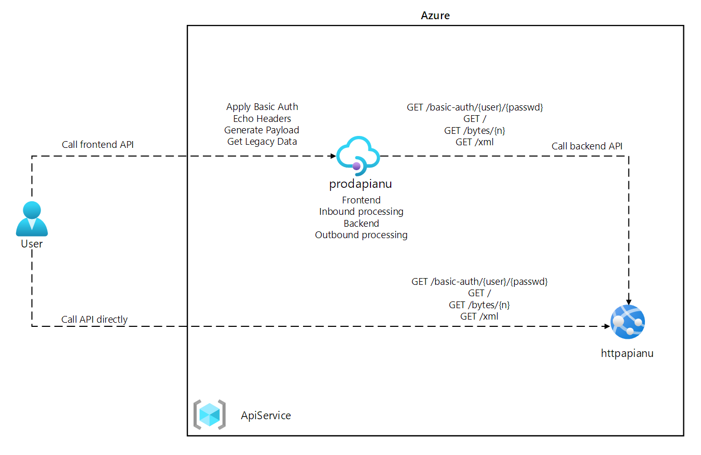
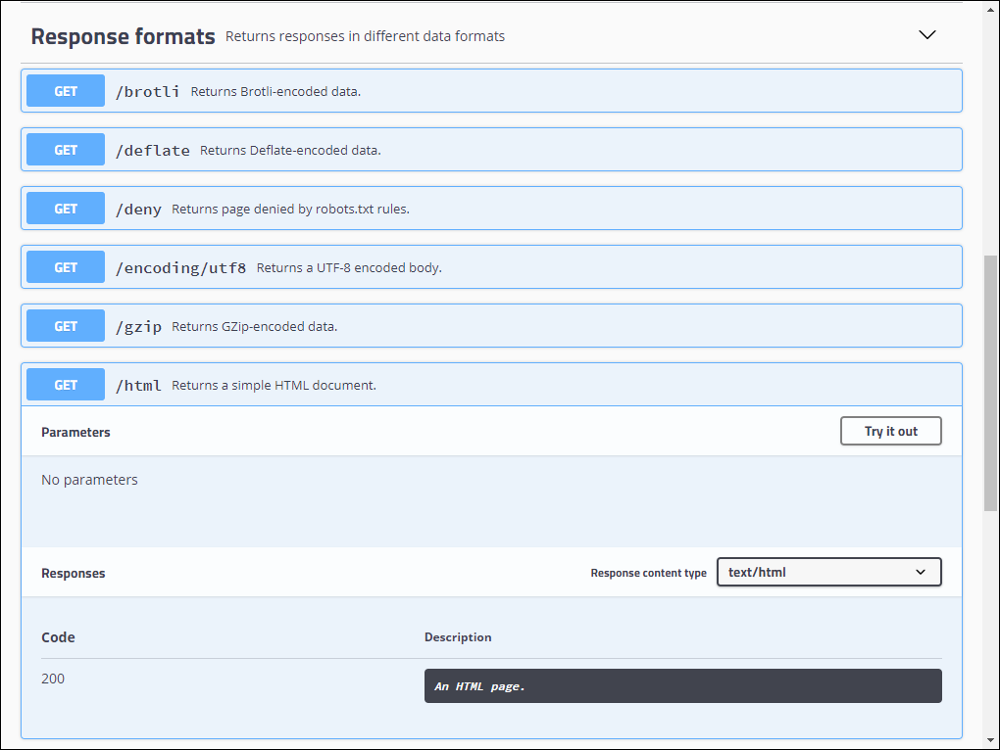
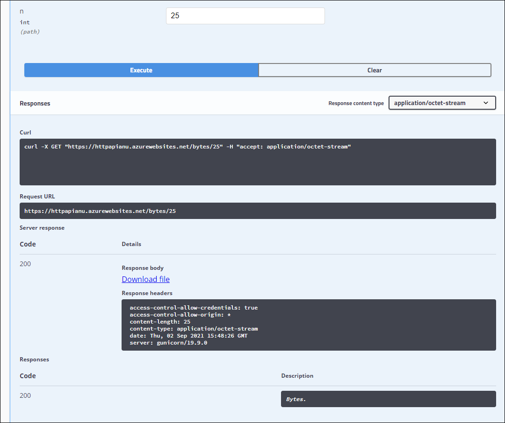
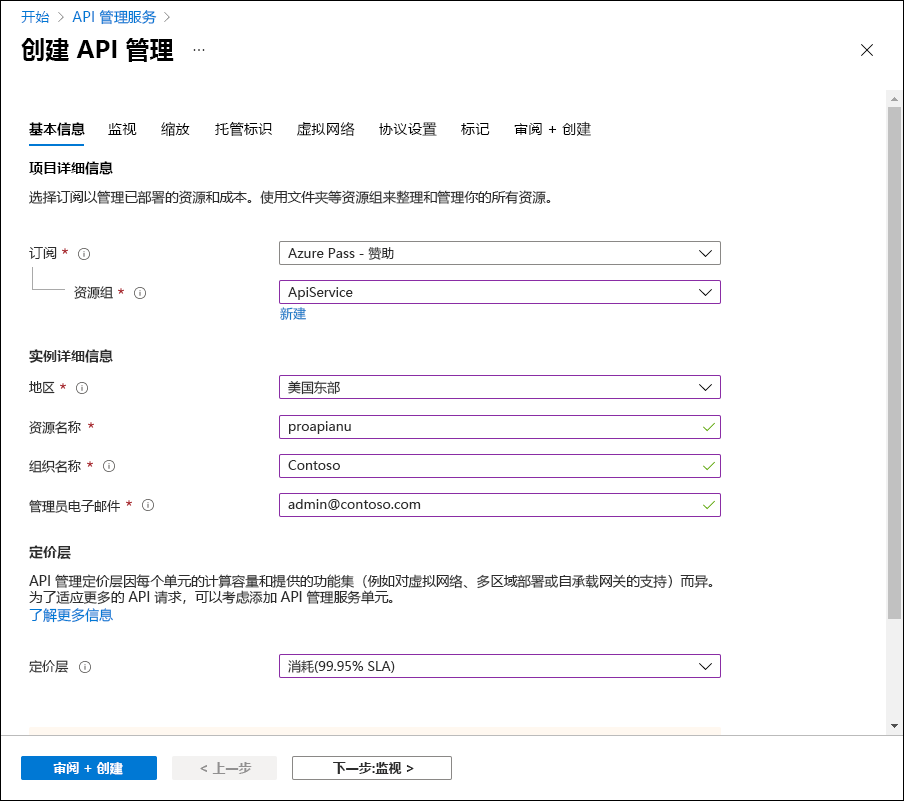
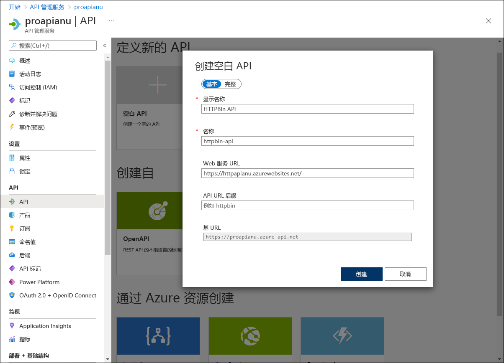
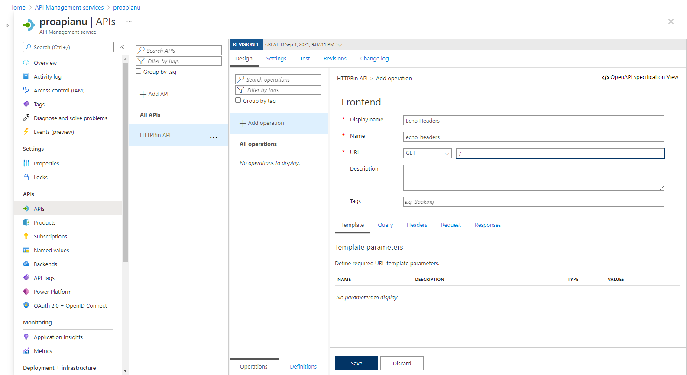

---
lab:
  az204Title: 'Lab 08: Create a multi-tier solution by using Azure services'
  az204Module: 'Learning Path 08: Implement API Management'
---

# 实验室 08：使用 Azure 服务创建多层解决方案

## Microsoft Azure 用户接口

鉴于 Microsoft 云工具的动态特性，Azure UI 在此培训内容开发后可能会发生更改。 因此，实验说明和实验步骤可能无法正确对应。

我们发现社区进行了必要更改时，Microsoft 会更新此培训课程。 但是，云更新经常发生，因此在此培训内容更新之前，可能会发生 UI 更改。 如果发生这种情况，请适应这些更改，并根据需要在实验室中熟悉这些更改。

## Instructions

### 开始之前

#### 登录到实验室环境

使用以下凭据登录到 Windows 10 虚拟机 (VM)：

- 用户名：`Admin`
- 密码：`Pa55w.rd`

> **注意**：你的讲师将提供连接到虚拟实验室环境的说明。

#### 查看已安装的应用程序

在你的 Windows 10 桌面上找到任务栏。 任务栏里有本实验室中你将使用的应用程序的图标：
    
-   Microsoft Edge

## 实验室场景

在此概念证明中，你将创建一个容器化应用程序，用于在 Azure 上托管 Web 应用作为 API 的信息源。 然后，你将使用 Azure API 管理功能生成一个 API 代理，用来公开和测试你的 API。 开发人员可以查询 API 来测试服务并验证其适用性。

## 体系结构关系图



### 练习 1：利用 Docker 容器映像创建 Azure 应用服务资源

#### 任务 1：打开 Azure 门户

1. 在任务栏上，选择 Microsoft Edge 图标。

1. 在打开的浏览器窗口中，浏览到 Azure 门户 (`https://portal.azure.com`)，然后使用你将用于此实验室的帐户登录。

    > **注意**：第一次登录 Azure 门户时，你会看到一个门户教程。 选择“开始使用”，以跳过导览并开始使用门户。

#### 任务 2：利用 httpbin 容器映像使用 Azure App 服务资源创建 web 应用

1. 在 Azure 门户中，使用“搜索资源、服务和文档”文本框搜索“应用服务”，然后在结果列表中选择“应用服务”  。

1. 在“应用服务”边栏选项卡上，选择“+ 创建” 。

1. 在“创建 Web 应用”边栏选项卡的“基本信息”选项卡上，执行以下操作：
    
    | 设置 | 操作 |
    | -- | -- |
    | “订阅”下拉列表 | 保留默认值 |
    | “资源组”部分 | 选择“新建”，输入 ApiService，然后选择“确定” |
    | “名称”文本框 | 输入“httpapi [yourname]” |
    | “发布”部分 | 选择“Docker 容器” |
    | “操作系统”部分 | 选择“Linux” |
    | “区域”下拉列表 | 选择可在其中部署 Azure Web 应用的任何 Azure 区域 |
    | “Linux 计划”部分 | 选择“新建”，在“名称”文本框中输入值 ApiPlan，然后选择“确定” |
    | “定价计划”部分 | 选择“浏览定价计划”，在“选择应用服务定价计划”页上选择“S1”，然后选中“选择” |

1. 选择“下一页:Docker”。

1. 在“Docker”选项卡上，执行以下操作，然后选择“查看 + 创建”：

    | 设置 | 操作 |
    | -- | -- |
    | “选项”下拉列表 | 选择“单个容器” |
    | “映像源”下拉列表 | 选择“Docker 中心” |
    | “访问权限类型”下拉列表 | 选择“公共” |
    | “映像和标记”文本框 | 输入 kennethreitz/httpbin:latest |

1. 在“查看 + 创建”选项卡中，查看在上述步骤中选择的选项。

1. 选择“创建”，使用指定的配置创建 Web 应用。

    > **注意**：等待创建任务完成，再继续操作本实验室。

#### 任务 3：测试 httpbin Web 应用程序

1. 在 Azure 门户中，使用“搜索资源、服务和文档”文本框搜索“应用服务”，然后在结果列表中选择“应用服务”  。

1. 在“应用服务”边栏选项卡上，选择新创建的 Web 应用。

1. 在显示新创建的应用属性的边栏选项卡上，选择“浏览”。

1. 在 Web 应用程序中，执行以下操作：

    a.  选择“响应格式”。

    b.  选择“GET /html”。

    c.  选择“试用”。

    以下屏幕截图显示了 Web 应用程序的“试用”部分。

    

    d.  选择“执行”。

    e.  查看“响应正文”和“响应标头”文本框的值 。

    f.  查看“请求 URL”文本框的值。

1. 在 Web 应用程序中，执行以下操作：

    a.  选择“动态数据”。

    b.  选择“GET /bytes/{n}”。

    c.  选择“试用”。

    d.  在“n”文本框中，输入 25 。

    e.  选择“执行”。

    f.  查看“响应正文”和“响应标头”文本框的值 。

    g.  选择“下载文件”，下载文件后，在记事本中打开该文件，查看其内容，然后将其关闭。

    > **注意**：该文件包含一系列随机生成的字节。

    以下屏幕截图显示了 Web 应用程序的动态数据部分。
  
    

1. 在 Web 应用程序中，执行以下操作：

    a.  选择“状态代码”。

    b.  选择“GET /status/{codes}”。

    c.  选择“试用”。

    d.  在“代码”文本框中，输入 404 。

    e.  选择“执行”。

    f.  查看“服务器响应”并注意它包含“错误: **未找到”条目**。
     
1. 关闭显示 Web 应用程序的浏览器窗口。

1. 切换回显示 httpapi[yourname] Web 应用的浏览器窗口。

1. 在“应用服务概述”边栏选项卡的“基本信息”中，记录“默认域”链接的值。 稍后在实验室中将使用此值将请求发送到相应的 API。

#### 审阅

在本练习中，你使用源自 Docker Hub 的容器映像创建了一个新的 Azure Web 应用。

### 练习 2：使用 Azure API 管理生成 API 代理层级

#### 任务 1：创建 API 管理资源

1. 在 Azure 门户中，使用“搜索资源、服务和文档”文本框搜索“API 管理服务”，然后在结果列表中选择“API 管理服务”  。

1. 在“API 管理服务”边栏选项卡上，选择“+ 创建” 。

1. 在“安装 API 管理网关”边栏选项卡上，执行以下操作，然后选择“查看 + 创建” ：

    
    | 设置 | 操作 |
    | -- | -- |
    | “订阅”下拉列表 | 保留默认值。 |
    | “资源组”部分 | 选择之前在实验室中创建的“ApiService”组 |
    | “区域”列表 | 选择在上一练习中选择的同一区域 |
    | “资源名称”文本框 | 输入 proapi [yourname] |
    | “组织名称”文本框**** | 输入“Contoso” |
    | “管理员电子邮件”文本框 | 输入 `admin@contoso.com` |
    | “定价层”下拉列表 | **消耗(99.95% SLA)** |

    以下屏幕截图显示了 Web 应用程序的“创建 API 管理”边栏选项卡的配置设置。
    
    

1. 在“查看 + 创建”选项卡中，查看在之前步骤中指定的选项，然后选择“创建” 。

    > **注意**：等待创建任务完成，再继续操作本实验室。

1. 在“部署概述”边栏选项卡上，选择“转到资源” 。

#### 任务 2：定义一个新的 API

1. 在“API 管理服务”边栏选项卡的“API”部分，选择“API”  。

1. 在“定义新的 API”部分，选择“HTTP” 。

1. 在“创建 HTTP API”窗口中，执行以下操作，然后选择“创建” ：
    
    | 设置 | 操作 |
    | -- | -- |
    | “显示名称”文本框 | 输入“HTTPBin API” |
    | “名称”文本框 | 输入“httpbin-api” |
    | “Web 服务 URL”文本框 | 输入之前在实验室中复制的 Web 应用的 URL。 注意：确保 URL 以 https:// 前缀开头 |
    | “API URL 后缀”文本框 | 留空 |
 
    以下屏幕截图显示了 Web 应用程序的“创建空白 API”窗口的配置设置。

    

    > **注意**：等待新 API 完成创建。

1. 在“设计”选项卡中，选择“+ 添加操作” 。

1. 在“添加操作”部分，执行以下操作，然后选择“保存” ：


    | 设置 | 操作 |
    | -- | -- |
    | “显示名称”文本框 | 输入“应答标题” |
    | “名称”文本框 | 验证其值是否设置为“echo-headers” |
    | “URL”列表 | 选择“GET” |
    | “URL”文本框 | 输入“/” |

    以下屏幕截图显示了“添加操作”部分的配置设置。
    
    

    
1. 返回到“设计”选项卡，从操作列表中选择“应答标题” 。

1. 在“设计”部分的“入站处理”磁贴上，选择“+ 添加策略”  。

1. 在“添加入站策略”部分，选择“设置标题”磁贴。

1. 在“设置标题”部分，执行以下操作，然后选择“保存” ：
    
    | 设置 | 操作 |
    | -- | -- |
    | “名称”文本框    | 输入“源” |
    | “值”文本框 | 选择列表，选择“添加值”，然后输入“azure-api-mgmt” |
    | “操作”列表 | 选择“追加” |

    以下屏幕截图显示了“设计”部分的配置设置。

    

1. 返回到“设计”选项卡，从操作列表中选择“应答标题” 。

1. 在“应答标题”的“设计”部分中，在“后端”磁贴上选择铅笔图标  。

1. 在“后端”部分，执行以下操作，然后选择“保存” ：

    | 设置 | 操作 |
    | -- | -- |
    | “服务 URL”部分 | 选择“替代”复选框 |
    | “服务 URL”文本框 | 向其当前值追加值“/headers”。 **注意**：例如，如果当前值为 `https://httpapi[yourname].azurewebsites.net`，新值将为 `https://httpapi[yourname].azurewebsites.net/headers` |
    
1. 返回到“设计”选项卡，从操作列表中选择“应答标题”，然后选择“测试”选项卡  。

1. 在“应答标题”部分，选择“发送”。

    以下屏幕截图显示了“应答标题”部分的配置设置。

    
    
1. 查看 API 请求的结果。

    > **注意**：验证作为请求的一部分发送的许多标题是否在响应中应答。 它们应包含你在此任务中创建的新“源”标题。
     
    以下屏幕截图显示对“应答标题”请求的响应。

    
     
1. 选择“设计”选项卡，返回操作列表。

#### 任务 3：处理 API 响应

1. 在“设计”选项卡中，选择“+ 添加操作” 。

1. 在“添加操作”部分，执行以下操作，然后选择“保存” ：

    | 设置 | 操作 |
    | -- | -- |
    | “显示名称”文本框 | 输入“获取旧数据” |
    | “名称”文本框 | 验证其值是否设置为“get-legacy-data” |
    | “URL”列表 | 验证其值是否设置为“GET” |
    | “URL”文本框 | 输入 /xml |

1. 返回到“设计”选项卡，在操作列表中选择“获取旧数据” 。

1. 选择“测试”选项卡，然后选择“发送”。

1. 查看 API 请求的结果。

    > **注意**：此时，结果应为 XML 格式。

    以下屏幕截图显示 API 请求的结果。
    
    

    
1. 选择“设计”选项卡，然后选择“获取旧数据” 。

1. 在“设计”窗格的“出站处理”部分中，选择“添加策略”  。
    
    以下屏幕截图显示“出站处理”部分。
    
    
    
1. 在“添加出站策略”部分，选择“其他策略”磁贴。

1. 在策略代码编辑器中，找到以下 XML 内容块：

    ```
    <outbound>
        <base />
    </outbound>
    ```

1. 使用以下 XML 替换该 XML 块：

    ```
    <outbound>
        <base />
        <xml-to-json kind="direct" apply="always" consider-accept-header="false" />
    </outbound>
    ```

1. 在策略代码编辑器中，选择“保存”。

1. 返回到“设计”选项卡，在操作列表中选择“获取旧数据”，然后选择“测试”  。

1. 在“获取遗留数据”部分，选择“发送”。

1. 查看 API 请求的结果。

    > **注意**：新结果采用 JavaScript 对象表示法 (JSON) 格式。

1. 在“HTTP 响应”部分，执行以下操作：

    1. 选择“跟踪”。
    
    1. 如果启用确认弹出窗口的跟踪打开，请选择“启用跟踪一小时”**** 按钮 

    1. 查看“后端”和“出站”文本框中的内容，并注意它们包含相应 API 操作的详细信息及其时间信息 。

#### 任务 4：处理 API 请求

1. 在“设计”选项卡中，选择“+ 添加操作” 。

1. 在“添加操作”部分，执行以下操作，然后选择“保存” ：

    | 设置  | 操作 |
    | -- | -- |
    | “显示名称”文本框 | 输入“修改状态代码” |
    | “名称”文本框 | 验证其值是否设置为“modify-status-code” |
    | “URL”列表 | 选择“GET” |
    | “URL”文本框 | 输入 /status/404 |

1. 返回到“设计”选项卡，在操作列表中选择“修改状态代码” 。

1. 在“设计”部分的“入站处理”磁贴上，选择“+ 添加策略”  。

1. 在“添加入站策略”部分，选择“重写 URL”磁贴 。

1. 在“重写 URL”部分，执行以下操作：
       
    a.  在“后端”文本框中，输入 /status/200 。
    
    b.  选择“保存”。

1. 返回到“设计”选项卡，从操作列表中选择“修改状态代码”，然后选择“测试”选项卡  。
    
1. 在“修改状态代码”部分中，选择“发送” 。

1. 查看 API 请求的结果。

    > **注意**：验证请求是否返回了“HTTP/1.1 200 正常”响应。
   
#### 审阅

在本练习中，你在应用服务资源和任何希望对其 API 进行查询的开发人员之间生成了代理层级。
