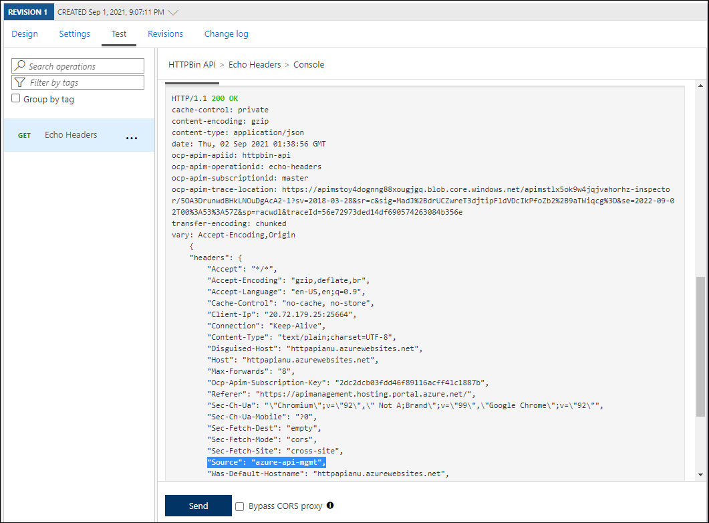
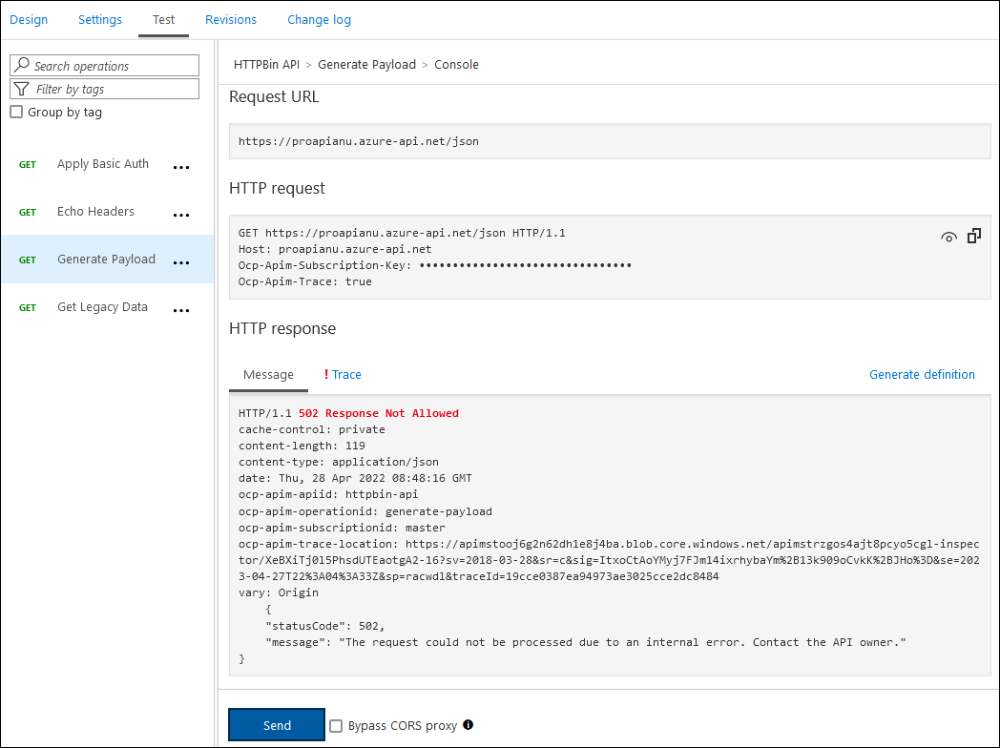

---
lab:
    az204Title: '实验室 08：使用 Azure 服务创建多层解决方案'
    az020Title: '实验室 08：使用 Azure 服务创建多层解决方案'
    az204Module: '模块 08：实现 API 管理'
    az020Module: '模块 08：实现 API 管理'
---

# 实验室 08： 使用 Azure 服务创建多层解决方案

## Microsoft Azure 用户界面

鉴于 Microsoft 云工具的动态特性，Azure UI 在此培训内容开发后可能会发生更改。因此，实验室说明和实验室步骤可能无法完全一致。

当社区提醒我们进行必要的更改时，Microsoft 会更新本培训课程。然而，云更新的发生频率很高，因此你可能会遇到 UI 已更改但本培训内容尚未更新的情况。**如果发生这种情况，请适应这些更改，并根据需要在实验室中熟悉这些更改。**


## 说明

### 准备工作

#### 登录实验室环境

使用以下凭据登录 Windows 10 虚拟机 (VM)：
    
-   用户名：**Admin**

-   密码： **Pa55w.rd**

> **备注**：你的讲师将提供连接到虚拟实验室环境的说明。

#### 查看已安装的应用程序

在你的 Windows 10 桌面上找到任务栏。任务栏里有本实验室中你将使用的应用程序的图标：
    
-   Microsoft Edge

## 体系结构图


### 练习 1： 利用 Docker 容器映像创建 Azure 应用服务资源

#### 任务 1：打开 Azure 门户

1.  在任务栏上，选择 **Microsoft Edge** 图标。

1.  在打开的浏览器窗口中，浏览到 Azure 门户 ([portal.azure.com](https://portal.azure.com))，然后使用你将在本实验室中使用的帐户登录。

    > **备注**：第一次登录 Azure 门户时，你会看到一个门户教程。选择“**开始使用**”，跳过教程并开始使用门户。

#### 任务 2： 利用 httpbin 容器映像使用 Azure 应用服务资源创建 web 应用

1.  在 Azure 门户中，使用“**搜索资源、服务和文档**”文本框搜索“**应用服务**”，并在结果列表中选择“**应用服务**”。

1.  在“**应用服务**”边栏选项卡中，选择“**+ 新建**”。

1.  在“**创建 Web 应用**”边栏选项卡的“**基本信息**”选项卡上，执行以下操作：
    
    | 设置                         | 操作                                                       |
    | ------------------------------- | ------------------------------------------------------------ |
    | “**订阅**”下拉列表 | 保留默认值。                                    |
    | “**资源组**”部分      | 选择“**新建**”，输入 **ApiService**，然后选择“**确定**”。 |
    | “**名称**”文本框               | 输入“**httpapi** *[yourname]*”。                        |
    | “**发布**”部分             | 选择“**Docker 容器**”。                                  |
    | “**操作系统**”部分    | 选择“**Linux**”。                                             |
    | “**区域**”下拉列表      | 选择可在其中部署 Azure Web 应用的任何 Azure 区域。     |
    | “**应用服务计划**”部分    | 选择“**新建**”，在“**名称**”文本框中输入值 **ApiPlan**，然后选择“**确定**”。 |
    | “**SKU 和大小**”部分        | 选择“**更改大小**”，在“**规格选择器**”边栏选项卡上，依次选择“**查看其他选项**”、“**S1**”和“**应用**”。 |

1.  选择“**下一步: Docker >**”。

1.  在“**Docker**”选项卡上，执行以下操作，然后选择“**查看 + 创建**”：

    | 设置                         | 操作                                     |
    | ------------------------------- | ------------------------------------------ |
    | “**选项**”下拉列表      | 选择“**单个容器**”。           |
    | “**映像源**”下拉列表 | 选择“**Docker Hub**”。                 |
    | “**访问类型**”下拉列表  | 选择“**公共**”。                  |
    | “**映像和标记**”文本框      | 输入“**kennethreitz/httpbin:latest**”。 |

1.  在“**查看 + 创建**”选项卡中，查看在上述步骤中选择的选项。

1.  选择“**创建**”，使用指定的配置创建 Web 应用。

    > **备注**：等待创建任务完成，再继续本实验室。

#### 任务 3：测试 httpbin Web 应用程序

1.  在 Azure 门户中，使用“**搜索资源、服务和文档**”文本框搜索“**应用服务**”，并在结果列表中选择“**应用服务**”。

1.  在“**应用服务**”边栏选项卡上，选择新创建的 Web 应用。

1.  在显示新创建的应用属性的边栏选项卡上，选择“**浏览**”。

1.  在 Web 应用程序中，执行以下操作：

    a.  选择“**响应格式**”。

    b.  选择“**GET/html**”。

    c.  选择“**试用**”。

    以下屏幕截图显示了 Web 应用程序的“**试用**”部分。

    

    d.  选择“**执行**”。

    e.  查看“**响应正文**”和“**响应头**”文本框的值。

    f.  查看“**请求 URL**”文本框的值。

1.  在 Web 应用程序中，执行以下操作：

    a.  选择“**动态数据**”。

    b.  选择“**GET/bytes/{n}**”。

    c.  选择“**试用**”。

    d.  在“**n**”文本框中，输入 **25**。

    e.  选择“**执行**”。

    f.  查看“**响应正文**”和“**响应头**”文本框的值。

    g.  选择“**下载文件**”，文件下载完成后，用记事本打开，查看文件内容，然后关闭该文件。

    > **备注**：该文件中包含一连串随机生成的字节。

    以下屏幕截图显示了 Web 应用程序的“动态数据”部分。
  
    

1.  在 Web 应用程序中，执行以下操作：

    a.  选择“**状态代码**”。

    b.  选择“**GET/status/{codes}**”。

    c.  选择“**试用**”。

    d.  在“**代码**”文本框中，输入 **404**。

    e.  选择“**执行**”。

    f.  查看“**服务器响应**”，可以看到其中包含“**错误: 未找到**”条目。
     
1.  关闭显示 Web 应用程序的浏览器窗口。

1.  切换回显示 **httpapi**_[yourname]_ Web 应用的浏览器窗口。

1.  在“**设置**”部分，选择“**属性**”链接。

1.  在“**属性**”部分中，记录“**URL**”链接的值。稍后你将在本实验室中使用此值将请求发送到相应的 API。

#### 回顾

在本练习中，你使用源自 Docker Hub 的容器映像创建了一个新的 Azure Web 应用。

### 练习 2：使用 Azure API 管理生成 API 代理层级

#### 任务 1：创建 API 管理资源

1.  在 Azure 门户中，使用“**搜索资源、服务和文档**”文本框搜索“**API 管理服务**”，并在结果列表中选择“**API 管理服务**”。

1.  在“**API 管理服务**”边栏选项卡中，选择“**+ 创建**”。

1.  在“**创建 API 管理**”边栏选项卡上执行以下操作，然后选择“**查看 + 创建**”：

    
    | 设置                           | 操作                                                       |
    | --------------------------------- | ------------------------------------------------------------ |
    | “**订阅**”下拉列表    | 保留默认值。                                    |
    | “**资源组**”部分        | 选择你之前在本实验室中创建的 **ApiService** 组。 |
    | “**资源名称**”文本框        | 输入“**proapi** *[yourname]*”。                               |
    | “**区域**”列表                   | 选择你在上一个练习中选择的同一区域。   |
    | “**组织名称**”文本框    | 输入“**Contoso**”。                                           |
    | “**管理员电子邮件**”文本框 | 输入 `admin@contoso.com`。                                    |
    | “**定价层**”下拉列表   | “**消耗(99.95% SLA)**”。                                |

    以下屏幕截图显示了 Web 应用程序的“**创建 API 管理**”边栏选项卡上已配置的设置。
    
    

1.  在“**查看 + 创建**”选项卡中，查看你在上一步中指定的选项，然后选择“**创建**”。

    > **备注**：等待创建任务完成，再继续本实验室。

#### 任务 2：定义一个新的 API

1.  在 Azure 门户中，使用“**搜索资源、服务和文档**”文本框搜索“**API 管理服务**”，并在结果列表中选择“**API 管理服务**”。

1.  在“**API 管理服务**”边栏选项卡上，选择新创建的 API 管理服务。

1.  在“**API 管理服务**”边栏选项卡的“**API**”部分，选择“**API**”。

1.  在“**定义新的 API**”部分，选择“**HTTP**”。

1.  在“**创建空白 API**”窗口中，执行以下操作，然后选择“**创建**”：
    
    | 设置                           | 操作                                                       |
    | --------------------------------- | ------------------------------------------------------------ |
    | “**显示名称**”文本框    | 输入“**HTTPBin API**”。                                    |
    | “**名称**”文本框 | 输入“**httpbin-api**”。 |
    | “**Web 服务 URL**”文本框        | 输入你之前在本实验室中复制的 Web 应用的 URL。**备注**：确保该 URL 以 https:// 前缀开头。                              |
    | “**API URL 前缀**”文本框   | 将其留空。  |
 
    以下屏幕截图显示了 Web 应用程序的“**创建空白 API**”窗口上已配置的设置。

    

    > **备注**：等待新 API 创建完毕。

1.  在“**设计**”选项卡中，选择“**+ 添加操作**”。

1.  在“**添加操作**”部分，执行以下操作，然后选择“**保存**”：


    | 设置                           | 操作                                                       |
    | --------------------------------- | ------------------------------------------------------------ |
    | “**显示名称**”文本框    | 输入“**回显标头**”。              |
    | “**名称**”文本框 | 验证其值是否设置为“**echo-headers**”。|
    | “**URL**”列表        | 选择“**GET**”。              |
    | “**URL**”文本框   | 输入“**/**”。  |

    以下屏幕截图显示了“**添加操作**”部分已配置的设置。
    
    

    
1.  回到“**设计**”选项卡，在操作列表中选择“**回显标头**”。

1.  在“**设计**”部分的“**入站处理**”磁贴中，选择“**+ 添加策略**”。

1.  在“**添加入站策略**”部分，选择“**设置标头**”磁贴。

1.  在“**设置标头**”部分，执行以下操作，然后选择“**保存**”：
    
    | 设置                           | 操作                                                       |
    | --------------------------------- | ------------------------------------------------------------ |
    | “**名称**”文本框    | 输入“**源**”。                          |
    | “**值**”文本框 | 选择列表，选择“**添加值**”，然后输入 **azure-api-mgmt**。 |
    | “**操作**”列表        | 选择“**追加**”。              |

    以下屏幕截图显示了“**设计**”部分已配置的设置。

    

1.  回到“**设计**”选项卡，在操作列表中选择“**回显标头**”。

1.  在“**回显标头**”的“**设计**”部分的“**后端**”磁贴中，选择铅笔图标。

1.  在“**后端**”部分，执行以下操作，然后选择“**保存**”：

    | 设置                           | 操作                                                       |
    | --------------------------------- | ------------------------------------------------------------ |
    | “**服务 URL**”部分    | 选中“**替代**”复选框。|
    | “**服务 URL**”文本框 | 将值 **/headers** 追加到其当前值。**备注**：例如，如果当前值为 `http://httpapi[yourname].azurewebsites.net`，新值将是 `http://httpapi[yourname].azurewebsites.net/headers`。|
    
1.  回到“**设计**”选项卡，在操作列表中选择“**回显标头**”，然后选择“**测试**”选项卡。

1.  在“**回显标头**”部分，选择“**发送**”。

    以下屏幕截图显示了“**回显标头**”部分已配置的设置。

    
    
1.  查看 API 请求的结果。

    > **备注**：验证是否有许多标头作为请求的一部分回显到响应中。它们应包括你在此任务中创建的新“**源**”标头。
     
    以下屏幕截图显示了对“**回显标头**”请求的响应。

    
     
1.  选择“**设计**”选项卡，返回操作列表。

#### 任务 3：处理 API 响应

1.  在“**设计**”选项卡中，选择“**+ 添加操作**”。

1.  在“**添加操作**”部分，执行以下操作，然后选择“**保存**”：

    | 设置                           | 操作                                                       |
    | --------------------------------- | ------------------------------------------------------------ |
    | “**显示名称**”文本框    | 输入“**获取旧数据**”。|
    | “**名称**”文本框 | 验证其值是否设置为“**get-legacy-data**”。|
    | “**URL**”列表 | 验证其值是否设置为“**GET**”。|
    | “**URL**”文本框 | 输入“**/xml**”。|

1.  回到“**设计**”选项卡，在操作列表中选择“**获取旧数据**”。

1.  选择“**测试**”选项卡，然后选择“**发送**”。

1.  查看 API 请求的结果。

    > **备注**：此时，结果应为 XML 格式。

    以下屏幕截图显示了 API 请求的结果。
    
    

    
1.  选择“**设计**”选项卡，然后选择“**获取旧数据**”。

1.  在“**设计**”窗格的“**入站处理**”部分，选择“**添加策略**”。
    
    以下屏幕截图显示了“**出站处理**”部分。
    
    
    
1.  在“**添加出站策略**”部分，选择“**其他策略**”磁贴。

1.  在策略代码编辑器中，找到以下 XML 内容块：

    ```
    <outbound>
        <base />
    </outbound>
    ```

1.  使用以下 XML 替换该 XML 块：

    ```
    <outbound>
        <base />
        <xml-to-json kind="direct" apply="always" consider-accept-header="false" />
    </outbound>
    ```

1.  在策略代码编辑器中，选择“**保存**”。

1.  回到“**设计**”选项卡，在操作列表中选择“**获取旧数据**”，然后选择“**测试**”。

1.  在“**获取旧数据**”部分，选择“**发送**”。

1.  查看 API 请求的结果。

    > **备注**：新结果采用 JavaScript 对象表示法 (JSON) 格式。

1.  在“**HTTP 响应**”部分，执行以下操作：

    1.  选择“**跟踪**”。

    1.  查看“**后端**”和“**出站**”文本框中的内容，可以看到它们包含相应 API 操作的详细信息及其计时信息。

1.  在“**设计**”选项卡中，选择“**+ 添加操作**”。

1.  在“**添加操作**”部分，执行以下操作，然后选择“**保存**”：

    | 设置                           | 操作                                                       |
    | --------------------------------- | ------------------------------------------------------------ |
    | “**显示名称**”文本框    | 输入“**生成有效负载**”。|
    | “**名称**”文本框 | 验证其值是否设置为“**generate-payload**”。|
    | “**URL**”列表 | 选择“**GET**”。|
    | “**URL**”文本框 | 输入“**/bytes/{n}**”。|
    | “**模板参数**”部分 | 在“**类型**”文本框中，输入 **int**。|


1.  回到“**设计**”选项卡，在操作列表中选择“**生成有效负载**”。

1.  在“**设计**”部分的“**出站处理**”磁贴中，选择“**+ 添加策略**”。

1.  在“**添加出站策略**”部分，选择“**验证内容**”磁贴。

1.  在“**出站处理**”部分，执行以下操作，然后选择“**保存**”：
    
    | 设置                           | 操作                                                       |
    | --------------------------------- | ------------------------------------------------------------ |
    | “**未指定的内容类型操作**”下拉列表    | 选择“**忽略**”。|
    | “**最大有效负载大小(以字节为单位)**”文本框 | 输入 **128**。|
    | “**大小超出操作**”下拉列表| 选择“**阻止**”。|
    | “**错误变量名称**”文本框 | 输入“**validationErrors**”。|
    

1.  回到“**设计**”选项卡，在操作列表中选择“**生成有效负载**”，然后选择“**测试**”选项卡。

1.  在“**生成有效负载**”部分的“**模板参数**”子部分，在 **n** 参数的“**值**”文本框中输入 **512**，然后选择“**发送**”。

1.  查看 API 请求的结果。

    > **备注**：你应会收到“HTTP/1.1 502 响应不允许”消息，因为有效负载的大小超出了出站策略定义的限制。

     
       

     
1.  选择“**设计**”选项卡，然后选择“**生成有效负载**”。

1.  在“**出站处理**”磁贴中，选择铅笔图标。

1.  在“**最大有效负载大小(以字节为单位)**”文本框中，将 **128** 替换为 **1024**。

1.  选择“**保存**”。

1.  回到“**设计**”选项卡，在操作列表中选择“**生成有效负载**”，然后选择“**测试**”选项卡。

1.  在“**生成有效负载**”部分的“**模板参数**”子部分，在 **n** 参数的“**值**”文本框中输入 **512**，然后选择“**发送**”。

1.  查看 API 请求的结果。

    > **备注**：你应会收到“HTTP/1.1 200 正常”响应消息，因为有效负载的大小现在出站策略定义的限制内。

       

#### 任务 4：处理 API 请求

1.  在“**设计**”选项卡中，选择“**+ 添加操作**”。

1.  在“**添加操作**”部分，执行以下操作，然后选择“**保存**”：

    | 设置                           | 操作                                                       |
    | --------------------------------- | ------------------------------------------------------------ |
    | “**显示名称**”文本框    | 输入“**修改状态代码**”。|
    | “**名称**”文本框 | 验证其值是否设置为“**modify-status-code**”。|
    | “**URL**”列表 | 选择“**GET**”。|
    | “**URL**”文本框 | 输入“**/status/404**”。|

1.  回到“**设计**”选项卡，在操作列表中选择“**修改状态代码**”。

1.  在“**设计**”部分的“**入站处理**”磁贴中，选择“**+ 添加策略**”。

1.  在“**添加入站策略**”部分，选择“**重写 URL**”磁贴。

1.  在“**重写 URL**”部分，执行以下操作：
       
    a.  在“**后端**”文本框中，输入 **/status/200**。
    
    b.  选择“**保存**”。

1.  回到“**设计**”选项卡，在操作列表中选择“**修改状态代码**”，然后选择“**测试**”选项卡。
    
1.  在“**修改状态代码**”部分，选择“**发送**”。

1.  查看 API 请求的结果。

    > **备注**：验证该请求是否返回了“**HTTP/1.1 200 正常**”响应。
   
#### 回顾

在本练习中，你在应用服务资源与任何希望对其 API 进行查询的开发人员之间构建了一个代理层。

### 练习 3：清理订阅

#### 任务 1：打开 Azure Cloud Shell

1.  在 Azure 门户中，选择 **Cloud Shell** 图标 ，打开新的 Bash 会话。如果 Cloud Shell 默认为 PowerShell 会话，请选择“**PowerShell**”，然后在下拉菜单中选择“**Bash**”。

      > **备注**：首次启动 **Cloud Shell** 时，系统会提示选择 **Bash** 或 **PowerShell**，请选择“**PowerShell**”。如果显示“**未挂载存储**”消息，请选择你在本实验室中使用的订阅，然后选择“**创建存储**”。

#### 任务 2：删除资源组

1.  在“**Cloud Shell**”窗格中运行以下命令，以删除“**ApiService**”资源组：

    ```
    az group delete --name ApiService --no-wait --yes
    ```
    
     > **备注**：该命令以异步方式执行（由 *--no-wait* 参数确定），因此，尽管可立即在同一 Bash 会话中运行另一个 Azure CLI 命令，但实际上要花几分钟才能删除资源组。
  
1.  关闭门户中的 **Cloud Shell** 窗格。

#### 任务 3：关闭活动应用程序

1.  关闭当前正在运行的 Microsoft Edge 应用程序。

#### 回顾

在本练习中，你通过删除本实验室中使用的资源组清理订阅。
