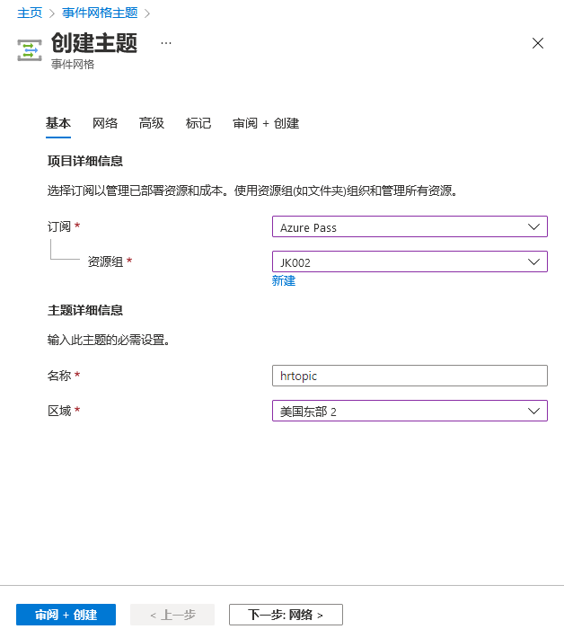

---
lab:
  az204Title: 'Lab 09: Publish and subscribe to Event Grid events'
  az020Title: 'Lab 09: Publish and subscribe to Event Grid events'
  az204Module: 'Module 09: Develop event-based solutions'
  az020Module: 'Module 09: Develop event-based solutions'
---

# <a name="lab-09-publish-and-subscribe-to-event-grid-events"></a>实验室 09：发布和订阅事件网格事件

## <a name="microsoft-azure-user-interface"></a>Microsoft Azure 用户接口

鉴于 Microsoft 云工具的动态特性，Azure UI 在此培训内容开发后可能会发生更改。 因此，实验说明和实验步骤可能无法正确对应。

我们发现社区进行了必要更改时，Microsoft 会更新此培训课程。 但是，云更新经常发生，因此在此培训内容更新之前，可能会发生 UI 更改。 如果发生这种情况，请适应这些更改，并根据需要在实验室中熟悉这些更改。

## <a name="instructions"></a>说明

### <a name="before-you-start"></a>开始之前

#### <a name="sign-in-to-the-lab-environment"></a>登录到实验室环境

使用以下凭据登录 Windows 10 虚拟机 (VM)：

- 用户名：Admin

- 密码：Pa55w.rd

> **注意**：你的讲师将提供连接到虚拟实验室环境的说明。

#### <a name="review-the-installed-applications"></a>查看已安装的应用程序

在你的 Windows 10 桌面上找到任务栏。 任务栏里有本实验室中你将使用的应用程序的图标，包括：

- Microsoft Edge

- Microsoft Visual Studio Code

## <a name="architecture-diagram"></a>体系结构关系图


### <a name="exercise-1-create-azure-resources"></a>练习 1：创建 Azure 资源

#### <a name="task-1-open-the-azure-portal"></a>任务 1：打开 Azure 门户

1. 在任务栏上，选择 Microsoft Edge 图标。

1. 在打开的浏览器窗口中，浏览到 Azure 门户 (<https://portal.azure.com>)，然后使用你将用于此实验的帐户登录。

    > **注意**：第一次登录 Azure 门户时，你会看到一个门户教程。 选择“开始使用”，以跳过导览并开始使用门户。

#### <a name="task-2-open-azure-cloud-shell"></a>任务 2：打开 Azure Cloud Shell

1. 在 Azure 门户中，选择“Cloud Shell”图标  以打开一个新的 Bash 会话。 如果 Cloud Shell 默认为 PowerShell 会话，请选择“PowerShell”，然后在下拉菜单中选择“Bash” 。

    > **注意**：如果这是你第一次启动 Cloud Shell，当系统提示你选择“Bash”或“PowerShell”时，请选择“Bash”。    当出现消息“未安装存储”时，请选择你在本实验中使用的订阅，然后选择“创建存储”。 

1. 在 Azure 门户中，在 Cloud Shell 命令提示符下输入以下命令，以获取 Azure 命令行接口 (Azure CLI) 工具的版本：

    ```bash
    az --version
    ```

#### <a name="task-3-review-the-microsofteventgrid-provider-registration"></a>任务 3：查看 Microsoft.EventGrid 提供程序注册

1. 在 CLoud Shell 窗格中，运行以下命令以获取 Azure CLI 根级别的子组和命令列表：

    ```bash
    az --help
    ```

1. 在 CLoud Shell 窗格中，运行以下命令以获取可用于资源提供者的命令列表：

    ```bash
    az provider --help
    ```

1. 在 CLoud Shell 窗格中运行以下命令，列出所有当前已注册的提供程序：

    ```bash
    az provider list
    ```

1. 在 CLoud Shell 窗格中，运行以下命令以仅列出当前注册的提供程序的名称空间：

    ```bash
    az provider list --query "[].namespace"
    ```

1. 在 CLoud Shell 窗格中，查看当前已注册的提供程序的列表。 请注意，Microsoft.EventGrid 提供程序当前包含在提供程序列表中。

1. 关闭 Cloud Shell 窗格。

#### <a name="task-4-create-a-custom-event-grid-topic"></a>任务 4：创建自定义事件网格主题

1. 在 Azure 门户的导航窗格上，选择“创建资源”。

1. 在“创建资源”窗格的“搜索服务和市场”文本框中，输入“事件网格主题”  ，然后按 Enter 键。

1. 在“市场”搜索结果边栏选项卡上，选择“事件网格主题”结果，然后选择“创建”  。

1. 在“创建主题”边栏选项卡的“基本”选项卡上，执行以下操作，然后选择“高级”选项卡  ：

    | 设置 | 操作 |
    | -- | -- |
    | “订阅”下拉列表  | 保留默认值 |
    | “资源组”下拉列表 | 选择“新建”，输入“PubSubEvents”，然后选择“确定”   |
    | “名称”文本框 | 输入“hrtopic [yourname]” |
    | “区域”下拉列表 | 选择“美国东部” |

   以下屏幕截图显示了“基本”选项卡上的配置设置。

   

1. 在“高级”选项卡的“事件架构”下拉列表中，选择“事件网格架构”，然后选择“查看 + 创建”   。

1. 在“查看 + 创建”选项卡中，查看在上述步骤中选择的选项。

1. 选择“创建”以使用指定配置创建事件网格主题。
  
    > **注意**：等待 Azure 完成创建主题，再继续本实验室操作。 创建主题时会收到通知。

#### <a name="task-5-deploy-the-azure-event-grid-viewer-to-a-web-app"></a>任务 5：将 Azure 事件网格查看器部署到 Web 应用

1. 在 Azure 门户的导航窗格上，选择“创建资源”。

1. 在“创建资源”窗格的“搜索服务和市场”文本框中，输入“Web 应用”  ，然后按 Enter 键。

1. 在“市场”搜索结果边栏选项卡上，选择“Web 应用”结果，然后选择“创建”  。

1. 在“创建 Web 帐户”窗格的“基本信息”选项卡上，执行以下操作，然后选择“下一步：  **Docker**：

   | 设置 | 操作 |
   | -- | -- |
   | “订阅”下拉列表 | 保留默认值 |
   | “资源组”下拉列表 | 选择列表中的“PubSubEvents” |
   | “名称”文本框  | 输入“eventviewer[yourname]” |
   | “发布”部分 | 选择“Docker 容器” |
   | “操作系统”部分 | 选择“Linux” |
   | “区域”下拉列表 | 选择“美国东部” |
   | “Linux 计划(美国东部)”部分 | 选择“新建”，在“名称”文本框中输入“EventPlan”，然后选择“确定”    |
   | “SKU 和大小”部分 | 保留默认值 |

   以下屏幕截图显示了“创建 Web 应用”窗格上配置的设置。

   

1. 在“Docker”选项卡上，执行以下操作，然后选择“查看 + 创建” ：

    | 设置 | 操作 |
    | -- | -- |
    | “选项”下拉列表 | 选择“单个容器” |
    | “映像源”下拉列表 | 选择“Docker 中心” |
    | “访问权限类型”下拉列表 | 选择“公共” |
    | “映像和标记”文本框 | 输入 microsoftlearning/azure-event-grid-viewer:latest |

   以下屏幕截图显示了“Docker”选项卡上配置的设置。

   

1. 在“查看 + 创建”选项卡中，查看在上述步骤中选择的选项。

1. 选择“创建”，使用指定的配置创建 Web 应用。
  
    > **注意**：等待 Azure 完成 Web 应用的创建后再继续本实验室。 会在应用创建完毕后收到通知。

#### <a name="review"></a>审阅

在本练习中，你创建了在本实验剩余时间里将用到的“事件网格主题”和“Web 应用”。

### <a name="exercise-2-create-an-event-grid-subscription"></a>练习 2：创建事件网格订阅

#### <a name="task-1-access-the-event-grid-viewer-web-application"></a>任务 1：访问事件网格查看器 Web 应用程序

1. 在 Azure 门户的导航窗格中，选择“资源组”。

1. 在“资源组”边栏选项卡上，选择“PubSubEvents”资源组 。

1. 在“PubSubEvents”边栏选项卡上，选择 eventviewer [yourname] Web 应用 。

1. 在“应用服务”边栏选项卡的“设置”部分，选择“属性”链接  。

1. 在“属性”部分，记录 URL 链接的值 。 你将在稍后的实验室中使用此值。

1. 选择“概述”，然后选择“浏览” 。

1. 查看当前运行的“Azure 事件网格查看器”Web 应用程序。 在接下来的实验室中，请保持 Web 应用程序的运行状态。

    > **注意**：此 Web 应用程序将在事件发送到其终结点时实时更新。 你将使用此应用程序在整个实验室中监视事件。

1. 返回显示 Azure 门户的当前打开的浏览器窗口。

#### <a name="task-2-create-a-new-subscription"></a>任务 2：创建新订阅

1. 在 Azure 门户的导航窗格中，选择“资源组”。

1. 在“资源组””边栏选项卡中，选择之前在本实验室中创建的“PubSubEvents”资源组 。

1. 在“PubSubEvents”边栏选项卡上，选择你之前在本实验室中创建的 hrtopic [yourname] 事件网格主题 。

1. 在“事件网格主题”边栏选项卡，选择“+ 事件订阅” 。

1. 在“创建事件订阅”边栏选项卡中，执行以下操作，然后选择“创建” ：

    | 设置 | 操作 |
    | -- | -- |
    | “名称”文本框  | 输入“basicsub” |
    | “事件架构”下拉列表 | 选择“事件网格架构” |
    | “终结点类型”下拉列表 | 选择“Web Hook” |
    | **终结点** | 选择“选择终结点”。 在“订阅服务器终结点”文本框中，输入之前记录的 Web 应用 URL 值，确保它使用 https:// 前缀，添加后缀 /api/updates，然后选择“确认选择”    。 例如，如果 Web 应用 URL 值为 ``http://eventviewerstudent.azurewebsites.net/``，则订阅服务器终结点为 ``https://eventviewerstudent.azurewebsites.net/api/updates``  |

   以下屏幕截图显示了“创建事件订阅”边栏选项卡上配置的设置。

   

    > **注意**：等待 Azure 完成创建订阅再继续本实验室操作。 创建订阅时会收到通知。

#### <a name="task-3-observe-the-subscription-validation-event"></a>任务 3：观察订阅验证事件

1. 返回该浏览器窗口，其中显示“Azure 事件网格查看器”Web 应用程序。

1. 查看在订阅创建过程中创建的 Microsoft.EventGrid.SubscriptionValidationEvent 事件。

1. 选择事件并查看其 JSON 内容。

1. 返回到当前打开显示 Azure 门户的浏览器窗口。

#### <a name="task-4-record-subscription-credentials"></a>任务 4：记录订阅凭据

1. 在 Azure 门户的导航窗格中，选择“资源组”。

1. 在“资源组””边栏选项卡中，选择之前在本实验室中创建的“PubSubEvents”资源组 。

1. 在“PubSubEvents”边栏选项卡上，选择你之前在本实验室中创建的 hrtopic [yourname] 事件网格主题 。

1. 在“事件网格主题”边栏选项卡中，记录“主题终结点”字段的值 。 你将在稍后的实验室中使用此值。

1. 在“设置”类别中，选择“访问密钥”链接 。

1. 在“访问密钥”部分，记录“密钥 1”文本框的值 。 你将在稍后的实验室中使用此值。

#### <a name="review"></a>审阅

在本练习中，你创建了一个新的订阅并进行了注册验证，然后记录了将新事件发布到该主题所需的凭据。

### <a name="exercise-3-publish-event-grid-events-from-net"></a>练习 3：在 .NET 上发布事件网格事件

#### <a name="task-1-create-a-net-project"></a>任务 1：创建 .NET 项目

1. 在“启动”屏幕上，选择“Visual Studio Code”磁贴 。

1. 在“文件”**** 菜单中，选择“打开文件夹”****。

1. 在打开的文件资源管理器窗口中，浏览到 Allfiles (F):\\Allfiles\\Labs\\09\\Starter\\EventPublisher，然后选择“选择文件夹”  。

1. 在 Visual Studio Code 窗口中，激活“资源管理器”窗格的快捷菜单，然后选择“在集成终端中打开”  。

1. 运行以下命令，在当前文件夹中创建一个名为 EventPublisher 的新 .NET 项目：

    ```powershell
    dotnet new console --framework net6.0 --name EventPublisher --output . 
    ```

    > **注意**：dotnet new 命令将在与项目同名的文件夹中创建一个新的“控制台”项目 。

1. 运行以下命令，从 NuGet 导入 Azure.Messaging.EventGrid 版本 4.10.0：

    ```powershell
    dotnet add package Azure.Messaging.EventGrid --version 4.11.0
    ```
    

    > **注意**：dotnet add package 命令将从 NuGet 添加 Microsoft.ApplicationInsights.PerfCounterCollector 。 有关详细信息，请转到 [Azure.Messaging.EventGrid](https://www.nuget.org/packages/Azure.Messaging.EventGrid/4.10.0)。

    > 运行以下命令来构建 .NET Web 应用程序： 选择“终止终端”或者“回收站”图标以关闭当前打开的终端和所有关联的进程 。


1. 任务 2：修改 Program 类以连接到事件网格

    ```powershell
    dotnet build
    ```

1. 在“Visual Studio Code”窗口的“资源管理器”窗格上，打开 Program.cs 文件。 ****   

#### <a name="task-2-modify-the-program-class-to-connect-to-event-grid"></a>在 Program.cs 文件的“代码编辑器”选项卡上，删除现有文件中的所有代码。 ****  

1. 添加以下代码行，通过从 NuGet 导入的“Azure.Messaging.EventGrid”包导入“Azure”和“Azure.Messaging.EventGrid”命名空间  ：

1. 添加以下代码行，为此文件将使用的内置命名空间添加 using 指令：

1. 输入以下代码，创建一个新的 Program 类：

    ```csharp
    using Azure;
    using Azure.Messaging.EventGrid;
    ```

1. 在“Program”类中，输入以下代码行以创建一个名为“topicEndpoint”的新字符串常数 ：

    ```csharp
    using System;
    using System.Threading.Tasks;
    ```

1. 更新 topicEndpoint 字符串常量，将其值设置为之前在本实验中记录的事件网格主题的主题终结点。 ****

    ```csharp
    public class Program
    {
    }
    ```

1. 在 Program 类中，输入以下代码行以创建一个名为 topicKey 的新字符串常量 ：

    ```csharp
    private const string topicEndpoint = "";
    ```

1. 通过将 topicKey 字符串常量的值设置为之前在本实验中记录的事件网格主题的密钥来更新它。 ****

1. 在 Program 类中，输入以下代码以创建新的异步 Main 方法 ：

    ```csharp
    private const string topicKey = "";
    ```

1. 查看“Program.cs”文件，现在应该包含以下代码行：

1. 任务 3：发布新事件

    ```csharp
    public static async Task Main(string[] args)
    {
    }
    ```

1. 在 Main 方法中，执行以下操作以将事件列表发布到你的主题终结点：

    ```csharp
    using Azure;
    using Azure.Messaging.EventGrid;
    using System;
    using System.Threading.Tasks;    
    public class Program
    {
        private const string topicEndpoint = "<topic-endpoint>";
        private const string topicKey = "<topic-key>";        
        public static async Task Main(string[] args)
        {
        }
    }
    ```

#### <a name="task-3-publish-new-events"></a>a.

1. 添加以下代码行，使用 topicEndpoint 字符串常量作为构造函数参数创建类型为 Uri 的新变量 endpoint  ：

    b. 添加以下代码行，使用 topicKey 字符串常量作为构造函数参数创建类型为 [AzureKeyCredential](https://docs.microsoft.com/dotnet/api/azure.azurekeycredential) 的新变量 credential  ：

    ```csharp
    Uri endpoint = new Uri(topicEndpoint); 
    ```

    c. 添加以下代码行，使用 endpoint 和 credential 变量作为构造函数参数创建类型为 [EventGridPublisherClient](https://docs.microsoft.com/dotnet/api/azure.messaging.eventgrid.eventgridpublisherclient) 的新变量 client   ：

    ```csharp
    AzureKeyCredential credential = new AzureKeyCredential(topicKey);
    ```

    d. 添加以下代码块，创建类型为 [EventGridEvent](https://docs.microsoft.com/dotnet/api/azure.messaging.eventgrid.eventgridevent) 的新变量 firstEvent，并使用示例数据填充该变量 ：

    ```csharp
    EventGridPublisherClient client = new EventGridPublisherClient(endpoint, credential);
    ```

    e. 添加以下代码块，创建类型为 [EventGridEvent](https://docs.microsoft.com/dotnet/api/azure.messaging.eventgrid.eventgridevent) 的新变量 secondEvent，并使用示例数据填充该变量 ：

    ```csharp
    EventGridEvent firstEvent = new EventGridEvent(
        subject: $"New Employee: Alba Sutton",
        eventType: "Employees.Registration.New",
        dataVersion: "1.0",
        data: new
        {
            FullName = "Alba Sutton",
            Address = "4567 Pine Avenue, Edison, WA 97202"
         }
     );
     ```

    f. 添加以下代码行以异步调用 [EventGridPublisherClient.SendEventAsync](https://docs.microsoft.com/dotnet/api/azure.messaging.eventgrid.eventgridpublisherclient.sendeventasync) 方法，将 firstEvent 变量用作参数：

     ```csharp
        EventGridEvent secondEvent = new EventGridEvent(
            subject: $"New Employee: Alexandre Doyon",
            eventType: "Employees.Registration.New",
            dataVersion: "1.0",
            data: new
            {
                FullName = "Alexandre Doyon",
                Address = "456 College Street, Bow, WA 98107"
            }
        );
     ```

    g. 添加以下代码行，在控制台显示“首个事件已发布”消息：

     ```csharp
     await client.SendEventAsync(firstEvent);
     ```

    h. 添加以下代码行以异步调用 [EventGridPublisherClient.SendEventAsync](https://docs.microsoft.com/dotnet/api/azure.messaging.eventgrid.eventgridpublisherclient.sendeventasync) 方法，将 secondEvent 变量用作参数 ：

     ```csharp
     Console.WriteLine("First event published");
     ```

    i. 添加以下代码行，在控制台显示“第二个事件已发布”消息：

     ```csharp
     await client.SendEventAsync(secondEvent);
     ```

    查看 Main 方法，现在应包括： 保存 Program.cs 文件。 ****

     ```csharp
     Console.WriteLine("Second event published");
     ```

1. 在 Visual Studio Code 窗口中，激活“资源管理器”窗格的快捷菜单，然后选择“在集成终端中打开”  。

    ```csharp
    public static async Task Main(string[] args)
    {
        Uri endpoint = new Uri(topicEndpoint);
        AzureKeyCredential credential = new AzureKeyCredential(topicKey);
        EventGridPublisherClient client = new EventGridPublisherClient(endpoint, credential);        
        EventGridEvent firstEvent = new EventGridEvent(
            subject: $"New Employee: Alba Sutton",
            eventType: "Employees.Registration.New",
            dataVersion: "1.0",
            data: new
            {
                FullName = "Alba Sutton",
                Address = "4567 Pine Avenue, Edison, WA 97202"
            }
        );
        EventGridEvent secondEvent = new EventGridEvent(
            subject: $"New Employee: Alexandre Doyon",
            eventType: "Employees.Registration.New",
            dataVersion: "1.0",
            data: new
            {
                FullName = "Alexandre Doyon",
                Address = "456 College Street, Bow, WA 98107"
            }
        );
        await client.SendEventAsync(firstEvent);
        Console.WriteLine("First event published");
        await client.SendEventAsync(secondEvent);
        Console.WriteLine("Second event published");
    }
    ```

1. 运行以下命令来运行 .NET Web 应用程序：

1. **注意**：如果有任何生成错误，请查看 Allfiles (F)：\\Allfiles\\Labs\\09\\Solution\\EventPublisher 文件夹中的 Program.cs 文件 。

1. 观察从当前正在运行的控制台应用程序中输出的成功消息。

    ```powershell
    dotnet run
    ```

    > 选择“终止终端”或者“回收站”图标以关闭当前打开的终端和所有关联的进程 。

1. 任务 4：查看发布的事件

1. 使用“Azure 事件网格查看器”Web 应用程序返回到浏览器窗口。

#### <a name="task-4-observe-published-events"></a>查看由控制台应用程序创建的 Employees.Registration.New 事件。

1. 选择任何事件并查看其 JSON 内容。

1. 返回到 Azure 门户。

1. 审阅

1. 在本练习中，你使用了 .NET 控制台应用程序将新事件发布到事件网格主题上。

#### <a name="review"></a>练习 4：清理订阅

任务 1：打开 Azure Cloud Shell

### <a name="exercise-4-clean-up-your-subscription"></a>在 Azure 门户中，选择“Cloud Shell”图标  以打开一个新的 Bash 会话。

#### <a name="task-1-open-azure-cloud-shell"></a>如果 Cloud Shell 默认为 PowerShell 会话，请选择“PowerShell”，然后在下拉菜单中选择“Bash” 。

1. **注意**：如果这是你第一次启动 Cloud Shell，当系统提示你选择“Bash”或“PowerShell”时，请选择“PowerShell”   。 当出现消息“未安装存储”时，请选择你在本实验室中使用的订阅，然后选择“创建存储” 。

    > 任务 2：删除资源组 在“Cloud Shell”窗格中，运行以下命令以删除“PubSubEvents”资源组 ：

#### <a name="task-2-delete-a-resource-group"></a>**注意**：该命令以异步方式运行（由 --nowait 参数确定），因此，尽管可立即在同一个 Bash 会话中运行另一个 Azure CLI 命令，但实际上要花几分钟才能删除资源组。

1. 关闭门户中的“Cloud Shell”窗格。

    ```bash
    az group delete --name PubSubEvents --no-wait --yes
    ```

     > 任务 3：关闭活动应用程序

1. 关闭当前正在运行的 Microsoft Edge 应用程序。

#### <a name="task-3-close-the-active-applications"></a>关闭当前正在运行的“Visual Studio Code”应用程序。

1. 审阅

1. 在本练习中，你通过删除本实验室中使用的资源组清理了订阅。

#### <a name="review"></a>Review

In this exercise, you cleaned up your subscription by removing the resource groups used in this lab.
