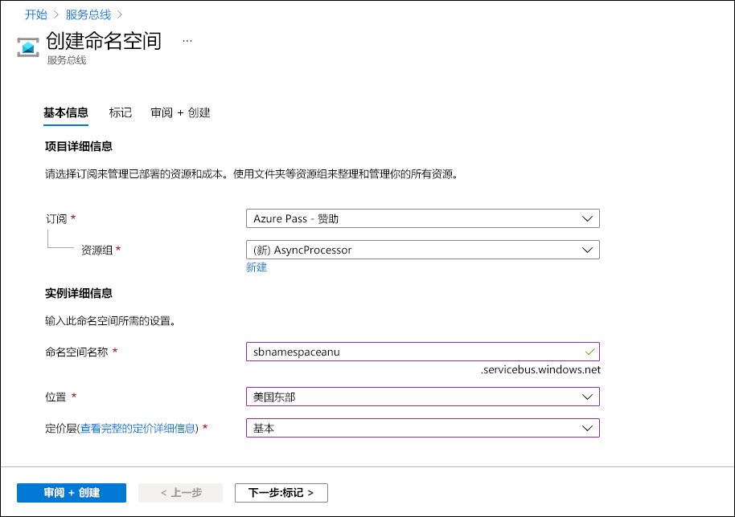
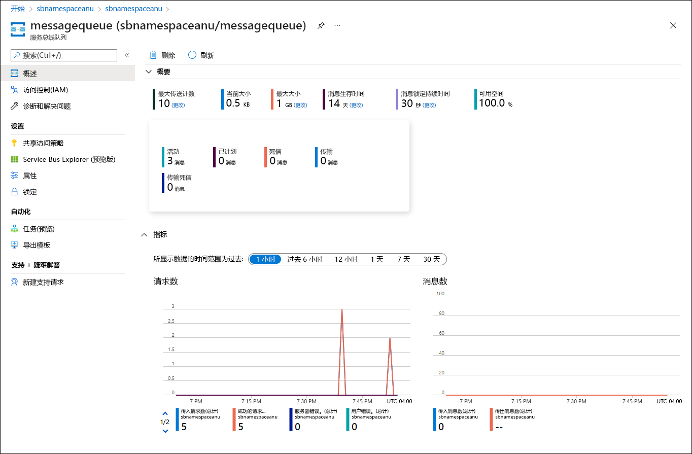
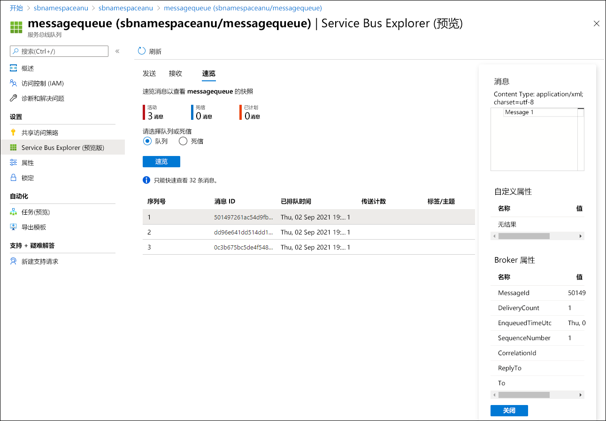

---
lab:
  az204Title: 'Lab 10: Asynchronously process messages by using Azure Service Bus Queues'
  az020Title: 'Lab 10: Asynchronously process messages by using Azure Service Bus Queues'
  az204Module: 'Module 10: Develop message-based solutions'
  az020Module: 'Module 10: Develop message-based solutions'
ms.openlocfilehash: b9134b549931690a3b6f0d596cab89f67b3f2a69
ms.sourcegitcommit: ddc44a8b5edc7ce2d93849bcab6c6a83dee1c99b
ms.translationtype: HT
ms.contentlocale: zh-CN
ms.lasthandoff: 04/29/2022
ms.locfileid: "144404839"
---
# <a name="lab-10-asynchronously-process-messages-by-using-azure-service-bus-queues"></a>实验室 10：使用 Azure 服务总线队列异步处理消息

## <a name="microsoft-azure-user-interface"></a>Microsoft Azure 用户接口

鉴于 Microsoft 云工具的动态特性，Azure UI 在此培训内容开发后可能会发生更改。 因此，实验说明和实验步骤可能无法正确对应。

我们发现社区进行了必要更改时，Microsoft 会更新此培训课程。 但是，云更新经常发生，因此在此培训内容更新之前，可能会发生 UI 更改。 如果发生这种情况，请适应这些更改，并根据需要在实验室中熟悉这些更改。

## <a name="instructions"></a>Instructions

### <a name="before-you-start"></a>开始之前

#### <a name="sign-in-to-the-lab-environment"></a>登录到实验室环境

使用以下凭据登录到 Windows 10 虚拟机 (VM)：
    
-   用户名：Admin

-   密码：Pa55w.rd

> **注意**：你的讲师将提供连接到虚拟实验室环境的说明。

#### <a name="review-the-installed-applications"></a>查看已安装的应用程序

在你的 Windows 10 桌面上找到任务栏。 任务栏里有本实验室中你将使用的应用程序的图标，包括：
    
-   Microsoft Edge

-   Visual Studio Code

## <a name="architecture-diagram"></a>体系结构关系图


### <a name="exercise-1-create-azure-resources"></a>练习 1：创建 Azure 资源

#### <a name="task-1-open-the-azure-portal"></a>任务 1：打开 Azure 门户

1.  在任务栏上，选择 Microsoft Edge 图标。

1.  在浏览器窗口中，浏览到 Azure 门户 ([portal.azure.com](https://portal.azure.com))，然后使用你将用于此实验的帐户登录。

    > **注意**：第一次登录 Azure 门户时，你会看到一个门户教程。 选择“开始使用”，以跳过导览并开始使用门户。

#### <a name="task-2-create-an-azure-service-bus-queue"></a>任务 2：创建 Azure 服务总线队列

1.  在 Azure 门户中，使用“搜索资源、服务和文档”文本框搜索“服务总线”，然后在结果列表中选择“服务总线”  。

1.  在“服务总线”边栏选项卡中，选择“+ 创建” 。

1.  在“创建命名空间”边栏选项卡的“基本信息”选项卡上，执行以下操作，并选择“查看 + 创建”  ：
        
    | 设置                           | 操作                                                       |
    | --------------------------------- | ------------------------------------------------------------ |
    | “订阅”下拉列表    |保留默认值。 |
    | “资源组”部分 | 选择“新建”，输入“AsyncProcessor”，然后选择“确定”  。|
    | “命名空间名称”文本框 | 输入 new-sbnamespace[yourname]。|
    | “区域”下拉列表 |  选择可在其中部署 Azure 服务总线的任何 Azure 区域。|
    | “定价层”下拉列表 |  选择“基本”。|

    以下屏幕截图显示了“创建命名空间”边栏选项卡的“基本信息”选项卡上配置的设置 。
    
       
     
1.  在“查看 + 创建”选项卡中，查看在上述步骤中选择的选项。

1.  选择“创建”以使用指定的配置创建服务总线命名空间 。

    > **注意**：等待创建任务完成，再继续操作本实验室。

1.  在“部署”边栏选项卡上，选择“转到资源”按钮，导航到新创建的“服务总线命名空间”边栏选项卡  。

1.  在“服务总线命名空间”边栏选项卡的“设置”部分中，选择“共享访问策略”  。

1.  在策略列表中，选择“RootManageSharedAccessKey”。

1.  在 SAS 策略上 **：在“RootManageSharedAccessKey”窗格中，在“主连接字符串”条目旁边，选择“复制到剪贴板”按钮，并记录复制的值**  。 你将在本实验室后面部分用到它。

    > **注意**：选择两个可用密钥中的哪一个都可以。 它们是可互换的。

1.  在“服务总线命名空间”边栏选项卡上的“实体”部分中，选择“队列”，然后选择“+ 新建队列”   。

1.  在“创建队列”边栏选项卡上，查看可用设置，在“名称”文本框中，输入“messagequeue”，然后选择“创建”   。

1.  选择“messagequeue”以显示服务总线队列的属性 。

1.  使浏览器窗口保持打开状态。 你将在本实验室后面部分再次用到它。

#### <a name="review"></a>审阅

在此练习中，你创建了一个 Azure 服务总线命名空间和一个服务总线队列（你将在实验室的剩余部分中使用它） 。

### <a name="exercise-2-create-a-net-core-project-to-publish-messages-to-a-service-bus-queue"></a>练习 2：创建 .NET Core 项目以将消息发布到服务总线队列

#### <a name="task-1-create-a-net-core-project"></a>任务 1：创建 .NET Core 项目

1.  在实验室计算机上，启动“Visual Studio Code”。

1.  在 Visual Studio Code 中的“文件”菜单上，选择“打开文件夹” 。

1.  在“打开文件夹”窗口中，浏览到 Allfiles (F):\\Allfiles\\Labs\\10\\Starter\\MessagePublisher，然后选择“选择文件夹”  。

1.  在“Visual Studio Code”窗口中，激活快捷菜单，然后选择“在集成终端中打开” 。

1.  在终端提示符下，运行以下命令以在当前文件夹中创建名为 MessagePublisher 的新 .NET 项目：

    ```
    dotnet new console --name MessagePublisher --output .
    ```

    > **注意**：dotnet new 命令将在与项目同名的文件夹中创建一个新的“控制台”项目 。

1.  运行以下命令，以从 NuGet 导入 7.2.1 版本的 Azure.Messaging.ServiceBus 包：

    ```
    dotnet add package Azure.Messaging.ServiceBus --version 7.2.1
    ```

    > **注意**：dotnet add package 命令将从 NuGet 添加 Azure.Messaging.ServiceBus 包 。 有关详细信息，请转到 [Azure.Messaging.ServiceBus](https://www.nuget.org/packages/Azure.Messaging.ServiceBus/)。

1.  在终端提示符下，运行以下命令以生成 .NET Core 控制台应用程序：

    ```
    dotnet build
    ```

1.  选择“终止终端”（“回收站”图标）以关闭终端窗格和任何关联的进程 。

#### <a name="task-2-publish-messages-to-an-azure-service-bus-queue"></a>任务 2：向 Azure 服务总线队列发布消息

1.  在“Visual Studio Code”窗口的“资源管理器”窗格中，打开“Program.cs”文件  。

1.  在 Program.cs 文件的“代码编辑器”选项卡中，删除现有文件中的所有代码。

1.  添加以下代码行，以方便使用将在此文件中引用的内置命名空间：

    ```csharp
    using System;
    using System.Threading.Tasks;
    ```

1.  添加以下代码以导入从 NuGet 导入的 Azure.Storage.Queues 包包含的 Azure.Messaging.ServiceBus 命名空间 ：

    ```csharp
    using Azure.Messaging.ServiceBus;
    ```
    
1.  输入以下代码以在 MessagePublisher 命名空间中创建新的 Program 类：

    ```csharp
    namespace MessagePublisher
    {
       public class Program
       {
       }
    }
    ```

1.  在 Program 类中，输入以下代码，创建一个名为 storageConnectionString 的字符串常量 ：

    ```csharp
    private const string storageConnectionString = "";
    ```

1.  通过将“storageConnectionString”字符串常量的值设置为你之前在本实验室中记录的“服务总线命名空间”的“主连接字符串”来更新该字符串常量 。

1.  输入以下代码以创建一个名为 queueName 的字符串常量，其值为 messagequeue，它与之前在本练习中创建的服务总线队列的名称相匹配 。

    ```csharp
    private const string queueName = "messagequeue";
    ```

1.  输入以下代码以创建一个整数常量，用于存储要发送到目标队列的消息数：

    ```csharp
    private const int numOfMessages = 3;
    ```

1.  输入以下代码以创建将连接到目标队列的服务总线客户端：

    ```csharp
    static ServiceBusClient client;
    ```

1.  输入以下代码以创建用于将消息发布到目标队列的服务总线发送程序：

    ```csharp
    static ServiceBusSender sender;
    ```

1.  输入以下代码以创建异步 Main 方法：

    ```csharp
    public static async Task Main(string[] args)
    {
    }
    ```

1.  查看 Program.cs文件，它现在应该包含以下代码。 请注意，`<storage-connection-string>` 占位符表示目标 Azure 服务总线命名空间的连接字符串：

    ```csharp
    using System;
    using System.Threading.Tasks;
    using Azure.Messaging.ServiceBus;
    namespace MessagePublisher
    {
        public class Program
        {
            private const string storageConnectionString = "<storage-connection-string>";
            private const string queueName = "messagequeue";
            private const int numOfMessages = 3;
            static ServiceBusClient client;
            static ServiceBusSender sender;
            public static async Task Main(string[] args)
            {
            }
        }
    }
    ```

1.  在 Main 方法中，添加以下代码以初始化类型 ServiceBusClient 的客户端，该客户端将提供服务总线命名空间与将负责发送消息的发送程序的连接 ：

    ```csharp
    client = new ServiceBusClient(storageConnectionString);
    sender = client.CreateSender(queueName);  
    ```

    > **注意**：服务总线客户端可以安全地缓存，还可用作应用程序生存期的单一实例。 这被视为定期发布和读取消息时的最佳做法之一。

1.  在 Main 方法中，添加以下代码以创建一个 ServiceBusMessageBatch 对象，该对象将允许你使用 TryAddMessage 方法将多个消息合并到一个批处理中  ：

    ```csharp
    using ServiceBusMessageBatch messageBatch = await sender.CreateMessageBatchAsync();
    ```

1.  在 Main 方法中，添加以下代码行以将消息添加到批中，并在消息大小超过批处理支持的限制时引发异常：

    ```csharp
    for (int i = 1; i <= numOfMessages; i++)
    {
        if (!messageBatch.TryAddMessage(new ServiceBusMessage($"Message {i}")))
        {
            throw new Exception($"The message {i} is too large to fit in the batch.");
        }
    }
    ```

1.  在 Main 方法中，添加以下代码行以创建 try 块，且发送程序将批处理中的消息异步发布到目标队列 ：

    ```csharp
    try
    {
        await sender.SendMessagesAsync(messageBatch);
        Console.WriteLine($"A batch of {numOfMessages} messages has been published to the queue.");
    }
    ```

1.  在 Main 方法中，添加以下代码行以创建 finally 块，以便异步释放发送程序对象和客户端对象，并释放任何网络和非托管资源  ：

    ```csharp
    finally
    {
        await sender.DisposeAsync();
        await client.DisposeAsync();
    }
    ```

1.  查看 Main 方法，该方法现在应包含以下代码： 

    ```csharp
    public static async Task Main(string[] args)
    {
        client = new ServiceBusClient(storageConnectionString);
        sender = client.CreateSender(queueName);
        using ServiceBusMessageBatch messageBatch = await sender.CreateMessageBatchAsync();
        for (int i = 1; i <= numOfMessages; i++)
        {
            if (!messageBatch.TryAddMessage(new ServiceBusMessage($"Message {i}")))
            {
                throw new Exception($"The message {i} is too large to fit in the batch.");
            }
        }
        try
        {
            await sender.SendMessagesAsync(messageBatch);
            Console.WriteLine($"A batch of {numOfMessages} messages has been published to the queue.");
        }
        finally
        {
            await sender.DisposeAsync();
            await client.DisposeAsync();
        }
    }
    ```

1.  保存 Program.cs 文件。

1.  在“Visual Studio Code”窗口中，激活快捷菜单，然后选择“在集成终端中打开” 。

1.  在终端提示符下，运行以下命令以启动 .NET Core 控制台应用：

    ```
    dotnet run
    ```

    > **注意**：如果遇到任何错误，请查看 Allfiles (F):\\Allfiles\\Labs\\10\\Solution\\MessagePublisher 文件夹中的 Program.cs 文件 。

1.  验证在终端提示符下显示的控制台消息是否指出已将三条消息批处理发布到队列。

1.  选择“终止终端”（“回收站”图标）以关闭终端窗格和任何关联的进程 。

1.  切换到 Microsoft Edge 浏览器，在 Azure 门户中显示服务总线队列 messagequeue。

1.  查看“Essentials”窗格，并注意该队列包含三个活动消息。

    以下屏幕截图显示服务总线队列指标和消息计数。
     
       
     
1.  在“设置”部分中，选择“服务总线资源管理器(预览)” 。

1.  在“服务总线资源管理器(预览)”边栏选项卡上，选择“速览”选项卡标题，然后在“速览”选项卡上选择“速览”按钮   。

1.  验证队列是否包含三条消息。

1.  选择第一条消息，并在“消息”窗格中查看其内容。

    以下屏幕截图显示第一条消息的内容。
         
       

     
1.  关闭“消息”窗格。

#### <a name="review"></a>审阅

在此练习中，你已配置了将消息发布到 Azure 服务总线队列的 .NET 项目。

### <a name="exercise-3-create-a-net-core-project-to-read-messages-from-a-service-bus-queue"></a>练习 3：创建 .NET Core 项目以读取服务总线队列的消息

#### <a name="task-1-create-a-net-project"></a>任务 1：创建 .NET 项目

1.  在实验室计算机上，启动“Visual Studio Code”。

1.  在 Visual Studio Code 中的“文件”菜单上，选择“打开文件夹” 。

1.  在“打开文件夹”窗口中，浏览到 Allfiles (F):\\Allfiles\\Labs\\10\\Starter\\MessageReader，然后选择“选择文件夹”  。

1.  在“Visual Studio Code”窗口中，激活快捷菜单，然后选择“在集成终端中打开” 。

1.  在终端提示符下，运行以下命令以在当前文件夹中创建名为 MessageReader 的新 .NET 项目：

    ```
    dotnet new console --name MessageReader --output .
    ```

1.  运行以下命令，以从 NuGet 导入 7.2.1 版本的 Azure.Messaging.ServiceBus 包：

    ```
    dotnet add package Azure.Messaging.ServiceBus --version 7.2.1
    ```

1.  在终端提示符下，运行以下命令以生成 .NET Core 控制台应用程序：

    ```
    dotnet build
    ```

1.  选择“终止终端”（“回收站”图标）以关闭终端窗格和任何关联的进程 。

#### <a name="task-2-read-messages-from-an-azure-service-bus-queue"></a>任务 2：从 Azure 服务总线队列读取消息

1.  在“Visual Studio Code”窗口的“资源管理器”窗格中，打开“Program.cs”文件  。

1.  在 Program.cs 文件的“代码编辑器”选项卡中，删除现有文件中的所有代码。

1.  添加 Program.cs 文件中包含的相同代码，以允许与 Azure 服务总线队列交互，但将命名空间设置为 MessageReader：

    ```csharp
    using System;
    using System.Threading.Tasks;
    using Azure.Messaging.ServiceBus;
    namespace MessageReader
    {
       public class Program
       {
          private const string storageConnectionString = "";
          static string queueName = "messagequeue";
          static ServiceBusClient client;
       }
    }
    ```

1.  和之前的操作一样，通过将“storageConnectionString”字符串常量的值设置为你之前在本实验室中记录的“服务总线命名空间”的“主连接字符串”来更新该字符串常量  。

1.  输入以下代码以创建将用于处理来自队列消息的 ServiceBusProcessor：

    ```csharp
    static ServiceBusProcessor processor;
    ```

1.  输入以下代码以创建一个静态 async MessageHandler 任务，该任务显示队列中正在处理的消息正文，并在处理完成后将其删除：

    ```csharp
    static async Task MessageHandler(ProcessMessageEventArgs args)
    {
        string body = args.Message.Body.ToString();
        Console.WriteLine($"Received: {body}");
        await args.CompleteMessageAsync(args.Message);
    }
    ```

1.  输入以下代码以创建一个静态 async ErrorHandler 任务，该任务管理在消息处理过程中遇到的任何异常：

    ```csharp
    static Task ErrorHandler(ProcessErrorEventArgs args)
    {
        Console.WriteLine(args.Exception.ToString());
        return Task.CompletedTask;
    }
    ```

1.  输入以下代码以创建异步 Main 方法：

    ```csharp
    static async Task Main(string[] args)
    {
    }
    ```

1.  查看 Program.cs文件，它现在应该包含以下代码。 `<storage-connection-string>` 占位符表示目标 Azure 服务总线命名空间的连接字符串：

    ```csharp
    using System;
    using System.Threading.Tasks;
    using Azure.Messaging.ServiceBus;
    namespace MessageReader
    {
        class Program
        {
            static string storageConnectionString = "";
            static string queueName = "messagequeue";
            static ServiceBusClient client;
            static ServiceBusProcessor processor;
            static async Task MessageHandler(ProcessMessageEventArgs args)
            {
                string body = args.Message.Body.ToString();
                Console.WriteLine($"Received: {body}");
                await args.CompleteMessageAsync(args.Message);
            }
            static Task ErrorHandler(ProcessErrorEventArgs args)
            {
                Console.WriteLine(args.Exception.ToString());
                return Task.CompletedTask;
            }
            static async Task Main()
            {
            }
        }
    }
    ```

1.  在 Main 方法中，添加以下代码以初始化类型 ServiceBusClient 的客户端，该客户端将提供服务总线命名空间与将负责处理消息的处理器的连接 ：

    ```csharp
    client = new ServiceBusClient(storageConnectionString);
    processor = client.CreateProcessor(queueName, new ServiceBusProcessorOptions());
    ```

    > **注意**：如前所述，服务总线客户端可以安全地缓存，还可用作应用程序生存期的单一实例。 这被视为定期发布和读取消息时的最佳做法之一。

1.  在 Main 方法中，添加以下代码行，以创建一个 try 块，该 try 块首先实现消息和错误处理处理程序，启动消息处理，并在用户输入后停止处理：

    ```csharp
    try
    {
        processor.ProcessMessageAsync += MessageHandler;
        processor.ProcessErrorAsync += ErrorHandler;
        await processor.StartProcessingAsync();
        Console.WriteLine("Wait for a minute and then press any key to end the processing");
        Console.ReadKey();
        Console.WriteLine("\nStopping the receiver...");
        await processor.StopProcessingAsync();
        Console.WriteLine("Stopped receiving messages");
    }
    ```

1.  在 Main 方法中，添加以下代码行以创建 finally 块，以便异步释放处理器对象和客户端对象，并释放任何网络和非托管资源  ：

    ```csharp
    finally
    {
        await processor.DisposeAsync();
        await client.DisposeAsync();
    }
    ```

1.  查看 Main 方法，该方法现在应包含以下代码：

    ```csharp
    static async Task Main()
    {
        client = new ServiceBusClient(storageConnectionString);
        processor = client.CreateProcessor(queueName, new ServiceBusProcessorOptions());
        try
        {
            processor.ProcessMessageAsync += MessageHandler;
            processor.ProcessErrorAsync += ErrorHandler;
            await processor.StartProcessingAsync();
            Console.WriteLine("Wait for a minute and then press any key to end the processing");
            Console.ReadKey();
            Console.WriteLine("\nStopping the receiver...");
            await processor.StopProcessingAsync();
            Console.WriteLine("Stopped receiving messages");
        }
        finally
        {
            await processor.DisposeAsync();
            await client.DisposeAsync();
        }
    }
    ```

1.  保存 Program.cs 文件。

1.  在“Visual Studio Code”窗口中，激活快捷菜单，然后选择“在集成终端中打开” 。

1.  在终端提示符下，运行以下命令以启动 .NET Core 控制台应用：

    ```
    dotnet run
    ```

    > **注意**：如果遇到任何错误，请查看 Allfiles (F):\\Allfiles\\Labs\\10\\Solution\\MessageReader 文件夹中的 Program.cs 文件 。

1.  验证在终端提示符下显示的控制台消息是否指出队列中的三条消息均已收到。

1.  在终端提示符下，按任意键即可停止接收程序并终止应用执行操作。

1.  选择“终止终端”（“回收站”图标）以关闭终端窗格和任何关联的进程 。

1.  切换回 Microsoft Edge 浏览器，在 Azure 门户中显示服务总线队列 messagequeue。

1.  在“服务总线资源管理器 (预览)”边栏选项卡上，选择“刷新”，并注意队列中的活动消息数已更改为“0”  。

#### <a name="review"></a>审阅

在本练习中，你已使用 .NET 库读取和删除 Azure 服务总线队列中的消息。

### <a name="exercise-4-clean-up-your-subscription"></a>练习 4：清理订阅

#### <a name="task-1-open-azure-cloud-shell"></a>任务 1：打开 Azure Cloud Shell

1.  在 Azure 门户中，选择“Cloud Shell”图标  以打开一个新的 Bash 会话。 如果 Cloud Shell 默认为 PowerShell 会话，请选择“PowerShell”，然后在下拉菜单中选择“Bash” 。

    > **注意**：如果这是你第一次启动 Cloud Shell，当系统提示你选择“Bash”或“PowerShell”时，请选择“PowerShell”   。 当出现消息“未安装存储”时，请选择你在本实验室中使用的订阅，然后选择“创建存储” 。

#### <a name="task-2-delete-resource-groups"></a>任务 2：删除资源组

1.  在“Cloud Shell”窗格中，运行以下命令以删除“AsyncProcessor”资源组 ：

    ```
    az group delete --name AsyncProcessor --no-wait --yes
    ```
    
     > **注意**：该命令以异步方式执行（由 --nowait 参数确定），因此，尽管可立即在同一个 Bash 会话中运行另一个 Azure CLI 命令，但实际上要花几分钟才能删除资源组。
  
1.  关闭门户中的“Cloud Shell”窗格。

#### <a name="task-3-close-the-active-applications"></a>任务 3：关闭活动应用程序

1.  关闭当前正在运行的 Microsoft Edge 应用程序。

1.  关闭当前正在运行的“Visual Studio Code”应用程序。

#### <a name="review"></a>审阅

在本练习中，你通过删除本实验室中使用的资源组清理了订阅。
