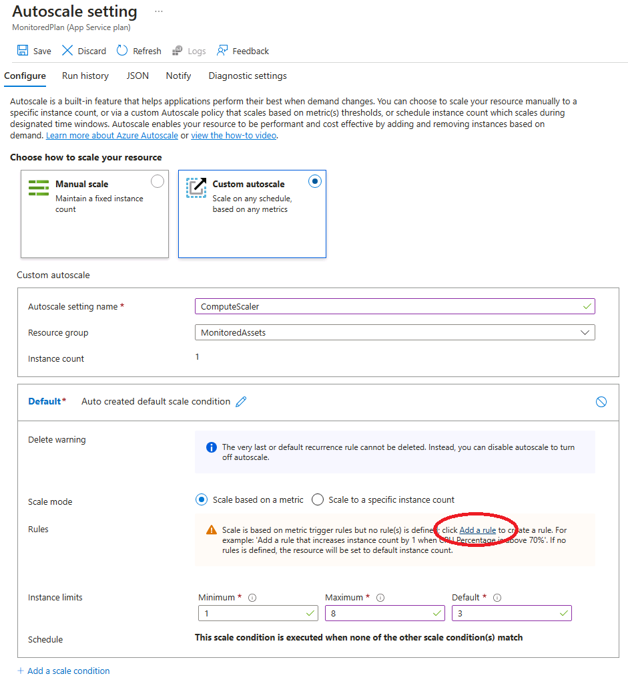
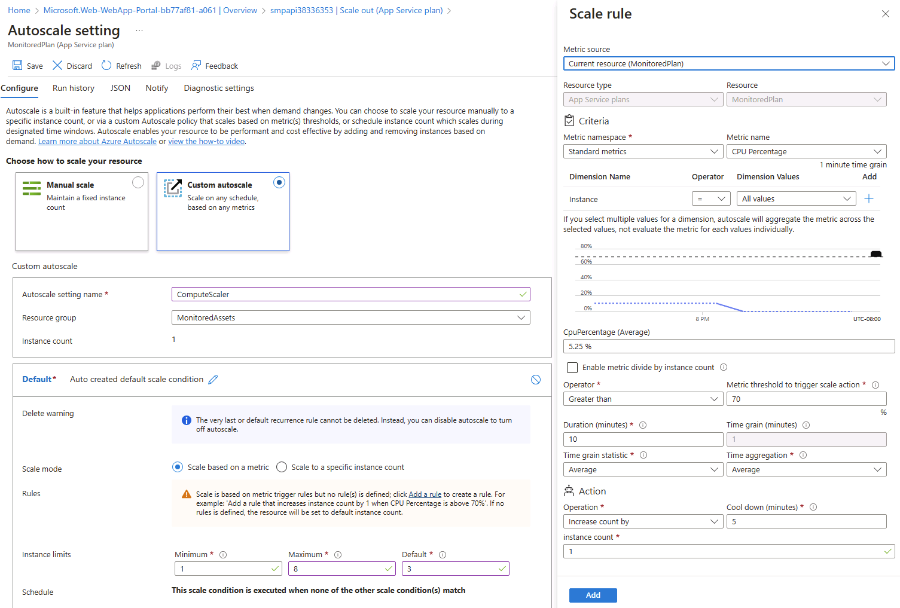
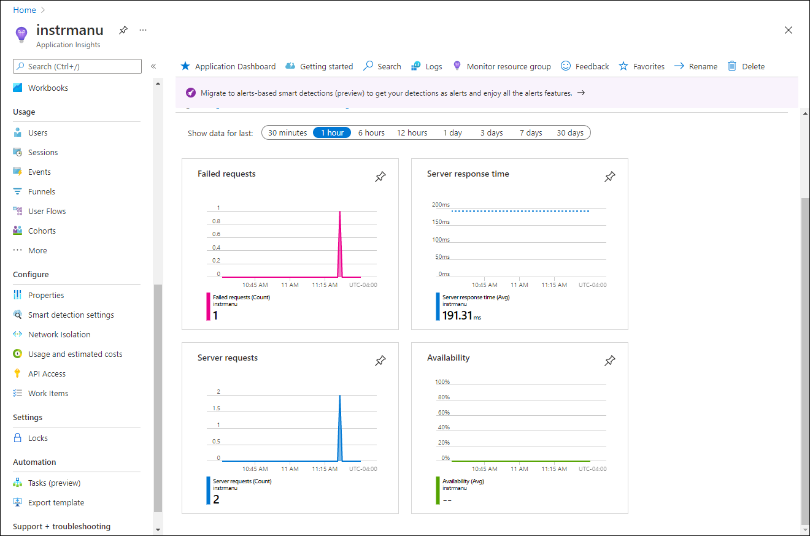
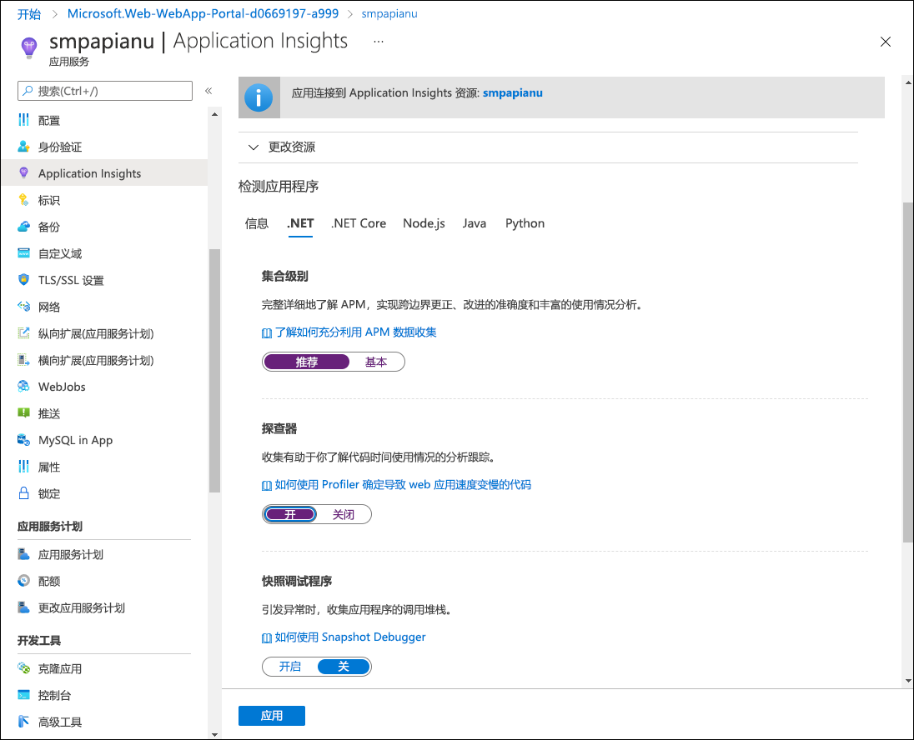
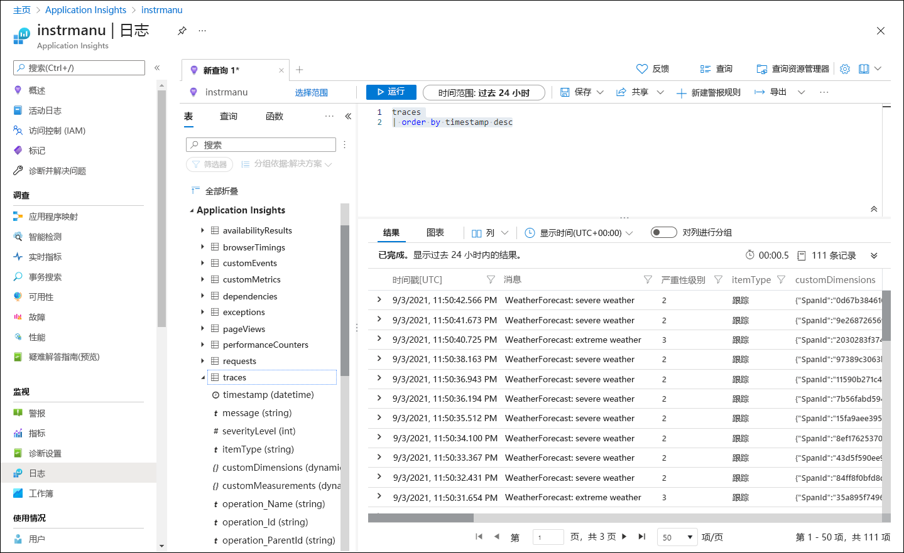

---
lab:
    az204Title: '实验室 11：监视部署到 Azure 的服务'
    az020Title: '实验室 11：监视部署到 Azure 的服务'
    az204Module: '模块 11：监视和优化 Azure 解决方案'
    az020Module: '模块 11：监视和优化 Azure 解决方案'
---

# 实验室 11：监视部署到 Azure 的服务

## Microsoft Azure 用户界面

鉴于 Microsoft 云工具的动态特性，Azure UI 在此培训内容开发后可能会发生更改。因此，实验室说明和实验室步骤可能无法完全一致。

当社区提醒我们进行必要的更改时，Microsoft 会更新本培训课程。然而，云更新的发生频率很高，因此你可能会遇到 UI 已更改但本培训内容尚未更新的情况。**如果发生这种情况，请适应这些更改，并根据需要在实验室中熟悉这些更改。**

## 说明

### 准备工作

#### 登录实验室环境

使用以下凭据登录 Windows 10 虚拟机 (VM)：
    
-   用户名：**Admin**

-   密码：**Pa55w.rd**

> **备注**：你的讲师将提供连接到虚拟实验室环境的说明。

#### 查看已安装的应用程序

在你的 Windows 10 桌面上找到任务栏。任务栏里有本实验室中你将使用的应用程序的图标，包括：
    
-   Microsoft Edge

-   文件资源管理器

-   Visual Studio Code

-   Azure PowerShell

## 体系结构图


### 练习 1：创建和配置 Azure 资源

#### 任务 1：打开 Azure 门户

1.  在任务栏上，选择 **Microsoft Edge** 图标。

1.  在浏览器窗口中，浏览到 Azure 门户 ([portal.azure.com](https://portal.azure.com))，并使用你将在本实验室中使用的帐户登录。

    > **备注**：第一次登录 Azure 门户时，你会看到一个门户教程。选择“**开始使用**”，跳过教程并开始使用门户。

#### 任务 2：创建 Application Insights 资源

1.  在 Azure 门户中，使用页面顶部的“**搜索资源、服务和文档**”文本框搜索“**Application Insights**”，然后在结果列表中选择“**Application Insights**”。

1.  在“**Application Insights**”边栏选项卡上，选择“**+ 创建**”。

1.  在“**Application Insights**”边栏选项卡的“**基本信息**”选项卡上，执行以下操作，然后选择“**查看 + 创建**”：
    
    | 设置                         | 操作                                                       |
    | ------------------------------- | ------------------------------------------------------------ |
    | “**订阅**”下拉列表 | 保留默认值。                                    |
    | “**资源组**”部分      | 选择“**新建**”，输入 **MonitoredAssets**，然后选择“**确定**”。 |
    | “**名称**”文本框     | **instrm**_[yourname]_。                           |
    | “**区域**”下拉列表       | 选择可以在其中部署 Azure 服务总线的任何 Azure 区域。 |
    | “**资源模式**”部分 | 选择“**基于工作区**”部分。|
    | “**工作区详细信息**”部分 | 保留“**订阅**”和“**Log Analytics 工作区**”下拉列表的默认值。|
    
    以下屏幕截图显示了“**Application Insights**”边栏选项卡上已配置的设置。

       
     
1.  在“**查看 + 创建**”选项卡中，查看在上述步骤中选择的选项。

1.  选择“**创建**”，使用指定的配置创建 **Application Insights** 实例。

    > **备注**：等待创建任务完成，再继续本实验室。

1.  在“**Microsoft.AppInsights \| 概述**”边栏选项卡上选择“**转到资源**”按钮，导航到新创建的 **Application Insights** 资源的边栏选项卡。

1.  在“**Application Insights**”边栏选项卡的“**配置**”部分，选择“**属性**”链接。

1.  在“**属性**”边栏选项卡的“**检测密钥**”条目旁边，选择“**复制到剪贴板**”按钮，然后记录复制的值。本实验室后面会用到它。

    > **备注**：客户端应用程序使用此密钥连接到特定的 **Application Insights** 资源。

### 任务 3：创建 Azure Web API 资源

1.  在 Azure 门户中，使用页面顶端的“**搜索资源、服务和文档**”文本框搜索“**应用服务**”，然后在结果列表中，选择“**应用服务**”。

1.  在“**应用服务**”边栏选项卡中，选择“**+ 新建**”。
    
1.  在“**创建 Web 应用**”边栏选项卡上的“**基本信息**”选项卡上，执行以下操作，然后选择“**下一步: 部署**”：

    | 设置                         | 操作                                                       |
    | ------------------------------- | ------------------------------------------------------------ |
    | “**订阅**”下拉列表 | 保留默认值。                                    |
    | “**资源组**”下拉列表      |选择“**MonitoredAssets**”。 |
    | “**名称**”文本框     | 输入“**smpapi**_[yourname]_”。                           |
    | “**发布**”部分       | 选择“**代码**”。 |
    | “**运行时堆栈**”下拉列表 | 选择“**.NET Core 3.1 (LTS)**”。|
    | “**操作系统**”部分 |  选择“**Windows**”。|
    | “**区域**”下拉列表 |  选择与“**应用程序实例**”资源位置相同的区域。 |
    | “**应用服务计划**”部分 |  选择“**新建**”。 |
    | “**名称**”文本框 |  输入“**MonitoredPlan**”，然后选择“**确定**”。|
    |  “**SKU 和大小**”部分 |  保留默认值。 |
    
1.  在“**部署**”选项卡中，选择“**下一步: 监视**”。

1.  在“**监视**”选项卡上，执行以下操作，然后选择“**查看 + 创建**”：
    
    | 设置                         | 操作                                                       |
    | ------------------------------- | ------------------------------------------------------------ |
    | “**启用 Application Insights**”部分 | 确保已选择“**确定**”。                                    |
    | “**Application Insights**”下拉列表     | 选择之前在本实验室中创建的 Application Insights 资源 **instrm**_[yourname]_。|
    
1.  在“**查看 + 创建**”选项卡中，查看在上述步骤中选择的选项。

1.  选择“**创建**”，使用指定的配置创建 Web API。

    > **备注**：等待创建任务完成，再继续本实验室。

1.  在部署的“**概述**”边栏选项卡上选择“**转到资源**”按钮，导航到新创建的 Azure Web API 的边栏选项卡。

1.  在“**应用服务**”边栏选项卡的“**设置**”部分，选择“**配置**”链接。

1.  在“**配置**”部分，执行以下操作：
    
    a.  在“**应用程序设置**”选项卡上选择“**显示值**”，显示与 Web API 关联的机密。

    b.  请注意表示“**APPINSIGHTS\_INSTRUMENTATIONKEY**”密钥的值。此值是在生成 Web API 资源时自动设置的。

1.  在“**应用服务**”边栏选项卡的“**设置**”部分，选择“**属性**”链接。

1.  在“**属性**”部分中，记录“**URL**”链接的值。稍后你将在本实验室中使用此值将请求发送到 Web API。

#### 任务 4： 配置 Web API 自动缩放选项

1.  在“**应用服务**”边栏选项卡的“**设置**”部分，选择“**横向扩展(应用服务计划)**”链接。

1.  在“**横向扩展**”部分，执行以下操作，然后选择“**保存**”：
    
    | 设置                         | 操作                                                       |
    | ------------------------------- | ------------------------------------------------------------ |
    | “**横向扩展**”部分 | 选择“**自定义自动缩放**”。|
    | “**自动缩放设置名称**”文本框     | 输入“**ComputeScaler**”。|
    | “**资源组**”下拉列表     |选择“**MonitoredAssets**”。 |
    | “**缩放模式**”部分      | 选择“**根据指标进行缩放**”。 |
    | “**实例限制**”部分的“**下限**”文本框 | 输入 **2**。|
    | “**实例限制**”部分的“**上限**”文本框 | 输入 **8**。|
    | “**实例限制**”部分的“**默认**”文本框 | 输入 **3**。 |
   
    以下屏幕截图显示了“**应用服务**”边栏选项卡的“**横向扩展**”部分中已配置的设置。
    
       

    | 设置                         | 操作                                                       |
    | ------------------------------- | ------------------------------------------------------------ |
    | “**规则**”部分 |  选择“**添加规则**”。|
    | “**缩放规则**”边栏选项卡 | 保留所有设置的默认值，然后选择“**添加**”。|

    以下屏幕截图显示了“**应用服务**”边栏选项卡的“**横向扩展**”部分中的其他设置。

       

    > **备注**：等待保存操作完成后再继续本实验室。

#### 回顾

在此练习中，你创建了将用于本实验室其余部分的 Azure 资源。

### 练习 2： 使用 Application Insights 监视本地 Web API

#### 任务 1： 生成一个 .NET Web API 项目

1.  在实验室计算机上，启动 **Visual Studio Code**。

1.  在 Visual Studio Code 的“**文件**”菜单中，选择“**打开文件夹**”。

1.  在“**打开文件夹**”窗口中，浏览到 **Allfiles (F):\\Allfiles\\Labs\\11\\Starter\\Api**，然后选中“**选择文件夹**”。

1.  在 **Visual Studio Code** 窗口中，激活快捷菜单，然后选择“**在集成终端中打开**”。

1.  在终端提示符下运行以下命令，在当前目录中新建一个名为 **SimpleApi** 的 .NET Web API 应用程序：

    ```
    dotnet new webapi --output . --name SimpleApi
    ```

1.  运行以下命令，将 2.18.0 版 **Microsoft.ApplicationInsights** 从 NuGet 导入到当前项目：

    ```
    dotnet add package Microsoft.ApplicationInsights --version 2.18.0
    ```

    > **备注**： **dotnet add package** 命令将从 NuGet 添加 **Microsoft.ApplicationInsights** 包。有关更多信息，请参见 [Microsoft.ApplicationInsights](https://www.nuget.org/packages/Microsoft.ApplicationInsights/)。

1.  运行以下命令，从 NuGet 导入 2.18.0 版 **Microsoft.ApplicationInsights.AspNetCore**：

    ```
    dotnet add package Microsoft.ApplicationInsights.AspNetCore --version 2.18.0
    ```

    > **备注**： **dotnet add package** 命令从 NuGet 添加 **Microsoft.ApplicationInsights.AspNetCore** 包。有关更多信息，请参见 [Microsoft.ApplicationInsights.AspNetCore](https://www.nuget.org/packages/Microsoft.ApplicationInsights.AspNetCore)。

1.  在终端提示符下运行以下命令，将 2.18.0 版 **Microsoft.ApplicationInsights.PerfCounterCollector** 从 NuGet 导入到当前项目：

    ```
    dotnet add package Microsoft.ApplicationInsights.PerfCounterCollector --version 2.18.0
    ```

    > **备注**： **dotnet add package** 命令将从 NuGet 添加 **Microsoft.ApplicationInsights.PerfCounterCollector** 包。有关更多信息，请参见 [Microsoft.ApplicationInsights.PerfCounterCollector](https://www.nuget.org/packages/Microsoft.ApplicationInsights.PerfCounterCollector/)。

1.  从终端提示符运行以下命令，生成 .NET Web API：

    ```
    dotnet build
    ```
    
#### 任务 2：更新应用代码以禁用 HTTPS 并使用 Application Insights

1.  在“**Visual Studio Code**”窗口的“**资源管理器**”窗格中，选择“**Startup.cs**”文件，在“**编辑器**”窗格中打开该文件。

1.  在“**编辑器**”窗格的 **Startup** 类中，在第 39 行找到以下代码并将其删除：

    ```csharp
    app.UseHttpsRedirection();
    ```

    > **备注**：此代码行强制 Web API 使用 HTTPS。对于本实验室而言，这不是必要的。

1.  在 **Startup** 类定义的开头，添加一个新的名为 **INSTRUMENTATION_KEY** 的静态字符串常量，其值设置为你之前在本实验室中记录的 Application Insights 资源检测密钥：

    ```csharp
    private const string INSTRUMENTATION_KEY = "instrumentation_key";
    ```

    > **备注**：例如，如果检测密钥是 `d2bb0eed-1342-4394-9b0c-8a56d21aaa43`，则代码行是 `private const string INSTRUMENTATION_KEY = "d2bb0eed-1342-4394-9b0c-8a56d21aaa43";`

1.  找到 **Startup** 类中的 **ConfigureServices** 方法：

    ```csharp
    public void ConfigureServices(IServiceCollection services)
    {
        services.AddControllers();
    }
    ```

1.  从新行开始，在 **ConfigureServices** 方法的末尾添加以下代码，使用提供的检测密钥配置 Application Insights：

    ```csharp
    services.AddApplicationInsightsTelemetry(INSTRUMENTATION_KEY);
    ```

1.  查看 **ConfigureServices** 方法，它现在应该包含以下代码：

    ```csharp
    public void ConfigureServices(IServiceCollection services)
    {
        services.AddControllers();
        services.AddApplicationInsightsTelemetry(INSTRUMENTATION_KEY);        
    }
    ```

1.  保存 **Startup.cs** 文件。

1.  从终端提示符运行以下命令，生成 .NET Web API。

    ```
    dotnet build
    ```

#### 任务 3：本地测试 API 应用程序

1.  从终端提示符运行以下命令，启动 .NET Web API。

    ```
    dotnet run
    ```

1.  在任务栏上，打开“**Microsoft Edge**”图标的上下文菜单，然后打开一个新的浏览器窗口。

1.  在打开的浏览器窗口中，导航到 URL 包含 Web API 的 **/weatherforecast** 相对路径的页面，此时该页面托管在 **localhost** 的端口 **5000** 上。
    
    > **备注**：完整 URL 是 `http://localhost:5000/weatherforecast`。

    > **备注**：页面应包含以下格式的输出：

    ```
    [{"date":"2021-09-04T10:15:04.0969996-07:00","temperatureC":54,"temperatureF":129,"summary":"Sweltering"},{"date":"2021-09-05T10:15:04.0972401-07:00","temperatureC":44,"temperatureF":111,"summary":"Balmy"},{"date":"2021-09-06T10:15:04.0976549-07:00","temperatureC":41,"temperatureF":105,"summary":"Scorching"},{"date":"2021-09-07T10:15:04.0976613-07:00","temperatureC":-4,"temperatureF":25,"summary":"Freezing"},{"date":"2021-09-08T10:15:04.0976618-07:00","temperatureC":33,"temperatureF":91,"summary":"Balmy"}]
    ```

1.  关闭显示由 `http://localhost:5000/weatherforecast` 生成的页面的浏览器窗口。

1.  在 Visual Studio Code 中选择“**终止终端**”（“**回收站**”图标），关闭**终端**窗格和所有关联进程。

#### 任务 4：查看 Application Insights 中的指标

1.  在实验室计算机上，切换到显示 Azure 门户的“**Microsoft Edge**”浏览器窗口。

1.  在 Azure 门户中，导航回到你之前在本实验室中创建的 Application Insights 资源 **instrm**_[yourname]_ 的边栏选项卡。

1.  在“**Application Insights**”边栏选项卡中间的磁贴中，找到显示的指标。具体来说，找到已经发生的服务器请求数量和平均服务器响应时间。

    以下屏幕截图显示了本地 Web 应用的 **Application Insights** 指标。

       

    > **备注**：请求最多可能需要五分钟即可显示在 Application Insights 指标图表中。

#### 回顾

在本练习中，你使用 ASP.NET 创建了一个 API 应用，并将其配置为将应用程序指标流式传输到 Application Insights。然后，你使用 Application Insights 仪表板查看了有关 API 的性能详细信息。

### 练习 3： 使用 Application Insights 监视 Web API

#### 任务 1：将应用程序部署到 Web API

1.  在实验室计算机上，切换到 Visual Studio Code。

1.  在 **Visual Studio Code** 窗口的“**资源管理器**”窗格中，导航到 **bin\Debug\netcoreapp3.1** 目录。

1.  将名为 **web.config** 的文件添加到目录中。

1.  打开 **web.config** 文件并添加以下内容：

    ```
    <?xml version="1.0" encoding="utf-8"?>
    <configuration>
      <location path="." inheritInChildApplications="false">
        <system.webServer>
          <handlers>
            <add name="aspNetCore" path="*" verb="*" modules="AspNetCoreModuleV2" resourceType="Unspecified" />
          </handlers>
          <aspNetCore processPath="dotnet" arguments=".\SimpleApi.dll" stdoutLogEnabled="false" stdoutLogFile=".\logs\stdout" hostingModel="inprocess" />
        </system.webServer>
      </location>
    </configuration>
    ```

1.  保存并关闭该文件。

1.  在 **Visual Studio Code** 窗口中，激活快捷菜单，然后选择“**在集成终端中打开**”。

1.  在终端提示符下运行以下命令，确保当前目录设置为 **Allfiles (F):\\Allfiles\\Labs\\11\\Starter\\Api\\bin\\Debug\\netcoreapp3.1**，这里包含部署文件：

    ```
    cd F:\Allfiles\Labs\11\Starter\Api\bin\Debug\netcoreapp3.1
    ```

1.  运行以下命令创建一个包含初学者项目的 zip 文件，你将在 Azure Web API 旁边部署该项目：

    ```powershell
    Compress-Archive -Path * -DestinationPath api.zip
    ```

1.  在终端提示符下运行以下命令，使用 Azure PowerShell 登录到 Azure 订阅：

    ```powershell
    Connect-AzAccount
    ```

1.  按照终端提示符中显示的说明，切换到显示 Azure 门户的 Microsoft Edge 浏览器，在浏览器窗口中另外打开一个标签页，导航到 `https://microsoft.com/devicelogin`，在出现提示时输入提供的代码，然后使用你将在本实验室中使用的帐户登录。

    > **备注**：请等待登录过程完成。

1.  关闭新打开的浏览器标签页，切换回到 Visual Studio Code 窗口中的终端提示符。

1.  运行以下命令，显示 **MonitoredAssets** 资源组中所有 Web 应用的列表：

    ```powershell
    Get-AzWebApp -ResourceGroupName MonitoredAssets
    ```

1.  运行以下命令，显示 **MonitoredAssets** 资源组中名称以 **smpapi\*** 开头的 Web 应用的列表：

    ```powershell
    Get-AzWebApp -ResourceGroupName MonitoredAssets | Where-Object {$_.Name -like 'smpapi*'}
    ```

1.  运行以下命令，显示在上一步中标识的第一个 Web 应用的名称，并将其存储在名为 **$webAppName** 的变量中：

    ```powershell
    Get-AzWebApp -ResourceGroupName MonitoredAssets | Where-Object {$_.Name -like 'smpapi*'} | Select-Object -ExpandProperty Name
    $webAppName = (Get-AzWebApp -ResourceGroupName MonitoredAssets | Where-Object {$_.Name -like 'smpapi*'})[0] | Select-Object -ExpandProperty Name
    ```

1.  运行以下命令，将你之前在此任务中创建的 **api.zip** 文件部署到具有你在上一步中标识的名称的 Web API：

    ```powershell
    az webapp deployment source config-zip --resource-group MonitoredAssets --src api.zip --name $webAppName
    ```
    > **备注**：如果提示进行身份验证，请运行 `az login` 并按照说明完成登录过程。

    > **备注**：等待部署完成后，再继续本实验室。

    > **备注**：请查看命令的输出，并验证 `provisioningState`是否设置为 `Succeeded`。命令的输出格式如下：

    ```
    Getting scm site credentials for zip deployment
    Starting zip deployment. This operation can take a while to complete ...
    Deployment endpoint responded with status code 202
    {
      "active": true,
      "author": "N/A",
      "author_email": "N/A",
      "complete": true,
      "deployer": "ZipDeploy",
      "end_time": "2021-09-03T17:02:18.124062Z",
      "id": "f5fb8ef6a11d4f8387f09dc47628007e",
      "is_readonly": true,
      "is_temp": false,
      "last_success_end_time": "2021-09-03T17:02:18.124062Z",
      "log_url": "https://smpapianu.scm.azurewebsites.net/api/deployments/latest/log",
      "message": "Created via a push deployment",
      "progress": "",
      "provisioningState": "Succeeded",
      "received_time": "2021-09-03T17:02:11.942626Z",
      "site_name": "smpapianu",
      "start_time": "2021-09-03T17:02:12.1613438Z",
      "status": 4,
      "status_text": "",
      "url": "https://smpapianu.scm.azurewebsites.net/api/deployments/latest"
    }
    ```

1.  在实验室计算机上，另外启动一个 Microsoft Edge 浏览器窗口。

1.  在浏览器窗口中，通过将后缀 **/weatherforecast** 附加到其 URL（你之前已在本实验室中记录），导航到之前在此任务中部署 API 应用的 Azure Web API 应用。

    > **备注**：例如，如果你的 URL 为 `https://smpapianu.azurewebsites.net`，则新的 URL 为 `https://smpapianu.azurewebsites.net/weatherforecast`。

1.  验证输出是否与在本地运行 API 应用时生成的输出类似。

    > **备注**：输出将包含不同的值，但应采用相同的格式。

#### 任务 2： 配置 Web 应用的深入指标集合

1.  在实验室计算机上，切换到显示 Azure 门户的“**Microsoft Edge**”浏览器窗口。

1.  在 Azure 门户中，导航回到你之前在本实验室中创建的 Web 应用资源 **smpapi**_[yourname]_ 的边栏选项卡。

1.  在“**应用服务**”边栏选项卡上，选择 “**Application Insights**”，然后选择“**打开 Application Insights**”。

1.  在“**Application Insights**”边栏选项卡上，执行以下操作，选择“**应用**”，然后在确认对话框中选择“**是**”：

    | 设置                         | 操作                                                       |
    | ------------------------------- | ------------------------------------------------------------ |
    | “**Application Insights**”滑块 | 确保它设置为“**启用**”。|
    | “**检测应用程序**”部分    | 选择“**.NET Core**”选项卡。|
    | “**集合级别**”部分    | 选择“**建议**”。 |
    | “**探查器**”部分      | 选择“**开**”。|
    | “**快照调试程序**”部分 | 选择“**关**”。|
    | “**SQL 命令**”部分 | 选择“**关**”。|

    
    以下屏幕截图显示了 Azure Web API 的 **Application Insights** 设置。
    
       

1.  切换到在上一个任务中打开的浏览器标签页，以显示将 API 应用部署到目标 Azure API 应用的结果（包括目标 URL 中的 **/weatherforecast** 相对路径），并多次刷新浏览器页面。

1.  查看 API 生成的 JSON 格式的输出。

1.  记录用于访问 JSON 格式输出的 URL。

    > **备注**： URL 的格式应为 `https://smpapianu.azurewebsites.net/weatherforecast`。

#### 任务 3： 在 Application Insights 中查看更新指标

1.  返回到在 Azure 门户中显示 Azure Web 应用的浏览器窗口。

1.  在 Web 应用的“**Application Insights**”边栏选项卡上，选择“**查看 Application Insights 数据**”链接。

1.  在“**Application Insights**”边栏选项卡上，查看边栏选项卡中间磁贴中收集的指标，包括已发生的服务器请求数和平均服务器响应时间。
 
    以下屏幕截图显示了 Azure 门户中 Azure Web 应用的 **Application Insights** 指标。
     
       

    > **备注**：更新的指标最多可能需要五分钟即可显示在 Application Insights 指标图表中。

#### 任务 4： 在 Application Insights 中查看实时指标

1.  在“**Application Insights**”边栏选项卡的“**调查**”部分中，选择“**实时指标**”。

1.  切换回到浏览器窗口，它显示了在目标 Azure Web 应用中运行的目标 API 应用（针对目标 URL 中的 **/weatherforecast** 相对路径），然后多次刷新浏览器页面。

1.  切换到显示“**实时指标**”边栏选项卡的浏览器窗口，并查看其内容。

    > **备注**： “**传入请求**”部分应该会在几秒钟内更新，显示你对 Web API 发出的请求。

### 练习 4： 使用 .NET Core 进行 Application Insights 日志记录

#### 任务 1：为 .NET Core API 应用配置日志记录

1.  切换到“**Visual Studio Code**”窗口。

1.  在终端提示符下运行以下命令，将当前目录设置为 **Allfiles (F):\\Allfiles\\Labs\\11\\Starter\\Api**，这里包含部署文件：

    ```
    cd F:\Allfiles\Labs\11\Starter\Api
    ```

1.  运行以下命令，将 2.18.0 版 **Microsoft.Extensions.Logging.ApplicationInsights** 从 NuGet 导入到当前项目：

    ```
    dotnet add package Microsoft.Extensions.Logging.ApplicationInsights --version 2.18.0
    ```

    > **备注**： **dotnet add package** 命令将从 NuGet 添加 **Microsoft.ApplicationInsights** 包。有关更多信息，请参见 [Microsoft.Extensions.Logging.ApplicationInsights](https://www.nuget.org/packages/Microsoft.Extensions.Logging.ApplicationInsights)。

1.  在 **Visual Studio Code** 窗口的“**资源管理器**”窗格中，导航到“**Controllers**”目录，然后打开 **WeatherForecastController.cs** 文件。

1.  查看文件的内容，注意它包括 `using Microsoft.Extensions.Logging` 指令和通用 ILogger<WeatherForecastController> 接口的构造函数注入。

    ```csharp
    using System;
    using System.Collections.Generic;
    using System.Linq;
    using System.Threading.Tasks;
    using Microsoft.AspNetCore.Mvc;
    using Microsoft.Extensions.Logging;

    namespace SimpleApi.Controllers
    {
        [ApiController]
        [Route("[controller]")]
        public class WeatherForecastController : ControllerBase
        {
            private static readonly string[] Summaries = new[]
            {
                "Freezing", "Bracing", "Chilly", "Cool", "Mild", "Warm", "Balmy", "Hot", "Sweltering", "Scorching"
            };

            private readonly ILogger<WeatherForecastController> _logger;

            public WeatherForecastController(ILogger<WeatherForecastController> logger)
            {
                _logger = logger;
            }

            [HttpGet]
            public IEnumerable<WeatherForecast> Get()
            {
                var rng = new Random();
                return Enumerable.Range(1, 5).Select(index => new WeatherForecast
                {
                    Date = DateTime.Now.AddDays(index),
                    TemperatureC = rng.Next(-20, 55),
                    Summary = Summaries[rng.Next(Summaries.Length)]
                })
                .ToArray();
            }
        }
    }
    ```

    > **备注**：你将利用此配置来实现自定义日志记录。目前，构造函数显示一组五个随机生成的天气预测。你将修改控制器，以便一次显示一个预测。对于每个预测，将生成一个信息、警告或错误日志条目，用于指示天气类型（温和、严重和极端）。在 Application Insights 将这些日志条目记录到相应的 Log Analytics 工作区中后，每个条目都将具有自动分配的严重性级别 1、2 或 3。 

1.  在 **WeatherForecastController.cs** 文件的 `public IEnumerable<WeatherForecast> Get()` 方法中找到 `var rng = new Random();` 行，然后从下一行开始添加以下代码：

    ```csharp
            int temperatureC = rng.Next(-20, 55);
            var summaryId = rng.Next(Summaries.Length);

            switch (summaryId)
            {
                case 0: case 9:
                _logger.LogError("WeatherForecast: extreme weather");
                break;
                case 1: case 2: case 7: case 8:
                _logger.LogWarning("WeatherForecast: severe weather");
                break;
                default:
                _logger.LogInformation("WeatherForecast: mild weather");
                break;
            }
    ```

1.  修改 `return` 语句，使其具有以下内容：

    ```csharp
            return Enumerable.Range(1, 1).Select(index => new WeatherForecast
            {
                Date = DateTime.Now.AddDays(index),
                TemperatureC = temperatureC,
                Summary = Summaries[summaryId]
            })
            .ToArray();
    ```

1.   保存并关闭该文件。

1.  从终端提示符运行以下命令，生成 .NET Web API：

    ```
    dotnet build
    ```

#### 任务 2： .NET Core API 应用的测试日志记录

1.  运行以下命令以启动 .NET Web API。

    ```
    dotnet run
    ```

    > **备注**：在此任务中执行后续步骤时，将 Web API 保持在运行状态，并监视“Visual Studio Code **终端**”窗格的输出。

1.  在实验室计算机上，打开“**Microsoft Edge**”图标的上下文菜单，然后打开一个新的浏览器窗口。

    > **备注**：定位浏览器窗口，使其不会阻止“Visual Studio Code **终端**”窗格。

1.  在打开的浏览器窗口中，导航到 `http://localhost:5000/weatherforecast`，然后多次刷新页面。
    
    > **备注**：每次刷新页面时，它应该按以下格式显示不同的天气预测。

    ```
    [{"date":"2021-09-04T14:35:29.0789168-07:00","temperatureC":2,"temperatureF":35,"summary":"Sweltering"}]
    ```

    > **备注**：每次刷新页面都应在终端提示符处显示信息、警告或错误消息，格式如下：

    ```
    warn: SimpleApi.Controllers.WeatherForecastController[0]
      WeatherForecast: severe weather
    ```

    > **备注**：多次刷新页面，确保每种类型至少生成了一条消息（“**信息**”、“**警告**”和“**失败**”）。

1.  让 API 应用保持运行。

#### 任务 3：查看 Application Insights 日志记录

1.  在实验室计算机上，切换到显示 Azure 门户的“**Microsoft Edge**”浏览器窗口。

1.  在 Azure 门户中，导航回到你之前在本实验室中创建的 Application Insights 资源 **instrm**_[yourname]_ 的边栏选项卡。

1.  在“**Application Insights**”边栏选项卡的“**监视**”部分，选择“**日志**”。

1.  如果需要，请关闭“**欢迎使用 Log Analytics**”窗格和“**查询**”窗格。

1.  在“**新建查询**”窗格中，键入以下查询，然后选择“**运行**”：

    ```
    traces
    | order by timestamp desc
    ```

1.  查看查询结果。

    > **备注**：结果应包括与 .NET Core API 应用生成的警告和错误消息对应的日志条目，以及它们各自的严重性级别（2 和 3）。

    > **备注**：请求最多可能需要五分钟即可显示在 Application Insights 指标图表中。

    以下屏幕截图显示了“**Application Insights**”边栏选项卡上的日志查询结果。

       

    > **备注**： 可将更新后的 API 应用部署到 Azure Web 应用，以等效方式使用 Application Insights 收集其日志。

    > **备注**：可通过修改 **appsettings.Development.json**（或 **appsettings.json**）文件，扩展 Application Insights 日志记录级来以包含信息事件，如下面的代码列表所示。但请记住，这将显著增加日志量，从而可能对网络性能和定价造成影响：

    ```
    {
      "Logging": {
        "LogLevel": {
          "Default": "Information",
          "Microsoft": "Warning",
          "Microsoft.Hosting.Lifetime": "Information"
        },
        "ApplicationInsights": {
          "LogLevel": {
            "Microsoft": "Information"
          }
        }
      }
    }
    ```

1.  关闭显示 API 应用输出的浏览器窗口。

1.  切换到“**Visual Studio Code**”窗口，然后选择“**终止终端**”（“**回收站**”图标），关闭**终端**窗格和所有关联进程。

#### 回顾

在本练习中，你配置并测试了 Web API 应用的 Application Insights 日志记录。

### 练习 5：清理订阅

#### 任务 1：打开 Azure Cloud Shell

1.  在 Azure 门户中，选择 **Cloud Shell** 图标 ，打开新的 PowerShell 会话。如果 Cloud Shell 默认为 PowerShell 会话，请选择“**PowerShell**”，然后在下拉菜单中选择“**Bash**”。

    > **备注**：首次启动 **Cloud Shell** 时，系统会提示选择 **Bash** 或 **PowerShell**，请选择“**Bash**”。如果显示“**未挂载存储**”消息，请选择你在本实验室中使用的订阅，然后选择“**创建存储**”。

#### 任务 2：删除资源组

1.  在 **Cloud Shell** 窗格中运行以下命令，以删除“**MonitoredAssets**”资源组：

    ```
    az group delete --name MonitoredAssets --no-wait --yes
    ```

     > **备注**：该命令以异步方式执行（由 *--no-wait* 参数确定），因此，尽管可立即在同一 Bash 会话中运行另一个 Azure CLI 命令，但实际上要花几分钟才能删除资源组。

1.  关闭门户中的 **Cloud Shell** 窗格。

#### 任务 3：关闭活动应用程序

1.  关闭当前正在运行的 Microsoft Edge 应用程序。

1.  关闭当前正在运行的“Visual Studio Code”应用程序。

#### 回顾

在本练习中，你通过删除本实验室中使用的资源组清理订阅。
