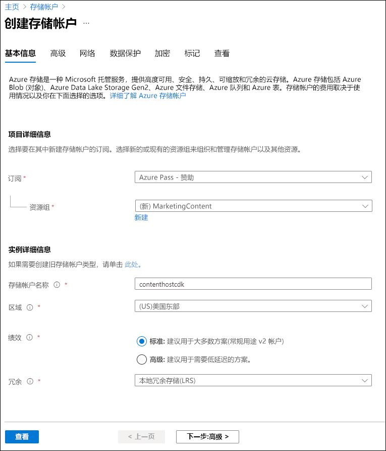
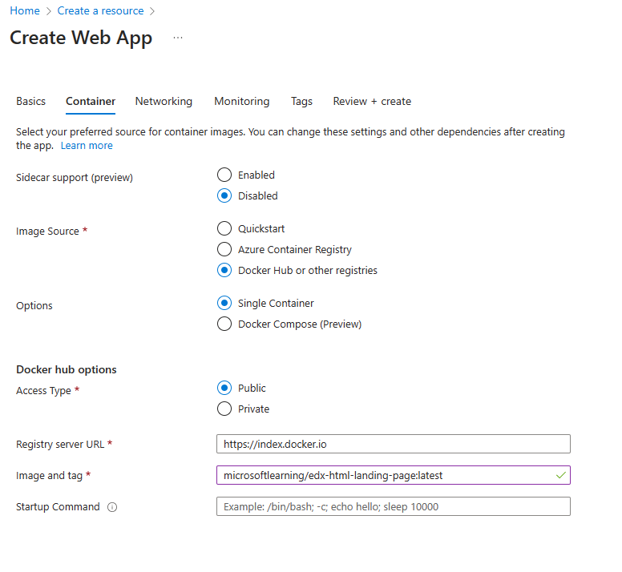
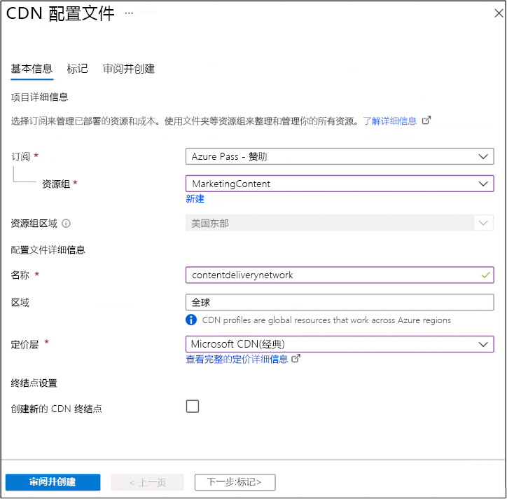
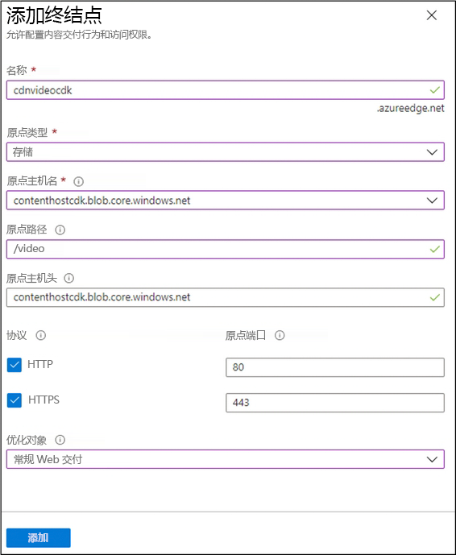

---
lab:
  az204Title: 'Lab 12: Enhance a web application by using the Azure Content Delivery Network'
  az204Module: 'Learning Path 12: Implement caching for solutions'
---

# 实验室 12：使用 Azure 内容分发网络增强 Web 应用程序

## Microsoft Azure 用户接口

鉴于 Microsoft 云工具的动态特性，Azure UI 在此培训内容开发后可能会发生更改。 因此，实验说明和实验步骤可能无法正确对应。

我们发现社区进行了必要更改时，Microsoft 会更新此培训课程。 但是，云更新经常发生，因此在此培训内容更新之前，可能会发生 UI 更改。 如果发生这种情况，请适应这些更改，并根据需要在实验室中熟悉这些更改。

## Instructions

### 开始之前

#### 登录到实验室环境

使用以下凭据登录到 Windows 11 虚拟机 (VM)：

- 用户名：`Admin`
- 密码：`Pa55w.rd`

> **注意**：你的讲师将提供连接到虚拟实验室环境的说明。

#### 查看已安装的应用程序

在 Windows 11 桌面上找到任务栏。 任务栏包含了你在本实验室中会使用的应用程序图标：

- Microsoft Edge

## 实验室场景

在本实验室中，你将实现 Azure 内容分发网络功能，来提供基于客户位置的缓存解决方案。 实验室会为受延迟问题影响最大的图像和视频文件配置一个存储帐户。 你将使用 Azure 内容分发网络来实现缓存解决方案，帮助降低这些图像和视频文件的延迟。

## 体系结构关系图


### 练习 1：创建 Azure 资源

#### 任务 1：打开 Azure 门户

1. 在任务栏上，选择 Microsoft Edge 图标。

1. 在打开的浏览器窗口中，浏览到 Azure 门户 (`https://portal.azure.com`)，然后使用你将用于此实验室的帐户登录。

   > **注意**：第一次登录 Azure 门户时，你会看到一个门户教程。 选择“开始使用”，以跳过导览并开始使用门户。

#### 任务 2：创建存储帐户

1. 在 Azure 门户中，使用“搜索资源、服务和文档”文本框搜索“存储帐户”，然后在结果列表中选择“存储帐户”。

1. 在“存储帐户”边栏选项卡上，选择“+ 创建”。

1. 在“创建存储帐户”边栏选项卡的“基本信息”选项卡上，执行以下操作，然后选择“下一步:**********高级 >**：

   | 设置 | 操作 |
   | -- | -- |
   | “订阅”下拉列表 | 保留默认值 |
   | “资源组”部分 | 选择“新建”，输入“MarketingContent”，然后选择“确定” |
   | “存储帐户名称”文本框 | 输入“contenthost[yourname]” |
   | “区域”下拉列表 | 选择“(US)美国东部” |
   | “性能”部分 | 选择“标准”选项 |
   | “冗余”下拉列表 | 选择“本地冗余存储(LRS)” |

    以下屏幕截图显示了“创建存储帐户”窗格中配置的设置。

    

1. 在“高级”选项卡上，确保启用“允许对单个容器启用匿名访问”。******** 如果未启用，请选中该框。

1. 在“查看”选项卡中，查看在上述步骤中选择的选项。

1. 选择“创建”，使用指定的配置创建存储帐户。

    > **注意**：等待创建任务完成，再继续本实验室。

#### 任务 3：使用 Azure 应用服务创建 Web 应用

1. 在 Azure 门户的导航窗格上，选择“创建资源”。

1. 在“创建资源”窗格的“搜索服务和市场”文本框中，输入“Web 应用”  ，然后按 Enter 键。

1. 在搜索结果窗格中，选择“Web 应用”结果，然后选择“创建”。

1. 在“创建 Web 帐户”窗格的“基本信息”选项卡上，执行以下操作，然后选择“下一步：  **Docker**：

   | 设置 | 操作 |
   | -- | -- |
   | “订阅”下拉列表 | 保留默认值 |
   | “资源组”下拉列表 | 在列表中选择“MarketingContent” |
   | “名称”文本框 | 输入“landingpage[yourname]” |
   | “发布”部分 | 选择“容器”**** |
   | “操作系统”部分 | 选择“Linux” |
   | “区域”下拉列表 | 选择“美国东部” |
   | “Linux 计划(美国东部)”部分 | 选择“新建”。 在“名称”文本框中，输入“MarketingPlan”，然后选择“确定” |
   | “定价计划”部分 | 保留默认值 |

   以下屏幕截图显示了“创建 Web 应用”窗格上配置的设置。

   

1. 在“容器”**** 选项卡上，执行以下操作，然后选择“查看 + 创建”：****

    | 设置 | 操作 |
    | -- | -- |
    | 挎斗支持（预览版）**** | 选择“已禁用” |
    | **映像源**  | 选择“Docker Hub 或其他注册表”**** |
    | **选项** | 选择“单个容器”**** |
    | “访问权限类型”下拉列表 | 选择“公共” |
    | 注册表服务器 URL**** | 输入 `https://index.docker.io` |
    | “映像和标记”文本框 | 输入“microsoftlearning/edx-html-landing-page:latest” |

   以下屏幕截图显示了“容器”选项卡上配置的设置****。

   

1. 在“查看 + 创建”选项卡中，查看在上述步骤中选择的选项。

1. 选择“创建”，使用指定的配置创建 Web 应用。

    > **注意**：等待创建任务完成，再继续本实验室。

1. 在“部署”边栏选项卡上，选择“转到资源”。

1. 在“应用服务概述”边栏选项卡的“基本信息”中，记录“默认域”链接的值。 你将在稍后的实验室中使用此值。

#### 审阅

在本练习中，你创建了一个 Azure 存储帐户和一个 Azure Web 应用，你稍后将在本实验使用。

### 练习 2：配置内容分发网络和端点

#### 任务 1：打开 Azure Cloud Shell

1. 在 Azure 门户中，选择“Cloud Shell”图标  以打开一个新的 Bash 会话。 如果 Cloud Shell 默认为 PowerShell 会话，请选择“PowerShell”，然后在下拉菜单中选择“Bash”。

    > **注意**：如果这是你第一次启动 Cloud Shell，当系统提示你选择“Bash”或“PowerShell”时，请选择“Bash”。 当出现消息“未安装存储”时，请选择你在本实验中使用的订阅，然后选择“创建存储”。

1. 在 Azure 门户中，在 Cloud Shell 命令提示符下输入以下命令，以获取 Azure 命令行接口 (Azure CLI) 工具的版本：

    ```bash
    az --version
    ```

#### 任务 2：注册 Microsoft.CDN 提供程序

1. 在门户中的“Cloud Shell”命令提示符处，执行以下操作：

    a.  输入以下命令，检查 Microsoft.CDN 是否已注册。 继续执行步骤 2。 如果 Microsoft.CDN 已注册：

    ```bash
    az provider show --namespace Microsoft.CDN --query "registrationState"
    ```

    b.  如果 Microsoft.CDN 未注册。 输入以下命令，然后按 Enter（使用当前订阅）注册 Microsoft.CDN 命名空间：

    ```bash
    az provider register --namespace Microsoft.CDN
    ```

1. 关闭门户中的“Cloud Shell”窗格。

#### 任务 3：创建内容分发网络配置文件

1. 在 Azure 门户的导航窗格上，选择“创建资源”。

1. 在“创建资源”窗格的“搜索服务和市场”文本框中，输入“CDN”  ，然后按 Enter 键。

1. 在“市场”搜索结果窗格中，选择“Front Door 和 CDN 配置文件”结果，然后选择“创建”。

1. 在“比较产品/服务”页上，选择“浏览其他产品/服务”，再选择“Microsoft 的 Azure CDN 标准（经典）”，然后选择“继续”。

1. 在“CDN 配置文件”窗格的“基本信息”选项卡上，执行以下操作，然后选择“查看 + 创建”：

   | 设置 | 操作 |
   | -- | -- |
   | “订阅”下拉列表 | 保留默认值 |
   | “资源组”下拉列表 | 在列表中选择“MarketingContent” |
   | “名称”文本框 | 输入“contentdeliverynetwork” |
   | “区域”文本框 | 保留默认值“全局”**** |
   | “定价层”下拉列表 | 保留默认值“Microsoft CDN（经典）”**** |
   | “创建新的 CDN 终结点”复选框 | 未选定 |

   以下屏幕截图显示了“CDN 配置文件”窗格上配置的设置。

   

1. 在“查看 + 创建”选项卡中，查看在上述步骤中选择的选项。

1. 选择“创建”以使用指定的配置创建 CDN 配置文件。
  
    > **注意**：等待 Azure 完成 CDN 配置文件创建后，再继续本实验室。 创建配置文件时会收到通知。

#### 任务 4：配置储存容器

1. 在 Azure 门户的导航窗格中，选择“资源组”。

1. 在“资源组”窗格中，选择之前在本实验中创建的“MarketingContent”资源组。

1. 在“MarketingContent”窗格中，选择你之前在本实验中创建的“contenthost[yourname]”存储帐户。

1. 在“存储帐户”边栏选项卡中，选择“数据存储”部分的“容器”链接。

1. 在“容器”部分，选择“+ 容器” 。

1. 在“新建容器”弹出窗口中，执行以下操作，然后选择“创建”：

   | 设置 | 操作 |
   | -- | -- |
   | “名称”文本框 | 输入“media” |
   | “公共访问级别”下拉列表 | 选择“Blob (仅限 Blob 匿名读取访问)” |

1. 在“容器”部分，再次选择“+ 容器” 。

1. 在“新建容器”弹出窗口中，执行以下操作，然后选择“创建”：

   | 设置 | 操作 |
   | -- | -- |
   | “名称”文本框 | 输入“video” |
   | “公共访问级别”下拉列表 | 选择“Blob (仅限 Blob 匿名读取访问)” |

1. 观察容器的更新列表，并确认已列出 media 和 video 容器 。

#### 任务 5：创建内容分发网络终结点

1. 在 Azure 门户的导航窗格中，选择“资源组”链接。

1. 在“资源组”窗格中，选择之前在本实验中创建的“MarketingContent”资源组。

1. 在“MarketingContent”窗格中，选择你之前在本实验中创建的“contentdeliverynetwork”CDN 配置文件。

1. 在“CDN 配置文件”边栏选项卡中，选择“+ 终结点”。

1. 在“添加终结点”弹出对话框中，执行以下操作，然后选择“添加”：

   | 设置 | 操作 |
   | -- | -- |
   | “名称”文本框 | 输入“cdnmedia[yourname]” |
   | “源类型”下拉列表 | 选择“存储” |
   | “源主机名”下拉列表 | 为之前在本实验室中创建的存储帐户选择“contenthost[yourname].blob.core.windows.net”选项 |
   | “源路径”文本框 | 输入“/media” |
   | “源主机头”文本框 | 保留默认值 |
   | “协议”和“源端口”部分 | 保留默认值 |
   | “已优化”下拉列表 | 选择“常规 Web 分发” |

   以下屏幕截图显示了“添加终结点”对话框中配置的设置。

   

1. 在“CDN 配置文件”窗格中，再次选择“+ 终结点”。

1. 在“添加终结点”弹出对话框中，执行以下操作，然后选择“添加”：

   | 设置 | 操作 |
   | -- | -- |
   | “名称”文本框 | 输入“cdnvideo[yourname]” |
   | “源类型”下拉列表 | 选择“存储” |
   | “源主机名”下拉列表 | 为之前在本实验室中创建的存储帐户选择“contenthost[yourname].blob.core.windows.net”选项 |
   | “源路径”文本框 | 输入“/video” |
   | “源主机头”文本框 | 保留默认值 |
   | “协议”和“源端口”部分 | 保留默认值 |
   | “已优化”下拉列表 | 选择“常规 Web 分发” |

   以下屏幕截图显示了“添加终结点”对话框中配置的设置。

   

1. 在“CDN 配置文件”窗格中，再次选择“+ 终结点”。

1. 在“添加终结点”弹出对话框中，执行以下操作，然后选择“添加”：

   | 设置 | 操作 |
   | -- | -- |
   | “名称”文本框 | 输入“cdnweb[yourname]” |
   | “源类型”下拉列表 | 选择“Web 应用” |
   | “源主机名”下拉列表 | 为之前在本实验室中创建的 Web 应用选择“landingpage[yourname].azurewebsites.net”选项 |
   | “源路径”文本框 | 保留默认值 |
   | “源主机头”文本框 | 保留默认值 |
   | “协议”和“源端口”部分 | 保留默认值 |
   | “已优化”下拉列表 | 选择“常规 Web 分发” |

   以下屏幕截图显示了“添加终结点”对话框中配置的设置。

   

#### 审阅

在本练习中，你注册了内容分发网络 (CDN) 的资源提供程序，然后使用该提供程序创建 CDN 配置文件和终结点资源。

### 练习 3：上传和配置静态 Web 内容

#### 任务 1：查看登录页面

1. 在 Azure 门户的导航窗格中，选择“资源组”。

1. 在“资源组”窗格中，选择之前在本实验中创建的“MarketingContent”资源组。

1. 在“MarketingContent”窗格中，选择你之前在本实验中创建的 “landingpage[yourname]”Web 应用。

1. 在“应用服务”边栏选项卡中，选择“浏览”。 此时会打开新的浏览器标签页并返回当前网站。 查看屏幕上显示的错误消息。 必须配置指定的设置以引用多媒体内容，否则该网站将无法正常工作。

1. 返回显示 Azure 门户的当前打开的浏览器窗口。

#### 任务 2：上传存储 Blob

1. 在 Azure 门户的导航窗格中，选择“资源组”。

1. 在“资源组”窗格中，选择之前在本实验中创建的“MarketingContent”资源组。

1. 在“MarketingContent”窗格中，选择你之前在本实验中创建的“contenthost[yourname]”存储帐户。

1. 在“存储帐户”边栏选项卡中，选择“数据存储”部分的“容器”链接。

1. 在“容器”部分中，选择 media 容器，然后选择“上传”  。

1. 在“上传 Blob”弹出窗口中，执行以下操作：

    a.  在“文件”部分，选择“浏览文件”或使用拖放功能。

    b.  在“文件资源管理器”窗口中，浏览到“Allfiles (F):\\Allfiles\\Labs\\12\\Starter”，选择以下文件，然后选择“打开”： **\\\\\\\\**

    - campus.jpg

    - conference.jpg

    - poster.jpg

    c.  确保“如果文件已存在，则覆盖”已选中，然后选择“上传” 。  

    > **注意**：等待 Blob 上传完成，然后再继续本实验室。

1. 在“容器”窗格中，在“设置”部分中选择“属性”。

1. 记录“URL”文本框中的值。 你将在稍后的实验室中使用此值。

1. 关闭“容器”边栏选项卡。

1. 在“容器”窗格中，选择“video”容器，然后选择“上传”  。

1. 在“上传 Blob”弹出窗口中，执行以下操作：

    a.  在“文件”部分，选择“浏览文件”或使用拖放功能。

    b.  在“文件资源管理器”窗口中，浏览至“Allfiles (F):\\Allfiles\\Labs\\12\\Starter”，选择“welcome.mp4”文件，然后选择“打开”。 **\\\\\\\\**

    c.  确保“如果文件已存在，则覆盖”已选中，然后选择“上传” 。  

    > **注意**：等待 Blob 上传完成，然后再继续本实验室。

1. 在“容器”窗格中，在“设置”部分中选择“属性”。

1. 记录“URL”文本框中的值。 你将在稍后的实验室中使用此值。

#### 任务 3：配置 Web 应用设置

1. 在 Azure 门户的导航窗格中，选择“资源组”。

1. 在“资源组”窗格中，选择之前在本实验中创建的“MarketingContent”资源组。

1. 在“MarketingContent”窗格中，选择你之前在本实验中创建的 “landingpage[yourname]”Web 应用。

1. 在“应用服务”边栏选项卡的“设置”部分，选择“配置”链接。

1. 在“配置”部分，选择“应用程序设置”选项卡，然后选择“新应用程序设置”。

1. 在“添加/编辑应用程序设置”弹出窗口中，配置以下设置，然后选择“确定”。

   | 设置 | 操作 |
   | -- | -- |
   | “名称”文本框 | 输入“CDNMediaEndpoint” |
   | “值”文本框 | 输入你之前在本实验室中记录的“contenthost[yourname]”存储帐户中的“media”容器的“URI”值 |
   | “部署槽设置”复选框 | 不要选中 |

1. 返回到“配置”部分，然后选择“新的应用程序设置”。

1. 在“添加/编辑应用程序设置”弹出窗口中，配置以下设置，然后选择“确定”。

   | 设置 | 操作 |
   | -- | -- |
   | “名称”文本框 | 输入“CDNVideoEndpoint” |
   | “值”文本框 | 输入你之前在本实验室中记录的“contenthost[yourname]”存储帐户中的“video”容器的“URI”值 |
   | “部署槽设置”复选框 | 不要选中 |

1. 返回到“配置”部分，然后选择“保存”。 选择“继续”以确认所做的更改。

   > **注意**：等待应用程序设置保存后再继续本实验。

#### 任务 4：验证更正的登录页面

1. 在 Azure 门户的导航窗格中，选择“资源组”。

1. 在“资源组”窗格中，选择之前在本实验中创建的“MarketingContent”资源组。

1. 在“MarketingContent”窗格中，选择你之前在本实验中创建的 “landingpage[yourname]”Web 应用。

1. 在“应用服务”窗格中，选择“重启”，然后选择“是”以确认应用重启过程。

   > **注意**：等待重启操作完成后再继续本实验室。 执行此操作时你会收到一条通知。

1. 在“应用服务”边栏选项卡中，选择“浏览”。 将打开一个新的浏览器窗口或选项卡，并返回到当前网站。 查看更新后的网站，其呈现出各种类型的多媒体内容。

1. 返回显示 Azure 门户的当前打开的浏览器窗口。

#### 审阅

在本练习中，将多媒体内容作为 blob 上传到存储容器，然后更新你的 Web 应用以直接指向存储 blob。

### 练习 4：使用内容分发网络终结点

#### 任务 1：检索终结点统一资源标识符 (URIs)

1. 在 Azure 门户的导航窗格中，选择“资源组”链接。

1. 在“资源组”窗格中，选择之前在本实验中创建的“MarketingContent”资源组。

1. 在“MarketingContent”窗格中，选择你之前在本实验中创建的“contentdeliverynetwork”CDN 配置文件。

1. 在“CDN 配置文件”窗格中，选择“cdnmedia[yourname]”终结点。

1. 在“终结点”窗格中，复制“终结点主机名”链接的值。 你将在稍后的实验室中使用此值。

1. 关闭“终结点”边栏选项卡。

1. 在“CDN 配置文件”窗格中，选择“cdnvideo[yourname]”终结点。

1. 在“终结点”窗格中，复制“终结点主机名”链接的值。 你将在稍后的实验室中使用此值。

1. 关闭“终结点”边栏选项卡。

#### 任务 2：测试多媒体内容

1. 通过将之前在实验中复制的“cdnmedia[yourname]”终结点的“终结点主机名”URL 与相对路径 /campus.jpg 合并，为 campus.jpg 资源构建 URL。

    > **注意**：例如，如果“终结点主机名”URL 为 `https://cdnmediastudent.azureedge.net/`，则新构造的 URL 将为 `https://cdnmediastudent.azureedge.net/campus.jpg`。

1. 通过将之前在实验中复制的“cdnmedia[yourname]”终结点的“终结点主机名”URL 与相对路径 /conference.jpg 合并，为 conference.jpg 资源构建 URL。

    > **注意**：例如，如果“终结点主机名”URL 为 `https://cdnmediastudent.azureedge.net/`，则新构造的 URL 将为 `https://cdnmediastudent.azureedge.net/conference.jpg`。

1. 通过将之前在实验中复制的“cdnmedia[yourname]”终结点的“终结点主机名”URL 与相对路径 /poster.jpg 合并，为 poster.jpg 资源构建 URL。

    > **注意**：例如，如果“终结点主机名”URL 为 `https://cdnmediastudent.azureedge.net/`，则新构造的 URL 将为 `https://cdnmediastudent.azureedge.net/poster.jpg`。

1. 通过将你之前在实验中复制的“cdnvideo[yourname]”终结点的“终结点主机名”URL 与相对路径 /welcome.mp4 合并，为 welcome.mp4 资源构建 URL。

    > **注意**：例如，如果“终结点主机名”URL 为 `https://cdnvideostudent.azureedge.net/`，则新构造的 URL 将为 `https://cdnvideostudent.azureedge.net/welcome.mp4`。

1. 在任务栏上，激活“Microsoft Edge”的快捷菜单，然后选择“新建窗口”。

1. 在新的浏览器窗口中，转到你为 campus.jpg 媒体资源构建的 URL，然后验证是否已成功找到该资源。

    > **注意**：如果内容尚不可用，则表示 CDN 终结点仍在初始化。 初始化过程可能需要 5 到 15 分钟。

1. 转到你为 conference.jpg 媒体资源构建的 URL，然后验证是否已成功找到该资源。

1. 转到你为 poster.jpg 媒体资源构建的 URL，然后验证是否已成功找到该资源。

1. 转到为 welcome.mp4 视频资源构建的 URL，然后验证是否已成功找到该资源。

1. 关闭在此任务中创建的浏览器窗口。

#### 任务 3：更新 Web 应用设置

1. 在 Azure 门户的导航窗格中，选择“资源组”。

1. 在“资源组”窗格中，选择之前在本实验中创建的“MarketingContent”资源组。

1. 在“MarketingContent”窗格中，选择你之前在本实验中创建的 “landingpage[yourname]”Web 应用。

1. 在“应用服务”边栏选项卡的“设置”部分，选择“配置”链接。

1. 在“配置”部分，选择“应用程序设置”选项卡 。

1. 选择现有的“CDNMediaEndpoint”应用程序设置。

1. 在“添加/编辑应用程序设置”弹出对话框中，通过从之前在实验中复制的 cdnmedia[yourname] 终结点输入“终结点主机名”URL 来更新“值”文本框，然后选择“确定”。

1. 选择现有的 **CDNVideoEndpoint** 应用程序设置。

1. 在“添加/编辑应用程序设置”弹出对话框中，通过从之前在实验中复制的 cdnvideo[yourname] 终结点输入“终结点主机名”URL 来更新“值”文本框，然后选择“确定”。

1. 选择“保存”，然后选择“继续”以确认所做的更改。  

   > **注意**：等待应用程序设置保存后再继续本实验。

1. 在“配置”部分，选择“概述”。

1. 在“概述”部分，选择“重启”，然后选择“是”以确认应用重启过程。

   > **注意**：等待重启操作完成后再继续本实验。 执行此操作时你会收到一条通知。

#### 任务 4：测试网页内容

1. 在 Azure 门户的导航窗格中，选择“资源组”链接。

1. 在“资源组”窗格中，选择之前在本实验中创建的“MarketingContent”资源组。

1. 在“MarketingContent”窗格中，选择你之前在本实验中创建的“contentdeliverynetwork”CDN 配置文件。

1. 在“CDN 配置文件”窗格中，选择“cdnweb[yourname]”终结点。

1. 在“终结点”窗格中，复制“终结点主机名”链接的值。

1. 在任务栏上，激活“Microsoft Edge”的快捷菜单，然后选择“新建窗口”。

1. 在新的浏览器窗口中，转到“cdnweb[yourname]”终结点的“终结点主机名”URL。

1. 参考所有使用内容分发网络提供的网站和多媒体内容。

#### 审阅

在本练习中，你更新了 Web 应用，以使用内容分发网络提供多媒体内容并为 Web 应用程序本身提供服务。
