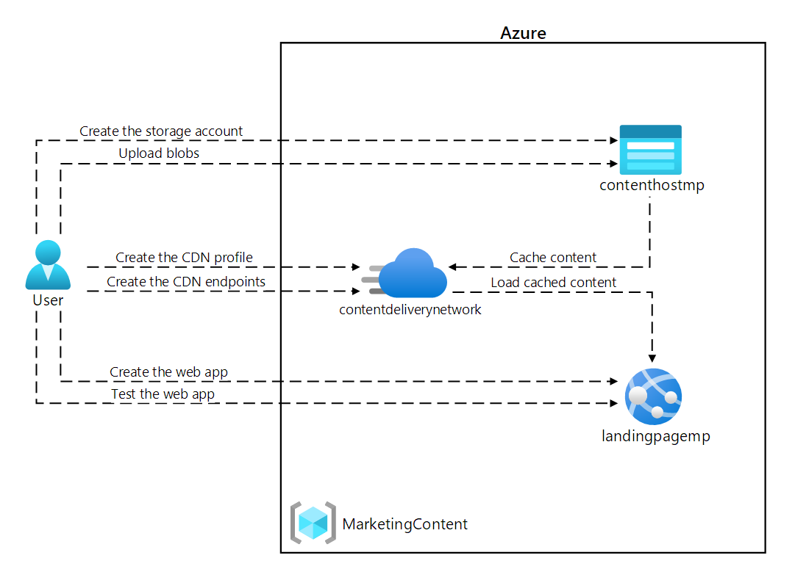

---
lab:
  az204Title: 'Lab 12: Enhance a web application by using the Azure Content Delivery Network'
  az204Module: 'Module 12: Integrate caching and content delivery within solutions'
---

# <a name="lab-12-enhance-a-web-application-by-using-the-azure-content-delivery-network"></a>实验室 12：使用 Azure 内容分发网络增强 Web 应用程序

## <a name="microsoft-azure-user-interface"></a>Microsoft Azure 用户接口

Given the dynamic nature of Microsoft cloud tools, you might experience Azure UI changes that occur after the development of this training content. As a result, the lab instructions and lab steps might not align correctly.

Microsoft updates this training course when the community alerts us to needed changes. However, cloud updates occur frequently, so you might encounter UI changes before this training content updates. <bpt id="p1">**</bpt>If this occurs, adapt to the changes, and then work through them in the labs as needed.<ept id="p1">**</ept>

## <a name="instructions"></a>说明

### <a name="before-you-start"></a>开始之前

#### <a name="sign-in-to-the-lab-environment"></a>登录到实验室环境

使用以下凭据登录到 Windows 10 虚拟机 (VM)：

- 用户名：Admin

- 密码：Pa55w.rd

> **注意**：你的讲师将提供连接到虚拟实验室环境的说明。

#### <a name="review-the-installed-applications"></a>查看已安装的应用程序

Find the taskbar on your Windows 10 desktop. The taskbar contains the icon for the application that you'll use in this lab:

- Microsoft Edge

## <a name="architecture-diagram"></a>体系结构关系图



### <a name="exercise-1-create-azure-resources"></a>练习 1：创建 Azure 资源

#### <a name="task-1-open-the-azure-portal"></a>任务 1：打开 Azure 门户

1. 在任务栏上，选择 Microsoft Edge 图标。

1. 在打开的浏览器窗口中，浏览到 Azure 门户 (<https://portal.azure.com>)，然后使用你将用于此实验的帐户登录。

   > 鉴于 Microsoft 云工具的动态特性，Azure UI 在此培训内容开发后可能会发生更改。

#### <a name="task-2-create-a-storage-account"></a>任务 2：创建存储帐户

1. 在 Azure 门户中，使用“搜索资源、服务和文档”文本框搜索“存储帐户”，然后在结果列表中选择“存储帐户”。

1. 在“存储帐户”边栏选项卡上，选择“+ 创建”。 ****  

1. 在“创建存储帐户”窗格的“基本信息”选项卡上，执行以下操作，然后选择“查看 + 创建”  。

   | 设置 | 操作 |
   | -- | -- |
   | “订阅”下拉列表 | 保留默认值 |
   | “资源组”部分 | 选择“新建”，输入“MarketingContent”，然后选择“确定” |
   | “存储帐户名称”文本框  | 输入“contenthost[yourname]” |
   | “区域”下拉列表 | 选择“(US)美国东部” |
   | “性能”部分 | 选择“标准”选项 |
   | “冗余”下拉列表 | 选择“本地冗余存储(LRS)” |

    以下屏幕截图显示了“创建存储帐户”窗格中配置的设置。

    

1. 在“查看 + 创建”选项卡中，查看在上述步骤中选择的选项。

1. 选择“创建”，使用指定的配置创建存储帐户。

    > **注意**：等待创建任务完成，再继续本实验室。

#### <a name="task-3-create-a-web-app-by-using-azure-app-service"></a>任务 3：使用 Azure 应用服务创建 Web 应用

1. 在 Azure 门户的导航窗格上，选择“创建资源”。

1. 在“创建资源”窗格的“搜索服务和市场”文本框中，输入“Web 应用”  ，然后按 Enter 键。

1. 在搜索结果窗格中，选择“Web 应用”结果，然后选择“创建”。

1. 在“创建 Web 帐户”窗格的“基本信息”选项卡上，执行以下操作，然后选择“下一步：  **Docker**：

   | 设置 | 操作 |
   | -- | -- |
   | “订阅”下拉列表 | 保留默认值 |
   | “资源组”下拉列表 | 在列表中选择“MarketingContent” |
   | “名称”文本框  | 输入“landingpage[yourname]” |
   | “发布”部分 | 选择“Docker 容器” |
   | “操作系统”部分 | 选择“Linux” |
   | “区域”下拉列表 | 选择“美国东部” |
   | “Linux 计划(美国东部)”部分 | 因此，实验说明和实验步骤可能无法正确对应。 |
   | “SKU 和大小”部分 | 保留默认值 |

   以下屏幕截图显示了“创建 Web 应用”窗格上配置的设置。

   

1. 在“Docker”选项卡上，执行以下操作，然后选择“查看 + 创建”：

   | 设置 | 操作 |
   | -- | -- |
   | “选项”下拉列表 | 选择“单个容器” |
   | “映像源”下拉列表 | 选择“Docker 中心” |
   | “访问权限类型”下拉列表 | 选择“公共” |
   | “映像和标记”文本框 | 输入“microsoftlearning/edx-html-landing-page:latest” |

   以下屏幕截图显示了“Docker”选项卡上配置的设置。

   

1. 在“查看 + 创建”选项卡中，查看在上述步骤中选择的选项。

1. 选择“创建”，使用指定的配置创建 Web 应用。

    > **注意**：等待创建任务完成，再继续本实验室。

1. 在“部署”边栏选项卡上，选择“转到资源”。

1. On the <bpt id="p1">**</bpt>App Service Overview<ept id="p1">**</ept> blade, in the <bpt id="p2">**</bpt>Essentials<ept id="p2">**</ept>, record the value of the <bpt id="p3">**</bpt>URL<ept id="p3">**</ept> link. You'll use this value later in the lab.

#### <a name="review"></a>审阅

在本练习中，你创建了一个 Azure 存储帐户和一个 Azure Web 应用，你稍后将在本实验使用。

### <a name="exercise-2-configure-content-delivery-network-and-endpoints"></a>练习 2：配置内容分发网络和端点

#### <a name="task-1-open-azure-cloud-shell"></a>任务 1：打开 Azure Cloud Shell

1. 我们发现社区进行了必要更改时，Microsoft 会更新此培训课程。

    > 但是，云更新经常发生，因此在此培训内容更新之前，可能会发生 UI 更改。

1. 在 Azure 门户中，在 Cloud Shell 命令提示符下输入以下命令，以获取 Azure 命令行接口 (Azure CLI) 工具的版本：

    ```bash
    az --version
    ```

#### <a name="task-2-register-the-microsoftcdn-provider"></a>任务 2：注册 Microsoft.CDN 提供程序

1. 在门户中的“Cloud Shell”命令提示符处，执行以下操作：

    如果发生这种情况，请适应这些更改，并根据需要在实验室中熟悉这些更改。

    ```bash
    az --help
    ```

    b.  Enter the following command, and then select Enter to get a list of the commands that are available for resource providers:

    ```bash
    az provider --help
    ```

    c.  Enter the following command, and then select Enter to list all currently registered providers:

     ```bash
     az provider list
     ```

    d.  Enter the following command, and then select Enter to list only the namespaces of the currently registered providers:

     ```bash
     az provider list --query "[?registrationState=='Registered'].namespace"
     ```

    e.  Observe the list of currently registered providers. The <bpt id="p1">**</bpt>Microsoft.CDN<ept id="p1">**</ept> provider isn't currently in the list of providers.

    f.  Enter the following command, and then select Enter to get the required flags to register a new provider:

     ```bash
     az provider register --help
     ```

    g.  Enter the following command, and then select Enter to register the <bpt id="p1">**</bpt>Microsoft.CDN<ept id="p1">**</ept> namespace with your current subscription:

     ```bash
     az provider register --namespace Microsoft.CDN
     ```

1. 关闭门户中的“Cloud Shell”窗格。

#### <a name="task-3-create-a-content-delivery-network-profile"></a>任务 3：创建内容分发网络配置文件

1. 在 Azure 门户的导航窗格上，选择“创建资源”。

1. 在“创建资源”窗格的“搜索服务和市场”文本框中，输入“CDN”  ，然后按 Enter 键。

1. 在“市场”搜索结果窗格中，选择“Front Door 和 CDN 配置文件”结果，然后选择“创建”。  

1. 在“比较产品/服务”页上，选择“浏览其他产品/服务”，再选择“Akamai 的 Azure CDN 标准”，然后选择“继续”。   

1. 在“CDN 配置文件”窗格的“基本信息”选项卡上，执行以下操作，然后选择“查看 + 创建”：  

   | 设置 | 操作 |
   | -- | -- |
   | “订阅”下拉列表 | 保留默认值 |
   | “资源组”下拉列表 | 在列表中选择“MarketingContent” |
   | “名称”文本框  | 输入“contentdeliverynetwork” |
   | “区域”文本框 | 保留默认值（全局） |
   | “定价层”下拉列表 | 选择“标准 Akamai” |
   | “立即创建新的 CDN 终结点”复选框 | 未选定 |

   以下屏幕截图显示了“CDN 配置文件”窗格上配置的设置。

   

1. 在“查看 + 创建”选项卡中，查看在上述步骤中选择的选项。

1. 选择“创建”以使用指定的配置创建 CDN 配置文件。
  
    > <bpt id="p1">**</bpt>Note<ept id="p1">**</ept>: Wait for Azure to finish creating the CDN profile before you move forward with the lab. You'll receive a notification when the app is created.

#### <a name="task-4-configure-storage-containers"></a>任务 4：配置储存容器

1. 在 Azure 门户的导航窗格中，选择“资源组”。

1. 在“资源组”窗格中，选择之前在本实验中创建的“MarketingContent”资源组。 

1. 在“MarketingContent”窗格中，选择你之前在本实验中创建的“contenthost[yourname]”存储帐户。 

1. 在“存储帐户”边栏选项卡中，选择“数据存储”部分的“容器”链接。

1. 在“容器”部分，选择“+ 容器” 。

1. 在“新建容器”弹出窗口中，执行以下操作，然后选择“创建”： 

   | 设置 | 操作 |
   | -- | -- |
   | “名称”文本框  | 输入“media” |
   | “公共访问级别”下拉列表 | 选择“Blob (仅限 Blob 匿名读取访问)” |

1. 在“容器”部分，再次选择“+ 容器” 。

1. 在“新建容器”弹出窗口中，执行以下操作，然后选择“创建”： 

   | 设置 | 操作 |
   | -- | -- |
   | “名称”文本框  | 输入“video” |
   | “公共访问级别”下拉列表 | 选择“Blob (仅限 Blob 匿名读取访问)” |

1. 观察容器的更新列表，并确认已列出 media 和 video 容器 。

#### <a name="task-5-create-content-delivery-network-endpoints"></a>任务 5：创建内容分发网络终结点

1. 在 Azure 门户的导航窗格中，选择“资源组”链接。

1. 在“资源组”窗格中，选择之前在本实验中创建的“MarketingContent”资源组。 

1. 在“MarketingContent”窗格中，选择你之前在本实验中创建的“contentdeliverynetwork”CDN 配置文件。 

1. 在“CDN 配置文件”边栏选项卡中，选择“+ 终结点”。

1. 在“添加终结点”弹出对话框中，执行以下操作，然后选择“添加”： 

   | 设置 | 操作 |
   | -- | -- |
   | “名称”文本框  | 输入“cdnmedia[yourname]” |
   | “源类型”下拉列表 | 选择“存储” |
   | “源主机名”下拉列表 | 为之前在本实验室中创建的存储帐户选择“contenthost[yourname].blob.core.windows.net”选项 |
   | “源路径”文本框 | 输入“/media” |
   | “源主机头”文本框 | 保留默认值 |
   | “协议”和“源端口”部分 | 保留默认值 |
   | “已优化”下拉列表 | 选择“常规 Web 分发” |

   以下屏幕截图显示了“添加终结点”对话框中配置的设置。

   

1. 在“CDN 配置文件”窗格中，再次选择“+ 终结点”。 

1. 在“添加终结点”弹出对话框中，执行以下操作，然后选择“添加”： 

   | 设置 | 操作 |
   | -- | -- |
   | “名称”文本框  | 输入“cdnvideo[yourname]” |
   | “源类型”下拉列表 | 选择“存储” |
   | “源主机名”下拉列表 | 为之前在本实验室中创建的存储帐户选择“contenthost[yourname].blob.core.windows.net”选项 |
   | “源路径”文本框 | 输入“/video” |
   | “源主机头”文本框 | 保留默认值 |
   | “协议”和“源端口”部分 | 保留默认值 |
   | “已优化”下拉列表 | 选择“点播视频媒体流” |

   以下屏幕截图显示了“添加终结点”对话框中配置的设置。

   

1. 在“CDN 配置文件”窗格中，再次选择“+ 终结点”。 

1. 在“添加终结点”弹出对话框中，执行以下操作，然后选择“添加”： 

   | 设置 | 操作 |
   | -- | -- |
   | “名称”文本框  | 输入“cdnweb[yourname]” |
   | “源类型”下拉列表 | 选择“Web 应用” |
   | “源主机名”下拉列表 | 为之前在本实验室中创建的 Web 应用选择“landingpage[yourname].azurewebsites.net”选项 |
   | “源路径”文本框 | 保留默认值 |
   | “源主机头”文本框 | 保留默认值 |
   | “协议”和“源端口”部分 | 保留默认值 |
   | “已优化”下拉列表 | 选择“常规 Web 分发” |

   以下屏幕截图显示了“添加终结点”对话框中配置的设置。

   

#### <a name="review"></a>审阅

在本练习中，你注册了内容分发网络 (CDN) 的资源提供程序，然后使用该提供程序创建 CDN 配置文件和终结点资源。

### <a name="exercise-3-upload-and-configure-static-web-content"></a>练习 3：上传和配置静态 Web 内容

#### <a name="task-1-observe-the-landing-page"></a>任务 1：查看登录页面

1. 在 Azure 门户的导航窗格中，选择“资源组”。

1. 在“资源组”窗格中，选择之前在本实验中创建的“MarketingContent”资源组。 

1. 在“MarketingContent”窗格中，选择你之前在本实验中创建的 “landingpage[yourname]”Web 应用。

1. On the <bpt id="p1">**</bpt>App Service<ept id="p1">**</ept> blade, select <bpt id="p2">**</bpt>Browse<ept id="p2">**</ept>. A new browser tab opens and returns the current website. Observe the error message displayed on the screen. The website won't work until you configure the specified settings to reference multimedia content.

1. 返回显示 Azure 门户的当前打开的浏览器窗口。

#### <a name="task-2-upload-storage-blobs"></a>任务 2：上传存储 Blob

1. 在 Azure 门户的导航窗格中，选择“资源组”。

1. 在“资源组”窗格中，选择之前在本实验中创建的“MarketingContent”资源组。 

1. 在“MarketingContent”窗格中，选择你之前在本实验中创建的“contenthost[yourname]”存储帐户。 

1. 在“存储帐户”边栏选项卡中，选择“数据存储”部分的“容器”链接。

1. 在“容器”部分中，选择 media 容器，然后选择“上传”  。

1. 在“上传 Blob”弹出窗口中，执行以下操作：

    a.  In the <bpt id="p1">**</bpt>Files<ept id="p1">**</ept> section, select the <bpt id="p2">**</bpt>Folder<ept id="p2">**</ept> icon.

    在你的 Windows 10 桌面上找到任务栏。

    - campus.jpg

    - conference.jpg

    - poster.jpg

    任务栏包含了你在本实验室中会使用的应用程序图标：  

    > **注意**：等待 Blob 上传完成，然后再继续本实验室。

1. 在“容器”窗格中，在“设置”部分中选择“属性”。  

1. Record the value in the <bpt id="p1">**</bpt>URL<ept id="p1">**</ept> text box. You'll use this value later in the lab.

1. 关闭“容器”边栏选项卡。

1. 在“容器”窗格中，选择“video”容器，然后选择“上传”  。

1. 在“上传 Blob”弹出窗口中，执行以下操作：

    a.  In the <bpt id="p1">**</bpt>Files<ept id="p1">**</ept> section, select the <bpt id="p2">**</bpt>Folder<ept id="p2">**</ept> icon.

    b.  In the <bpt id="p1">**</bpt>File Explorer<ept id="p1">**</ept> window, browse to <bpt id="p2">**</bpt>Allfiles (F):<ph id="ph1">\\</ph>Allfiles<ph id="ph2">\\</ph>Labs<ph id="ph3">\\</ph>12<ph id="ph4">\\</ph>Starter<ept id="p2">**</ept>, select the <bpt id="p3">**</bpt>welcome.mp4<ept id="p3">**</ept> file, and then select <bpt id="p4">**</bpt>Open<ept id="p4">**</ept>.

    c.  Ensure that <bpt id="p1">**</bpt>Overwrite if files already exist<ept id="p1">**</ept> is selected, and then select <bpt id="p2">**</bpt>Upload<ept id="p2">**</ept>.  

    > **注意**：等待 Blob 上传完成，然后再继续本实验室。

1. 在“容器”窗格中，在“设置”部分中选择“属性”。  

1. Record the value in the <bpt id="p1">**</bpt>URL<ept id="p1">**</ept> text box. You'll use this value later in the lab.

#### <a name="task-3-configure-web-app-settings"></a>任务 3：配置 Web 应用设置

1. 在 Azure 门户的导航窗格中，选择“资源组”。

1. 在“资源组”窗格中，选择之前在本实验中创建的“MarketingContent”资源组。 

1. 在“MarketingContent”窗格中，选择你之前在本实验中创建的 “landingpage[yourname]”Web 应用。

1. 在“应用服务”边栏选项卡的“设置”部分，选择“配置”链接。

1. 在“配置”部分，选择“应用程序设置”选项卡，然后选择“新应用程序设置”。  

1. 在“添加/编辑应用程序设置”弹出窗口中，配置以下设置，然后选择“确定”。 

   | 设置 | 操作 |
   | -- | -- |
   | “名称”文本框  | 输入“CDNMediaEndpoint” |
   | “值”文本框 | 输入你之前在本实验室中记录的“contenthost[yourname]”存储帐户中的“media”容器的“URI”值   |
   | “部署槽设置”复选框 | 不要选中 |

1. 返回到“配置”部分，然后选择“新的应用程序设置”。

1. 在“添加/编辑应用程序设置”弹出窗口中，配置以下设置，然后选择“确定”。 

   | 设置 | 操作 |
   | -- | -- |
   | “名称”文本框  | 输入“CDNVideoEndpoint” |
   | “值”文本框 | 输入你之前在本实验室中记录的“contenthost[yourname]”存储帐户中的“video”容器的“URI”值   |
   | “部署槽设置”复选框 | 不要选中 |

1. Return to the <bpt id="p1">**</bpt>Configuration<ept id="p1">**</ept> section, and then select <bpt id="p2">**</bpt>Save<ept id="p2">**</ept>. Select <bpt id="p1">**</bpt>Continue<ept id="p1">**</ept> to confirm your changes.

   > **注意**：等待应用程序设置保存后再继续本实验。

#### <a name="task-4-validate-the-corrected-landing-page"></a>任务 4：验证更正的登录页面

1. 在 Azure 门户的导航窗格中，选择“资源组”。

1. 在“资源组”窗格中，选择之前在本实验中创建的“MarketingContent”资源组。 

1. 在“MarketingContent”窗格中，选择你之前在本实验中创建的 “landingpage[yourname]”Web 应用。

1. 在“应用服务”窗格中，选择“重启”，然后选择“是”以确认应用重启过程。 

   > <bpt id="p1">**</bpt>Note<ept id="p1">**</ept>: Wait for the restart operation to complete before you move forward with the lab. You'll receive a notification when the operation is done.

1. On the <bpt id="p1">**</bpt>App Service<ept id="p1">**</ept> blade, select <bpt id="p2">**</bpt>Browse<ept id="p2">**</ept>. A new browser window or tab will open and return to the current website. Observe the updated website rendering multimedia content of various types.

1. 返回显示 Azure 门户的当前打开的浏览器窗口。

#### <a name="review"></a>审阅

在本练习中，将多媒体内容作为 blob 上传到存储容器，然后更新你的 Web 应用以直接指向存储 blob。

### <a name="exercise-4-use-content-delivery-network-endpoints"></a>练习 4：使用内容分发网络终结点

#### <a name="task-1-retrieve-endpoint-uniform-resource-identifiers-uris"></a>任务 1：检索终结点统一资源标识符 (URIs)

1. 在 Azure 门户的导航窗格中，选择“资源组”链接。

1. 在“资源组”窗格中，选择之前在本实验中创建的“MarketingContent”资源组。 

1. 在“MarketingContent”窗格中，选择你之前在本实验中创建的“contentdeliverynetwork”CDN 配置文件。 

1. 在“CDN 配置文件”窗格中，选择“cdnmedia[yourname]”终结点。 

1. **注意**：第一次登录 Azure 门户时，你会看到一个门户教程。

1. 关闭“终结点”边栏选项卡。

1. 在“CDN 配置文件”窗格中，选择“cdnvideo[yourname]”终结点。 

1. 选择“开始使用”，以跳过导览并开始使用门户。

1. 关闭“终结点”边栏选项卡。

#### <a name="task-2-test-multimedia-content"></a>任务 2：测试多媒体内容

1. 通过将之前在实验中复制的“cdnmedia[yourname]”终结点的“终结点主机名”URL 与相对路径 /campus.jpg 合并，为 campus.jpg 资源构建 URL。  

    > **注意**：例如，如果“终结点主机名”URL 为 `https://cdnmediastudent.azureedge.net/`，则新构造的 URL 将为 `https://cdnmediastudent.azureedge.net/campus.jpg`。

1. 通过将之前在实验中复制的“cdnmedia[yourname]”终结点的“终结点主机名”URL 与相对路径 /conference.jpg 合并，为 conference.jpg 资源构建 URL。  

    > **注意**：例如，如果“终结点主机名”URL 为 `https://cdnmediastudent.azureedge.net/`，则新构造的 URL 将为 `https://cdnmediastudent.azureedge.net/conference.jpg`。

1. 通过将之前在实验中复制的“cdnmedia[yourname]”终结点的“终结点主机名”URL 与相对路径 /poster.jpg 合并，为 poster.jpg 资源构建 URL。  

    > **注意**：例如，如果“终结点主机名”URL 为 `https://cdnmediastudent.azureedge.net/`，则新构造的 URL 将为 `https://cdnmediastudent.azureedge.net/poster.jpg`。

1. 通过将你之前在实验中复制的“cdnvideo[yourname]”终结点的“终结点主机名”URL 与相对路径 /welcome.mp4 合并，为 welcome.mp4 资源构建 URL。  

    > **注意**：例如，如果“终结点主机名”URL 为 `https://cdnvideostudent.azureedge.net/`，则新构造的 URL 将为 `https://cdnvideostudent.azureedge.net/welcome.mp4`。

1. 在任务栏上，激活“Microsoft Edge”的快捷菜单，然后选择“新建窗口”。 

1. 在新的浏览器窗口中，转到你为 campus.jpg 媒体资源构建的 URL，然后验证是否已成功找到该资源。

    > <bpt id="p1">**</bpt>Note<ept id="p1">**</ept>: If the content isn't available yet, the CDN endpoint is still initializing. This initialization process can take anywhere from 5 to 15 minutes.

1. 转到你为 conference.jpg 媒体资源构建的 URL，然后验证是否已成功找到该资源。

1. 转到你为 poster.jpg 媒体资源构建的 URL，然后验证是否已成功找到该资源。

1. 转到为 welcome.mp4 视频资源构建的 URL，然后验证是否已成功找到该资源。

1. 关闭在此任务中创建的浏览器窗口。

#### <a name="task-3-update-the-web-app-settings"></a>任务 3：更新 Web 应用设置

1. 在 Azure 门户的导航窗格中，选择“资源组”。

1. 在“资源组”窗格中，选择之前在本实验中创建的“MarketingContent”资源组。 

1. 在“MarketingContent”窗格中，选择你之前在本实验中创建的 “landingpage[yourname]”Web 应用。

1. 在“应用服务”边栏选项卡的“设置”部分，选择“配置”链接。

1. 在“配置”部分，选择“应用程序设置”选项卡 。

1. 选择现有的“CDNMediaEndpoint”应用程序设置。

1. 在“添加/编辑应用程序设置”弹出对话框中，通过从之前在实验中复制的 cdnmedia[yourname] 终结点输入“终结点主机名”URL 来更新“值”文本框，然后选择“确定”。   

1. 选择现有的 **CDNVideoEndpoint** 应用程序设置。

1. 在“添加/编辑应用程序设置”弹出对话框中，通过从之前在实验中复制的 cdnvideo[yourname] 终结点输入“终结点主机名”URL 来更新“值”文本框，然后选择“确定”。   

1. 选择“保存”，然后选择“继续”以确认所做的更改。   

   > **注意**：等待应用程序设置保存后再继续本实验。

1. 在“配置”部分，选择“概述”。 

1. 在“概述”部分，选择“重启”，然后选择“是”以确认应用重启过程。  

   > <bpt id="p1">**</bpt>Note<ept id="p1">**</ept>: Wait for the restart operation to complete before you continue with the lab. You'll receive a notification when the operation is done.

#### <a name="task-4-test-the-web-content"></a>任务 4：测试网页内容

1. 在 Azure 门户的导航窗格中，选择“资源组”链接。

1. 在“资源组”窗格中，选择之前在本实验中创建的“MarketingContent”资源组。 

1. 在“MarketingContent”窗格中，选择你之前在本实验中创建的“contentdeliverynetwork”CDN 配置文件。 

1. 在“CDN 配置文件”窗格中，选择“cdnweb[yourname]”终结点。 

1. 在“终结点”窗格中，复制“终结点主机名”链接的值。 

1. 在任务栏上，激活“Microsoft Edge”的快捷菜单，然后选择“新建窗口”。 

1. 在新的浏览器窗口中，转到“cdnweb[yourname]”终结点的“终结点主机名”URL。 

1. 参考所有使用内容分发网络提供的网站和多媒体内容。

#### <a name="review"></a>审阅

在本练习中，你更新了 Web 应用，以使用内容分发网络提供多媒体内容并为 Web 应用程序本身提供服务。

### <a name="exercise-5-clean-up-your-subscription"></a>练习 5：清理订阅

#### <a name="task-1-open-azure-cloud-shell"></a>任务 1：打开 Azure Cloud Shell

1. In the Azure portal, select the <bpt id="p1">**</bpt>Cloud Shell<ept id="p1">**</ept> icon <ph id="ph1"></ph> to open a new Bash session. If Cloud Shell defaults to a PowerShell session, select <bpt id="p1">**</bpt>PowerShell<ept id="p1">**</ept>, and then in the drop-down menu, select <bpt id="p2">**</bpt>Bash<ept id="p2">**</ept>.

    > <bpt id="p1">**</bpt>Note<ept id="p1">**</ept>: If this is the first time you're starting <bpt id="p2">**</bpt>Cloud Shell<ept id="p2">**</ept>, when prompted to select either <bpt id="p3">**</bpt>Bash<ept id="p3">**</ept> or <bpt id="p4">**</bpt>PowerShell<ept id="p4">**</ept>, select <bpt id="p5">**</bpt>PowerShell<ept id="p5">**</ept>. When you're presented with the <bpt id="p1">**</bpt>You have no storage mounted<ept id="p1">**</ept> message, select the subscription you're using in this lab, and select <bpt id="p2">**</bpt>Create storage<ept id="p2">**</ept>.

#### <a name="task-2-delete-a-resource-group"></a>任务 2：删除资源组

1. 在 Cloud Shell 窗格中，运行以下命令以删除“MarketingContent”资源组： 

    ```bash
    az group delete --name MarketingContent --no-wait --yes
    ```

     > **注意**：该命令以异步方式运行（由 --nowait 参数确定），因此，尽管可立即在同一个 Bash 会话中运行另一个 Azure CLI 命令，但实际上要花几分钟才能删除资源组。

1. 关闭门户中的“Cloud Shell”窗格。

#### <a name="task-3-close-the-active-application"></a>任务 3：关闭活动的应用程序

1. 关闭当前正在运行的 Microsoft Edge 应用程序。

#### <a name="review"></a>审阅

在本练习中，你通过删除本实验室中曾经使用的资源组来清理订阅。
